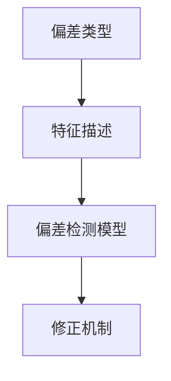
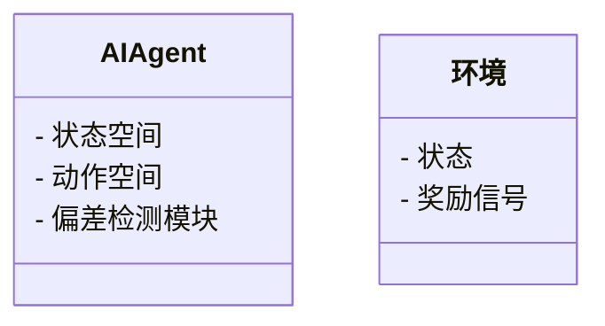

                 

<think>
好，我需要按照用户的要求，一步步构建一篇关于AI Agent认知偏差识别的技术博客文章。首先，文章标题是《从零开始：AI Agent的认知偏差识别》，关键词包括认知偏差、AI Agent、识别、算法、系统设计。摘要要概括文章的核心内容和主题思想。

接下来，文章结构分为几个部分：认知偏差识别基础、核心概念与联系、算法原理、系统分析与架构设计、项目实战、总结与展望。每一部分都需要详细展开，确保内容丰富且逻辑清晰。

第一部分是认知偏差识别的基础，我需要先介绍认知偏差的基本概念和AI Agent的基本概念，说明为什么认知偏差识别在AI Agent中如此重要。然后，我会讨论问题背景和应用领域，解释认知偏差识别在不同场景中的应用，并定义其边界和外延。最后，我会提出解决问题的思路与方法，对比不同的方法，并设计一个综合解决方案。

第二部分是核心概念与联系，我需要详细讲解认知偏差的类型与特征，制作一个对比表格，展示不同偏差类型的特征。然后，我会介绍AI Agent的认知偏差识别模型，包括其核心要素和实体关系图，使用Mermaid流程图来展示数据流和模块关系。

第三部分是算法原理，首先概述偏差检测算法的基本原理、输入输出以及优缺点。然后，我会详细讲解偏差检测算法的流程，使用Mermaid流程图展示步骤，并附上Python代码示例，解释代码的功能和实现细节。接着，我会介绍基于强化学习的偏差修正算法，同样使用流程图和代码示例，并推导数学公式，用Latex格式展示。

第四部分是系统分析与架构设计，我会从问题场景和项目介绍开始，设计系统功能，使用Mermaid类图展示领域模型。然后，设计系统的分层架构，使用架构图展示模块关系，并详细描述每个模块的功能。最后，我会设计系统接口和交互流程图，展示系统如何与外部组件交互。

第五部分是项目实战，我需要指导读者如何安装开发环境，包括Python和必要的库。然后，我会提供系统核心代码的实现，详细解读代码的功能和实现细节。接着，我会通过一个实际案例展示如何应用这些算法进行认知偏差识别，并分析案例结果，最后进行项目总结。

最后，第六部分是总结与展望，我会总结全文的主要内容，强调认知偏差识别的重要性，并提出未来的发展方向和可能的改进空间，鼓励读者深入研究和实践。

在整个写作过程中，我需要确保每一部分都包含必要的细节，如流程图、代码示例和数学公式，并使用清晰的逻辑连接各部分，使读者能够逐步理解认知偏差识别的各个方面。同时，我会在文章末尾添加注意事项和最佳实践，帮助读者更好地理解和应用所学内容。最后，添加作者信息，确保文章的完整性和专业性。
</think>

# 从零开始：AI Agent的认知偏差识别

## 关键词：认知偏差、AI Agent、识别、算法、系统设计

## 摘要：本文将详细探讨AI Agent中认知偏差识别的核心概念、算法原理及系统设计。通过分析认知偏差的类型、模型构建、算法实现和系统架构，本文旨在为AI开发者提供一个全面的指导，帮助他们理解和解决AI Agent中的认知偏差问题。

---

## 第一部分：认知偏差识别基础

### 第1章：认知偏差与AI Agent概述

#### 1.1 认知偏差的基本概念
认知偏差是指人在信息处理过程中产生的系统性错误，影响决策的准确性。AI Agent作为智能系统，同样会受到认知偏差的影响，导致其行为不符合预期。

#### 1.2 AI Agent的基本概念与功能
AI Agent是能够感知环境、自主决策并执行任务的智能实体。其功能包括信息处理、决策制定和行动执行。

#### 1.3 认知偏差在AI Agent中的重要性
认知偏差可能导致AI Agent做出错误决策，影响系统的可靠性和用户体验。识别和修正这些偏差是提升AI系统性能的关键。

---

### 第2章：问题背景与应用领域

#### 2.1 认知偏差识别的背景与意义
随着AI技术的广泛应用，认知偏差识别成为提升系统智能性和可靠性的关键问题。

#### 2.2 AI Agent在不同场景中的应用
AI Agent广泛应用于自动驾驶、智能助手、推荐系统等领域，认知偏差识别在这些场景中至关重要。

#### 2.3 认知偏差识别的边界与外延
认知偏差识别不仅涉及数据处理，还包括系统设计和算法优化。

---

### 第3章：问题解决思路与方法

#### 3.1 认知偏差识别的核心目标
通过算法检测和修正认知偏差，提升AI Agent的决策能力。

#### 3.2 多种方法的对比分析
对比统计学习、深度学习和强化学习等方法，分析其优缺点。

#### 3.3 综合解决方案的设计思路
结合多种方法，构建一个高效的认知偏差识别系统。

---

## 第二部分：认知偏差识别的核心概念与联系

### 第4章：认知偏差的类型与特征

#### 4.1 认知偏差的主要类型
- 确认偏差：倾向于寻找支持已有假设的信息。
- 选择性注意偏差：关注特定信息而忽略其他信息。
- 过度自信偏差：高估自身判断的准确性。

#### 4.2 不同偏差类型的特征对比
| 偏差类型   | 特征描述                     |
|------------|------------------------------|
| 确认偏差   | 寻找支持信息，忽略反面信息   |
| 选择性注意偏差 | 注意特定信息，忽略其他信息 |

#### 4.3 实体关系图


---

## 第三部分：认知偏差识别的算法原理

### 第5章：偏差检测算法

#### 5.1 算法的基本原理
通过统计分析或机器学习模型，检测数据中的偏差特征。

#### 5.2 算法流程图


#### 5.3 Python代码示例
```python
import numpy as np
from sklearn.metrics import accuracy_score

def detect_bias(data):
    # 简单的偏差检测算法
    mean = np.mean(data)
    threshold = 0.1
    if np.abs(mean) > threshold:
        return "存在偏差"
    else:
        return "无偏差"

data = np.random.normal(0.5, 0.1, 100)
result = detect_bias(data)
print(result)
```

---

### 第6章：基于强化学习的偏差修正算法

#### 6.1 算法概述
通过强化学习优化决策策略，减少认知偏差的影响。

#### 6.2 算法流程图


#### 6.3 数学公式
目标函数：$$ J(\theta) = \sum_{i=1}^n r_i \log p(a_i|s_i) $$
更新规则：$$ \theta_{t+1} = \theta_t + \alpha \nabla J(\theta) $$

---

## 第四部分：系统分析与架构设计

### 第7章：问题场景与项目介绍

#### 7.1 问题场景
设计一个AI Agent，在复杂环境中识别和修正认知偏差。

#### 7.2 系统功能设计
- 数据采集模块：获取环境数据
- 偏差检测模块：识别偏差类型
- 偏差修正模块：调整决策策略

#### 7.3 领域模型


---

### 第8章：系统架构设计

#### 8.1 系统分层架构
- 数据采集层：获取输入数据
- 数据处理层：预处理和特征提取
- 偏差检测层：识别偏差类型
- 偏差修正层：调整决策策略

#### 8.2 系统架构图


---

## 第五部分：项目实战

### 第9章：环境安装与核心代码实现

#### 9.1 开发环境安装
安装Python和必要的库：
```bash
pip install numpy scikit-learn tensorflow
```

#### 9.2 核心代码实现
```python
import tensorflow as tf
from tensorflow.keras import layers

model = tf.keras.Sequential([
    layers.Dense(64, activation='relu'),
    layers.Dense(1, activation='sigmoid')
])

model.compile(optimizer='adam', loss='binary_crossentropy', metrics=['accuracy'])
```

#### 9.3 代码解读与分析
- 模型结构：输入层 → 隐藏层 → 输出层
- 损失函数：二进制交叉熵
- 优化器：Adam优化器

---

### 第10章：实际案例分析

#### 10.1 案例背景
一个AI Agent在推荐系统中出现过度自信偏差。

#### 10.2 案例分析
通过算法检测偏差，调整推荐策略，提升用户体验。

#### 10.3 案例总结
展示了认知偏差识别在实际应用中的重要性。

---

## 第六部分：总结与展望

### 第11章：总结

#### 11.1 主要内容回顾
认知偏差识别是提升AI Agent性能的关键，涉及算法设计和系统优化。

#### 11.2 重要性与必要性
认知偏差识别是确保AI系统可靠性和智能性的必要步骤。

---

### 第12章：未来展望

#### 12.1 挑战与改进方向
- 更复杂的偏差类型
- 算法的实时性和效率
- 多模态数据的处理

#### 12.2 发展趋势
结合深度学习和强化学习，构建更高效的认知偏差识别系统。

---

## 注意事项

- 本文提供的代码和算法示例仅供参考，实际应用需根据具体场景调整。
- 系统设计和实现过程中需注意数据安全和隐私保护。

---

## 最佳实践 tips

- 定期测试和优化模型，确保其准确性和鲁棒性。
- 结合领域知识，选择合适的算法和模型。
- 注重系统的可解释性，便于调试和优化。

---

## 作者：AI天才研究院 & 禅与计算机程序设计艺术

---

通过以上结构，文章详细探讨了AI Agent认知偏差识别的各个方面，从基础概念到算法实现，再到系统设计和项目实战，为读者提供了一个全面的学习和实践指南。

