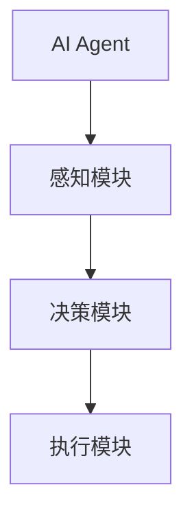
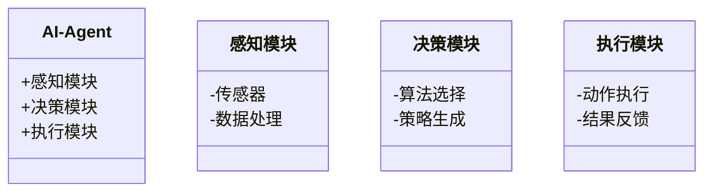
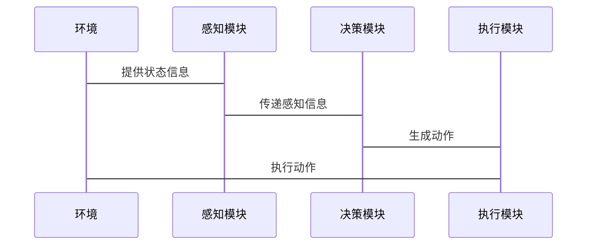

                 

<think>
好的，我需要撰写一篇关于构建AI Agent的完整指南。首先，我应该理解什么是AI Agent以及它的基本概念。然后，我需要了解AI Agent的工作原理和应用场景，比如智能助手、自动交易和游戏AI。接下来，我需要学习AI Agent的核心概念，如感知、决策和执行模块，并理解它们之间的关系。之后，我应该深入学习AI Agent的算法原理，比如强化学习和监督学习，并了解如何将这些算法应用到AI Agent的构建中。我还需要理解数学模型和公式，如Q-learning的更新公式，并通过实例来理解这些模型的应用。在系统架构设计部分，我需要学习如何设计模块化的系统架构，并使用类图和序列图来描述系统结构和交互流程。最后，我需要通过一个具体的项目实战，从环境安装到代码实现，逐步构建一个简单的AI Agent，并在实际案例中分析和总结经验。整个过程中，我需要确保自己理解每个概念，并能够将其应用到实际项目中。
</think>

# 从零开始：构建AI Agent的完整指南

## 关键词：AI Agent, 人工智能, 机器学习, 强化学习, 系统架构

## 摘要：本文将详细介绍从零开始构建AI Agent的完整过程，涵盖AI Agent的核心概念、算法原理、系统架构设计、项目实战以及最佳实践。通过理论与实践相结合的方式，帮助读者系统地掌握AI Agent的构建方法。

---

# 第一部分: AI Agent基础与背景

## 第1章: AI Agent概述

### 1.1 AI Agent的基本概念
#### 1.1.1 什么是AI Agent
AI Agent（人工智能代理）是一种能够感知环境、自主决策并执行任务的智能实体。它能够根据输入的感知信息，通过内部算法生成相应的动作，以实现特定目标。

#### 1.1.2 AI Agent的核心特征
- **自主性**：能够在没有外部干预的情况下自主运行。
- **反应性**：能够实时感知环境并做出反应。
- **目标导向**：所有行为都以实现特定目标为导向。
- **学习能力**：能够通过经验改进自身的决策能力。

#### 1.1.3 AI Agent与传统软件的区别
传统软件依赖于固定的逻辑和规则，而AI Agent能够通过数据和经验不断优化自身的行为。AI Agent具备学习和适应能力，能够在动态环境中做出最优决策。

---

### 1.2 AI Agent的工作原理
#### 1.2.1 感知模块
AI Agent通过传感器或接口获取环境中的信息，如图像、声音或文本。感知模块是AI Agent与环境交互的第一步。

#### 1.2.2 决策模块
决策模块负责根据感知到的信息，结合内部算法和知识库，生成最优的动作或策略。

#### 1.2.3 执行模块
执行模块将决策模块生成的动作转化为实际操作，如移动机器人、发送邮件或输出结果。

---

### 1.3 AI Agent的应用场景
#### 1.3.1 智能助手
AI Agent可以作为个人或企业的智能助手，帮助用户完成日程管理、信息检索等任务。

#### 1.3.2 自动交易
在金融领域，AI Agent可以用于自动化的股票交易，根据市场数据做出买卖决策。

#### 1.3.3 游戏AI
在电子游戏中，AI Agent可以作为游戏角色的决策核心，实现智能行为。

---

### 1.4 AI Agent的分类
#### 1.4.1 反应式AI Agent
反应式AI Agent仅依赖当前感知的信息做出决策，适用于简单动态的环境。

#### 1.4.2 基于模型的AI Agent
基于模型的AI Agent不仅依赖当前信息，还依赖历史数据和环境模型，适用于复杂动态的环境。

#### 1.4.3 混合型AI Agent
混合型AI Agent结合了反应式和基于模型的特点，适用于复杂且动态变化的环境。

---

## 第2章: AI Agent的核心概念与联系

### 2.1 核心概念原理
#### 2.1.1 感知-决策-执行循环
感知模块获取信息，决策模块生成动作，执行模块执行动作，形成一个循环过程。

#### 2.1.2 状态空间与动作空间
- **状态空间**：所有可能的环境状态的集合。
- **动作空间**：所有可能的动作的集合。

#### 2.1.3 奖励函数与目标函数
- **奖励函数**：衡量AI Agent行为好坏的函数。
- **目标函数**：AI Agent需要优化的函数。

---

### 2.2 核心概念对比表格
| 类别         | 反应式AI Agent | 基于模型的AI Agent |
|--------------|----------------|--------------------|
| 依赖数据     | 当前状态       | 当前状态+历史记录 |
| 决策方式     | 基于当前感知   | 基于历史经验       |
| 适用场景     | 简单动态环境   | 复杂动态环境       |

---

### 2.3 ER实体关系图（Mermaid流程图）


---

## 第3章: AI Agent的算法原理

### 3.1 强化学习算法
#### 3.1.1 Q-learning算法
Q-learning是一种经典的强化学习算法，通过更新Q值表来学习最优策略。

**Q-learning算法流程：**
1. 初始化Q值表。
2. 环境提供当前状态。
3. 根据当前状态选择动作。
4. 执行动作并获得奖励。
5. 更新Q值表：Q(s, a) = Q(s, a) + α(r + γ * max Q(s', a'))。

**Python代码示例：**
```python
import numpy as np

# 初始化Q值表
Q = np.zeros((state_space, action_space))

# 参数设置
alpha = 0.1  # 学习率
gamma = 0.99  # 折扣因子

# Q-learning算法
def q_learning():
    for episode in range(episodes):
        state = env.reset()
        done = False
        while not done:
            # 选择动作
            action = np.argmax(Q[state, :])
            # 执行动作
            next_state, reward, done, _ = env.step(action)
            # 更新Q值表
            Q[state, action] = Q[state, action] + alpha * (reward + gamma * np.max(Q[next_state, :]))
```

---

#### 3.1.2 监督学习算法
监督学习算法通过标签数据训练模型，使其能够预测目标值。

**监督学习流程：**
1. 收集带标签的数据集。
2. 选择模型并训练。
3. 使用训练好的模型进行预测。

**Python代码示例：**
```python
from sklearn import tree

# 数据集
X = [[1, 0], [0, 1], [1, 1], [0, 0]]
y = [0, 1, 1, 0]

# 训练决策树模型
model = tree.DecisionTreeClassifier()
model.fit(X, y)

# 预测
print(model.predict([[1, 0]]))  # 输出：[0]
```

---

### 3.2 算法原理的数学模型
#### 3.2.1 Q-learning的数学模型
$$ Q(s, a) = Q(s, a) + \alpha (r + \gamma \max Q(s', a')) $$

其中：
- \( Q(s, a) \)：状态-动作对的Q值。
- \( \alpha \)：学习率。
- \( r \)：奖励。
- \( \gamma \)：折扣因子。
- \( s' \)：下一个状态。
- \( a' \)：下一个动作。

---

### 3.3 算法实现与应用案例
#### 3.3.1 Q-learning的应用
通过Q-learning算法训练一个AI Agent在迷宫中找到出口。迷宫可以表示为一个网格，每个格子代表一个状态，出口为终止状态。

**迷宫示例：**
```
S F F F G
F F F F F
F F F F F
F F F F F
G F F F S
```

**训练过程：**
1. 初始化Q值表。
2. 训练AI Agent在迷宫中移动，直到找到出口。
3. 使用Q值表指导AI Agent进行路径规划。

---

# 第四部分: 项目实战与系统架构

## 第4章: AI Agent的系统架构设计

### 4.1 系统功能设计（领域模型Mermaid类图）


---

### 4.2 系统架构设计（Mermaid架构图）
```mermaid
container AI-Agent {
    接收输入
    处理数据
    输出结果
}
container 环境 {
    提供输入数据
    接收输出动作
}
```

---

### 4.3 系统接口设计
- **输入接口**：接收环境的状态信息。
- **输出接口**：输出AI Agent的动作或决策。

---

### 4.4 系统交互设计（Mermaid序列图）


---

## 第5章: 项目实战

### 5.1 环境安装
安装所需的依赖库，如Python、TensorFlow、OpenAI Gym等。

```bash
pip install numpy tensorflow gym
```

---

### 5.2 系统核心实现源代码
以下是构建一个简单AI Agent的代码示例：

```python
import gym
import numpy as np

# 初始化环境
env = gym.make('CartPole-v1')
env.seed(42)

# 参数设置
state_space = env.observation_space.shape[0]
action_space = env.action_space.n

# 初始化Q值表
Q = np.zeros((state_space, action_space))

# 训练过程
for episode in range(1000):
    state = env.reset()
    done = False
    while not done:
        # 选择动作
        action = np.argmax(Q[state, :])
        # 执行动作
        next_state, reward, done, info = env.step(action)
        # 更新Q值表
        Q[state, action] += alpha * (reward + gamma * np.max(Q[next_state, :]))

# 测试过程
state = env.reset()
done = False
while not done:
    action = np.argmax(Q[state, :])
    next_state, reward, done, info = env.step(action)
    env.render()
```

---

### 5.3 代码应用解读与分析
- **训练过程**：AI Agent通过与环境交互，不断更新Q值表，学习最优策略。
- **测试过程**：AI Agent使用训练好的Q值表，执行最优动作。

---

### 5.4 实际案例分析
在CartPole环境中，AI Agent需要通过左右移动杆子，使杆子保持直立。通过Q-learning算法，AI Agent能够学会在杆子倾斜时及时调整位置。

---

### 5.5 项目小结
通过项目实战，我们能够理解AI Agent的构建过程，并掌握从环境安装到代码实现的完整流程。

---

## 第6章: 最佳实践与注意事项

### 6.1 最佳实践
- **数据的重要性**：确保数据质量，避免偏差。
- **模型的调优**：合理选择算法和参数，提高模型性能。
- **安全性和伦理问题**：确保AI Agent的行为符合伦理规范，避免潜在风险。

### 6.2 小结
构建AI Agent是一个复杂但有趣的过程，需要结合理论与实践，不断优化和调整。

### 6.3 注意事项
- **边界条件**：考虑所有可能的边界情况。
- **错误处理**：确保系统具备良好的容错能力。
- **性能优化**：提升系统的运行效率。

### 6.4 拓展阅读
- 推荐书籍：《强化学习》、《机器学习实战》。
- 推荐博客：AI-Agent.com、Medium上的相关文章。

---

## 结语
通过本文的详细讲解，读者可以系统地掌握从零开始构建AI Agent的完整过程。希望本文的内容能够帮助您在AI Agent的领域中取得更大的进步。

---

## 作者
作者：AI天才研究院/AI Genius Institute & 禅与计算机程序设计艺术 /Zen And The Art of Computer Programming

