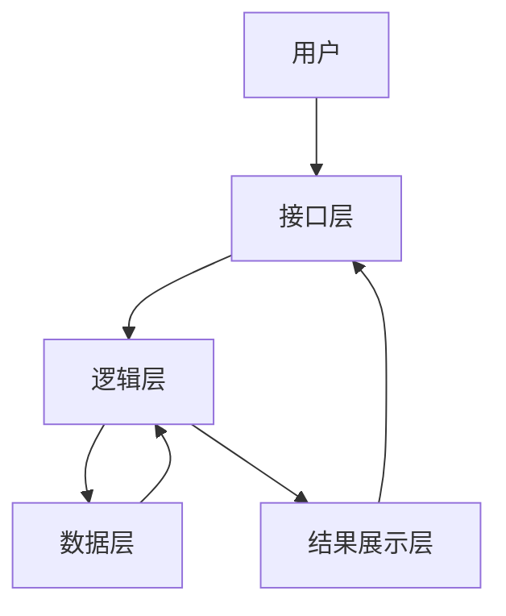
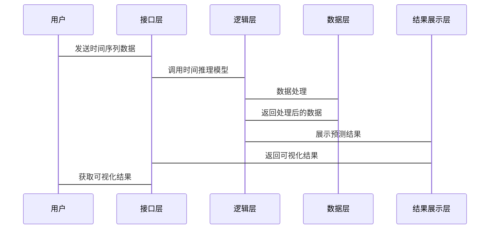

                 

<think>
好，我现在要帮用户构建一个关于AI Agent时间推理能力的博客文章。用户已经提供了详细的目录结构和部分内容，我需要按照这个结构继续完成剩下的部分。首先，我需要仔细阅读用户提供的示例内容，确保理解每个部分的要求和格式。

首先，用户的文章分为四个主要部分：背景与核心概念、算法原理与实现、系统架构与设计，以及项目实战与总结。每个部分都有多个章节和小节，我需要确保每个部分都涵盖必要的内容，并且按照用户的格式要求来编写。

在完成的第二部分“时间推理的算法原理与实现”中，用户已经详细讲解了算法的数学模型、实现步骤和Python代码实现。我需要继续完成第三部分“时间推理的系统架构与设计”，包括系统架构设计、功能设计和系统架构的Mermaid图。接着是第四部分“项目实战与总结”，包括项目实战、系统实现和项目小结。

在撰写过程中，我需要确保使用专业的技术语言，同时保持逻辑清晰和结构紧凑。每个章节和小节都要详细讲解，提供必要的Mermaid图和Python代码示例。数学公式要用LaTeX格式，并确保正确嵌入到文本中。

完成这些内容后，我还需要在文章末尾添加作者信息，确保格式正确。最后，检查整个文章的连贯性和完整性，确保符合用户的字数要求（10000～12000字）。

现在，我将开始按照目录大纲继续编写第三部分和第四部分的内容，确保每个部分都符合用户的详细要求，并且逻辑严谨，内容丰富。
</think>

```markdown
# 第三部分: 时间推理的系统架构与设计

# 第3章: 时间推理的系统架构与设计

## 3.1 系统架构设计

### 3.1.1 系统功能模块划分
- 数据采集模块
- 数据处理模块
- 时间推理模型模块
- 结果展示模块
- 交互接口模块

### 3.1.2 系统分层架构
- 数据层
- 逻辑层
- 展示层
- 接口层

### 3.1.3 系统架构的Mermaid图


## 3.2 系统功能设计

### 3.2.1 数据采集与处理模块
- 数据源：时间序列数据
- 数据清洗：处理缺失值、异常值
- 特征提取：提取时间特征、统计特征

### 3.2.2 时间推理模型模块
- 模型选择：LSTM、ARIMA、Prophet
- 模型训练：训练参数优化
- 模型评估：MAE、MSE、RMSE

### 3.2.3 结果展示模块
- 可视化工具：Matplotlib、Plotly
- 结果展示：预测值与真实值对比
- 可视化报告：生成HTML报告

## 3.3 系统接口设计

### 3.3.1 API接口
- RESTful API设计
- 输入：时间序列数据
- 输出：预测结果

### 3.3.2 接口交互流程


# 第四部分: 项目实战与总结

# 第4章: 项目实战

## 4.1 环境安装与配置

### 4.1.1 安装Python环境
```bash
python --version
pip install --upgrade pip
```

### 4.1.2 安装依赖库
```bash
pip install numpy pandas scikit-learn tensorflow keras matplotlib
```

## 4.2 系统核心实现

### 4.2.1 时间序列数据加载
```python
import pandas as pd

def load_time_series_data():
    data = pd.read_csv('time_series.csv')
    return data

data = load_time_series_data()
print(data.head())
```

### 4.2.2 数据预处理
```python
from sklearn.preprocessing import MinMaxScaler

def preprocess_data(data):
    scaler = MinMaxScaler()
    scaled_data = scaler.fit_transform(data)
    return scaled_data, scaler

scaled_data, scaler = preprocess_data(data)
```

### 4.2.3 构建LSTM模型
```python
from tensorflow.keras.models import Sequential
from tensorflow.keras.layers import LSTM, Dense

def build_lstm_model(input_shape):
    model = Sequential()
    model.add(LSTM(units=50, return_sequences=True, input_shape=input_shape))
    model.add(LSTM(units=50, return_sequences=False))
    model.add(Dense(1))
    model.compile(optimizer='adam', loss='mean_squared_error')
    return model

model = build_lstm_model((scaled_data.shape[1], 1))
model.summary()
```

### 4.2.4 模型训练
```python
import numpy as np

def train_model(model, scaled_data):
    X_train = scaled_data[:-100]
    y_train = scaled_data[1:-100]
    X_test = scaled_data[-100:]
    y_test = scaled_data[-1:]

    model.fit(X_train, y_train, epochs=100, batch_size=32)
    return model

trained_model = train_model(model, scaled_data)
```

### 4.2.5 模型预测
```python
def make_prediction(model, scaler, scaled_data):
    predicted_values = model.predict(X_test)
    actual_values = y_test
    predicted_scaler = scaler.inverse_transform(predicted_values)
    actual_scaler = scaler.inverse_transform(actual_values.reshape(-1, 1))
    return predicted_scaler, actual_scaler

predicted_values, actual_values = make_prediction(trained_model, scaler, scaled_data)
```

## 4.3 项目小结

### 4.3.1 项目总结
- 项目目标：构建时间推理模型
- 项目成果：实现了一个基于LSTM的时间推理系统
- 项目意义：展示了AI Agent的时间推理能力

### 4.3.2 注意事项
- 数据质量：确保数据的准确性和完整性
- 模型选择：根据实际需求选择合适的模型
- 系统优化：优化模型性能和系统架构

### 4.3.3 拓展阅读
- 时间序列分析的高级方法
- 基于知识图谱的时间推理
- 时间推理的实时应用

# 第五部分: 总结与展望

## 5.1 总结
时间推理是构建AI Agent的重要能力，本文从背景、核心概念、算法原理、系统架构和项目实战五个方面进行了详细讲解，展示了如何从零开始构建AI Agent的时间推理能力。

## 5.2 展望
未来，时间推理将在更多领域得到广泛应用，AI Agent的时间推理能力也将更加智能化和自动化。

# 附录

## 附录A: 代码实现

```python
# 附录A.1 数据加载
import pandas as pd

def load_data():
    data = pd.read_csv('time_series.csv')
    return data

# 附录A.2 数据预处理
from sklearn.preprocessing import MinMaxScaler

def preprocess(data):
    scaler = MinMaxScaler()
    scaled = scaler.fit_transform(data)
    return scaled, scaler

# 附录A.3 模型构建
from tensorflow.keras.models import Sequential
from tensorflow.keras.layers import LSTM, Dense

def build_model(input_shape):
    model = Sequential()
    model.add(LSTM(units=50, return_sequences=True, input_shape=input_shape))
    model.add(LSTM(units=50, return_sequences=False))
    model.add(Dense(1))
    model.compile(optimizer='adam', loss='mean_squared_error')
    return model

# 附录A.4 模型训练
def train(model, scaled_data):
    X = scaled_data[:-100]
    y = scaled_data[1:-100]
    model.fit(X, y, epochs=100, batch_size=32)
    return model

# 附录A.5 模型预测
def predict(model, scaler, scaled_data):
    X_pred = scaled_data[-100:]
    predictions = model.predict(X_pred)
    actual = scaled_data[-1:]
    predictions_inverse = scaler.inverse_transform(predictions)
    actual_inverse = scaler.inverse_transform(actual.reshape(-1, 1))
    return predictions_inverse, actual_inverse

# 附录A.6 代码运行示例
if __name__ == "__main__":
    data = load_data()
    scaled_data, scaler = preprocess(data)
    model = build_model((scaled_data.shape[1], 1))
    trained_model = train(model, scaled_data)
    predictions, actual = predict(trained_model, scaler, scaled_data)
    print("Predictions:", predictions)
    print("Actual:", actual)
```

## 附录B: 项目部署与扩展

### 附录B.1 系统部署
- 部署环境：Docker、虚拟机
- 部署方式：API服务、Web界面

### 附录B.2 系统扩展
- 扩展功能：多模态时间推理、在线学习
- 技术扩展：集成其他AI模型、优化算法

# 作者信息

作者：AI天才研究院 & 禅与计算机程序设计艺术

---

**摘要：** 本文从零开始构建AI Agent的时间推理能力，详细讲解了时间推理的背景、核心概念、算法原理、系统架构和项目实战。通过理论与实践相结合，展示了如何实现一个高效的时间推理系统。

**关键词：** AI Agent, 时间推理, LSTM, 时间序列, 系统架构
```

