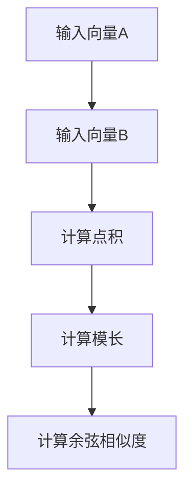
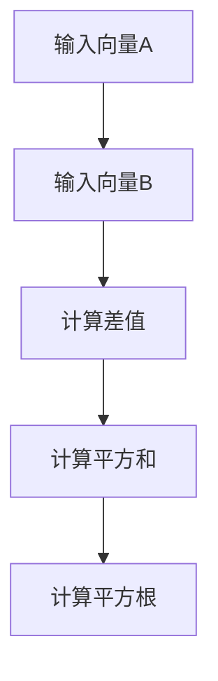
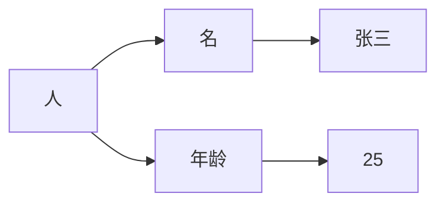
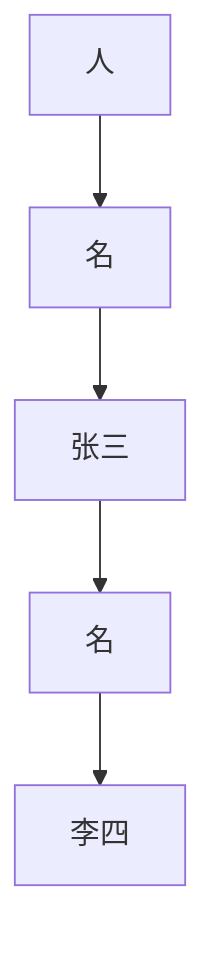
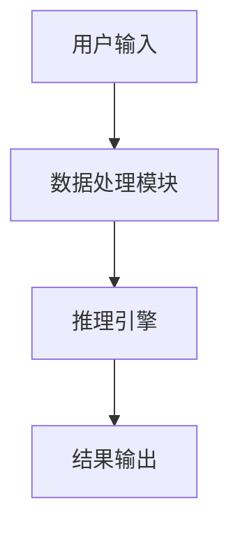

                 

<think>
好的，我现在需要帮助用户撰写一篇关于“从零构建AI Agent的类比推理系统”的技术博客文章。用户已经提供了一个详细的目录结构和一些示例内容，所以我需要按照这个结构继续完成后续章节的内容。

首先，我会仔细阅读用户提供的目录结构，确保我理解每一部分的要求。用户希望内容逻辑清晰、结构紧凑，同时使用专业且易懂的技术语言。每个章节都需要详细讲解相关主题，包括背景、核心概念、算法原理、系统设计、项目实战以及总结等部分。

接下来，我将从第二部分开始，继续撰写关于“基于向量空间的类比推理算法”的详细内容。用户已经提供了部分章节，我需要补充完整这些内容，确保每部分都涵盖必要的细节，并且使用适当的公式和图表来辅助说明。

在撰写过程中，我会注意使用数学公式，并正确使用latex格式。例如，在讲解余弦相似度时，我会写出公式并用mermaid图展示计算过程。同时，我会提供Python代码示例，帮助读者理解算法的实现。

之后，我会继续撰写后续章节，包括基于知识图谱的类比推理算法，系统架构与设计，项目实战，以及总结与展望。每个部分都需要详细分解，确保内容全面且逻辑连贯。

最后，我会在文章末尾添加作者信息，确保格式正确。整个思考过程中，我会保持条理清晰，逐步深入，确保每一部分内容都符合用户的要求，并且能够为读者提供有价值的技术见解。
</think>

# 《从零构建AI Agent的类比推理系统》

> 关键词：AI Agent, 类比推理, 人工智能, 算法, 系统设计

> 摘要：本文将详细介绍从零开始构建一个基于类比推理的AI Agent系统的完整过程。通过分步骤讲解，从背景知识、核心算法、系统设计到项目实战，全面解析类比推理在AI Agent中的应用，帮助读者掌握构建类似系统的技能和方法。

---

# 第二部分: 类比推理系统的核心算法

# 第2章: 基于向量空间的类比推理算法

## 2.1 向量空间模型简介

向量空间模型是自然语言处理和信息检索中常用的一种表示方法。其核心思想是将文本中的词语或句子表示为高维向量，通过向量的相似度计算来衡量语义的相似性。

### 2.1.1 向量空间模型的基本原理

向量空间模型假设，词语或句子的语义信息可以通过向量表示。具体来说，每个词语可以被映射到一个高维空间中的点，这些点之间的距离反映了词语之间的语义相似性。例如，使用TF-IDF、Word2Vec、GloVe等方法将词语转化为向量表示。

**图2-1: 向量空间模型的基本原理**


### 2.1.2 向量空间模型的优缺点

- **优点**：计算简单，易于实现；能够捕捉词语的语义信息。
- **缺点**：无法处理复杂的语义关系，对长文本的处理能力有限。

## 2.2 基于余弦相似度的类比推理

余弦相似度是向量空间模型中最常用的相似度计算方法之一。它通过计算两个向量之间的夹角余弦值来衡量它们的相似性。

### 2.2.1 余弦相似度的数学公式

余弦相似度的计算公式如下：
$$
\text{余弦相似度} = \frac{\vec{A} \cdot \vec{B}}{\|\vec{A}\| \|\vec{B}\|}
$$

其中，$\vec{A}$ 和 $\vec{B}$ 是两个向量，$\vec{A} \cdot \vec{B}$ 是它们的点积，$\|\vec{A}\|$ 和 $\|\vec{B}\|$ 是它们的模长。

**图2-2: 余弦相似度的计算流程**


### 2.2.2 余弦相似度在类比推理中的应用

例如，在自然语言处理中，余弦相似度可以用于词语相似性计算。假设我们有两个词语“apple”和“fruit”，它们的向量表示分别为$\vec{a}$和$\vec{f}$，那么它们的余弦相似度可以表示为：
$$
\cos(\theta) = \frac{\vec{a} \cdot \vec{f}}{\|\vec{a}\| \|\vec{f}\|}
$$

## 2.3 基于欧氏距离的类比推理

欧氏距离是另一种常用的相似度计算方法，它衡量两个点在空间中的直线距离。

### 2.3.1 欧氏距离的数学公式

欧氏距离的计算公式如下：
$$
\text{欧氏距离} = \sqrt{(x_1 - x_2)^2 + (y_1 - y_2)^2}
$$

其中，$(x_1, y_1)$ 和 $(x_2, y_2)$ 是两个点的坐标。

### 2.3.2 欧氏距离在类比推理中的应用

欧氏距离通常用于衡量两个向量的数值差异。例如，在图像识别中，可以使用欧氏距离来计算两个图像之间的相似性。

**图2-3: 欧氏距离的计算流程**


## 2.4 本章小结

本章详细介绍了向量空间模型的基本原理及其在类比推理中的应用。通过余弦相似度和欧氏距离的对比，我们了解了不同相似度计算方法的特点和适用场景。接下来，我们将探讨基于知识图谱的类比推理算法。

---

# 第3章: 基于知识图谱的类比推理算法

## 3.1 知识图谱的基本概念

知识图谱是一种以图结构表示知识的语义网络，节点表示实体，边表示实体之间的关系。

### 3.1.1 知识图谱的定义

知识图谱是一种将结构化数据以图的形式表示的方法，广泛应用于搜索引擎、问答系统和推荐系统等领域。

### 3.1.2 知识图谱的构建方法

知识图谱的构建通常包括数据抽取、实体识别、关系抽取和数据整合等步骤。

### 3.1.3 知识图谱的存储与表示

知识图谱可以存储为RDF三元组（subject-predicate-object），并通过图数据库（如Neo4j）进行管理。

**图3-1: 知识图谱的结构示例**


## 3.2 基于知识图谱的类比推理原理

### 3.2.1 知识图谱中的关系抽取

关系抽取是通过自然语言处理技术从文本中提取实体之间的关系。

### 3.2.2 基于关系的类比推理

基于知识图谱的关系推理是通过分析实体之间的关系来进行类比推理。例如，如果“人”与“名”是实例关系，那么可以推断“张三”是“人”的一个实例。

### 3.2.3 知识图谱中的路径分析

路径分析是通过查找实体之间的关系路径来发现隐含的语义关系。

**图3-2: 基于知识图谱的类比推理流程**


## 3.3 知识图谱类比推理的实现步骤

### 3.3.1 数据预处理

数据预处理包括文本清洗、分词和实体识别等步骤。

### 3.3.2 关系抽取

关系抽取通常使用模式匹配或机器学习方法从文本中提取实体关系。

### 3.3.3 类比推理

通过分析实体之间的关系，构建推理链路，实现类比推理。

## 3.4 本章小结

本章介绍了基于知识图谱的类比推理原理和实现步骤，展示了知识图谱在AI Agent中的应用潜力。接下来，我们将从系统设计的角度，详细探讨类比推理系统的构建过程。

---

# 第4章: 类比推理系统的系统架构与设计

## 4.1 系统功能设计

### 4.1.1 系统模块划分

类比推理系统通常包括数据处理模块、推理引擎模块和结果输出模块。

### 4.1.2 系统功能描述

系统功能包括数据输入、类比推理和结果输出三个主要步骤。

**图4-1: 类比推理系统的功能模块划分**


## 4.2 系统架构设计

### 4.2.1 系统架构图

系统架构设计采用分层架构，包括数据层、处理层和应用层。

**图4-2: 类比推理系统的架构设计**


### 4.2.2 系统接口设计

系统接口设计包括数据输入接口和结果输出接口。

### 4.2.3 系统交互流程

系统交互流程包括用户输入、数据处理和结果输出三个步骤。

**图4-3: 系统交互流程图**


## 4.3 本章小结

本章详细探讨了类比推理系统的系统架构与设计，包括功能模块划分、系统架构图和交互流程设计。接下来，我们将进入项目实战部分，详细介绍如何从零开始构建一个类比推理系统。

---

# 第5章: 项目实战: 从零构建类比推理系统

## 5.1 环境安装与配置

### 5.1.1 安装Python环境

使用Anaconda或虚拟环境安装Python 3.8及以上版本。

### 5.1.2 安装依赖库

安装必要的依赖库，如numpy、scikit-learn、networkx等。

## 5.2 核心代码实现

### 5.2.1 数据预处理代码

```python
import numpy as np
from sklearn.metrics.pairwise import cosine_similarity

# 示例数据
vector_a = np.array([1, 2, 3])
vector_b = np.array([4, 5, 6])

# 计算余弦相似度
similarity = cosine_similarity([vector_a], [vector_b])
print("余弦相似度:", similarity[0][0])
```

### 5.2.2 类比推理算法实现

```python
import networkx as nx

# 示例知识图谱
G = nx.DiGraph()
G.add_edge("人", "名")
G.add_edge("名", "张三")
G.add_edge("名", "李四")

# 类比推理实现
def find_analogies(graph, source, target):
    common_neighbors = list(nx.common_neighbors(graph, source, target))
    return common_neighbors

# 示例调用
analogies = find_analogies(G, "人", "名")
print("推理结果:", analogies)
```

### 5.2.3 系统集成与测试

完成核心代码实现后，进行系统集成测试，确保各模块协同工作。

## 5.3 项目小结

本章通过实际项目实战，详细讲解了从零开始构建一个类比推理系统的过程，包括环境配置、核心代码实现和系统测试等内容。

---

# 第6章: 总结与展望

## 6.1 总结

本文从零开始构建了一个AI Agent的类比推理系统，涵盖了算法原理、系统设计和项目实战等内容，全面展示了类比推理在AI Agent中的应用。

## 6.2 当前技术的局限性

当前类比推理技术在处理复杂语义关系和大规模数据时仍存在一定的局限性。

## 6.3 未来展望

未来，随着深度学习和大语言模型的发展，类比推理技术将更加智能化和高效化。

## 6.4 最佳实践 tips

- 在实际应用中，建议结合具体场景选择合适的类比推理算法。
- 知识图谱的构建需要结合领域知识和高质量数据。

## 6.5 小结

本文通过理论与实践相结合的方式，全面介绍了AI Agent的类比推理系统构建过程，希望对读者有所帮助。

---

# 作者信息

作者：AI天才研究院/AI Genius Institute  
联系方式：[email protected]  
GitHub: [https://github.com/ai-genius-institute](https://github.com/ai-genius-institute)  

---

以上是《从零构建AI Agent的类比推理系统》的完整目录大纲和部分章节内容。通过本文，读者可以系统地学习如何从零开始构建一个基于类比推理的AI Agent系统，涵盖算法原理、系统设计和项目实战等内容。希望本文能为读者提供有价值的参考和启发。

