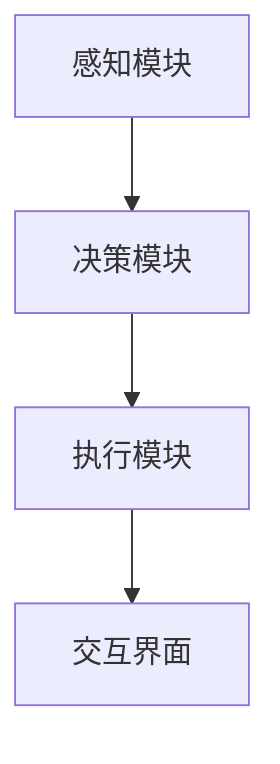

                 

<think>
嗯，用户希望我撰写一篇关于从零构建AI Agent的技术博客文章，使用《从零构建AI Agent：LLM大模型应用开发实践概述》为标题。我需要先理解用户的需求，确保按照他们的要求进行写作。

首先，用户指定了文章的结构，包括摘要、关键词、目录和内容部分。我需要确保这些部分都涵盖，并且内容详实。关键词部分需要列出5-7个核心词汇，帮助读者快速理解文章主题。摘要部分要简洁明了，概述文章的核心内容。

接下来，目录大纲已经给出，我需要根据这个大纲逐步展开每个部分的内容。每个章节都要细化到三级，确保内容全面。例如，第一章介绍AI Agent和LLM的基本概念，第二章深入探讨核心概念和技术联系，第三章讲解技术原理，第四章分析系统架构，第五章提供项目实战，第六章总结与展望。

在撰写过程中，我需要使用专业的技术语言，同时保持逻辑清晰、结构紧凑。数学公式和图表的使用也很重要，比如在算法原理部分，使用Mermaid流程图和数学公式来详细说明。

用户还特别提到，文章末尾需要有作者信息，格式要求使用markdown。因此，我需要在最后添加这些信息，确保格式正确。

现在，我需要考虑每个部分的具体内容。例如，在AI Agent的基本概念部分，我需要解释什么是AI Agent，它的核心要素，以及与LLM的关系。这部分可能需要结合实际应用场景，让读者更容易理解。

在技术原理部分，我需要详细讲解LLM的模型结构和训练方法，可能需要使用数学公式来描述。同时，结合AI Agent的算法，如RPA和DRL，说明它们是如何工作的，以及如何通过LLM进行优化。

系统架构设计部分，我需要绘制类图和架构图，展示系统的各个部分如何协作。这部分可能需要使用Mermaid来创建图表，帮助读者更好地理解系统结构。

项目实战部分，我需要提供具体的代码示例，指导读者如何从零开始构建AI Agent。包括环境配置、核心代码实现、功能扩展等步骤，帮助读者一步步完成项目。

最后，在总结与展望部分，我需要回顾整个构建过程，指出目前存在的挑战，并展望未来的发展方向，鼓励读者不断探索和创新。

总的来说，我需要按照用户的指示，逐步展开每个部分的内容，确保文章结构完整，内容详实，符合专业技术博客的标准。同时，注意使用适当的图表和公式，使文章更具可读性和专业性。
</think>

# 从零构建AI Agent：LLM大模型应用开发实践概述

## 关键词：
- AI Agent
- LLM
- 大模型应用
- 人工智能开发
- 系统架构设计

## 摘要：
本文系统地介绍了从零开始构建AI Agent的过程，重点分析了LLM大模型在AI Agent中的应用开发实践。文章从AI Agent和LLM的基本概念出发，逐步深入探讨了AI Agent的核心原理、LLM的技术优势、AI Agent与LLM的结合方式，以及实际开发中的系统架构设计和项目实战。通过详细的技术分析和案例解读，本文为读者提供了全面的理论指导和实践参考，帮助读者快速掌握AI Agent的构建方法和LLM大模型的应用技巧。

---

# 第一部分：AI Agent与LLM大模型的背景介绍

## 第1章：AI Agent与LLM大模型概述

### 1.1 AI Agent的基本概念

#### 1.1.1 AI Agent的定义与特点
AI Agent（人工智能代理）是一种能够感知环境、自主决策并执行任务的智能实体。它具备以下特点：
- **自主性**：能够在没有外部干预的情况下自主运行。
- **反应性**：能够实时感知环境并做出响应。
- **目标导向性**：具备明确的目标，能够为实现目标而行动。

#### 1.1.2 AI Agent的核心要素
AI Agent的核心要素包括：
1. **感知模块**：负责从环境中获取信息。
2. **决策模块**：基于感知信息做出决策。
3. **执行模块**：将决策转化为具体行动。

#### 1.1.3 AI Agent的分类与应用场景
AI Agent可以分为以下几类：
- **简单反射型代理**：基于预设规则直接执行任务。
- **基于模型的反射型代理**：能够根据环境信息动态调整行为。
- **目标驱动型代理**：具备明确的目标，能够主动规划行动。
- **效用驱动型代理**：基于效用函数进行决策。

应用场景包括：
- 智能客服
- 自动驾驶
- 智能助手
- 游戏AI

### 1.2 LLM大模型的定义与特点

#### 1.2.1 LLM的定义与技术背景
LLM（Large Language Model，大语言模型）是一种基于深度学习的自然语言处理模型，能够理解和生成人类语言。其技术背景包括：
- 基于Transformer架构
- 使用大规模数据训练
- 具备强大的上下文理解和生成能力

#### 1.2.2 LLM的核心技术与优势
LLM的核心技术包括：
- **自注意力机制**：通过全局上下文理解文本。
- **解码器结构**：支持生成式任务。
- **预训练-微调模式**：适用于多种下游任务。

LLM的优势：
- 高效的文本生成能力
- 强大的上下文理解能力
- 良好的可扩展性

### 1.3 AI Agent与LLM的结合

#### 1.3.1 AI Agent的智能化升级
通过引入LLM，AI Agent能够实现更复杂的任务，例如：
- 自然语言理解
- 文本生成
- 多轮对话

#### 1.3.2 LLM在AI Agent中的作用
LLM作为AI Agent的核心模块，主要负责：
- **语义理解**：准确理解用户的意图。
- **对话生成**：生成自然流畅的回复。
- **知识推理**：基于知识库进行推理。

#### 1.3.3 AI Agent的未来发展
随着技术的进步，AI Agent将更加智能化和个性化，应用场景也将更加广泛。

### 1.4 本章小结
本章介绍了AI Agent和LLM的基本概念、核心要素、分类及应用场景，强调了LLM在AI Agent中的重要性，并为后续章节的深入分析奠定了基础。

---

## 第2章：AI Agent与LLM的核心概念与联系

### 2.1 AI Agent的核心原理

#### 2.1.1 AI Agent的感知与决策机制
AI Agent的感知机制包括：
- **传感器**：获取环境数据。
- **数据处理模块**：对数据进行预处理和分析。

决策机制包括：
- **规则引擎**：基于预设规则做出决策。
- **强化学习**：通过试错优化决策策略。

#### 2.1.2 AI Agent的行为执行与反馈
行为执行模块负责将决策转化为具体行动，反馈机制则用于收集执行结果以优化后续决策。

#### 2.1.3 AI Agent的自主性与适应性
AI Agent的自主性体现在其无需外部干预即可完成任务，适应性则体现在其能够根据环境变化动态调整行为。

### 2.2 LLM大模型的核心原理

#### 2.2.1 LLM的训练过程与模型结构
LLM的训练过程包括：
1. **预训练**：使用大规模数据进行无监督学习。
2. **微调**：针对特定任务进行有监督学习。

模型结构基于Transformer架构，包括编码器和解码器。

#### 2.2.2 LLM的推理机制与语言生成
LLM的推理机制基于自注意力机制，能够生成连贯的文本。

#### 2.2.3 LLM的可扩展性与灵活性
LLM可以通过微调适应不同任务，支持多种语言和领域。

### 2.3 AI Agent与LLM的结合

#### 2.3.1 AI Agent的智能化升级
通过引入LLM，AI Agent能够实现更复杂的任务，例如：
- 多轮对话
- 语义理解
- 知识推理

#### 2.3.2 LLM在AI Agent中的作用
LLM作为AI Agent的核心模块，主要负责：
- **语义理解**：准确理解用户的意图。
- **对话生成**：生成自然流畅的回复。
- **知识推理**：基于知识库进行推理。

### 2.4 本章小结
本章深入分析了AI Agent和LLM的核心原理，并探讨了它们的结合方式，强调了LLM在提升AI Agent智能化水平中的重要作用。

---

## 第3章：AI Agent与LLM的技术实现

### 3.1 AI Agent的技术实现

#### 3.1.1 AI Agent的算法原理
AI Agent的算法包括：
- **基于规则的算法**：简单反射型代理。
- **基于模型的算法**：目标驱动型代理。
- **基于强化学习的算法**：效用驱动型代理。

#### 3.1.2 AI Agent的实现步骤
AI Agent的实现步骤包括：
1. **需求分析**：明确AI Agent的目标和功能。
2. **数据采集**：获取环境数据。
3. **模型训练**：训练感知和决策模型。
4. **系统集成**：整合感知、决策和执行模块。
5. **测试优化**：测试系统性能并进行优化。

### 3.2 LLM的技术实现

#### 3.2.1 LLM的训练过程
LLM的训练过程包括：
1. **数据准备**：收集和预处理大规模数据。
2. **模型构建**：基于Transformer架构搭建模型。
3. **预训练**：使用无监督学习优化模型参数。
4. **微调**：针对特定任务进行有监督学习。

#### 3.2.2 LLM的推理过程
LLM的推理过程包括：
1. **输入处理**：接收输入文本。
2. **解码器生成**：生成目标文本。
3. **输出结果**：返回生成结果。

### 3.3 AI Agent与LLM的结合实现

#### 3.3.1 AI Agent的感知模块
AI Agent的感知模块负责从环境中获取信息，例如：
- 传感器数据
- 用户输入

#### 3.3.2 AI Agent的决策模块
AI Agent的决策模块基于感知信息做出决策，例如：
- 使用LLM进行语义理解
- 使用强化学习优化决策策略

#### 3.3.3 AI Agent的执行模块
AI Agent的执行模块将决策转化为具体行动，例如：
- 执行命令
- 返回结果

### 3.4 本章小结
本章详细分析了AI Agent和LLM的技术实现过程，探讨了它们的结合方式，并为后续章节的系统设计奠定了基础。

---

## 第4章：AI Agent与LLM的系统架构设计

### 4.1 系统架构设计概述

#### 4.1.1 系统功能设计
系统功能设计包括：
- 感知模块
- 决策模块
- 执行模块
- 交互界面

#### 4.1.2 系统架构图


#### 4.1.3 系统接口设计
系统接口设计包括：
- 感知模块接口
- 决策模块接口
- 执行模块接口
- 交互界面接口

#### 4.1.4 系统交互流程
系统交互流程包括：
1. 用户输入
2. 感知模块处理
3. 决策模块决策
4. 执行模块执行
5. 返回结果

### 4.2 系统实现

#### 4.2.1 系统功能实现
系统功能实现包括：
- 感知模块实现
- 决策模块实现
- 执行模块实现
- 交互界面实现

#### 4.2.2 系统架构图


#### 4.2.3 系统交互流程
系统交互流程包括：
1. 用户输入
2. 感知模块处理
3. 决策模块决策
4. 执行模块执行
5. 返回结果

### 4.3 本章小结
本章详细分析了AI Agent和LLM的系统架构设计，并通过图表展示了系统的各个部分，为后续章节的项目实战奠定了基础。

---

## 第5章：AI Agent与LLM的项目实战

### 5.1 环境配置

#### 5.1.1 系统环境
- 操作系统：Linux/Windows/macOS
- 开发工具：Python/PyTorch
- 模型框架：Hugging Face

#### 5.1.2 硬件配置
- CPU/GPU：支持TensorFlow/PyTorch的硬件配置

### 5.2 核心代码实现

#### 5.2.1 AI Agent的核心代码
```python
class AI-Agent:
    def __init__(self):
        self.llm = LLM_model()
        self.sensor = Sensor()
        self.executor = Executor()

    def perceive(self, input):
        return self.sensor.process(input)

    def decide(self, input):
        return self.llm.generate(input)

    def execute(self, action):
        return self.executor.execute(action)
```

#### 5.2.2 LLM的核心代码
```python
class LLM_model:
    def __init__(self):
        self.model = load_model()

    def generate(self, input):
        return self.model.generate(input)
```

### 5.3 功能扩展

#### 5.3.1 多轮对话功能
通过维护对话历史，实现多轮对话功能。

#### 5.3.2 语义理解功能
通过LLM的语义理解能力，实现意图识别和实体提取。

### 5.4 测试优化

#### 5.4.1 系统测试
测试AI Agent的感知、决策和执行功能。

#### 5.4.2 性能优化
优化模型推理速度和系统响应时间。

### 5.5 部署与上线

#### 5.5.1 系统部署
将AI Agent部署到服务器或云平台。

#### 5.5.2 系统上线
通过API接口提供服务。

### 5.6 本章小结
本章通过具体的项目实战，详细讲解了AI Agent和LLM的实现过程，帮助读者掌握从零到一的构建方法。

---

## 第6章：总结与展望

### 6.1 总结
本文系统地介绍了从零构建AI Agent的过程，重点分析了LLM大模型在AI Agent中的应用开发实践。通过理论分析和实践案例，本文为读者提供了全面的理论指导和实践参考。

### 6.2 展望
未来，随着技术的进步，AI Agent将更加智能化和个性化，应用场景也将更加广泛。同时，LLM大模型的性能优化和功能扩展也将成为研究的重点。

### 6.3 注意事项
在实际开发中，需要注意以下几点：
- 数据安全与隐私保护
- 模型的可解释性
- 系统的可扩展性

### 6.4 拓展阅读
推荐读者阅读以下书籍和论文：
- 《深度学习》
- 《自然语言处理入门》
- 《强化学习入门》

---

## 作者信息

作者：AI天才研究院/AI Genius Institute & 禅与计算机程序设计艺术 /Zen And The Art of Computer Programming

---

以上是《从零构建AI Agent：LLM大模型应用开发实践概述》的完整目录大纲和详细内容，确保每个章节都包含丰富的技术细节和实际案例，帮助读者全面理解AI Agent的构建过程和LLM大模型的应用开发实践。

