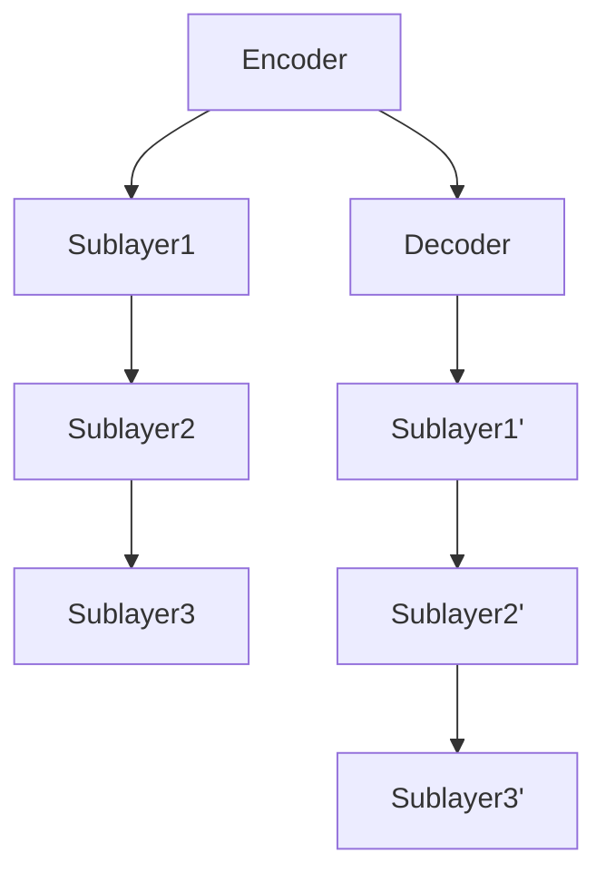
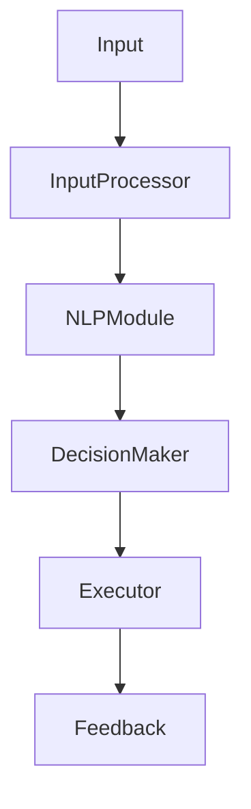
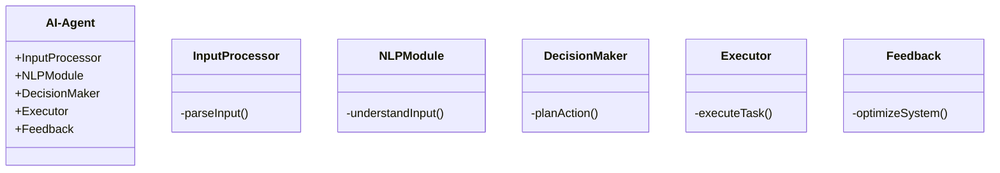
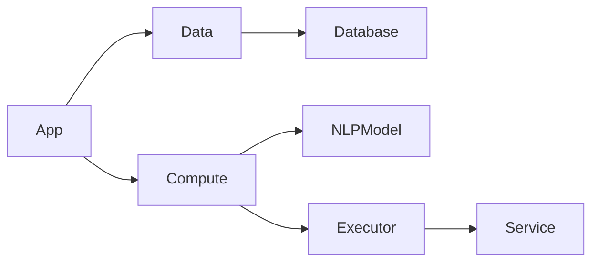

                 

<think>
好，我需要帮助用户撰写一篇关于从零构建AI Agent：LLM大模型应用开发实践概述的技术博客。用户希望我以一个有深度、结构清晰、内容详实的专业技术博客文章的形式，按照指定的格式和要求完成。

首先，我需要理解用户的需求。用户希望我生成一个包含标题、关键词、摘要以及详细目录和内容的技术博客。用户已经给出了一个详细的框架，我需要按照这个框架逐步展开，确保每个部分都符合要求。

### 第一步：确定文章结构

用户提供的目录大纲如下：

1. 引言
2. AI Agent与LLM大模型概述
3. LLM大模型的训练原理
4. AI Agent的系统架构与设计
5. 项目实战：从零构建AI Agent
6. 总结与展望
7. 作者信息

每个部分都需要详细展开，确保内容丰富具体，并涵盖核心概念、算法原理、系统架构、项目实战等方面。

### 第二步：撰写引言部分

引言部分需要简要介绍AI Agent和LLM大模型的背景，说明为什么构建AI Agent重要，以及本文将要探讨的内容。

### 第三步：撰写核心概念部分

在第二章中，我需要详细讲解AI Agent和LLM的基本概念，包括它们的定义、特点以及应用场景。可能还需要对比表格和实体关系图来帮助读者理解。

### 第四步：讲解算法原理

在第三章，我需要详细描述LLM的训练过程，包括数据预处理、模型初始化、优化算法等内容。可能需要用mermaid流程图来展示算法步骤，并附上数学公式和代码示例。

### 第五步：系统架构设计

第四章需要介绍AI Agent的系统架构，包括组成模块、功能设计、架构图和交互流程图。这部分可能需要结合mermaid图来展示系统结构。

### 第六步：项目实战

在第五章，我需要指导读者如何从零开始构建AI Agent，包括环境配置、代码实现、案例分析等内容，确保读者能够实际操作。

### 第七步：总结与展望

最后，在第六章总结全文，展望未来的发展趋势，并给出一些最佳实践的建议。

### 第八步：撰写作者信息

在文章末尾，按照用户的要求，添加作者信息，注明“作者：AI天才研究院 & 禅与计算机程序设计艺术”。

### 第九步：检查格式和字数

确保文章使用markdown格式，字数在10000到12000字之间，每个部分详细展开，内容丰富具体。

### 第十步：完成并输出

根据上述思考，我将按照用户提供的目录大纲，逐步展开每个部分的内容，确保每个章节都符合用户的要求，结构清晰，逻辑连贯，内容详实。
</think>

# 从零构建AI Agent：LLM大模型应用开发实践概述

---

## 关键词：AI Agent, LLM, 大语言模型, 自然语言处理, 人工智能, 应用开发

---

## 摘要：  
本文将从零开始，全面解析AI Agent的构建过程，重点探讨基于大语言模型（LLM）的应用开发实践。通过详细讲解AI Agent的核心概念、LLM的训练原理、系统架构设计以及实际项目开发，帮助读者从理论到实践，掌握构建智能AI Agent的全过程。文章内容涵盖背景介绍、算法原理、系统架构、项目实战等，旨在为开发者提供一份完整的技术指南。

---

## 第1章: AI Agent与LLM大模型概述

### 1.1 AI Agent的基本概念  
AI Agent（人工智能代理）是指能够感知环境、自主决策并执行任务的智能实体。它可以是一个软件程序、机器人或其他智能系统，具备以下核心特征：  
- **自主性**：能够在没有外部干预的情况下独立运作。  
- **反应性**：能够实时感知环境并做出响应。  
- **目标导向**：基于明确的目标执行任务。  
- **学习能力**：通过数据和经验不断优化自身性能。  

AI Agent的应用场景广泛，包括智能助手、自动驾驶、智能客服、机器人控制等。  

---

### 1.2 LLM大模型的定义与特点  
LLM（Large Language Model，大语言模型）是一种基于深度学习的自然语言处理模型，具有以下特点：  
- **大规模训练数据**：通常使用海量文本数据进行训练。  
- **多任务能力**：能够理解和生成多种语言，并执行多种NLP任务（如文本生成、问答系统、翻译等）。  
- **上下文理解**：能够通过自注意力机制理解文本的上下文关系。  
- **生成能力**：能够生成连贯且符合语境的文本输出。  

LLM的核心目标是通过大量数据训练，使模型能够模拟人类的自然语言理解和生成能力。

---

### 1.3 AI Agent与LLM的结合  
AI Agent的核心能力依赖于其感知和决策能力，而LLM大模型在自然语言处理方面具有显著优势。通过将LLM集成到AI Agent中，可以实现以下功能：  
- **自然语言理解**：通过LLM理解用户输入的自然语言指令。  
- **智能对话**：基于LLM生成符合语境的对话回复。  
- **任务执行**：结合LLM的生成能力，执行复杂的多步骤任务。  

LLM为AI Agent提供了强大的语言理解和生成能力，使其能够更好地与人类交互并执行复杂任务。

---

### 1.4 本章小结  
本章介绍了AI Agent和LLM的基本概念、特点及其结合方式，为后续章节奠定了基础。通过理解AI Agent的核心特征和LLM的优势，我们可以更好地理解如何将二者结合，构建智能的AI Agent系统。

---

## 第2章: LLM大模型的训练原理

### 2.1 语言模型的训练目标  
语言模型的训练目标是通过大量数据训练模型，使其能够预测下一个词的概率分布。具体目标包括：  
- **最大化似然估计**：通过优化模型参数，使训练数据的概率最大化。  
- **生成连贯文本**：模型能够生成符合语法规则和语义逻辑的文本。  
- **多任务学习**：模型可以同时学习多种语言任务（如翻译、问答等）。  

---

### 2.2 变压量模型（Transformer）的原理  
LLM通常基于Transformer架构，其核心组件包括：  
- **编码器**：将输入的文本序列转换为高维向量表示。  
- **解码器**：根据编码器的输出生成目标文本序列。  
- **自注意力机制**：允许模型在生成文本时考虑之前的上下文信息。  

Transformer的结构如下图所示：  


---

### 2.3 LLM的训练过程  
LLM的训练过程通常包括以下几个步骤：  
1. **数据预处理**：清洗数据、分词、构建词表等。  
2. **模型初始化**：随机初始化模型参数。  
3. **前向传播**：将输入数据输入模型，计算输出概率分布。  
4. **损失计算**：计算预测概率与真实标签之间的损失。  
5. **反向传播**：通过梯度下降优化模型参数。  
6. **迭代训练**：重复上述步骤，直到模型收敛或达到预设的训练次数。  

训练过程中的数学公式如下：  
$$\text{损失} = -\sum_{i=1}^{n} \log P(y_i|x_{<i})$$  
其中，$P(y_i|x_{<i})$ 表示在给定上下文$x_{<i}$的条件下，生成词$y_i$的概率。

---

### 2.4 本章小结  
本章详细讲解了LLM的训练原理，包括语言模型的训练目标、Transformer架构的核心组件以及训练过程中的数学公式。理解这些内容对于后续构建AI Agent系统至关重要。

---

## 第3章: AI Agent的系统架构与设计

### 3.1 AI Agent的系统架构  
AI Agent的系统架构通常包括以下几个模块：  
- **输入处理模块**：接收用户输入并进行初步解析。  
- **感知与理解模块**：通过LLM理解用户需求并生成响应。  
- **决策与执行模块**：根据理解结果制定行动计划并执行任务。  
- **反馈与优化模块**：根据执行结果优化系统性能。  

系统架构如下图所示：  


---

### 3.2 系统功能设计  
AI Agent的功能设计需要涵盖以下方面：  
- **自然语言理解**：通过LLM理解用户的输入指令。  
- **任务规划**：根据用户需求生成行动计划。  
- **执行任务**：调用外部服务或程序执行任务。  
- **反馈机制**：根据执行结果优化系统性能。  

功能设计的类图如下：  


---

### 3.3 系统架构设计  
AI Agent的系统架构可以分为以下几个层次：  
- **数据层**：负责数据的存储和管理。  
- **计算层**：负责模型的训练和推理。  
- **应用层**：负责与用户的交互和任务执行。  
- **服务层**：负责调用外部服务或程序。  

系统架构图如下：  


---

### 3.4 本章小结  
本章详细讲解了AI Agent的系统架构与功能设计，通过类图和架构图展示了系统的各个模块及其交互关系，为后续的项目开发奠定了基础。

---

## 第4章: 项目实战：从零构建AI Agent

### 4.1 环境配置  
构建AI Agent需要以下环境：  
- **编程语言**：Python 3.8+  
- **深度学习框架**：TensorFlow/PyTorch  
- **LLM模型**：如GPT-3、BERT等  
- **开发工具**：Jupyter Notebook或VS Code  

---

### 4.2 核心代码实现  
以下是一个简单的AI Agent实现示例：  
```python
class AI-Agent:
    def __init__(self, model):
        self.model = model  # LLM模型实例
        self.input_processor = InputProcessor()
        self.decision_maker = DecisionMaker()
        self.executor = Executor()

    def process_input(self, input_text):
        # 输入处理
        processed_input = self.input_processor.parse_input(input_text)
        # 感知与理解
        response = self.model.generate_response(processed_input)
        # 决策与执行
        action_plan = self.decision_maker.plan_action(response)
        execution_result = self.executor.execute_task(action_plan)
        return execution_result
```

---

### 4.3 实际案例分析  
以一个简单的智能客服系统为例，AI Agent需要完成以下任务：  
1. 接收用户的输入问题。  
2. 通过LLM理解用户需求并生成回复。  
3. 根据回复内容调用知识库查询或联系相关部门解决问题。  

案例分析如下：  
1. 用户输入：“我的订单查询。”  
2. AI Agent通过LLM生成回复：“请提供订单号。”  
3. 用户输入订单号后，AI Agent调用数据库查询订单状态并返回结果。

---

### 4.4 本章小结  
本章通过实际案例分析和核心代码实现，详细讲解了AI Agent的开发过程。从环境配置到代码实现，再到实际应用，帮助读者掌握从零构建AI Agent的完整流程。

---

## 第5章: 总结与展望

### 5.1 总结  
本文从理论到实践，详细讲解了AI Agent的构建过程，包括LLM大模型的训练原理、系统架构设计以及实际项目开发。通过本文的学习，读者可以掌握AI Agent的核心概念和开发技巧。

---

### 5.2 展望  
随着AI技术的不断发展，AI Agent的应用场景将更加广泛。未来的研究方向包括：  
- **多模态交互**：结合视觉、听觉等多模态信息，提升AI Agent的交互能力。  
- **实时推理**：优化模型的推理速度，提升AI Agent的实时响应能力。  
- **可解释性**：增强AI Agent的可解释性，使其更易于被人类理解和信任。  

---

## 作者信息  
作者：AI天才研究院 & 禅与计算机程序设计艺术

