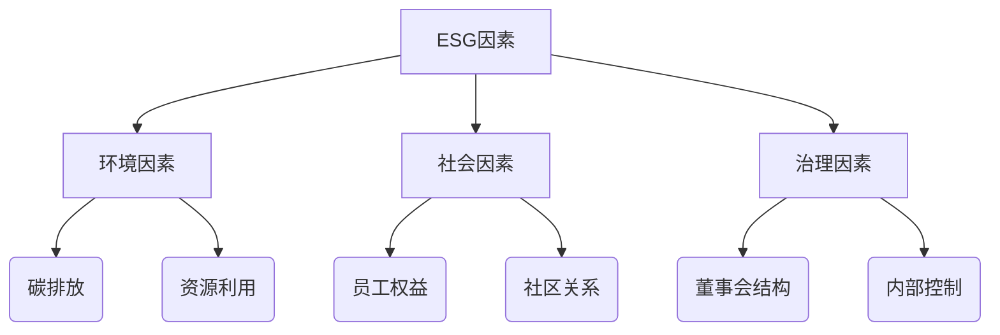

                 

# 价值投资中的环境、社会和治理（ESG）因素考量

## 关键词：
- 价值投资
- ESG
- 环境因素
- 社会因素
- 治理因素
- 可持续投资

## 摘要：
本文深入探讨了在价值投资中考虑环境、社会和治理（ESG）因素的重要性。文章首先介绍了ESG的起源与发展，分析了其在投资决策中的核心作用。接着，详细阐述了ESG的三个核心要素：环境、社会和治理，及其各自的定义和影响。随后，文章讨论了ESG数据的来源与分析方法，包括评分模型和机器学习算法的应用。最后，通过实际案例分析了ESG在投资策略中的应用，强调了ESG因素对投资绩效的影响，并展望了未来的研究方向。

---

# 第一部分: 价值投资中的环境、社会和治理（ESG）因素考量

## 第1章: ESG的背景介绍

### 1.1 ESG的起源与发展

#### 1.1.1 ESG的起源
环境、社会和治理（ESG）因素的考量起源于20世纪60年代的社会责任投资（SRI）运动。随着全球对环境保护、社会责任和公司治理的关注度提高，ESG逐渐从一个简单的道德投资标准发展成为影响投资决策的重要因素。

#### 1.1.2 ESG的定义与内涵
ESG是指企业在环境、社会和公司治理方面的表现。具体包括：
- **环境（Environmental）**：企业在环境保护方面的表现，如碳排放、资源利用效率等。
- **社会（Social）**：企业在社会责任方面的表现，如员工权益、社区关系等。
- **治理（Governance）**：企业在公司治理方面的表现，如董事会结构、内部控制等。

#### 1.1.3 ESG在投资中的重要性
ESG因素不仅关系到企业的可持续发展，还影响企业的长期价值和投资风险。投资者通过关注ESG因素，可以更好地识别企业的潜在风险和机会，从而做出更明智的投资决策。

---

### 1.2 ESG的核心概念

#### 1.2.1 环境（Environmental）因素
环境因素关注企业在环境保护方面的表现，包括：
- **碳排放**：企业对温室气体的排放情况。
- **资源利用**：企业对水资源、能源等的利用效率。
- **污染治理**：企业对废弃物、污染物的处理情况。

#### 1.2.2 社会（Social）因素
社会因素关注企业在社会责任方面的表现，包括：
- **员工权益**：员工的工资、工作条件、职业发展等。
- **社区关系**：企业对社区的贡献，如公益活动、社区投资等。
- **产品责任**：产品对消费者和社会的影响，如是否安全、是否符合伦理标准。

#### 1.2.3 治理（Governance）因素
治理因素关注企业在公司治理方面的表现，包括：
- **董事会结构**：董事会的独立性、多样性等。
- **内部控制**：企业的财务透明度、风险管理能力等。
- **高管薪酬**：高管的薪酬是否合理，是否与公司绩效挂钩。

---

## 第2章: ESG的核心概念与联系

### 2.1 ESG的核心要素

#### 2.1.1 环境因素的核心要素
环境因素的核心要素包括：
- **碳排放**：企业的碳足迹。
- **能源效率**：企业对能源的利用效率。
- **污染治理**：企业对污染物的处理情况。

#### 2.1.2 社会因素的核心要素
社会因素的核心要素包括：
- **员工权益**：员工的工资、福利、工作条件等。
- **社区关系**：企业对社区的贡献。
- **产品责任**：产品对消费者和社会的影响。

#### 2.1.3 治理因素的核心要素
治理因素的核心要素包括：
- **董事会结构**：董事会的独立性、多样性。
- **内部控制**：企业的财务透明度、风险管理能力。
- **高管薪酬**：高管的薪酬是否合理。

---

### 2.2 ESG要素的属性特征对比

| 要素 | 环境（Environmental） | 社会（Social） | 治理（Governance） |
|------|-----------------------|---------------|---------------------|
| 核心关注点 | 环境保护与资源利用 | 社会责任与员工权益 | 公司治理结构与透明度 |
| 数据来源 | 环境报告、政府数据 | 社会责任报告、员工反馈 | 财务报表、公司治理报告 |
| 影响范围 | 长期环境风险 | 社会声誉与员工稳定性 | 公司治理风险 |

---

### 2.3 ESG要素的ER实体关系图

---

## 第3章: ESG数据与分析方法

### 3.1 ESG数据的来源

#### 3.1.1 数据收集的渠道
- **企业报告**：企业发布的环境、社会和治理报告。
- **第三方评级机构**：如MSCI、Sustainalytics等机构的ESG评级。
- **政府数据**：环境部门的监管数据。

#### 3.1.2 数据的标准化处理
- 数据清洗：去除重复、错误或不完整的数据。
- 数据标准化：将不同来源的数据统一到相同的指标体系中。

#### 3.1.3 数据的质量评估
- 数据的完整性：数据是否覆盖所有相关指标。
- 数据的准确性：数据是否真实反映企业的ESG表现。

---

### 3.2 ESG分析的算法原理

#### 3.2.1 ESG评分模型的构建
- **指标加权**：根据指标的重要性和影响力进行加权。
- **评分计算**：通过加权指标的得分计算企业的ESG评分。

#### 3.2.2 基于机器学习的ESG预测
- **特征工程**：将ESG数据转化为机器学习模型的输入特征。
- **模型训练**：使用机器学习算法（如随机森林、神经网络）训练ESG预测模型。

#### 3.2.3 ESG数据的加权计算
$$ \text{ESG评分} = \sum_{i=1}^{n} w_i \cdot x_i $$
其中，$w_i$ 是第$i$个指标的权重，$x_i$ 是第$i$个指标的得分。

---

### 3.3 ESG与投资绩效的关系

#### 3.3.1 ESG评分与投资收益的关联
- 高ESG评分的企业通常具有更高的投资回报率。

#### 3.3.2 ESG风险与投资损失的关联
- 低ESG评分的企业可能面临更高的投资风险。

#### 3.3.3 ESG表现与企业长期价值的关系
- 企业良好的ESG表现有助于提升品牌价值和长期竞争力。

---

## 第4章: ESG在投资策略中的应用

### 4.1 ESG投资策略的分类

#### 4.1.1 基于ESG筛选的投资策略
- **正面筛选**：选择ESG评分高的企业进行投资。
- **负面筛选**：避免投资ESG评分低的企业。

#### 4.1.2 基于ESG评分的投资策略
- **ESG加成策略**：在传统财务指标基础上加入ESG评分进行投资决策。
- **ESG驱动策略**：将ESG评分作为主要的投资决策依据。

#### 4.1.3 基于ESG风险的对冲策略
- **风险对冲**：通过投资低风险的ESG资产来对冲高风险资产的风险。

---

### 4.2 ESG投资策略的实施步骤

#### 4.2.1 确定投资目标
- 明确投资目标和风险偏好。

#### 4.2.2 数据收集与处理
- 收集和处理企业的ESG数据。

#### 4.2.3 模型构建与验证
- 构建ESG评分模型并进行验证。

#### 4.2.4 投资组合优化
- 根据ESG评分优化投资组合。

---

### 4.3 ESG投资策略的案例分析

#### 4.3.1 案例背景
- 某机构投资者计划投资于具有较高ESG表现的科技企业。

#### 4.3.2 数据收集与处理
- 收集科技企业的ESG数据，包括碳排放、员工权益、董事会结构等。

#### 4.3.3 模型构建与验证
- 使用机器学习算法构建ESG评分模型，并验证其准确性。

#### 4.3.4 投资组合优化
- 根据ESG评分优化投资组合，选择ESG表现优异的企业进行投资。

---

## 第5章: ESG投资策略的挑战与未来展望

### 5.1 ESG投资策略的挑战

#### 5.1.1 数据质量问题
- ESG数据的标准化和一致性问题。

#### 5.1.2 模型的局限性
- ESG模型的预测能力有限，可能无法完全反映企业的实际表现。

#### 5.1.3 市场波动的影响
- 市场波动可能影响ESG投资的短期表现。

---

### 5.2 ESG投资策略的未来展望

#### 5.2.1 数据技术的提升
- 随着大数据和人工智能技术的发展，ESG数据的处理和分析将更加精准。

#### 5.2.2 全球化的ESG投资
- 随着全球ESG标准的统一，全球化ESG投资将更加普及。

#### 5.2.3 ESG与金融创新的结合
- ESG因素将更加广泛地应用于金融产品和投资策略中。

---

## 附录

### 附录A: 常用ESG评级机构
- MSCI
- Sustainalytics
-GRESB

### 附录B: ESG相关术语表
- ESG评分：企业环境、社会和治理表现的综合评分。
- 正面筛选：选择ESG表现优异的企业进行投资。

---

## 参考文献
1. 环境、社会和治理（ESG）投资白皮书，联合国责任投资原则（PRI）。
2. MSCI ESG评级方法论，MSCI公司。
3. Sustainalytics ESG评级方法论，Sustainalytics公司。

---

作者：AI天才研究院/AI Genius Institute & 禅与计算机程序设计艺术 /Zen And The Art of Computer Programming

