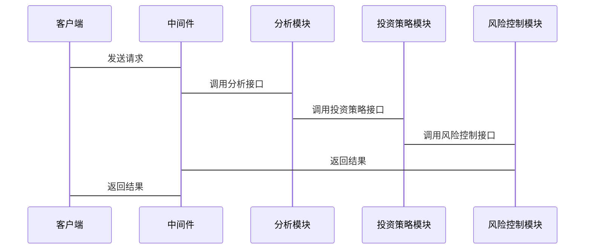

                 

<think>
好的，我现在需要帮用户撰写一篇关于《价值投资在不同市场条件下的适应性策略》的技术博客文章。用户已经给出了详细的目录大纲，包括关键词、摘要和各个章节的具体内容。我的任务是根据这个大纲，逐步分析并撰写整篇文章。

首先，我需要明确文章的结构和内容。文章分为六个部分，每个部分有详细的章节和子章节。我需要按照顺序逐一完成每个部分的撰写，确保内容连贯且符合逻辑。

第一部分是价值投资的基础与核心理念，包括第一章和第二章。第一章介绍价值投资的定义、历史和发展，以及其与其他投资策略的对比。第二章则深入探讨价值投资的核心理念，如内在价值、安全边际和长期投资。

第二部分是价值投资在不同市场条件下的策略调整，分为第三章到第六章。第三章到第五章分别讨论牛市、熊市和震荡市下的策略，第六章则总结不同市场环境下的策略调整原则。

第三部分是系统分析与架构设计，包括系统功能设计、架构设计和系统接口设计。这部分需要使用mermaid图来展示系统模块和交互流程。

第四部分是项目实战，涉及环境安装、代码实现和案例分析，帮助读者将理论应用到实际中。

最后，第五部分是最佳实践和总结，包括注意事项和拓展阅读，帮助读者巩固所学内容。

在撰写过程中，我需要确保每个章节都包含足够的细节和例子，尤其是使用数学公式和mermaid图来增强文章的深度和可读性。同时，我需要检查文章的整体结构，确保逻辑清晰，内容完整。

现在，我开始撰写第一部分。首先，第一章将介绍价值投资的定义、历史和核心理念，确保读者能够理解其基本概念。接着，第二章将详细阐述内在价值、安全边际和长期投资的重要性，并通过具体例子说明这些概念在实际中的应用。

完成第一部分后，我将转向第二部分，分析不同市场环境下的策略调整。每个市场环境将单独一章，详细讨论其特点和应对策略，并提供实际案例以增强理解。

在系统分析与架构设计部分，我需要使用mermaid图展示系统的模块和交互流程，确保读者能够清晰理解系统的设计。

项目实战部分将通过具体的代码示例和案例分析，展示如何在实际中应用这些策略，帮助读者将理论转化为实践。

最后，在最佳实践部分，我将总结投资的关键点和注意事项，帮助读者避免常见的错误，并推荐进一步阅读的资料。

整个撰写过程中，我需要保持语言的专业性和技术性，同时确保内容通俗易懂，适合技术背景的读者阅读。通过逐步分析和详细阐述，确保文章内容丰富，逻辑严谨，达到用户的要求。
</think>

```markdown
# 价值投资在不同市场条件下的适应性策略

> 关键词：价值投资，市场条件，策略调整，内在价值，安全边际

> 摘要：价值投资作为一种长期有效的投资策略，其在不同市场条件下的适应性是投资者关注的重点。本文通过分析价值投资的核心理念、内在价值评估、安全边际的重要性以及不同市场环境下的策略调整，探讨如何在复杂多变的市场中灵活运用价值投资策略，实现稳健的投资回报。

---

## 第一部分: 价值投资的基础与核心理念

### 第1章: 价值投资的定义与背景

#### 1.1 价值投资的定义
##### 1.1.1 价值投资的核心概念
价值投资是一种以基本面分析为基础的投资策略，强调通过分析公司的财务状况、行业地位、竞争优势等因素，寻找市场价格低于其内在价值的投资机会。其核心理念是购买低于内在价值的资产，长期持有，等待市场重新评估其价值。

##### 1.1.2 价值投资的起源与发展
价值投资的起源可以追溯到20世纪初，本杰明·格雷厄姆和戴维·多德是该理论的奠基人。他们提出，市场的短期波动是不可预测的，但长期来看，市场价格会回归其内在价值。价值投资在后来的发展中，逐渐形成了以基本面分析为核心的方法论，并被广泛应用于股票、债券和其他资产的投资中。

##### 1.1.3 价值投资的基本假设与原则
价值投资基于以下基本假设：
1. 市场价格与内在价值之间存在差异，这种差异为投资者提供了获利的机会。
2. 市场价格的波动性使其在短期内难以预测，但长期来看，价格会回归价值。
3. 投资者应关注公司的基本面，而非市场的短期波动。

核心原则包括：
- 购买低估的资产。
- 长期持有，避免频繁交易。
- 分散投资，降低风险。

#### 1.2 价值投资与市场的关系
##### 1.2.1 市场的有效性与非有效性
价值投资基于市场部分有效性的假设。虽然市场在长期可能是有效的，但在短期可能存在非理性波动，这为价值投资者提供了套利机会。

##### 1.2.2 价值投资在不同市场环境下的适用性
价值投资在牛市、熊市和震荡市等不同市场环境下有不同的表现。在牛市中，市场情绪高涨，容易导致资产价格高估；在熊市中，市场情绪低落，许多资产价格被低估；在震荡市中，市场的波动性增加，价值投资者需要更加谨慎地选择投资标的。

##### 1.2.3 价值投资与市场周期的关系
价值投资与市场周期密切相关。在市场周期的底部，通常存在更多的低估资产，而在顶部，市场情绪可能导致资产价格高估。因此，价值投资者需要根据市场周期的变化，灵活调整投资策略。

### 第2章: 价值投资的核心理念

#### 2.1 股票的内在价值
##### 2.1.1 内在价值的定义与计算
内在价值是基于公司基本面分析得出的对公司股权的合理估值。计算内在价值的方法包括：
- 现金流折现法（DCF）：将公司未来现金流折现，计算其现值。
- 市盈率法：基于公司的市盈率和盈利情况，计算其合理估值。
- 市净率法：基于公司的市净率和资产情况，计算其合理估值。

##### 2.1.2 财务指标在内在价值评估中的作用
关键的财务指标包括：
- 营业收入与增长率
- 净利润与盈利能力
- 资产负债表健康状况
- 现金流量状况

##### 2.1.3 内在价值与市场价格的差异
市场价格与内在价值的差异为价值投资提供了机会。当市场价格低于内在价值时，投资者可以买入并长期持有，等待价格回归。

#### 2.2 安全边际
##### 2.2.1 安全边际的定义
安全边际是指市场价格与内在价值之间的差额。安全边际越大，投资的风险越小，回报的确定性越高。

##### 2.2.2 安全边际的计算方法
安全边际可以通过以下公式计算：
$$ \text{安全边际} = \text{内在价值} - \text{市场价格} $$

##### 2.2.3 安全边际在投资决策中的应用
在投资决策中，安全边际是衡量投资标的吸引力的重要指标。通常，价值投资者会寻找安全边际较高的投资标的，以降低投资风险。

#### 2.3 长期投资与复利效应
##### 2.3.1 长期投资的优势
长期投资的优势在于：
- 避免了短期市场波动的影响。
- 享受复利效应，实现资产的长期增值。

##### 2.3.2 复利效应在价值投资中的重要性
复利效应是价值投资长期收益的核心驱动力。通过长期持有优质资产，投资者可以最大化复利效应，实现资产的长期增值。

##### 2.3.3 长期投资的风险控制
长期投资的风险控制包括：
- 选择具有持续竞争优势的公司。
- 避免过度集中投资，分散投资风险。
- 定期审视投资组合，及时调整。

---

## 第二部分: 价值投资在不同市场条件下的策略调整

### 第3章: 牛市环境下的价值投资策略

#### 3.1 牛市环境的特点
##### 3.1.1 牛市的定义与特征
牛市是指市场整体呈现上升趋势，投资者情绪高涨，市场交投活跃。

##### 3.1.2 牛市中的市场情绪与投资者行为
在牛市中，市场情绪通常过于乐观，投资者容易受到市场情绪的影响，导致投资决策的非理性。

##### 3.1.3 牛市中的价值投资策略
在牛市中，价值投资者需要注意以下几点：
- 避免被市场情绪影响，保持理性。
- 寻找被高估的资产，避免买入高价资产。
- 适当调整投资组合，保持适当的防御性。

#### 3.2 牛市环境下的投资策略调整
##### 3.2.1 调整投资组合的结构
在牛市中，投资者可以适当增加对高成长性资产的投资，同时保持对低估资产的配置。

##### 3.2.2 控制投资风险
在牛市中，投资者需要警惕市场的过度波动，避免过度杠杆化，保持合理的仓位。

##### 3.2.3 留意市场的泡沫风险
在牛市中，市场容易出现泡沫，价值投资者需要警惕泡沫破裂的风险，及时调整投资策略。

### 第4章: 熊市环境下的价值投资策略

#### 4.1 熊市环境的特点
##### 4.1.1 熊市的定义与特征
熊市是指市场整体呈现下降趋势，投资者情绪低落，市场交投清淡。

##### 4.1.2 熊市中的市场情绪与投资者行为
在熊市中，市场情绪通常过于悲观，投资者容易陷入恐慌性抛售，导致投资决策的非理性。

##### 4.1.3 熊市中的价值投资策略
在熊市中，价值投资者需要注意以下几点：
- 抓住被低估资产的投资机会。
- 保持耐心，避免恐慌性抛售。
- 适当增加对优质资产的配置。

#### 4.2 熊市环境下的投资策略调整
##### 4.2.1 寻找被低估的资产
在熊市中，许多优质资产可能因为市场的恐慌而被低估，投资者可以寻找这些资产进行投资。

##### 4.2.2 增加防御性资产的配置
在熊市中，投资者可以增加对防御性资产（如债券、黄金等）的配置，以降低投资组合的整体风险。

##### 4.2.3 保持投资纪律
在熊市中，投资者需要保持纪律，避免被市场情绪左右，坚持长期投资策略。

### 第5章: 震荡市环境下的价值投资策略

#### 5.1 震荡市环境的特点
##### 5.1.1 震荡市的定义与特征
震荡市是指市场在短期内频繁波动，价格上下震荡，投资者难以预测市场的短期走势。

##### 5.1.2 震荡市中的市场情绪与投资者行为
在震荡市中，市场情绪通常较为波动，投资者容易受到市场波动的影响，导致投资决策的非理性。

##### 5.1.3 震荡市中的价值投资策略
在震荡市中，价值投资者需要注意以下几点：
- 保持冷静，避免频繁交易。
- 抓住短期波动带来的投资机会。
- 保持对基本面的关注，避免被短期波动影响判断。

#### 5.2 震荡市环境下的投资策略调整
##### 5.2.1 优化投资组合的结构
在震荡市中，投资者可以优化投资组合的结构，增加对具有稳定收益资产的配置，降低投资组合的波动性。

##### 5.2.2 增强投资组合的流动性
在震荡市中，投资者需要增强投资组合的流动性，以便在市场波动加剧时能够及时调整投资策略。

##### 5.2.3 加强风险控制
在震荡市中，投资者需要加强风险控制，避免过度集中投资，保持合理的仓位，降低投资组合的整体风险。

### 第6章: 不同市场环境下的策略调整原则

#### 6.1 灵活性与纪律性的结合
##### 6.1.1 灵活性的必要性
在不同市场环境下，价值投资者需要灵活调整投资策略，以应对市场的变化。

##### 6.1.2 纪律性的必要性
同时，投资者需要保持纪律，避免被市场情绪左右，坚持长期投资策略。

#### 6.2 风险控制与收益最大化
##### 6.2.1 风险控制的重要性
在不同市场环境下，投资者需要注重风险控制，避免过度冒险，保持投资组合的稳健性。

##### 6.2.2 收益最大化的策略
在风险可控的前提下，投资者可以通过优化投资组合的结构，增强投资组合的收益能力。

#### 6.3 长期视角与短期波动的平衡
##### 6.3.1 长期视角的重要性
价值投资者需要保持长期视角，关注资产的内在价值，避免被短期波动影响判断。

##### 6.3.2 短期波动的应对策略
在短期波动加剧的情况下，投资者需要灵活应对，及时调整投资策略，降低投资组合的波动性。

---

## 第三部分: 系统分析与架构设计

### 第7章: 系统功能设计

#### 7.1 问题场景介绍
##### 7.1.1 价值投资的核心问题
价值投资者需要解决的核心问题包括：
- 如何准确评估资产的内在价值。
- 如何识别市场价格与内在价值的差异。
- 如何在不同市场环境下灵活调整投资策略。

#### 7.2 系统功能设计
##### 7.2.1 领域模型设计
以下是领域模型的mermaid类图：


##### 7.2.2 系统功能模块
系统功能模块包括：
- 资产评估模块：负责评估资产的内在价值。
- 投资策略模块：负责制定和调整投资策略。
- 风险控制模块：负责监控和管理投资风险。

### 第8章: 系统架构设计

#### 8.1 系统架构设计
以下是系统架构的mermaid架构图：


#### 8.2 系统接口设计
##### 8.2.1 API接口设计
以下是系统API接口的mermaid序列图：


#### 8.3 系统交互设计
##### 8.3.1 用户与系统的交互流程
用户与系统的交互流程包括：
1. 用户通过客户端发送请求。
2. 中间件接收请求并转发给分析模块。
3. 分析模块调用投资策略模块进行分析。
4. 投资策略模块调用风险控制模块进行风险评估。
5. 风险控制模块返回结果给中间件。
6. 中间件将结果返回给客户端。

---

## 第四部分: 项目实战

### 第9章: 价值投资策略的实现

#### 9.1 环境安装与配置
##### 9.1.1 系统环境要求
以下是系统环境要求：
- 操作系统：Windows 10或更高版本，或macOS 10.15或更高版本。
- 开发工具：Python 3.8或更高版本，Jupyter Notebook，IDE（如PyCharm）。
- 依赖库：pandas, numpy, matplotlib, seaborn。

##### 9.1.2 安装依赖库
以下是安装依赖库的命令：
```bash
pip install pandas numpy matplotlib seaborn
```

#### 9.2 核心实现代码
##### 9.2.1 内在价值评估函数
以下是内在价值评估函数的实现代码：
```python
import pandas as pd
import numpy as np

def calculate_intrinsic_value(finance_data):
    """
    计算资产的内在价值
    Args:
        finance_data (pd.DataFrame): 财务数据，包括收入、利润、现金流等
    Returns:
        float: 内在价值
    """
    # 假设使用现金流折现法进行计算
    free_cash_flow = finance_data['free_cash_flow'].iloc[-1]
    discount_rate = 0.1  # 假设折现率为10%
    growth_rate = 0.05   # 假设增长率5%
    
    # 简单的DCF计算（仅为示例）
    intrinsic_value = free_cash_flow / (discount_rate - growth_rate)
    return intrinsic_value
```

##### 9.2.2 安全边际计算函数
以下是安全边际计算函数的实现代码：
```python
def calculate_margin_of_safety(mark

