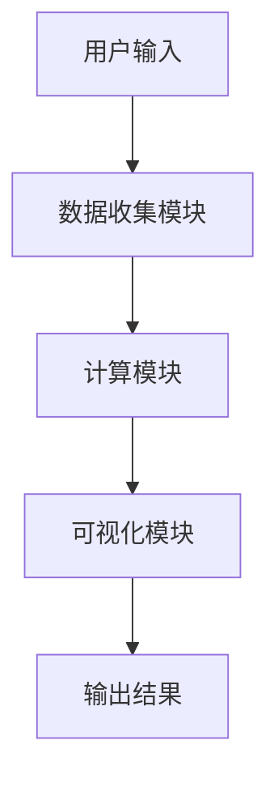

                 


# 价值投资的核心原则：安全边际

> 关键词：价值投资, 安全边际, 内在价值, 风险控制, 价值评估, 投资策略, 安全边际率

> 摘要：安全边际是价值投资中的核心原则，它通过计算内在价值和市场价格之间的差异，帮助投资者降低风险并确保投资决策的稳健性。本文详细阐述了安全边际的定义、计算方法、在价值投资中的应用以及如何通过系统化的方法和项目实战来实现安全边际的有效应用。

---

## 第一章: 价值投资的背景与发展

### 1.1 价值投资的起源
价值投资是一种长期投资策略，起源于20世纪初，由本杰明·格雷厄姆和戴维·多德共同提出。这种策略强调以低于内在价值的价格买入股票，并长期持有，直到市场认识到其真实价值。价值投资的核心理念是寻找市场定价错误的机会，从而在长期获得超额收益。

### 1.2 安全边际的提出与意义
安全边际是价值投资中的核心原则，它通过计算内在价值和市场价格之间的差异，为投资者提供了一种量化风险的方法。安全边际的存在确保了投资者在市场价格波动时仍能获得稳健的收益，同时也为应对市场的不确定性提供了缓冲空间。

### 1.3 价值投资与安全边际的核心要素
- **内在价值**：内在价值是资产在市场中合理的价格，通常通过现金流折现法计算得出。
- **市场价格**：市场价格是资产在市场上的即时价格，受市场情绪和短期因素影响较大。
- **安全边际率**：安全边际率是内在价值与市场价格之间的差额占内在价值的比例，公式为：
  $$ \text{安全边际率} = \frac{\text{内在价值} - \text{市场价格}}{\text{内在价值}} $$

---

## 第二章: 安全边际的核心概念

### 2.1 安全边际的数学模型
安全边际的计算基于内在价值和市场价格的差异。以下是内在价值的计算公式：
$$ V = \frac{CF}{r - g} $$
其中，\( V \) 表示内在价值，\( CF \) 表示现金流，\( r \) 表示折现率，\( g \) 表示增长率。

### 2.2 安全边际的计算方法
1. **计算内在价值**：通过现金流折现法计算目标公司的内在价值。
2. **确定市场价格**：获取目标公司在市场上的当前价格。
3. **计算安全边际率**：使用上述公式计算安全边际率，评估投资的安全性。

### 2.3 安全边际与投资风险的关系
- **高安全边际**：意味着内在价值远高于市场价格，投资风险较低。
- **低安全边际**：意味着市场价格接近或高于内在价值，投资风险较高。

### 2.4 本章小结
本章通过数学模型和实例分析，详细讲解了安全边际的计算方法及其在投资决策中的重要性。

---

## 第三章: 安全边际的计算与应用

### 3.1 安全边际的计算步骤
1. **确定目标公司的内在价值**：通过分析公司的财务数据和行业状况，计算其内在价值。
2. **确定目标公司的市场价格**：获取目标公司在市场上的即时价格。
3. **计算安全边际率**：使用公式计算安全边际率，并评估投资的安全性。

### 3.2 安全边际的实例分析
假设某公司的内在价值为50元，市场价格为40元，其安全边际率为：
$$ \text{安全边际率} = \frac{50 - 40}{50} = 20\% $$
这意味着该投资具有较高的安全边际，风险较低。

### 3.3 安全边际在投资组合中的应用
- **分散投资**：通过投资多个具有较高安全边际的资产，降低整体投资组合的风险。
- **长期持有**：价值投资者通常长期持有具有较高安全边际的资产，等待市场重新认识到其内在价值。

### 3.4 本章小结
本章通过实例分析和理论阐述，详细讲解了安全边际在实际投资中的应用。

---

## 第四章: 系统架构与实现

### 4.1 问题场景介绍
为了实现安全边际的系统化计算，我们设计了一个基于Python的分析系统，用于自动计算目标公司的内在价值、市场价格和安全边际率。

### 4.2 系统功能设计
- **数据收集模块**：收集目标公司的财务数据和市场数据。
- **计算模块**：计算内在价值、市场价格和安全边际率。
- **可视化模块**：将计算结果以图表形式展示，帮助投资者直观理解。

### 4.3 系统架构设计
以下是系统架构的mermaid图：


### 4.4 系统接口设计
- **输入接口**：用户输入目标公司的名称和相关数据。
- **输出接口**：输出目标公司的内在价值、市场价格和安全边际率。

### 4.5 本章小结
本章通过系统架构设计和功能模块划分，详细讲解了安全边际的系统化计算方法。

---

## 第五章: 项目实战

### 5.1 环境安装
- **Python**：安装Python 3.x及以上版本。
- **Pandas** 和 **Matplotlib**：通过pip安装这些库。

### 5.2 核心实现代码
以下是一个计算安全边际率的Python代码示例：
```python
import pandas as pd
import matplotlib.pyplot as plt

# 示例数据
data = {
    '公司': ['A', 'B', 'C'],
    '内在价值': [50, 60, 40],
    '市场价格': [40, 50, 35]
}

df = pd.DataFrame(data)

# 计算安全边际率
df['安全边际率'] = (df['内在价值'] - df['市场价格']) / df['内在价值']

# 可视化
plt.figure(figsize=(10, 6))
plt.bar(df['公司'], df['安全边际率'], label='安全边际率')
plt.title('公司安全边际率比较')
plt.ylabel('安全边际率')
plt.legend()
plt.show()
```

### 5.3 代码应用解读与分析
上述代码通过Pandas和Matplotlib库，计算并可视化了目标公司的安全边际率。通过分析图表，投资者可以直观地识别出具有较高安全边际率的投资标的。

### 5.4 实际案例分析
以苹果公司为例，假设其内在价值为300美元，市场价格为280美元，其安全边际率为：
$$ \text{安全边际率} = \frac{300 - 280}{300} = 6.67\% $$
虽然安全边际率较低，但考虑到苹果公司的强大护城河和盈利能力，投资者仍可以考虑投资。

### 5.5 本章小结
本章通过实际案例分析和代码实现，详细讲解了安全边际率的计算方法和应用。

---

## 第六章: 总结与最佳实践

### 6.1 本章小结
安全边际是价值投资中的核心原则，它通过量化内在价值与市场价格的差异，帮助投资者降低风险并实现稳健投资。

### 6.2 投资建议
- **长期视角**：价值投资强调长期持有，耐心等待市场认识到资产的内在价值。
- **风险管理**：通过计算安全边际率，投资者可以更好地控制风险，避免重大损失。
- **持续学习**：价值投资需要不断学习和分析，提升自身的分析能力和判断力。

### 6.3 注意事项
- **数据准确性**：内在价值的计算依赖于准确的财务数据和合理的假设。
- **市场变化**：市场价格受多种因素影响，投资者需要动态调整安全边际率的计算。

### 6.4 拓展阅读
- 《格雷厄姆智慧》
- 《投资学原理》
- 《安全边际：价值投资的核心》

---

## 作者：AI天才研究院 & 禅与计算机程序设计艺术

---

以上是《价值投资的核心原则：安全边际》的完整内容，感谢您的阅读！

