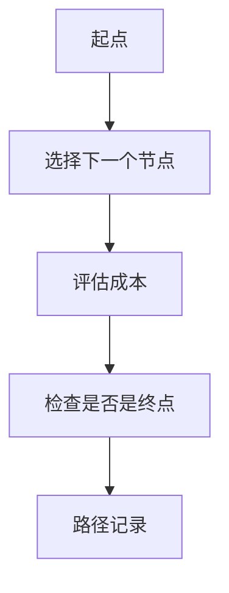
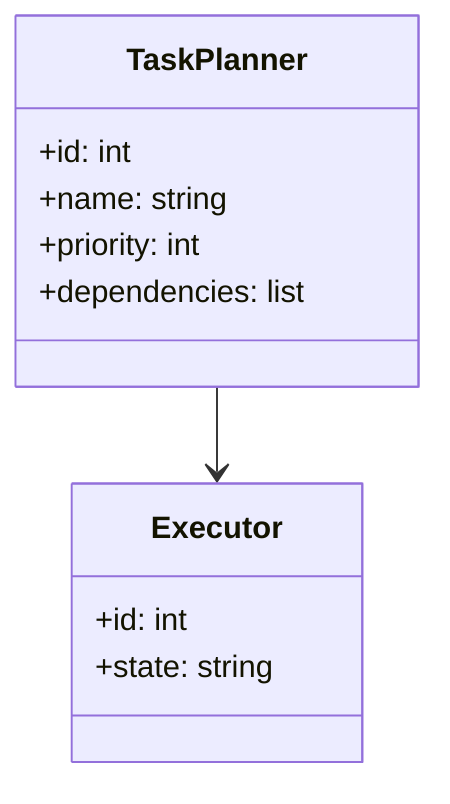
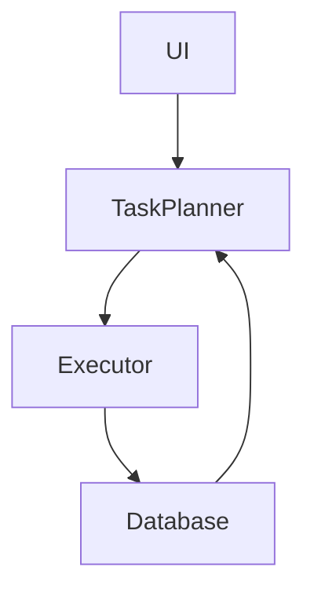
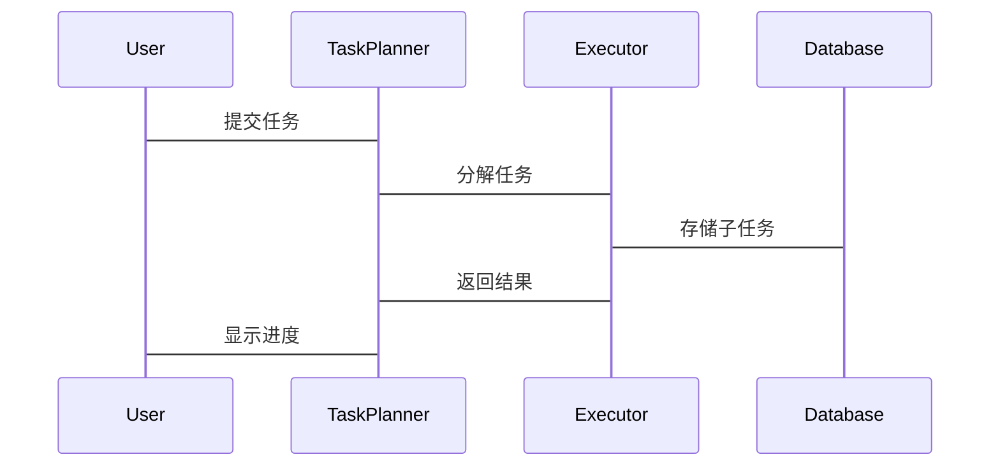

                 


# 任务规划与分解：提高AI Agent的问题解决能力

**关键词：任务规划、AI Agent、问题解决能力、任务分解、算法、系统设计**

**摘要：**  
任务规划与分解是提升AI Agent问题解决能力的核心技术。本文从任务规划的基本概念出发，详细探讨任务分解的策略、算法原理、系统架构设计及实际应用案例。通过系统分析和项目实战，帮助读者掌握任务规划与分解的关键方法，从而提高AI Agent在复杂场景中的执行效率和决策能力。

---

## 第一部分：任务规划与分解的背景与基础

### 第1章：任务规划的基本概念

#### 1.1 任务规划的定义
- **任务规划**：AI Agent根据目标和环境状态，制定一系列行动步骤的过程。
- **AI Agent**：具备感知环境、自主决策和执行任务的能力。
- **任务分解**：将复杂任务拆解为简单子任务，简化问题解决过程。

#### 1.2 任务分解的意义
- 提高效率：通过分解任务，降低问题复杂度。
- 适应性：灵活应对不同场景和约束条件。
- 可扩展性：便于后续功能的扩展和优化。

#### 1.3 经典任务分解模型
- 分层规划模型：任务分解成子任务，逐步细化。
- 目标驱动模型：基于目标导向进行任务分解。
- 资源约束模型：考虑资源限制的任务分解策略。

---

## 第二部分：任务规划与分解的核心概念

### 第2章：任务分解的策略与方法

#### 2.1 分解策略对比分析
- **横向分解**：按功能模块划分。
- **纵向分解**：按任务层次划分。
- **混合分解**：结合横向和纵向的策略。

| 分解策略 | 优点 | 缺点 |
|----------|------|------|
| 横向 | 明确功能模块 | 可能忽视任务间的依赖 |
| 纵向 | 强调层次结构 | 可能增加复杂性 |
| 混合 | 综合优势 | 实施难度较高 |

#### 2.2 任务结构与依赖关系
- **任务结构**：任务的层级关系和执行顺序。
- **依赖关系**：任务之间的依赖关系，例如任务A必须在任务B完成后执行。

#### 2.3 任务优先级与约束条件
- **优先级确定**：基于任务的重要性、紧急性和资源可用性。
- **约束条件**：时间、资源、环境等限制因素。

---

## 第三部分：任务规划与分解的算法原理

### 第3章：经典任务规划算法

#### 3.1 A*算法
- **原理**：基于启发式搜索，找到从起点到目标的最短路径。
- **流程图**：


#### 3.2 贪心算法
- **特点**：总是选择当前最优的子任务，逐步推进整体目标。

#### 3.3 分支界限算法
- **特点**：通过设置界限，减少不必要的分支探索。

### 第4章：算法实现与数学模型

#### 4.1 A*算法的实现
```python
def a_star_search(start, goal):
    open_set = {start}
    closed_set = set()
    came_from = {}
    g_score = {start: 0}
    f_score = {start: heuristic(start, goal)}
    while open_set:
        current = min(open_set, key=lambda x: f_score[x])
        if current == goal:
            break
        open_set.remove(current)
        closed_set.add(current)
        for neighbor in neighbors(current):
            if neighbor in closed_set:
                continue
            tentative_g_score = g_score[current] + cost(current, neighbor)
            if neighbor not in g_score or tentative_g_score < g_score[neighbor]:
                came_from[neighbor] = current
                g_score[neighbor] = tentative_g_score
                f_score[neighbor] = g_score[neighbor] + heuristic(neighbor, goal)
                if neighbor not in open_set:
                    open_set.add(neighbor)
    return reconstruct_path(came_from, start, goal)
```

#### 4.2 数学模型
- **启发函数**：$f(n) = g(n) + h(n)$
- **代价函数**：$g(n)$ 表示从起点到节点n的代价。

---

## 第四部分：系统分析与架构设计

### 第5章：系统功能设计

#### 5.1 领域模型设计


#### 5.2 系统架构设计


#### 5.3 系统交互设计


---

## 第五部分：项目实战与案例分析

### 第6章：智能助手任务分解系统

#### 6.1 环境配置
- **Python版本**：3.8+
- **依赖库**：numpy、pandas、scipy

#### 6.2 核心代码实现
```python
def decompose_task(main_task, constraints):
    sub_tasks = []
    for constraint in constraints:
        if constraint.check(main_task):
            sub_tasks.append(constraint.decompose(main_task))
    return sub_tasks
```

#### 6.3 代码解读与分析
- **约束检查**：确保任务分解符合约束条件。
- **子任务生成**：根据约束条件生成子任务列表。

---

## 第六部分：总结与展望

### 第7章：总结与最佳实践

#### 7.1 核心要点回顾
- 任务分解的策略选择。
- 算法的适用场景与优化。
- 系统设计的模块化与可扩展性。

#### 7.2 未来展望
- 更智能的任务分解方法。
- 结合机器学习的自适应算法。
- 多Agent协作的任务规划。

---

**作者：AI天才研究院/AI Genius Institute & 禅与计算机程序设计艺术 /Zen And The Art of Computer Programming**

---

通过以上目录，文章从任务规划的基本概念到实际应用案例，层层深入，帮助读者全面掌握任务规划与分解的关键技术。

