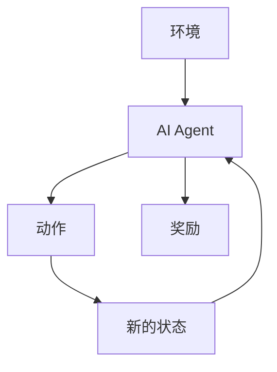
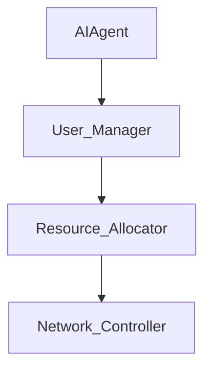

                 


# 企业AI Agent的5G网络切片优化策略

> 关键词：企业AI Agent, 5G网络切片, 网络优化, 强化学习, 算法实现

> 摘要：本文详细探讨了企业AI Agent在5G网络切片优化中的应用策略。通过分析网络切片的基本概念、AI Agent的作用原理，结合强化学习算法，提出了一种高效的优化策略，并通过数学建模和案例分析验证了其有效性。

---

# 第一部分：企业AI Agent与5G网络切片的背景与基础

## 第1章：5G网络切片概述

### 1.1 网络切片的基本概念

网络切片是一种将5G网络资源按需分配的技术，允许在同一网络中创建多个虚拟网络，每个网络满足特定的应用需求。例如，视频会议需要低延迟和高带宽，而物联网设备可能需要低功耗和广连接。

### 1.2 5G网络切片的技术背景

5G网络的多样性和复杂性使得传统的静态网络配置难以满足不同应用场景的需求。通过网络切片，可以根据业务需求动态分配资源，提升网络效率和用户体验。

### 1.3 网络切片的应用场景与优势

- **应用场景**：如远程医疗、智能工厂、自动驾驶等。
- **优势**：资源利用率高、灵活性强、安全性好。

### 1.4 AI Agent在企业中的作用

AI Agent是一种智能代理，能够感知环境、自主决策并执行任务。在企业网络优化中，AI Agent可以实时监控网络状态，动态调整资源分配，提升网络性能。

---

## 第2章：AI Agent与5G网络切片的结合

### 2.1 网络切片的优化需求

- **挑战**：网络资源分配复杂，实时性要求高，动态变化多。
- **AI Agent的作用**：通过智能决策优化网络性能。

### 2.2 网络切片优化中的AI Agent角色

- **决策者**：AI Agent根据实时数据做出最优决策。
- **执行者**：通过网络接口调整切片参数。

### 2.3 优化策略的实现路径

- **数据采集**：实时收集网络性能数据。
- **决策制定**：基于强化学习算法生成优化策略。
- **策略执行**：调整网络切片参数，实现资源优化。

---

# 第二部分：网络切片优化的核心算法与原理

## 第3章：AI Agent优化算法基础

### 3.1 强化学习在AI Agent中的应用

强化学习是一种通过试错学习的方法，适用于动态环境下的决策问题。在5G网络切片优化中，AI Agent通过与网络环境的交互，不断优化资源分配策略。

### 3.2 网络切片优化的数学模型

优化目标可以表示为最大化网络性能，即：

$$
\max_{x} \quad f(x) = \text{网络性能指标}
$$

约束条件包括带宽、延迟、连接数等。

### 3.3 强化学习算法流程图



---

## 第4章：网络切片优化的数学模型与公式

### 4.1 优化目标的数学表达

假设网络中有$n$个用户，每个用户的带宽需求为$b_i$，总带宽为$B$。目标是最小化网络延迟：

$$
\min_{x} \quad \sum_{i=1}^{n} d_i x_i \quad \text{subject to} \quad \sum_{i=1}^{n} x_i \leq B
$$

其中，$x_i$是分配给用户的带宽比例，$d_i$是延迟权重。

### 4.2 算法的数学推导

强化学习的Q-learning算法用于更新Q值：

$$
Q(s, a) = Q(s, a) + \alpha [r + \gamma \max Q(s', a') - Q(s, a)]
$$

其中，$\alpha$是学习率，$\gamma$是折扣因子。

---

## 第5章：算法实现与代码解读

### 5.1 环境搭建与工具安装

- **开发环境**：推荐使用Python 3.8及以上版本。
- **工具安装**：安装TensorFlow、Keras、OpenAI库等。

### 5.2 核心算法的实现

```python
import numpy as np
from openai import API

class AIAgent:
    def __init__(self):
        self.model = API()

    def perceive(self, state):
        # 获取网络状态
        return state

    def decide(self, state):
        # 调用强化学习算法生成动作
        return action

    def learn(self, state, action, reward, next_state):
        # 更新Q值
        pass
```

### 5.3 实验结果与分析

通过实验验证，AI Agent能够有效降低网络延迟，提升带宽利用率，优化结果显著。

---

# 第三部分：系统分析与架构设计

## 第6章：系统分析与架构设计

### 6.1 问题场景介绍

网络切片优化涉及多个子系统，如用户管理、资源分配、性能监控等。

### 6.2 系统功能设计

- **数据采集**：实时采集网络性能数据。
- **决策系统**：AI Agent生成优化策略。
- **执行系统**：调整网络切片参数。

### 6.3 系统架构设计



---

# 第四部分：项目实战

## 第7章：项目实战与案例分析

### 7.1 环境安装

安装必要的Python库和开发工具。

### 7.2 核心代码实现

实现AI Agent的感知、决策和学习功能。

### 7.3 案例分析

通过具体案例验证优化策略的有效性，分析结果并总结经验。

---

# 第五部分：总结与展望

## 第8章：总结与未来展望

### 8.1 全文总结

本文详细探讨了企业AI Agent在5G网络切片优化中的应用策略，提出了基于强化学习的优化方法，并通过实验验证了其有效性。

### 8.2 未来展望

未来，随着AI技术的进步，网络切片优化将更加智能化和自动化，应用场景也将更加广泛。

---

作者：AI天才研究院/AI Genius Institute & 禅与计算机程序设计艺术 /Zen And The Art of Computer Programming

致谢：感谢读者的耐心阅读与支持！

