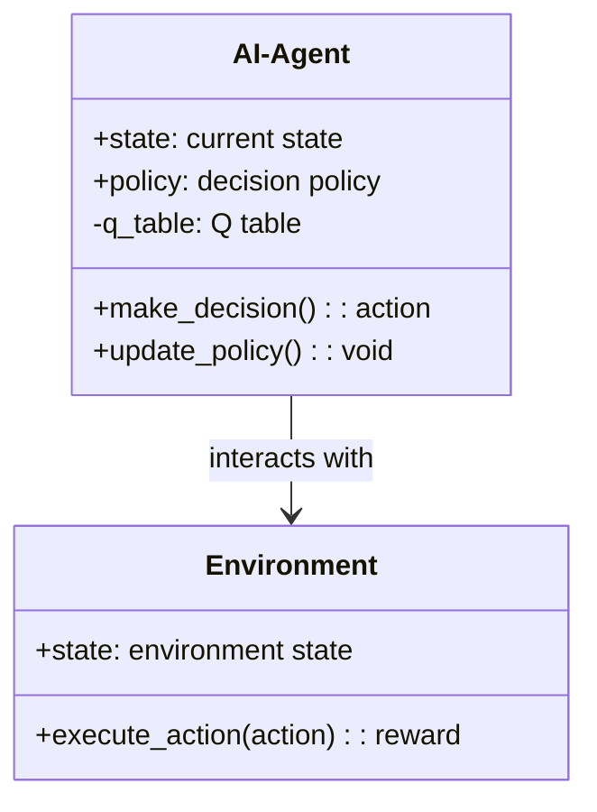
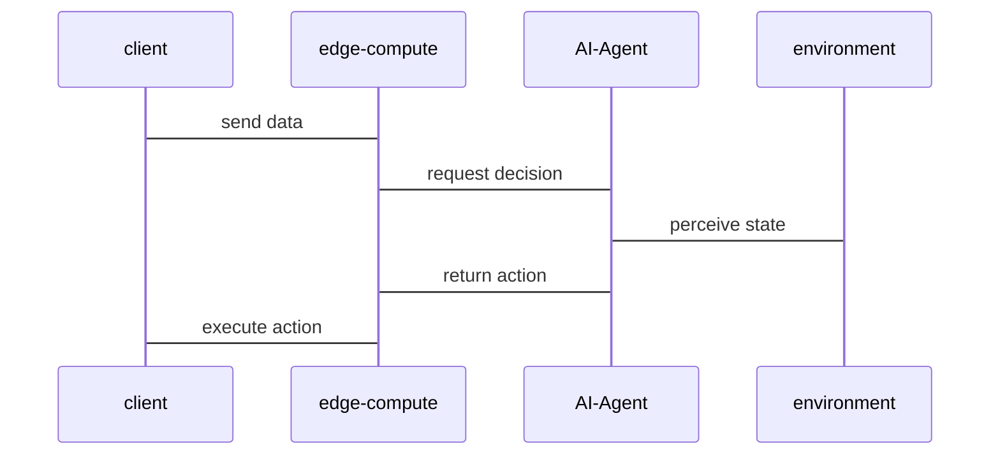

                 


# 企业AI Agent的5G边缘计算策略

> 关键词：AI Agent，5G边缘计算，企业应用，算法原理，系统架构

> 摘要：本文探讨了AI Agent在5G边缘计算环境中的策略制定与应用，详细分析了AI Agent的核心原理、算法实现、系统架构，并通过实际案例展示了如何在企业中部署和优化AI Agent。文章还总结了最佳实践和注意事项，为技术从业者提供了深度的技术洞察。

---

## 第一部分：背景介绍

### 第1章：企业AI Agent的概述

#### 1.1 AI Agent的基本概念

AI Agent（智能体）是指能够感知环境并采取行动以实现目标的智能实体。在企业环境中，AI Agent通常用于自动化决策、流程优化和问题解决。其核心特点包括自主性、反应性、目标导向和学习能力。

- **自主性**：AI Agent能够独立决策，无需人工干预。
- **反应性**：能够实时感知环境变化并做出响应。
- **目标导向**：所有行动均以实现特定目标为导向。
- **学习能力**：通过数据和经验不断优化自身行为。

AI Agent在企业中的应用场景广泛，包括自动化运维、智能客服、供应链优化等。

#### 1.2 5G边缘计算的背景

5G技术的普及为企业AI Agent的部署提供了新的可能性。5G边缘计算是指将计算能力从云端转移到网络边缘，靠近数据源进行处理，具有低延迟、高带宽和高可靠性的特点。

- **低延迟**：边缘计算将数据处理从云端转移到边缘，减少了数据传输的延迟。
- **高带宽**：5G网络提供了更高的带宽，支持更大规模的数据传输。
- **高可靠性**：边缘计算能够在断网情况下继续运行，确保系统的可靠性。

5G边缘计算在企业中的应用前景广阔，尤其是在智能制造、智慧城市和自动驾驶等领域。

---

## 第二部分：核心概念与联系

### 第2章：AI Agent与5G边缘计算的核心原理

#### 2.1 AI Agent的原理

AI Agent通过感知环境、分析信息并采取行动来实现目标。其决策机制通常基于强化学习或深度学习算法。AI Agent的学习过程包括状态识别、动作选择和奖励机制三个步骤。

- **状态识别**：AI Agent通过传感器或数据接口感知当前环境状态。
- **动作选择**：基于当前状态，AI Agent选择最优动作。
- **奖励机制**：通过奖励函数评估动作的结果，调整后续决策。

#### 2.2 5G边缘计算的原理

5G边缘计算将计算资源部署在靠近数据源的位置，如边缘服务器或网关。数据在边缘进行预处理和分析，减少对云端的依赖。5G网络切片技术为不同的应用场景提供独立的虚拟网络，确保服务质量。

- **网络切片**：将5G网络划分为多个虚拟网络，每个切片独立运行，互不干扰。
- **边缘计算架构**：包括边缘设备、边缘计算节点和云端管理平台，形成三级架构。

#### 2.3 AI Agent与5G边缘计算的联系

AI Agent在5G边缘计算中的应用主要体现在智能决策和高效数据处理。AI Agent利用边缘计算的低延迟特性，实时处理数据并做出决策。边缘计算为AI Agent提供了分布式计算环境，提高了系统的响应速度和可靠性。

- **智能决策**：AI Agent在边缘节点实时分析数据，做出最优决策。
- **高效数据处理**：边缘计算减少了数据传输到云端的延迟，提高了处理效率。

---

## 第三部分：算法原理讲解

### 第3章：AI Agent的算法实现

#### 3.1 强化学习算法

强化学习是一种通过试错机制优化决策的算法。Q-learning是一种常用的强化学习算法，适用于离散动作空间的问题。其数学模型如下：

$$ Q(s, a) = r + \gamma \max Q(s', a') $$

其中，$Q(s, a)$表示当前状态$s$和动作$a$的Q值，$r$是奖励值，$\gamma$是折扣因子，$s'$是下一步状态。

##### 3.1.1 算法实现

以下是一个简单的Q-learning算法实现：

```python
import numpy as np

class QLearning:
    def __init__(self, state_space, action_space, gamma=0.9, alpha=0.1):
        self.q_table = np.zeros((state_space, action_space))
        self.gamma = gamma
        self.alpha = alpha

    def choose_action(self, state):
        return np.argmax(self.q_table[state])

    def update_q_table(self, current_state, action, reward, next_state):
        self.q_table[current_state][action] = self.q_table[current_state][action] * self.gamma + self.alpha * reward
```

#### 3.2 图神经网络在AI Agent中的应用

图神经网络（Graph Neural Network, GNN）能够处理图结构数据，适用于复杂的网络环境。其数学模型如下：

$$ h_v^{(l+1)} = \text{aggregate}(\{h_u^{(l)} | u \in N(v)\}) $$

其中，$h_v^{(l)}$表示节点$v$在第$l$层的表示，$N(v)$是$v$的邻居节点集合。

##### 3.2.1 算法实现

以下是一个简单的图神经网络实现：

```python
import torch
from torch.nn import Linear, ReLU

class GNN(torch.nn.Module):
    def __init__(self, input_dim, hidden_dim, output_dim):
        super(GNN, self).__init__()
        self.fc1 = Linear(input_dim, hidden_dim)
        self.relu = ReLU()
        self.fc2 = Linear(hidden_dim, output_dim)

    def forward(self, x):
        x = self.fc1(x)
        x = self.relu(x)
        x = self.fc2(x)
        return x
```

---

## 第四部分：系统分析与架构设计方案

### 第4章：系统架构设计

#### 4.1 问题场景介绍

在企业环境中，AI Agent需要实时处理大量数据，对系统架构提出了高要求。传统的集中式架构难以满足低延迟和高吞吐量的需求。

#### 4.2 系统功能设计

系统功能包括数据采集、智能决策、结果反馈和状态监控。

- **数据采集**：从边缘设备收集数据。
- **智能决策**：AI Agent基于数据做出决策。
- **结果反馈**：将决策结果反馈给边缘设备。
- **状态监控**：监控系统运行状态，及时发现异常。

##### 4.2.1 领域模型

以下是领域模型的类图：



##### 4.2.2 系统架构

以下是系统架构的架构图：


##### 4.2.3 接口和交互设计

以下是接口和交互的序列图：



---

## 第五部分：项目实战

### 第5章：企业AI Agent的实现与部署

#### 5.1 项目开发环境

开发环境包括Python 3.8及以上、TensorFlow 2.4及以上和Kubernetes 1.20及以上。

##### 5.1.1 环境安装

```bash
pip install numpy tensorflow matplotlib
```

#### 5.2 系统核心代码实现

##### 5.2.1 AI Agent的核心代码

```python
import numpy as np
import tensorflow as tf

class AI-Agent:
    def __init__(self, state_dim, action_dim):
        self.state_dim = state_dim
        self.action_dim = action_dim
        self.model = self.build_model()

    def build_model(self):
        model = tf.keras.Sequential([
            tf.keras.layers.Dense(64, activation='relu', input_dim=self.state_dim),
            tf.keras.layers.Dense(self.action_dim, activation='linear')
        ])
        model.compile(optimizer='adam', loss='mean_squared_error')
        return model

    def perceive(self, state):
        return self.model.predict(np.array([state]))[0]

    def choose_action(self, state):
        q_values = self.perceive(state)
        return np.argmax(q_values)
```

##### 5.2.2 边缘计算节点的代码实现

```python
import os
import json

class Edge-Node:
    def __init__(self, agent, device_id):
        self.agent = agent
        self.device_id = device_id

    def process_data(self, data):
        state = self.agent.perceive(data)
        action = self.agent.choose_action(state)
        return action

    def send_to_cloud(self, data, action):
        # 模拟发送到云端
        payload = {
            'device_id': self.device_id,
            'data': data,
            'action': action
        }
        # 实际实现中应替换为具体通信方式
        print(f"发送数据到云端：{json.dumps(payload)}")
```

#### 5.3 代码应用解读与分析

- **AI Agent的核心代码**：构建了一个简单的深度Q网络，用于感知状态并选择动作。
- **边缘计算节点的代码实现**：负责数据处理和与云端的交互，体现了边缘计算的特点。

#### 5.4 实际案例分析

假设我们有一个智能制造车间，需要优化生产流程。AI Agent可以实时监控设备状态，做出最优决策，减少生产停机时间。

---

## 第六部分：最佳实践与注意事项

### 第6章：总结与展望

#### 6.1 最佳实践 tips

- **数据质量管理**：确保数据的准确性和实时性。
- **系统安全性**：加强边缘设备的安全防护，防止数据泄露。
- **性能优化**：定期优化AI Agent的算法，提高决策效率。

#### 6.2 小结

本文详细探讨了AI Agent在5G边缘计算中的应用策略，从算法实现到系统架构，为企业提供了全面的技术指导。

#### 6.3 注意事项

- AI Agent的决策依赖于实时数据，数据源的可靠性至关重要。
- 边缘计算的资源限制要求我们在算法设计上进行优化。

#### 6.4 拓展阅读

建议读者深入学习强化学习和图神经网络的相关知识，阅读相关论文和文献，以更好地理解AI Agent的实现细节。

---

## 作者

作者：AI天才研究院/AI Genius Institute & 禅与计算机程序设计艺术 /Zen And The Art of Computer Programming

---

感谢您的耐心阅读，希望本文对您在企业AI Agent的5G边缘计算策略方面有所帮助。如需进一步探讨，欢迎随时联系。

