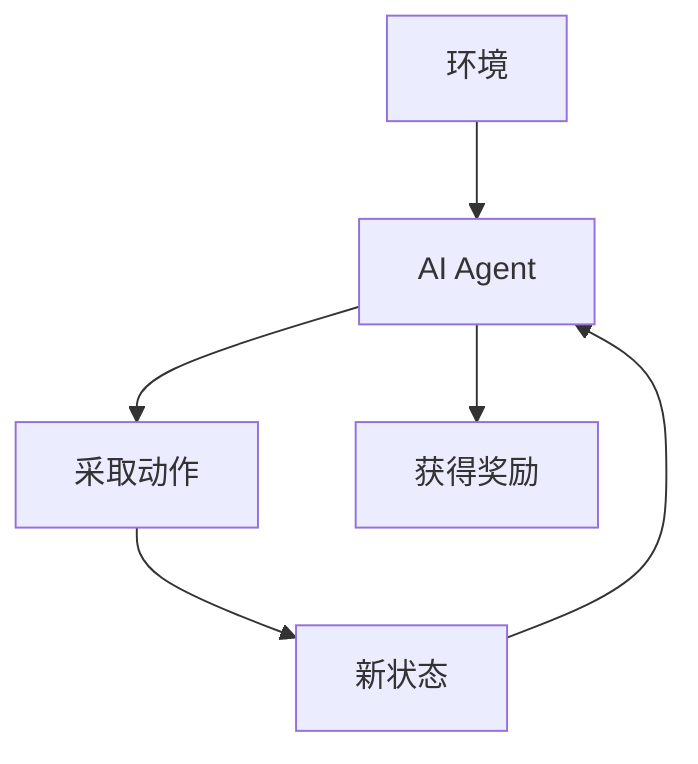
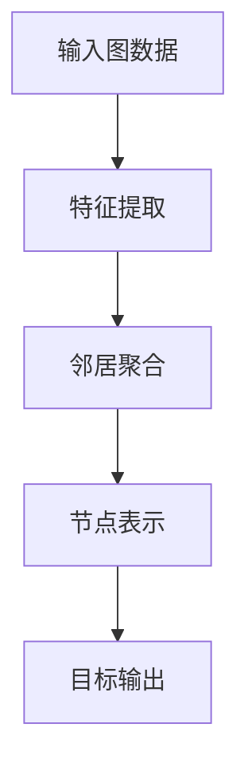
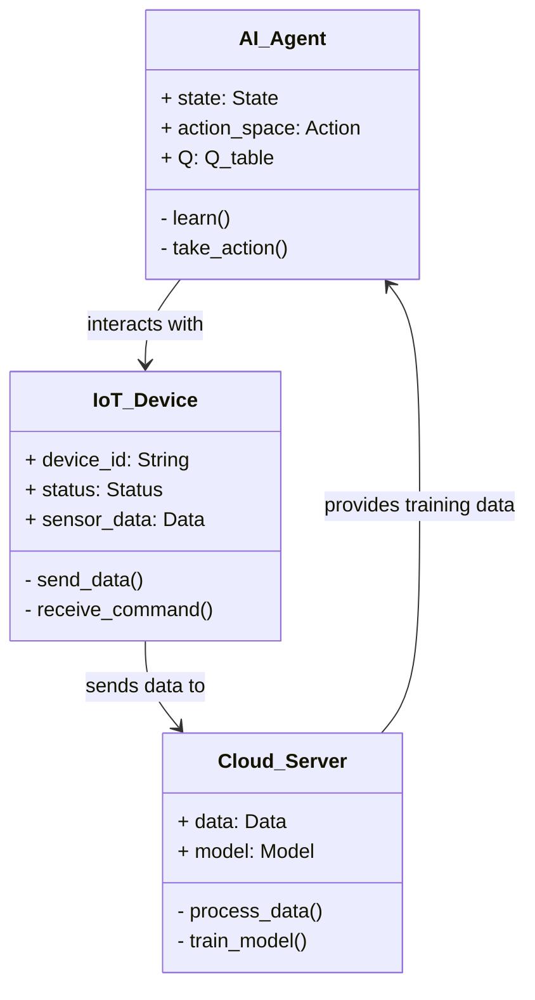
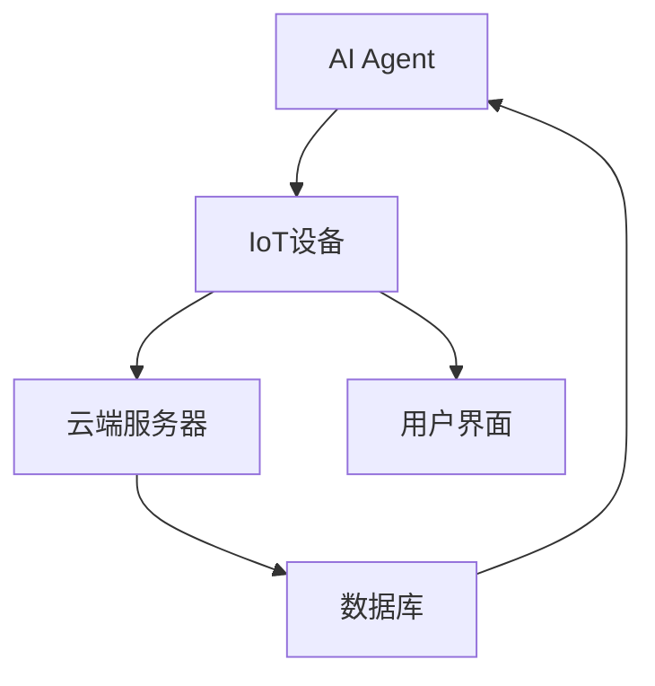
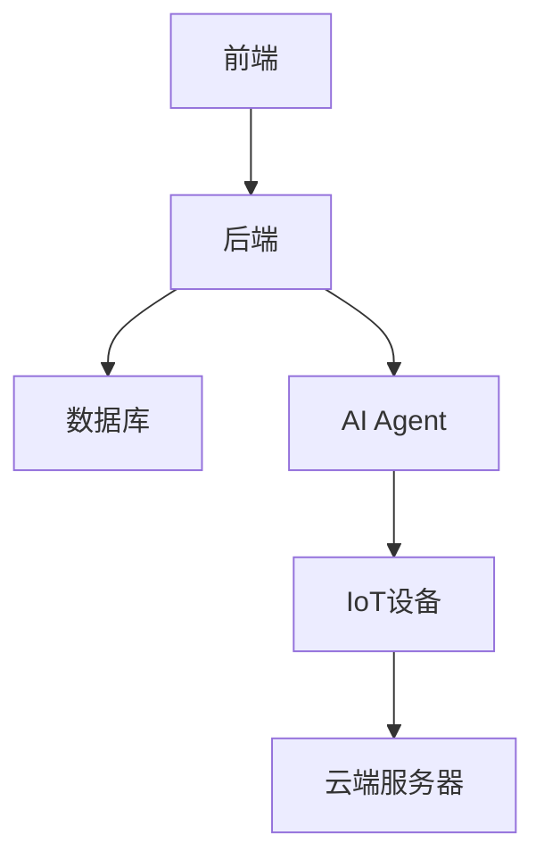
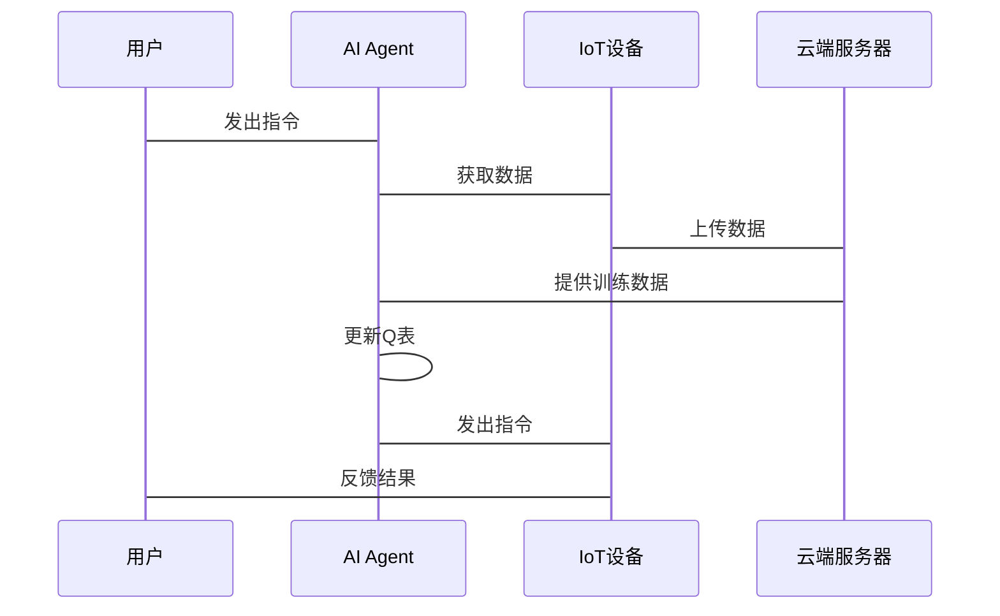

                 


# 企业AI Agent的IoT集成策略

> 关键词：企业AI Agent, IoT集成, 智能化转型, 物联网, 人工智能, 数据分析

> 摘要：随着企业智能化转型的深入，AI Agent与IoT的结合为企业提供了更加智能化的解决方案。本文从企业AI Agent与IoT的核心概念出发，分析其交互关系与协同工作模式，探讨其算法原理与系统架构设计，结合实际案例，为企业AI Agent的IoT集成提供可行的策略与方法。

---

# 第一章: 企业AI Agent与IoT概述

## 1.1 AI Agent的基本概念

### 1.1.1 AI Agent的定义与特点
- **定义**：AI Agent是一种具备自主性、反应性、目标导向和社交能力的智能实体，能够感知环境并采取行动以实现目标。
- **特点**：
  - **自主性**：无需外部干预，自主决策。
  - **反应性**：实时感知环境变化并做出反应。
  - **目标导向**：基于目标驱动行动。
  - **学习能力**：通过数据与经验不断优化自身能力。

### 1.1.2 AI Agent的核心功能与类型
- **核心功能**：
  - 数据采集与分析
  - 自动决策与执行
  - 知识表示与推理
- **类型**：
  - **反应式AI Agent**：基于当前感知做出反应。
  - **基于模型的AI Agent**：利用内部模型进行推理与决策。
  - **混合式AI Agent**：结合反应式与基于模型的方法。

### 1.1.3 企业级AI Agent的应用场景
- **企业级AI Agent**的应用场景包括智能客服、供应链优化、智能监控等，旨在提升企业运营效率与决策能力。

## 1.2 IoT的基本概念与技术架构

### 1.2.1 IoT的定义与组成
- **定义**：物联网（IoT）是通过各种信息传感设备，按照约定的协议，把任何物品与互联网连接起来，实现智能化识别、定位、跟踪、监控和管理。
- **组成**：
  - **感知层**：包括传感器、RFID标签等，用于数据采集。
  - **网络层**：负责数据的传输，包括Wi-Fi、蓝牙、NB-IoT等通信技术。
  - **计算层**：进行数据的处理与分析，包括边缘计算与云计算。
  - **应用层**：展示数据并提供应用服务。

### 1.2.2 IoT的关键技术与挑战
- **关键技术**：
  - 数据采集技术
  - 低功耗设计
  - 大规模设备管理
- **挑战**：
  - 数据量大且多样化
  - 安全与隐私问题
  - 设备兼容性与互操作性

### 1.2.3 IoT在企业中的应用现状
- **现状**：
  - 智能制造：通过IoT实现生产线的智能化监控与优化。
  - 智慧物流：利用IoT实现物流过程的实时追踪与管理。
  - 智慧办公：通过IoT实现办公环境的智能化管理。

## 1.3 企业AI Agent与IoT集成的背景与意义

### 1.3.1 当前企业智能化转型的趋势
- **趋势**：
  - 数字化转型的深化
  - 智能化决策的需求
  - 高效运营的追求

### 1.3.2 AI Agent与IoT结合的必要性
- **必要性**：
  - IoT产生的海量数据需要AI Agent进行实时分析与决策。
  - AI Agent需要通过IoT设备与现实世界交互。
  - 两者的结合能够实现更高效的智能化应用。

### 1.3.3 集成后的价值与应用场景
- **价值**：
  - 提高企业运营效率
  - 实现智能化决策
  - 优化资源利用
- **应用场景**：
  - 智能制造：实时监控生产线，优化生产流程。
  - 智慧物流：实现物流过程的智能化调度与管理。
  - 智慧能源：通过IoT与AI Agent实现能源的智能分配与管理。

## 1.4 本章小结
- 本章介绍了AI Agent与IoT的基本概念，分析了它们在企业中的应用背景与意义，为后续章节的深入分析奠定了基础。

---

# 第二章: AI Agent与IoT的核心概念分析

## 2.1 AI Agent的核心原理

### 2.1.1 AI Agent的感知与决策机制
- **感知**：通过传感器、摄像头等设备获取环境数据。
- **决策**：基于感知数据，利用算法进行推理与决策。

### 2.1.2 AI Agent的自主性与适应性
- **自主性**：无需外部干预，自主完成任务。
- **适应性**：能够根据环境变化调整自己的行为。

### 2.1.3 AI Agent的知识表示与推理
- **知识表示**：将知识表示为符号、规则或语义网络。
- **推理**：基于知识库进行逻辑推理，得出结论。

## 2.2 IoT的核心技术与数据流

### 2.2.1 IoT的数据采集与传输
- **数据采集**：通过传感器等设备采集数据。
- **数据传输**：通过网络将数据传输到云端或本地服务器。

### 2.2.2 IoT的设备管理与通信协议
- **设备管理**：包括设备的注册、配置、监控与维护。
- **通信协议**：如MQTT、HTTP、CoAP等，用于设备与云端的通信。

### 2.2.3 IoT的数据存储与处理
- **数据存储**：将数据存储在数据库中，支持结构化与非结构化数据。
- **数据处理**：通过数据清洗、转换与分析，提取有价值的信息。

## 2.3 AI Agent与IoT的交互关系

### 2.3.1 AI Agent对IoT数据的处理与分析
- **数据处理**：AI Agent接收IoT设备传输的数据，进行清洗、转换与分析。
- **数据分析**：利用机器学习、深度学习等技术，对数据进行建模与预测。

### 2.3.2 IoT对AI Agent的反馈与执行
- **反馈**：IoT设备接收AI Agent的指令，执行相应的操作。
- **执行**：通过IoT设备执行AI Agent的决策，实现对物理世界的干预。

### 2.3.3 AI Agent与IoT的协同工作模式
- **协同模式**：
  - **数据驱动型**：AI Agent通过IoT数据进行分析与决策。
  - **指令驱动型**：AI Agent通过IoT设备执行指令。
  - **反馈驱动型**：IoT设备通过反馈数据优化AI Agent的决策。

## 2.4 核心概念对比分析

### 2.4.1 AI Agent与传统软件的对比
| 对比维度 | AI Agent | 传统软件 |
|----------|-----------|-----------|
| 自主性    | 高         | 低         |
| 学习能力  | 高         | 无或低     |
| 决策能力  | 高         | 低或无     |

### 2.4.2 IoT与传统IT系统的对比
| 对比维度 | IoT       | 传统IT系统 |
|----------|-----------|------------|
| 数据来源  | 物理设备   | 数据库     |
| 数据量    | 大且多样   | 结构化      |
| 应用场景  | 物理世界   | 信息化      |

### 2.4.3 AI Agent与IoT的结合优势
- **优势**：
  - **实时性**：AI Agent能够实时处理IoT数据，快速做出决策。
  - **智能化**：AI Agent通过学习与推理，实现更智能的决策。
  - **灵活性**：IoT设备的多样化与AI Agent的自主性结合，能够适应复杂的环境。

## 2.5 本章小结
- 本章从AI Agent与IoT的核心概念出发，分析了它们的特点与交互关系，强调了两者结合的优势与必要性。

---

# 第三章: AI Agent与IoT的算法原理

## 3.1 强化学习算法在AI Agent中的应用

### 3.1.1 强化学习的基本原理
- **定义**：强化学习是一种通过试错机制，通过与环境交互来学习策略的方法。
- **核心要素**：
  - **状态（State）**：环境的当前情况。
  - **动作（Action）**：AI Agent采取的行动。
  - **奖励（Reward）**：环境对AI Agent行动的反馈。
  - **策略（Policy）**：AI Agent选择动作的概率分布。

### 3.1.2 强化学习的算法流程


### 3.1.3 强化学习在AI Agent中的应用
- **应用**：
  - **游戏AI**：如AlphaGo，通过强化学习实现最优决策。
  - **机器人控制**：通过强化学习实现机器人自主行动与决策。

### 3.1.4 强化学习的数学公式
- **Q-learning公式**：
  $$ Q(s, a) = Q(s, a) + \alpha (r + \gamma \max Q(s', a') - Q(s, a)) $$
  其中，$\alpha$是学习率，$\gamma$是折扣因子。

## 3.2 图神经网络在IoT数据处理中的应用

### 3.2.1 图神经网络的基本原理
- **定义**：图神经网络是一种处理图结构数据的深度学习模型。
- **核心思想**：通过聚合节点及其邻居的信息，学习节点的表示。

### 3.2.2 图神经网络的算法流程


### 3.2.3 图神经网络在IoT中的应用
- **应用**：
  - **设备关联分析**：通过图神经网络分析IoT设备之间的关联关系。
  - **异常检测**：通过图神经网络检测IoT设备的异常行为。

## 3.3 算法实现与优化

### 3.3.1 算法实现
- **Python代码实现强化学习算法**：
  ```python
  import numpy as np

  class AI_Agent:
      def __init__(self, state_space, action_space):
          self.state_space = state_space
          self.action_space = action_space
          self.Q = np.zeros((state_space, action_space))
      
      def take_action(self, state):
          epsilon = 0.1
          if np.random.random() < epsilon:
              return np.random.randint(self.action_space)
          else:
              return np.argmax(self.Q[state])
      
      def update_Q(self, state, action, reward, next_state):
          alpha = 0.1
          gamma = 0.9
          self.Q[state, action] += alpha * (reward + gamma * np.max(self.Q[next_state]) - self.Q[state, action])
  ```

- **图神经网络的实现**：
  ```python
  import torch
  import torch.nn as nn

  class Graph Neural Network:
      def __init__(self, input_dim, hidden_dim, output_dim):
          self.fc1 = nn.Linear(input_dim, hidden_dim)
          self.fc2 = nn.Linear(hidden_dim, output_dim)
      
      def forward(self, x):
          x = self.fc1(x)
          x = self.fc2(x)
          return x
  ```

### 3.3.2 算法优化
- **强化学习优化**：
  - 使用经验回放（Experience Replay）减少相关样本的影响。
  - 调整学习率（$\alpha$）与折扣因子（$\gamma$）以优化学习效果。

- **图神经网络优化**：
  - 采用Dropout技术防止过拟合。
  - 使用批量归一化（Batch Normalization）加速训练。

## 3.4 本章小结
- 本章详细介绍了强化学习与图神经网络在AI Agent与IoT中的应用，通过Python代码实现并优化了相关算法，为后续的系统设计提供了理论基础。

---

# 第四章: 企业AI Agent与IoT的系统分析与架构设计

## 4.1 问题场景介绍

### 4.1.1 问题背景
- 企业希望通过AI Agent与IoT的结合，实现智能化的生产与管理。

### 4.1.2 问题描述
- 如何设计一个高效的AI Agent-IoT集成系统，实现数据的实时采集、分析与决策。

## 4.2 系统功能设计

### 4.2.1 领域模型类图


### 4.2.2 系统架构设计
- **架构图**：


## 4.3 系统架构设计

### 4.3.1 模块化设计
- **前端模块**：负责与用户的交互，接收指令并展示数据。
- **后端模块**：负责处理AI Agent的决策与IoT设备的控制。
- **数据库模块**：负责存储IoT设备的数据与AI Agent的模型。

### 4.3.2 系统架构图


### 4.3.3 系统接口设计
- **AI Agent接口**：
  - `take_action()`: 根据当前状态采取行动。
  - `update_Q()`: 更新Q表。
- **IoT设备接口**：
  - `send_data()`: 发送传感器数据。
  - `receive_command()`: 接收并执行指令。

### 4.3.4 系统交互流程图


## 4.4 系统实现与优化

### 4.4.1 系统实现
- **前端实现**：
  - 使用React框架构建用户界面，展示IoT设备的状态与AI Agent的决策结果。
- **后端实现**：
  - 使用Python的Flask框架搭建RESTful API，处理AI Agent的决策与IoT设备的控制。
- **数据库实现**：
  - 使用MongoDB存储IoT设备的传感器数据，使用MySQL存储AI Agent的Q表。

### 4.4.2 系统优化
- **性能优化**：
  - 使用边缘计算减少数据传输延迟。
  - 优化数据库查询效率，使用索引加速数据检索。
- **安全性优化**：
  - 加强设备认证与数据加密，防止数据泄露与篡改。

## 4.5 本章小结
- 本章详细设计了企业AI Agent与IoT的系统架构，通过模块化设计与接口设计，实现了系统的高效运行与优化。

---

# 第五章: 企业AI Agent与IoT的项目实战

## 5.1 环境安装与配置

### 5.1.1 系统环境
- **操作系统**：Linux或Windows
- **编程语言**：Python 3.8+
- **框架**：
  - Flask 2.0+
  - TensorFlow 2.0+
  - MongoDB 4.0+

### 5.1.2 工具安装
- **安装命令**：
  ```bash
  pip install flask pymongo tensorflow
  ```

## 5.2 系统核心实现

### 5.2.1 AI Agent核心代码实现
```python
class AI_Agent:
    def __init__(self, state_space, action_space):
        self.state_space = state_space
        self.action_space = action_space
        self.Q = np.zeros((state_space, action_space))
    
    def take_action(self, state):
        if np.random.random() < 0.1:
            return np.random.randint(self.action_space)
        else:
            return np.argmax(self.Q[state])
    
    def update_Q(self, state, action, reward, next_state):
        alpha = 0.1
        gamma = 0.9
        self.Q[state, action] += alpha * (reward + gamma * np.max(self.Q[next_state]) - self.Q[state, action])
```

### 5.2.2 IoT设备核心代码实现
```python
class IoT_Device:
    def __init__(self, device_id):
        self.device_id = device_id
        self.status = 'idle'
        self.sensor_data = None
    
    def send_data(self):
        return self.sensor_data
    
    def receive_command(self, command):
        self.status = command
```

### 5.2.3 云端服务器核心代码实现
```python
from flask import Flask, jsonify, request
from pymongo import MongoClient

app = Flask(__name__)
client = MongoClient('mongodb://localhost:27017/')
db = client['iot_db']

@app.route('/data', methods=['POST'])
def process_data():
    data = request.json
    db.data.insert_one(data)
    return jsonify({'status': 'success'})

@app.route('/train', methods=['POST'])
def train_model():
    # 假设数据已经存储在数据库中
    data = list(db.data.find())
    # 这里可以实现模型训练逻辑
    return jsonify({'status': 'success'})

if __name__ == '__main__':
    app.run(debug=True)
```

### 5.2.4 系统功能解读
- **AI Agent功能**：
  - 数据采集与分析
  - 自动决策与执行
  - 知识表示与推理
- **IoT设备功能**：
  - 数据采集与传输
  - 设备控制与反馈
  - 状态监控与管理
- **云端服务器功能**：
  - 数据存储与管理
  - 模型训练与优化
  - 数据分析与展示

## 5.3 项目实战案例分析

### 5.3.1 案例背景
- **案例名称**：智能工厂环境监测
- **项目目标**：通过AI Agent与IoT的结合，实现工厂环境的实时监测与智能调控。

### 5.3.2 案例实现与分析
- **实现步骤**：
  1. 部署IoT设备，采集工厂环境数据（温度、湿度、空气质量等）。
  2. AI Agent接收数据，分析并做出决策。
  3. AI Agent通过IoT设备调控环境，优化工厂环境。

### 5.3.3 案例效果
- **效果**：
  - 实现了工厂环境的实时监测与智能调控。
  - 提高了工厂的生产效率与员工健康。
  - 降低了能源消耗，实现了绿色生产。

## 5.4 本章小结
- 本章通过实际案例展示了企业AI Agent与IoT的集成应用，详细讲解了系统的实现与优化，为读者提供了实际的操作指南。

---

# 第六章: 企业AI Agent与IoT的最佳实践与总结

## 6.1 最佳实践

### 6.1.1 系统设计
- **模块化设计**：确保系统的可扩展性与可维护性。
- **高可用性设计**：通过冗余与负载均衡提高系统的可靠性。
- **安全性设计**：加强数据加密与设备认证，防止数据泄露与篡改。

### 6.1.2 系统优化
- **性能优化**：通过边缘计算与本地存储减少数据传输延迟。
- **资源优化**：合理分配计算资源，避免资源浪费。
- **算法优化**：通过经验回放与模型蒸馏优化算法性能。

## 6.2 小结

### 6.2.1 核心知识点回顾
- AI Agent与IoT的核心概念
- AI Agent与IoT的交互关系
- AI Agent与IoT的算法原理
- AI Agent与IoT的系统设计与实现

### 6.2.2 实践中的注意事项
- **数据安全**：高度重视数据的安全性，防止数据泄露。
- **系统兼容性**：确保系统能够兼容多种设备与协议。
- **系统可扩展性**：设计时预留扩展接口，方便后续功能的扩展。

## 6.3 未来展望

### 6.3.1 技术发展趋势
- **AI Agent的智能化**：通过深度学习与强化学习提升AI Agent的智能水平。
- **IoT的普及化**：IoT设备的多样化与智能化将更加普及。
- **AI Agent与IoT的深度融合**：通过更复杂的技术实现AI Agent与IoT的协同工作。

### 6.3.2 应用前景
- **智能制造**：AI Agent与IoT的结合将推动智能制造的进一步发展。
- **智慧城市**：通过AI Agent与IoT的结合实现城市的智能化管理。
- **智能家居**：AI Agent与IoT的结合将实现智能家居的智能化控制。

## 6.4 本章小结
- 本章总结了企业AI Agent与IoT集成的关键点，提出了系统的最佳实践与未来展望。

---

# 作者：AI天才研究院 & 禅与计算机程序设计艺术

