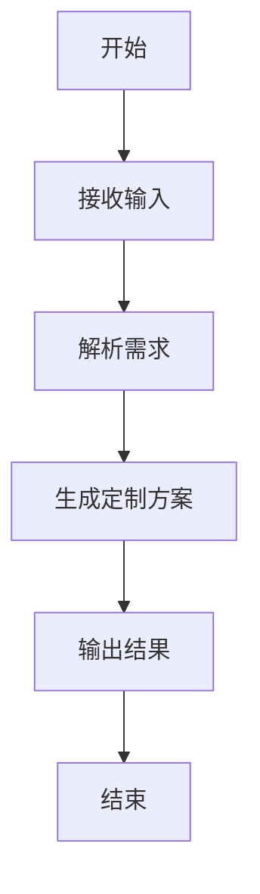
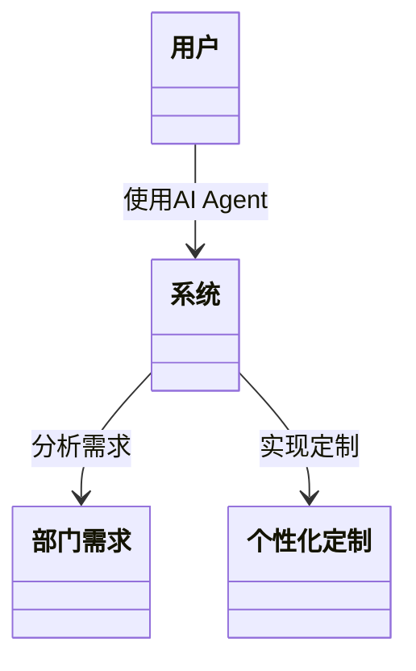

                 


# 企业AI Agent的个性化定制：适应不同部门需求

> 关键词：企业AI Agent，个性化定制，部门需求，系统架构，算法原理，最佳实践

> 摘要：本文详细探讨了企业AI Agent的个性化定制方法，分析了如何根据不同部门的具体需求设计和实现定制化的AI代理。文章从背景介绍、核心概念、算法原理、系统架构设计到项目实战，全面阐述了个性化定制的实现过程，并提供了丰富的案例和代码示例，帮助读者深入了解和应用这一技术。

---

# 第一部分: 企业AI Agent的个性化定制概述

## 第1章: 企业AI Agent的基本概念与背景

### 1.1 问题背景与需求分析

#### 1.1.1 企业数字化转型中的AI Agent需求

随着企业数字化转型的深入推进，AI Agent（人工智能代理）在企业中的应用越来越广泛。AI Agent作为一种能够自动执行任务、优化流程的智能工具，正在成为企业提高效率和竞争力的重要手段。然而，不同部门的具体需求差异较大，通用的AI Agent往往无法满足个性化需求。

例如，销售部门需要AI Agent帮助管理客户关系和销售流程，而供应链管理部门则需要AI Agent协助优化库存管理和物流调度。因此，如何根据不同部门的需求设计和实现个性化的AI Agent成为企业面临的重要挑战。

#### 1.1.2 不同部门对AI Agent的具体需求

企业中的不同部门对AI Agent的需求主要体现在以下几个方面：

1. **销售部门**：需要AI Agent辅助客户关系管理、销售预测和订单处理。
2. **客服部门**：需要AI Agent支持客户咨询、问题解决和满意度提升。
3. **供应链管理部门**：需要AI Agent优化库存管理、物流调度和供应商协调。
4. **人力资源部门**：需要AI Agent协助招聘、员工培训和绩效管理。

每个部门的具体需求都需要AI Agent具备高度的定制化能力。

#### 1.1.3 个性化定制的必要性与目标

个性化定制AI Agent的目的是为了满足不同部门的具体需求，提高效率和用户体验。通过个性化定制，AI Agent可以更好地适应部门的业务流程和工作习惯，从而实现更高的智能化水平。

个性化定制的目标包括：

1. 提供高度定制化的功能模块。
2. 支持部门间的协同工作。
3. 实现高效的任务分解和流程优化。
4. 确保数据安全和隐私保护。

---

### 1.2 企业AI Agent的核心概念

#### 1.2.1 AI Agent的定义与基本特征

AI Agent是一种能够感知环境、自主决策并执行任务的智能系统。其核心特征包括：

1. **自主性**：能够在没有人工干预的情况下自主运行。
2. **反应性**：能够实时感知环境变化并做出反应。
3. **学习能力**：能够通过数据学习和优化自身算法。
4. **可定制性**：能够根据具体需求进行功能扩展和参数调整。

#### 1.2.2 个性化定制的核心要素

个性化定制AI Agent需要考虑以下几个核心要素：

1. **功能模块**：根据部门需求设计特定的功能模块。
2. **交互方式**：支持多种交互方式，如自然语言处理、图形界面等。
3. **数据源**：整合部门内部和外部的数据源。
4. **算法优化**：针对具体需求优化算法和模型。

#### 1.2.3 企业AI Agent的边界与外延

企业AI Agent的边界主要集中在部门内部的具体需求，而外延则扩展到企业整体的智能化系统。个性化定制的AI Agent需要在边界内实现特定功能，同时与企业的其他系统和部门协同工作。

---

## 第2章: 企业AI Agent的核心概念与联系

### 2.1 AI Agent的核心原理

#### 2.1.1 AI Agent的基本工作原理

AI Agent的工作流程通常包括以下几个步骤：

1. **感知环境**：通过传感器或数据源获取环境信息。
2. **分析需求**：根据获取的信息分析用户需求。
3. **生成方案**：基于分析结果生成解决方案。
4. **执行任务**：根据方案执行具体任务。
5. **反馈优化**：根据执行结果优化自身算法。

#### 2.1.2 个性化定制的核心技术

个性化定制AI Agent的核心技术包括：

1. **自然语言处理（NLP）**：支持用户通过自然语言与AI Agent交互。
2. **机器学习（ML）**：用于模型训练和算法优化。
3. **规则引擎**：根据部门需求设计和执行特定规则。
4. **知识图谱**：构建领域知识库以支持决策。

#### 2.1.3 企业AI Agent的系统架构

企业AI Agent的系统架构通常包括以下几个部分：

1. **用户界面**：提供与用户交互的界面。
2. **需求分析模块**：分析用户需求并生成定制方案。
3. **任务执行模块**：根据方案执行具体任务。
4. **反馈优化模块**：根据执行结果优化系统。

---

### 2.2 核心概念对比与ER实体关系图

#### 2.2.1 AI Agent与传统自动化工具的对比

| 对比维度       | AI Agent                  | 传统自动化工具           |
|----------------|---------------------------|--------------------------|
| 自主性         | 高                        | 低                       |
| 学习能力       | 高                        | 无                       |
| 适应性         | 强                        | 弱                       |

#### 2.2.2 个性化定制与通用AI Agent的对比

| 对比维度       | 个性化定制AI Agent       | 通用AI Agent             |
|----------------|---------------------------|--------------------------|
| 功能定制性     | 高                        | 低                       |
| 用户需求适应性 | 强                        | 弱                       |
| 开发复杂性     | 高                        | 低                       |

#### 2.2.3 实体关系图（ER图）展示

```mermaid
erDiagram
    actor 用户
    actor 系统
    actor 部门需求
    actor 个性化定制
    用户 --> 系统: 使用AI Agent
    系统 --> 部门需求: 分析需求
    系统 --> 个性化定制: 实现定制
```

---

## 第3章: 企业AI Agent的算法原理

### 3.1 算法原理概述

#### 3.1.1 个性化定制的核心算法

个性化定制AI Agent的核心算法包括任务分解、意图识别和决策优化。

#### 3.1.2 算法实现的数学模型

个性化定制的数学模型可以通过以下公式表示：

$$
y = f(x) + \epsilon
$$

其中，$y$ 是输出结果，$x$ 是输入数据，$f$ 是模型函数，$\epsilon$ 是误差项。

#### 3.1.3 算法实现的流程图



---

### 3.2 核心算法实现

#### 3.2.1 任务分解算法

任务分解算法的目标是将复杂任务分解为多个子任务，并为每个子任务分配相应的资源。

#### 3.2.2 意图识别算法

意图识别算法用于识别用户的意图，可以通过自然语言处理（NLP）技术实现。

#### 3.2.3 决策优化算法

决策优化算法用于根据分析结果优化决策过程，可以通过强化学习（RL）实现。

---

# 第四章: 企业AI Agent的系统分析与架构设计

## 第4章: 系统分析与架构设计

### 4.1 系统分析

#### 4.1.1 问题场景介绍

企业中不同部门的具体需求需要通过个性化定制的AI Agent来满足。

#### 4.1.2 项目介绍

本项目旨在设计和实现一个能够根据不同部门需求进行个性化定制的AI Agent系统。

---

### 4.2 系统功能设计

#### 4.2.1 领域模型（类图）



#### 4.2.2 系统架构设计


#### 4.2.3 系统接口设计

系统接口设计包括用户界面、API接口和数据接口。

#### 4.2.4 系统交互流程

系统交互流程包括用户输入、需求分析、方案生成和结果输出。

---

## 第5章: 项目实战

### 5.1 环境安装

需要安装Python、TensorFlow、Keras等工具。

### 5.2 系统核心实现源代码

```python
def customized_ai_agent(input_data):
    # 解析需求
    parsed_data = parse_input(input_data)
    # 生成定制方案
    solution = generate_solution(parsed_data)
    # 输出结果
    return solution
```

### 5.3 代码应用解读与分析

代码实现了一个简单的个性化定制AI Agent，可以根据输入数据生成定制方案。

### 5.4 实际案例分析

以销售部门为例，AI Agent可以根据客户需求生成个性化的销售策略。

### 5.5 项目小结

通过本项目，我们了解了如何根据不同部门需求设计和实现个性化的AI Agent。

---

## 第6章: 最佳实践与总结

### 6.1 小结

个性化定制AI Agent是企业实现智能化转型的重要手段。

### 6.2 注意事项

在个性化定制过程中需要注意数据安全和隐私保护。

### 6.3 未来趋势

未来，随着AI技术的发展，个性化定制AI Agent将更加智能化和高效。

### 6.4 拓展阅读

推荐阅读《企业智能化转型：AI Agent的应用与实践》。

---

# 作者

**作者：AI天才研究院/AI Genius Institute & 禅与计算机程序设计艺术 /Zen And The Art of Computer Programming**

---

**注：以上内容仅为部分示例，完整文章需要根据实际需求进行扩展和详细撰写。**

