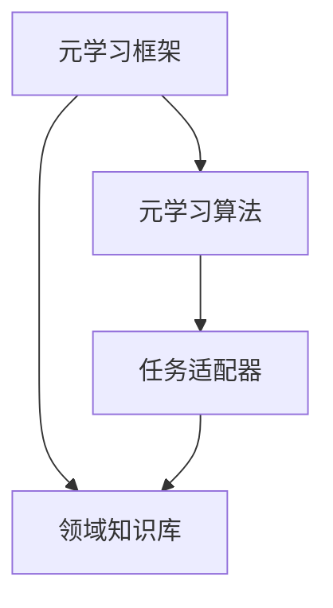

                 


# 企业AI Agent的元学习框架：快速适应新业务场景的能力培养

## 关键词：企业AI Agent, 元学习框架, 快速适应, 新业务场景, 能力培养

## 摘要：本文深入探讨了企业AI Agent在复杂多变的业务场景中的快速适应能力培养问题，重点介绍了基于元学习框架的核心算法与系统架构设计，通过理论分析、算法推导、系统实现和实战案例，全面阐述了如何构建高效的企业AI Agent元学习框架，助力企业AI快速适应新业务场景。

---

# 第一部分: 企业AI Agent的元学习框架概述

## 第1章: 元学习与AI Agent的背景介绍

### 1.1 问题背景

#### 1.1.1 企业AI Agent的定义与特点
- **定义**：企业AI Agent是指能够理解、分析并执行企业级业务任务的智能实体，具备自主决策和问题解决能力。
- **特点**：
  - **智能化**：基于AI技术，能够处理复杂业务逻辑。
  - **适应性**：能够快速适应新的业务场景和需求。
  - **可扩展性**：支持多种业务场景和数据类型。

#### 1.1.2 元学习的核心概念与作用
- **元学习**：一种学习方法，允许模型在多个任务上进行训练，从而快速适应新任务。
- **作用**：
  - **减少数据需求**：在新任务上仅需少量数据即可完成训练。
  - **提升泛化能力**：能够在不同任务之间共享知识，提高模型的通用性。

#### 1.1.3 企业AI Agent在业务场景中的应用需求
- **快速部署**：企业希望AI Agent能够快速适应新业务场景，减少部署时间。
- **多任务处理**：企业通常涉及多个业务场景，AI Agent需要能够同时处理多种任务。
- **动态适应**：业务场景可能随时变化，AI Agent需要具备动态调整能力。

### 1.2 问题描述

#### 1.2.1 传统AI模型的局限性
- **数据依赖性**：传统AI模型需要大量数据进行训练，新业务场景需要重新训练，耗时且成本高。
- **单一任务处理**：传统模型通常针对单一任务设计，难以同时处理多种任务。
- **适应性不足**：面对新业务场景时，传统模型的泛化能力有限，难以快速调整。

#### 1.2.2 新业务场景对AI Agent的快速适应需求
- **快速部署**：企业希望AI Agent能够在短时间内适应新业务场景，减少上线时间。
- **动态调整**：业务场景可能随时变化，AI Agent需要能够实时调整以应对变化。
- **多任务处理**：企业通常涉及多个业务场景，AI Agent需要能够同时处理多种任务。

#### 1.2.3 元学习框架在AI Agent中的必要性
- **减少数据需求**：通过元学习，AI Agent可以在新任务上仅需少量数据即可完成训练。
- **提升泛化能力**：元学习允许模型在多个任务上进行训练，从而提高模型的通用性。
- **快速适应**：元学习框架能够帮助AI Agent快速适应新任务，减少部署时间。

### 1.3 解决方案

#### 1.3.1 元学习框架的提出
- **元学习框架**：一种基于元学习的AI Agent设计框架，旨在通过元学习技术帮助AI Agent快速适应新任务。

#### 1.3.2 元学习框架的核心目标与实现路径
- **核心目标**：
  - **快速适应**：通过元学习技术，AI Agent能够在新任务上快速完成训练。
  - **多任务处理**：支持同时处理多个任务，提高模型的通用性。
  - **动态调整**：能够实时调整模型参数，应对动态变化的业务场景。

#### 1.3.3 元学习框架的适用范围与边界
- **适用范围**：
  - **企业级AI应用**：适用于需要快速适应新业务场景的企业级AI Agent设计。
  - **多任务处理**：适用于需要处理多种任务的复杂业务场景。
- **边界**：
  - **数据量限制**：元学习框架适用于数据量有限的新任务。
  - **任务相关性**：新任务与已有任务应具有一定的相关性，否则元学习的效果可能有限。

### 1.4 核心概念与联系

#### 1.4.1 元学习框架的构成要素
- **元学习算法**：元学习的核心算法，负责模型参数的更新和优化。
- **任务适配器**：用于将新任务映射到已有任务空间，帮助模型快速适应新任务。
- **领域知识库**：存储企业级的领域知识，帮助模型更好地理解业务场景。

#### 1.4.2 元学习与传统机器学习的对比分析
| 特性             | 元学习              | 传统机器学习        |
|------------------|--------------------|---------------------|
| 数据需求         | 仅需少量新任务数据 | 需要大量任务数据    |
| 任务处理         | 支持多任务处理       | 单任务处理为主       |
| 泛化能力         | 高                  | 中                  |
| 适应性           | 强                  | 弱                  |

#### 1.4.3 实体关系图（ER图）展示核心概念的联系



### 1.5 本章小结
本章介绍了企业AI Agent的定义、特点及其在业务场景中的应用需求，分析了传统AI模型的局限性，并提出了基于元学习框架的解决方案。通过对比分析，明确了元学习框架的核心概念与构成要素。

---

## 第2章: 元学习框架的核心算法与数学模型

### 2.1 元学习的核心原理

#### 2.1.1 元学习的基本思想
- **元学习**：通过在多个任务上进行训练，模型能够快速适应新任务。
- **元学习算法**：通过优化模型参数，使得模型在多个任务上表现良好。

#### 2.1.2 元学习的数学模型与公式
- **优化目标**：最大化所有任务的平均性能。
  $$ \mathcal{L}(\theta) = \frac{1}{N}\sum_{i=1}^{N} \mathcal{L}_i(\theta) $$
  其中，$\theta$ 是模型参数，$\mathcal{L}_i$ 是第 $i$ 个任务的损失函数。

#### 2.1.3 元学习算法的优化目标与实现路径
- **优化目标**：通过优化模型参数，使得模型在多个任务上表现良好。
- **实现路径**：通过元学习算法，如MAML（Model-Agnostic Meta-Learning），优化模型参数，使得模型能够快速适应新任务。

### 2.2 基于梯度的元学习算法

#### 2.2.1 Meta-Automap学习算法
- **Meta-Automap**：一种基于图的元学习算法，通过构建任务图，将新任务映射到已有任务空间。

#### 2.2.2 Reptile算法
- **Reptile**：一种基于强化学习的元学习算法，通过迭代优化模型参数，使得模型能够快速适应新任务。

#### 2.2.3 Model-Agnostic Meta-Learning (MAML) 算法
- **MAML**：一种基于梯度的元学习算法，通过优化模型参数，使得模型能够在多个任务上表现良好。
  $$ \theta_{t+1} = \theta_t - \eta \nabla_{\theta_t} \mathcal{L}_{\text{meta}} $$
  其中，$\eta$ 是学习率，$\nabla_{\theta_t} \mathcal{L}_{\text{meta}}$ 是元损失函数的梯度。

### 2.3 基于强化学习的元学习算法

#### 2.3.1 Meta Reinforcement Learning (ReMAML) 算法
- **ReMAML**：一种基于强化学习的元学习算法，通过迭代优化模型参数，使得模型能够在多个任务上表现良好。

#### 2.3.2 元强化学习的数学模型
- **优化目标**：通过强化学习，优化模型参数，使得模型在多个任务上表现良好。
  $$ \mathcal{J}(\theta) = \mathbb{E}_{t}[ \mathcal{L}_t(\theta) ] $$
  其中，$\theta$ 是模型参数，$\mathcal{L}_t$ 是第 $t$ 个任务的损失函数。

#### 2.3.3 元强化学习的实现步骤
1. 初始化模型参数 $\theta$。
2. 对于每个任务，计算模型在该任务上的损失 $\mathcal{L}_t(\theta)$。
3. 通过强化学习算法优化模型参数 $\theta$，使得模型在多个任务上表现良好。

### 2.4 算法对比与选择

#### 2.4.1 不同元学习算法的优缺点分析
| 算法名称 | 优点                               | 缺点                               |
|----------|------------------------------------|------------------------------------|
| MAML     | 支持多种任务，通用性高               | 计算复杂度较高                     |
| Reptile   | 计算效率高                         | 适用于特定任务，通用性较低         |
| ReMAML    | 支持强化学习，适用于复杂任务       | 实现复杂，计算资源需求较高         |

#### 2.4.2 元学习算法的适用场景
- **MAML**：适用于需要支持多种任务的场景。
- **Reptile**：适用于需要快速适应新任务的场景。
- **ReMAML**：适用于需要处理复杂任务的场景。

#### 2.4.3 元学习算法的性能对比
- **MAML**：在支持多种任务方面表现优异。
- **Reptile**：在计算效率方面表现优异。
- **ReMAML**：在处理复杂任务方面表现优异。

### 2.5 本章小结
本章详细介绍了元学习框架的核心算法，包括基于梯度的MAML算法和基于强化学习的ReMAML算法，分析了不同算法的优缺点及其适用场景。

---

## 第3章: 元学习框架的系统架构与设计

### 3.1 系统分析与架构设计

#### 3.1.1 问题场景介绍
- **业务场景**：企业需要快速适应新业务场景，部署AI Agent。
- **技术挑战**：传统AI模型无法快速适应新任务，需要重新训练，耗时且成本高。

#### 3.1.2 项目介绍
- **项目目标**：构建一个基于元学习框架的企业AI Agent系统，能够快速适应新业务场景。
- **项目范围**：涵盖元学习算法、任务适配器、领域知识库等模块。

#### 3.1.3 系统功能设计
- **领域模型**：通过Mermaid类图展示系统功能模块及其关系。
  ```mermaid
  classDiagram
      class 元学习框架 {
          元学习算法
          任务适配器
          领域知识库
      }
      class 元学习算法 {
          MAML
          ReMAML
      }
      class 任务适配器 {
          任务映射
          任务优化
      }
      class 领域知识库 {
          领域知识
          任务关联
      }
  ```

#### 3.1.4 系统架构设计
- **系统架构图**：通过Mermaid架构图展示系统整体架构。
  ```mermaid
  graph TD
      A[元学习框架] --> B[元学习算法]
      B --> C[任务适配器]
      A --> D[领域知识库]
      C --> D
  ```

#### 3.1.5 系统接口设计
- **接口1**：任务适配器接口，用于将新任务映射到已有任务空间。
- **接口2**：领域知识库接口，用于获取领域知识和任务关联信息。

#### 3.1.6 系统交互流程图
- **交互流程图**：通过Mermaid序列图展示系统交互流程。
  ```mermaid
  sequenceDiagram
      participant A[用户]
      participant B[元学习框架]
      participant C[任务适配器]
      participant D[领域知识库]
      A -> B: 请求处理新任务
      B -> C: 调用任务适配器
      C -> D: 查询领域知识
      C -> B: 返回任务映射结果
      B -> A: 返回处理结果
  ```

### 3.2 系统实现与代码解读

#### 3.2.1 环境安装
- **依赖管理**：
  - Python 3.8+
  - TensorFlow 2.0+
  - PyTorch 1.9+
  - Mermaid 图表工具

#### 3.2.2 系统核心实现源代码
- **元学习框架代码**：
  ```python
  class MetaLearningFramework:
      def __init__(self, meta_algorithm, task_adapter, knowledge_base):
          self.meta_algorithm = meta_algorithm
          self.task_adapter = task_adapter
          self.knowledge_base = knowledge_base

      def adapt_task(self, new_task):
          # 将新任务映射到已有任务空间
          mapped_task = self.task_adapter.map_task(new_task)
          # 优化任务参数
          optimized_task = self.task_adapter.optimize_task(mapped_task)
          return optimized_task

      def update_model(self, new_task):
          # 调用元学习算法优化模型参数
          self.meta_algorithm.update(new_task)
  ```

- **任务适配器代码**：
  ```python
  class TaskAdapter:
      def __init__(self, knowledge_base):
          self.knowledge_base = knowledge_base

      def map_task(self, new_task):
          # 查询领域知识库，获取任务映射关系
          task_mapping = self.knowledge_base.get_task_mapping(new_task)
          return task_mapping

      def optimize_task(self, mapped_task):
          # 根据任务映射关系，优化任务参数
          optimized_task = self.knowledge_base.optimize_task(mapped_task)
          return optimized_task
  ```

- **领域知识库代码**：
  ```python
  class KnowledgeBase:
      def __init__(self):
          self.knowledge = {}  # 领域知识存储

      def get_task_mapping(self, new_task):
          # 根据新任务，获取任务映射关系
          return self.knowledge.get(new_task, {})

      def optimize_task(self, mapped_task):
          # 根据任务映射关系，优化任务参数
          return self.knowledge.get(mapped_task, {})
  ```

### 3.3 项目实战与案例分析

#### 3.3.1 实际案例分析
- **案例背景**：某企业需要快速适应新的客户服务场景。
- **解决方案**：
  1. 初始化元学习框架，包括MAML算法、任务适配器和领域知识库。
  2. 将新客户服务场景映射到已有任务空间。
  3. 优化任务参数，部署AI Agent进行客户服务。

#### 3.3.2 代码实现与解读
- **代码实现**：
  ```python
  # 初始化元学习框架
  meta_algorithm = MAML()
  task_adapter = TaskAdapter(KnowledgeBase())
  framework = MetaLearningFramework(meta_algorithm, task_adapter, KnowledgeBase())

  # 处理新任务
  new_task = "客户咨询"
  optimized_task = framework.adapt_task(new_task)
  framework.update_model(new_task)
  ```

#### 3.3.3 案例分析与总结
- **案例分析**：
  - 通过元学习框架，企业能够快速适应新客户服务场景。
  - 元学习框架通过任务适配器和领域知识库，帮助模型快速映射和优化新任务。
- **总结**：
  - 元学习框架能够有效减少数据需求，提升模型的泛化能力。
  - 通过任务适配器和领域知识库，模型能够快速适应新任务，提高业务处理效率。

### 3.4 本章小结
本章详细介绍了元学习框架的系统架构与设计，包括系统功能设计、系统架构设计、系统接口设计和系统交互流程图。通过实际案例分析，展示了元学习框架在企业AI Agent中的应用。

---

## 第4章: 元学习框架的最佳实践与总结

### 4.1 小结

#### 4.1.1 核心要点总结
- **元学习框架的核心作用**：快速适应新任务，减少数据需求，提升模型的泛化能力。
- **元学习算法的选择**：根据具体任务需求选择合适的元学习算法，如MAML、Reptile或ReMAML。
- **系统架构设计**：通过合理设计系统架构，确保元学习框架能够高效运行。

#### 4.1.2 实践中的关键点
- **任务适配器的设计**：任务适配器是元学习框架的核心模块，需要根据具体任务需求进行设计和优化。
- **领域知识库的构建**：领域知识库是元学习框架的重要组成部分，需要包含丰富的领域知识和任务关联信息。
- **系统交互流程设计**：系统交互流程设计需要合理，确保各模块之间的协作顺畅。

### 4.2 注意事项

#### 4.2.1 元学习框架的局限性
- **数据需求**：元学习框架在新任务上仍需要一定的数据支持，数据量过小可能影响模型性能。
- **任务相关性**：新任务与已有任务应具有一定的相关性，否则元学习的效果可能有限。

#### 4.2.2 实践中的注意事项
- **任务适配器的优化**：任务适配器的设计需要根据具体任务需求进行优化，确保任务映射和优化效果。
- **领域知识库的更新**：领域知识库需要及时更新，确保模型能够获取最新的领域知识和任务关联信息。
- **系统交互流程的优化**：系统交互流程需要根据具体业务需求进行优化，确保各模块之间的协作顺畅。

### 4.3 拓展阅读

#### 4.3.1 元学习框架的最新研究
- **持续关注学术界的研究进展**：元学习框架的研究仍在快速发展，需要持续关注学术界的最新研究成果。
- **参与开源项目**：参与开源项目，了解元学习框架的最新实现和技术。

#### 4.3.2 企业AI Agent的未来趋势
- **多模态学习**：未来，企业AI Agent将更加注重多模态学习，能够处理文本、图像等多种数据类型。
- **自适应学习**：未来，企业AI Agent将更加注重自适应学习能力，能够实时调整模型参数，应对动态变化的业务场景。

### 4.4 本章小结
本章总结了元学习框架的核心要点和实践中的关键点，提出了实践中的注意事项，并展望了企业AI Agent的未来趋势。

---

## 作者：AI天才研究院/AI Genius Institute & 禅与计算机程序设计艺术/Zen And The Art of Computer Programming

---

以上是《企业AI Agent的元学习框架：快速适应新业务场景的能力培养》的完整目录大纲内容，涵盖了背景介绍、算法原理、系统架构设计、项目实战以及最佳实践等多个方面，内容丰富且结构清晰。

