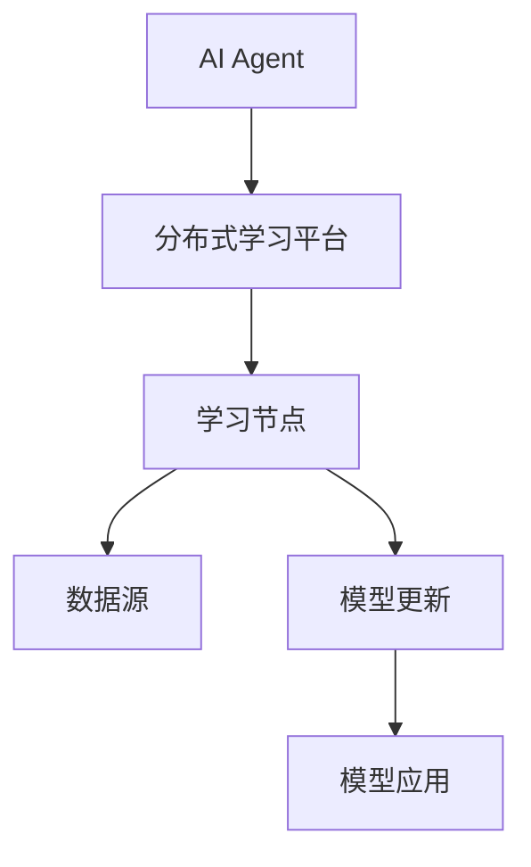

                 


# 企业AI Agent的分布式学习平台设计

**关键词**：企业AI Agent，分布式学习平台，机器学习算法，系统架构设计，Python实现，分布式系统

**摘要**：本文详细探讨了企业AI Agent的分布式学习平台设计，从背景、核心概念、算法原理、系统架构到项目实战，全面解析了该平台的设计与实现。通过分析分布式学习算法、系统架构设计以及实际案例，本文为读者提供了一套完整的设计思路和实现方案，帮助企业在复杂的分布式环境中高效构建和优化AI Agent。

---

## 第一部分: 企业AI Agent与分布式学习平台概述

### 第1章: 企业AI Agent与分布式学习平台概述

#### 1.1 企业AI Agent的背景与问题背景
企业AI Agent是一种能够感知环境、自主决策并执行任务的智能体，广泛应用于推荐系统、自然语言处理、强化学习等领域。然而，随着企业规模的扩大和数据量的激增，单机学习模式逐渐暴露出计算资源不足、数据同步延迟等问题。分布式学习平台作为一种高效的解决方案，通过将计算任务分解到多个节点并行执行，显著提升了学习效率和模型性能。

#### 1.2 分布式学习平台的特点与优势
- **分布式计算**：通过将任务分配到多个节点，充分利用计算资源，提升效率。
- **数据并行**：支持大规模数据集的并行处理，减少训练时间。
- **容错性**：节点故障时，系统能够自动恢复，确保任务完成。
- **扩展性**：可以根据需求动态调整节点数量，适应企业规模的变化。

#### 1.3 企业AI Agent的典型应用场景
- **分布式推荐系统**：通过分布式学习平台训练推荐模型，提升推荐效率和精度。
- **分布式自然语言处理**：在大规模数据上训练语言模型，优化文本生成和理解能力。
- **分布式强化学习**：通过多智能体协作，提升决策系统的性能。

---

## 第二部分: 企业AI Agent的分布式学习平台核心概念与联系

### 第2章: 核心概念与联系

#### 2.1 AI Agent与分布式学习平台的核心概念
- **AI Agent**：能够感知环境、自主决策的智能体，具备学习、推理和执行能力。
- **分布式学习平台**：一种支持分布式计算的平台，通过多个节点协作完成学习任务。

#### 2.2 核心概念的联系与对比
- **关系图解**：通过Mermaid流程图展示AI Agent与分布式学习平台的关系。
- **核心要素对比**：表格形式对比AI Agent和分布式学习平台的核心要素。



---

## 第三部分: 分布式学习平台的算法原理

### 第3章: 分布式学习算法原理

#### 3.1 分布式学习算法概述
- **参数服务器架构**：通过中心服务器管理模型参数，多个工作节点并行更新参数。
- **同步与异步更新**：同步更新确保所有节点参数一致，异步更新提升效率但可能引入延迟。

#### 3.2 分布式参数服务器架构
- **参数服务器**：管理模型参数，接收各节点的梯度更新请求。
- **工作节点**：负责数据处理和梯度计算，向参数服务器发送更新请求。

#### 3.3 分布式学习的数学模型与公式
- **分布式梯度下降**：通过参数服务器同步更新模型参数。
  $$w_{t+1} = w_t - \eta \cdot \frac{1}{n}\sum_{i=1}^{n}g_i(w_t)$$
  其中，$w$为模型参数，$\eta$为学习率，$g_i$为梯度。

#### 3.4 算法实现与代码示例
- **Python实现**：
  ```python
  import numpy as np
  from concurrent.futures import ThreadPoolExecutor

  def distributed SGD(data, model, num_workers=4):
      executor = ThreadPoolExecutor(max_workers=num_workers)
      futures = []
      for i in range(num_workers):
          futures.append(executor.submit(update_worker, data[i], model))
      executor.shutdown(wait=True)
  ```

---

## 第四部分: 企业AI Agent分布式学习平台的系统架构设计

### 第4章: 系统分析与架构设计

#### 4.1 问题场景介绍
企业AI Agent需要在分布式环境中高效学习和推理，解决大规模数据处理和模型更新的问题。

#### 4.2 系统功能设计
- **数据处理**：分布式数据预处理和特征工程。
- **模型训练**：并行训练模型，优化训练效率。
- **模型更新**：支持在线更新和离线更新。

#### 4.3 系统架构设计
- **分层架构**：
  ```mermaid
  graph TD
      A[用户请求] --> B[API Gateway]
      B --> C[应用层]
      C --> D[服务层]
      D --> E[数据层]
  ```

---

## 第五部分: 企业AI Agent分布式学习平台的项目实战

### 第5章: 项目实战

#### 5.1 环境安装
- **依赖安装**：
  ```bash
  pip install numpy pandas tensorflow
  ```

#### 5.2 核心代码实现
- **分布式训练代码**：
  ```python
  import os
  import numpy as np
  from tensorflow.keras.models import Sequential
  from tensorflow.keras.layers import Dense

  def create_model():
      model = Sequential()
      model.add(Dense(64, activation='relu', input_dim=64))
      model.add(Dense(10, activation='softmax'))
      model.compile(optimizer='adam', loss='categorical_crossentropy', metrics=['accuracy'])
      return model

  def train_model(data, model):
      model.fit(data, epochs=10, batch_size=32, verbose=0)
      return model

  # 分布式训练示例
  data = np.random.random((1000, 64))
  model = create_model()
  trained_model = train_model(data, model)
  ```

#### 5.3 案例分析与总结
- **案例分析**：通过实际案例展示分布式学习平台的优势。
- **总结**：总结实现过程中的关键点和注意事项。

---

## 第六部分: 最佳实践与总结

### 第6章: 最佳实践

#### 6.1 项目总结
- **项目成果**：成功构建企业AI Agent的分布式学习平台，提升模型训练效率和性能。
- **经验总结**：分布式系统设计的关键点，如节点通信、任务分配和容错机制。

#### 6.2 注意事项
- **节点负载均衡**：避免节点过载，确保任务分配合理。
- **数据一致性**：保证分布式系统中数据的一致性，避免数据冲突。

#### 6.3 拓展阅读
- **分布式系统经典书籍**：《分布式系统：概念与设计》。
- **机器学习算法研究**：深入研究分布式机器学习算法的优化方法。

---

## 附录

### 附录A: 术语表
- **AI Agent**：人工智能代理。
- **分布式学习平台**：支持分布式计算的学习平台。

### 附录B: 参考文献
- [1]《分布式系统：概念与设计》
- [2]《机器学习实战》

---

**作者：AI天才研究院/AI Genius Institute & 禅与计算机程序设计艺术 /Zen And The Art of Computer Programming**

---

通过本文的详细解析，企业可以更好地理解并设计高效的AI Agent分布式学习平台，提升企业的智能化水平和竞争力。

