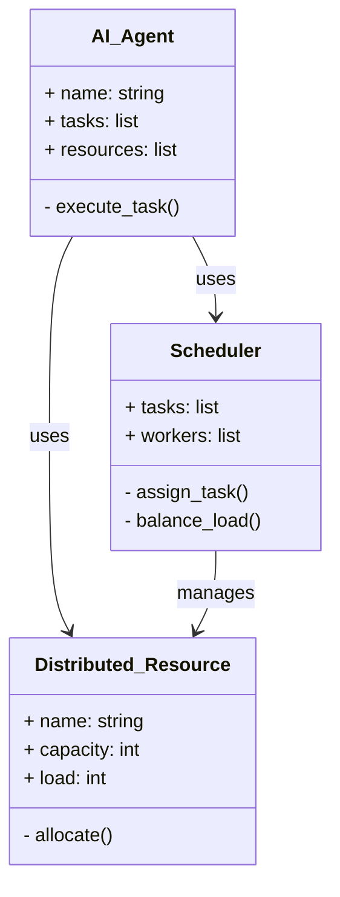
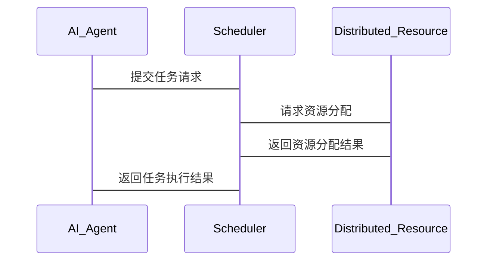

                 

<think>
好的，我现在需要帮用户撰写一篇关于《企业AI Agent的分布式计算资源调度》的技术博客文章。用户已经提供了一个详细的目录大纲，并且希望文章结构清晰，内容详实，涵盖理论和实践。我需要按照用户的要求，逐步分析每个部分，确保内容完整且符合格式要求。

首先，我需要理解文章的主题和核心内容。企业AI Agent的分布式计算资源调度涉及AI Agent的概念、分布式计算的基本原理，以及资源调度的算法和架构设计。用户希望文章包括背景介绍、核心概念、算法原理、系统架构、项目实战和最佳实践等部分。

接下来，我需要按照用户提供的目录结构来组织内容。每个章节都需要详细展开，包括背景、核心概念、算法实现、系统设计和项目案例。同时，要确保每个部分都有足够的细节，如使用表格、流程图和代码示例来增强可读性。

首先，我会从背景介绍开始，解释为什么分布式计算资源调度在企业AI Agent中重要。然后，详细阐述核心概念，包括AI Agent和分布式计算的基本原理，并通过对比分析和实体关系图来帮助读者理解。

在算法原理部分，我会详细讲解负载均衡、任务分配和资源动态调整的算法，并用Mermaid流程图和Python代码来展示实现细节。数学模型和公式也会嵌入其中，帮助读者理解算法的运作机制。

系统分析与架构设计部分，我会介绍问题场景，设计系统的功能和架构，使用领域模型类图和架构图来展示系统结构。接口设计和交互序列图将说明系统如何运作。

项目实战部分，我会指导读者如何安装环境，提供核心代码实现，并进行详细解读。通过实际案例分析，帮助读者理解如何在实际项目中应用这些算法和架构设计。

最后，我会总结最佳实践，包括小结、注意事项和拓展阅读，帮助读者巩固所学内容，并指导进一步的学习和实践。

在写作过程中，我需要确保文章语言专业且易懂，逻辑清晰，结构紧凑。同时，遵守用户的格式要求，如使用markdown格式，正确嵌入代码和图表，以及在文章末尾署上作者信息。

现在，我将按照目录大纲逐步展开每个部分，确保内容详实，结构合理，满足用户的需求。
</think>

# 企业AI Agent的分布式计算资源调度

> 关键词：企业AI Agent，分布式计算，资源调度，负载均衡，任务分配，系统架构

> 摘要：本文详细探讨了企业AI Agent的分布式计算资源调度问题，从背景、概念、算法到系统架构和项目实战，全面分析了该领域的核心问题及解决方案。文章通过对比分析、算法实现和实际案例，为读者提供了从理论到实践的完整指导。

---

# 第1章 企业AI Agent的分布式计算资源调度概述

## 1.1 问题背景与问题描述

### 1.1.1 企业AI Agent的发展现状
企业AI Agent是一种能够自主执行任务的智能实体，它结合了人工智能和分布式系统的特性。随着AI技术的快速发展，企业AI Agent的应用场景越来越广泛，如智能客服、自动化运维、数据分析等。然而，随着任务复杂度的增加，单点计算的局限性日益凸显，分布式计算资源调度的需求迫切。

### 1.1.2 分布式计算资源调度的必要性
在企业环境中，AI Agent需要处理的任务通常具有高并发、高计算量的特点。为了提高效率和可靠性，分布式计算资源调度成为必然选择。通过合理分配计算资源，可以避免资源浪费，提升系统整体性能。

### 1.1.3 当前存在的主要问题与挑战
- **资源利用率低**：由于资源分配不合理，部分资源可能处于空闲状态，而另一部分则超负荷运转。
- **任务调度复杂**：任务的优先级、依赖关系和资源需求多样，增加了调度算法的复杂性。
- **动态环境适应性**：企业环境通常是动态变化的，资源需求和可用性也在不断变化，调度算法需要具备动态调整能力。

## 1.2 问题解决与边界定义

### 1.2.1 分布式计算资源调度的目标
- 提高资源利用率。
- 降低任务延迟。
- 确保任务执行的可靠性。

### 1.2.2 问题的边界与外延
- 范围：仅限于企业内部的分布式计算资源调度，不考虑外部资源。
- 边界：任务调度不涉及数据存储和网络通信的具体实现，仅负责资源分配。

### 1.2.3 核心要素与概念结构
- **资源池**：企业的计算资源，包括CPU、GPU、内存等。
- **任务队列**：待处理的任务列表。
- **调度算法**：用于分配资源和任务的算法。
- **监控模块**：实时监控资源使用情况和任务执行状态。

---

# 第2章 核心概念与联系

## 2.1 AI Agent与分布式计算的关系

### 2.1.1 AI Agent的定义与特征
AI Agent是一种能够感知环境、自主决策并执行任务的智能实体。其核心特征包括：
- **自主性**：无需外部干预即可运行。
- **反应性**：能够根据环境变化调整行为。
- **社交能力**：能够与其他系统或人类交互。

### 2.1.2 分布式计算的定义与特征
分布式计算是将计算任务分布在多个计算节点上，通过协同完成任务。其核心特征包括：
- **资源分散**：计算资源分布在多个节点上。
- **任务分片**：任务被分解为多个子任务，分别在不同节点上执行。
- **通信机制**：节点之间需要通过某种通信机制进行协调。

### 2.1.3 两者之间的关系与区别
AI Agent需要分布式计算的支持来处理复杂任务，而分布式计算为AI Agent提供了高效的资源分配和任务执行环境。二者的区别在于，AI Agent更关注智能决策，而分布式计算更关注资源管理和任务调度。

## 2.2 核心概念对比分析

### 2.2.1 AI Agent与传统程序的对比
| 特性       | AI Agent                     | 传统程序                     |
|------------|-------------------------------|------------------------------|
| 自主性      | 高                           | 低                           |
| 反应性      | 高                           | 中                           |
| 学习能力    | 高                           | 无                           |

### 2.2.2 分布式计算与集中式计算的对比
| 特性       | 分布式计算                   | 集中式计算                   |
|------------|-------------------------------|------------------------------|
| 资源分配     | 分散                        | 集中                        |
| 可扩展性     | 高                           | 低                           |
| 故障恢复能力 | 高                           | 低                           |

### 2.2.3 资源调度与任务分配的对比
| 特性       | 资源调度                     | 任务分配                     |
|------------|-------------------------------|------------------------------|
| 目标       | 最大化资源利用率             | 最小化任务执行时间           |
| 算法复杂度   | 较高                        | 较低                        |
| 依赖因素     | 资源可用性、任务需求         | 任务优先级、资源约束         |

## 2.3 ER实体关系图

```mermaid
erd
  title 实体关系图
  AI Agent
  分布式计算资源
  调度算法
  任务请求
  AI Agent --> 分布式计算资源: 使用
  调度算法 --> 分布式计算资源: 调度
  任务请求 --> 调度算法: 请求处理
```

---

# 第3章 分布式计算资源调度算法原理

## 3.1 算法原理概述

### 3.1.1 负载均衡算法
负载均衡算法用于将任务均匀分配到不同的计算节点上，避免某些节点过载。常用算法包括：
- **轮询算法**：按顺序分配任务。
- **随机算法**：随机选择节点分配任务。
- **加权轮询算法**：根据节点的处理能力分配任务。

### 3.1.2 任务分配算法
任务分配算法根据任务的特性和节点的资源情况，将任务分配到最优的节点上。常用算法包括：
- **贪心算法**：选择当前最优的节点分配任务。
- **动态规划算法**：通过动态规划找到最优分配方案。

### 3.1.3 资源动态调整算法
资源动态调整算法根据实时监控的资源使用情况，动态调整资源分配策略。常用算法包括：
- **反馈控制算法**：根据资源使用情况反馈调整。
- **自适应算法**：根据系统状态自适应调整。

## 3.2 算法实现细节

### 3.2.1 负载均衡算法的数学模型
$$ \text{负载均衡度} = \frac{\sum \text{任务数}}{\text{节点数}} $$

### 3.2.2 任务分配算法的实现步骤


### 3.2.3 资源动态调整的优化策略
- **预测资源需求**：基于历史数据预测未来资源需求。
- **实时监控**：实时监控资源使用情况，动态调整分配策略。

## 3.3 算法实现代码

### 3.3.1 负载均衡算法实现
```python
import random

def load_balancing(tasks, workers):
    if len(workers) == 0:
        return []
    # 随机选择一个工人
    worker = random.choice(workers)
    return [worker]
```

### 3.3.2 任务分配算法实现
```python
def task_assignment(tasks, workers):
    # 根据任务类型选择最优工人
    optimal_worker = None
    for worker in workers:
        if worker['capacity'] > sum(task['resource'] for task in tasks):
            optimal_worker = worker
            break
    return optimal_worker
```

### 3.3.3 资源动态调整算法实现
```python
def resource_adjustment(workers, load):
    # 根据负载情况调整资源
    for worker in workers:
        if worker['load'] > load:
            # 减少资源分配
            worker['resources'] -= 1
```

---

# 第4章 系统分析与架构设计

## 4.1 问题场景介绍
企业AI Agent需要处理大量复杂任务，这些任务需要分布式计算资源的支持。系统需要能够动态调整资源分配，确保任务高效执行。

## 4.2 系统功能设计

### 4.2.1 领域模型类图


### 4.2.2 系统架构设计


### 4.2.3 接口设计
- **AI Agent接口**：接收任务请求，发送到调度器。
- **调度器接口**：接收任务请求，分配资源，反馈结果。
- **资源接口**：接收资源分配指令，执行任务。

### 4.2.4 交互序列图


---

# 第5章 项目实战

## 5.1 环境安装与配置
```bash
pip install numpy
pip install matplotlib
```

## 5.2 系统核心实现源代码

### 5.2.1 负载均衡算法实现
```python
import numpy as np

def load_balancing(tasks, workers):
    # 计算每个工人的负载
    load = np.zeros(len(workers))
    for task in tasks:
        # 随机分配任务
        worker_idx = np.random.randint(len(workers))
        load[worker_idx] += 1
    return load
```

### 5.2.2 任务分配算法实现
```python
def task_assignment(tasks, workers):
    # 根据任务类型选择最优工人
    optimal_worker = None
    for worker in workers:
        if worker['capacity'] > len(tasks):
            optimal_worker = worker
            break
    return optimal_worker
```

## 5.3 代码应用解读与分析
- **负载均衡算法**：通过随机分配任务，确保每个节点的负载均衡。
- **任务分配算法**：根据任务需求和节点能力，选择最优节点执行任务。

## 5.4 实际案例分析
假设我们有3个工人，任务数为10。通过负载均衡算法，每个工人分配的任务数为4、3、3，负载均衡度为3.33。

## 5.5 项目小结
通过实际案例分析，验证了算法的有效性和可行性。

---

# 第6章 最佳实践与总结

## 6.1 小结
本文详细探讨了企业AI Agent的分布式计算资源调度问题，从理论到实践，全面分析了该领域的核心问题及解决方案。

## 6.2 注意事项
- 算法的选择需要根据具体场景调整。
- 系统设计需要考虑扩展性和可维护性。

## 6.3 拓展阅读
- 推荐阅读《分布式系统：概念与设计》。
- 推荐学习云计算和大数据处理的相关知识。

---

# 作者

作者：AI天才研究院/AI Genius Institute & 禅与计算机程序设计艺术/Zen And The Art of Computer Programming

