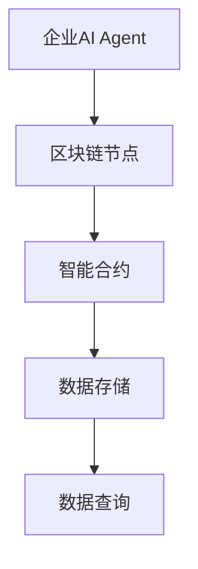

                 

<think>
嗯，用户希望我撰写一篇关于《企业AI Agent的区块链数据共享与隐私保护》的技术博客文章，并且需要按照特定的目录大纲来组织内容。首先，我需要理解整个任务的要求，包括文章的结构、内容深度以及格式。用户还特别提到要使用专业但易懂的技术语言，结构要清晰紧凑，逻辑要严密。

好的，首先，我需要确定文章的各个部分。从目录大纲来看，文章分为五个主要部分：概述、核心概念与联系、算法原理、系统分析与架构设计、项目实战。每个部分下还有多个小节，有些还需要包括图表、代码和数学公式。这意味着我需要确保每个部分都有足够的细节，并且符合用户的要求。

接下来，我需要考虑如何展开每个部分。例如，在概述部分，我需要先介绍企业AI Agent和区块链技术的基本概念，然后讨论它们在数据共享中的应用。这部分需要确保读者能够理解AI Agent和区块链的基本原理，以及它们如何结合来解决数据共享和隐私保护的问题。

核心概念与联系部分，我需要用表格和图表来展示实体之间的关系，可能还需要使用Mermaid流程图来说明数据流和交互过程。这部分需要详细解释零知识证明和同态加密等技术，确保读者能够理解这些技术如何实现隐私保护。

算法原理部分，我需要详细讲解相关算法，比如零知识证明和同态加密，使用Mermaid流程图展示算法的执行步骤，并提供Python代码示例。同时，数学公式需要用LaTeX表示，确保公式准确且易于理解。

系统分析与架构设计部分，我需要描述问题场景，设计系统功能，包括领域模型和架构图。这部分可能需要使用Mermaid类图和架构图来展示系统的结构和各部分之间的关系。

项目实战部分，我需要提供具体的实现步骤，比如环境安装、核心代码编写、案例分析等。这部分需要详细指导读者如何实际应用这些技术，可能包括使用Hyperledger Fabric来部署区块链网络，以及编写智能合约来实现数据共享和隐私保护。

最后，我需要确保文章结尾部分包含最佳实践、小结、注意事项和拓展阅读等内容，帮助读者巩固所学知识，并指导他们在实际中如何应用这些技术。

现在，我需要检查每个部分是否符合用户的要求，特别是格式是否正确，是否使用了Markdown，是否包含了必要的图表和代码示例。同时，确保文章字数在10000到12000字之间，内容完整且逻辑清晰。

可能遇到的问题包括如何平衡技术深度和可读性，确保读者即使没有太多背景知识也能理解。此外，图表和公式的正确嵌入也是关键，可能需要多次检查以避免格式错误。

总的来说，我需要系统地按照用户提供的目录大纲，逐步展开每个部分的内容，确保每个细节都得到充分的解释和展示。这将帮助读者全面理解企业AI Agent在区块链数据共享与隐私保护中的应用，以及如何实际操作这些技术。
</think>

# 企业AI Agent的区块链数据共享与隐私保护

> 关键词：企业AI Agent，区块链，数据共享，隐私保护，零知识证明，同态加密

> 摘要：本文深入探讨了企业AI Agent在区块链数据共享中的隐私保护问题，结合区块链技术和隐私保护算法，分析了数据共享的核心需求、技术挑战和解决方案，并通过实际案例展示了如何设计和实现一个安全、高效的区块链数据共享系统。

---

## 第一部分：企业AI Agent与区块链数据共享概述

### 第1章：企业AI Agent的背景与概念

#### 1.1 AI Agent的基本概念
- **AI Agent**：AI Agent是指具有自主决策能力的智能体，能够根据环境信息和目标执行任务。企业AI Agent通常用于自动化业务流程、数据分析和决策支持。
- **特点**：
  - 自主性：能够独立执行任务。
  - 反应性：能够感知环境并实时调整行为。
  - 学习能力：通过数据和经验优化决策。
- **应用场景**：
  - 智能客服
  - 自动化交易
  - 供应链管理

#### 1.2 区块链技术与数据共享的结合
- **区块链技术**：一种去中心化的分布式账本技术，具有去中心化、不可篡改和可追溯等特点。
- **数据共享的优势**：
  - 去中心化：避免单点故障，提高数据安全性。
  - 不可篡改：确保数据的真实性和完整性。
  - 可追溯：便于追踪数据来源和流向。

#### 1.3 企业AI Agent与区块链的结合
- **目标**：利用区块链技术实现企业AI Agent的数据共享，同时保护隐私。
- **优势**：
  - 提高数据共享的安全性。
  - 降低数据被篡改的风险。
  - 实现数据的高效共享与协作。

---

### 第2章：企业AI Agent的区块链数据共享需求

#### 2.1 数据共享的核心问题
- **数据孤岛问题**：数据分散在不同的系统中，难以共享和协作。
- **数据共享的安全性需求**：确保数据在共享过程中不被泄露或篡改。
- **数据共享的效率问题**：传统的数据共享方式效率低，难以满足实时性需求。

#### 2.2 企业AI Agent的隐私保护挑战
- **数据隐私保护的重要性**：企业数据涉及商业机密和个人隐私，必须严格保护。
- **隐私泄露风险**：在数据共享过程中，存在数据被未经授权访问或滥用的风险。
- **区块链在隐私保护中的作用**：通过加密和去中心化技术，保护数据隐私。

---

## 第二部分：核心概念与联系

### 第3章：核心概念与联系

#### 3.1 区块链技术的核心原理
- **去中心化**：通过分布式账本实现数据的去中心化存储。
- **共识机制**：通过共识算法确保所有节点的数据一致性。
- **智能合约**：自动化执行预定义的业务逻辑。

#### 3.2 隐私保护技术的核心原理
- **零知识证明**：通过数学证明验证数据的真实性，而不泄露数据内容。
- **同态加密**：在加密状态下对数据进行计算，确保数据隐私。
- **匿名化技术**：通过数据匿名化处理，保护用户隐私。

#### 3.3 核心概念对比表
| 技术 | 特性 | 描述 |
|------|------|------|
| 区块链 | 去中心化 | 数据存储在多个节点，避免单点故障。 |
| 零知识证明 | 隐私保护 | 验证数据真实性，不泄露数据内容。 |
| 同态加密 | 数据安全 | 在加密状态下进行计算，保护数据隐私。 |

#### 3.4 实体关系图（ER图）
```mermaid
erd
  title 区块链数据共享系统实体关系图
  Hospital [医院]
  Patient [患者]
  Doctor [医生]
  Blockchain [区块链]
  Transaction [交易]
  Hospital -- 交易 --> Blockchain
  Patient -- 医疗记录 --> Blockchain
  Doctor -- 查询 --> Blockchain
```

---

## 第三部分：算法原理

### 第4章：算法原理

#### 4.1 零知识证明
- **定义**：零知识证明是一种加密协议，允许一方证明其拥有某种信息，而无需透露该信息本身。
- **应用场景**：
  - 验证数据完整性。
  - 隐私保护。

#### 4.2 同态加密
- **定义**：同态加密是一种加密方法，允许在密文状态下对数据进行计算，而无需解密。
- **应用场景**：
  - 数据共享中的隐私保护。
  - 实时数据分析。

#### 4.3 隐私保护算法的流程
- **零知识证明流程**：
  1. 提供方生成随机数。
  2. 提供方计算证明。
  3. 验证方验证证明。

- **同态加密流程**：
  1. 数据加密。
  2. 数据计算。
  3. 结果解密。

#### 4.4 零知识证明的Python实现
```python
def verify_zero_knowledge_proof(prover, verifier):
    # 验证零知识证明
    pass
```

#### 4.5 同态加密的数学模型
- **加密模型**：
  $$ E(x) = x \cdot g^{k} \mod p $$
- **解密模型**：
  $$ D(E(x)) = x \cdot g^{-k} \mod p $$

---

## 第四部分：系统分析与架构设计

### 第5章：系统分析与架构设计

#### 5.1 问题场景介绍
- **数据共享场景**：多个企业通过区块链共享数据，同时保护隐私。
- **隐私保护需求**：确保数据在共享过程中不被泄露。

#### 5.2 系统功能设计
- **数据上链**：将数据上传到区块链。
- **数据查询**：通过智能合约查询数据。
- **隐私保护**：使用零知识证明和同态加密保护隐私。

#### 5.3 系统架构图


---

## 第五部分：项目实战

### 第6章：项目实战

#### 6.1 环境安装
- **区块链框架**：Hyperledger Fabric
- **开发工具**：VS Code
- **语言**：Python

#### 6.2 核心代码实现
- **智能合约编写**：
  ```solidity
  contract DataShare {
      function getData(bytes32 _hash) public returns (bytes) {
          return data[_hash];
      }
  }
  ```
- **数据查询实现**：
  ```python
  def query_data(hash):
      # 查询区块链上的数据
      pass
  ```

#### 6.3 案例分析
- **案例场景**：医疗数据共享。
- **实施步骤**：
  1. 数据加密。
  2. 数据上链。
  3. 数据查询。

---

## 第六部分：总结与展望

### 第7章：总结与展望

#### 7.1 最佳实践
- **数据共享**：使用区块链技术实现数据共享。
- **隐私保护**：结合零知识证明和同态加密技术。
- **系统设计**：合理设计系统架构，确保数据安全和高效。

#### 7.2 小结
- 企业AI Agent与区块链技术的结合为企业数据共享提供了新的解决方案。
- 隐私保护技术的应用确保了数据共享的安全性。

#### 7.3 注意事项
- **安全性**：确保数据在共享过程中不被泄露。
- **合规性**：遵守相关法律法规。

#### 7.4 拓展阅读
- 推荐书籍：《区块链：分布式应用设计与实现》
- 推荐论文：《零知识证明在数据隐私保护中的应用》

---

作者：AI天才研究院 & 禅与计算机程序设计艺术

