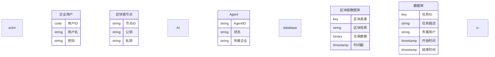
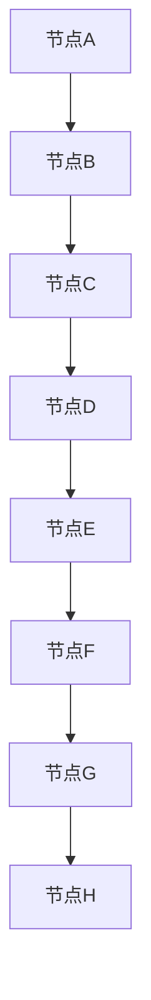
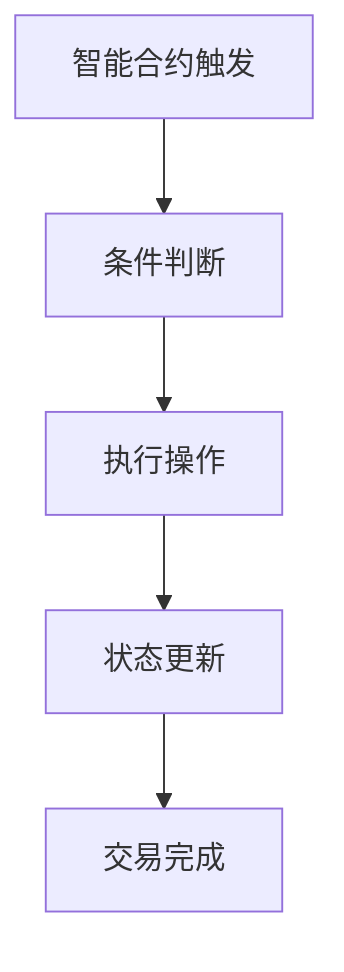
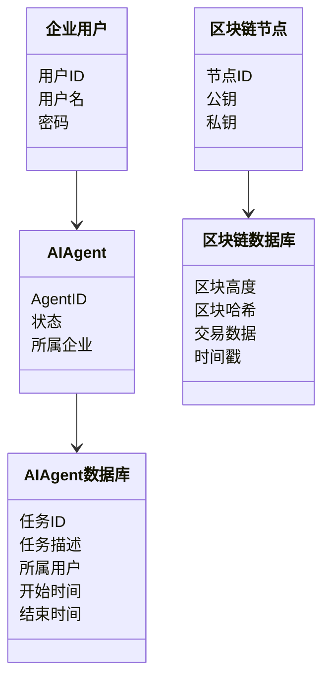
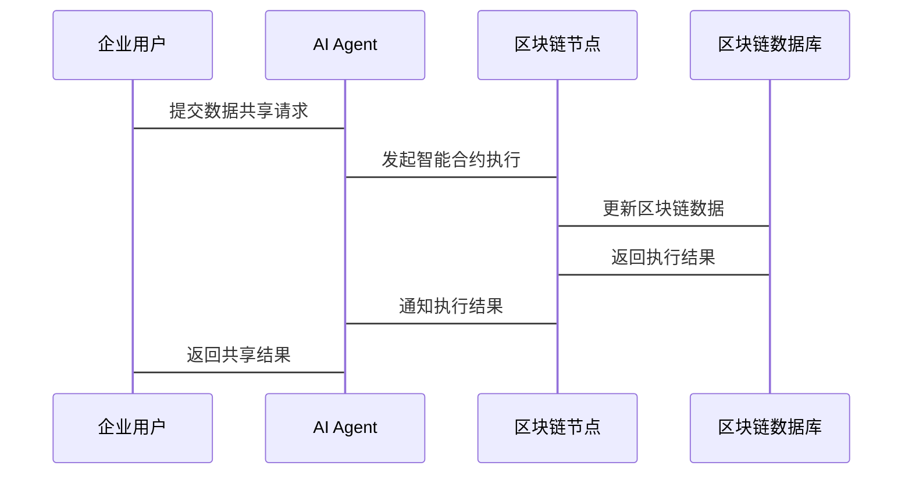

                 


# 企业AI Agent的区块链数据共享机制

> 关键词：企业AI Agent，区块链，数据共享机制，共识算法，智能合约，数据隐私

> 摘要：本文深入探讨了企业AI Agent与区块链技术的结合，重点分析了如何利用区块链技术实现高效、安全的企业数据共享机制。通过详细阐述AI Agent的核心概念、区块链技术的优势，以及两者的结合方式，本文提出了基于区块链的AI Agent数据共享模型，并通过实际案例展示了该模型的应用与实现。文章内容涵盖问题背景、核心概念对比、算法原理、系统架构设计、项目实战以及最佳实践，旨在为企业级数据共享提供一种创新的解决方案。

---

## 第1章: 问题背景与解决思路

### 1.1 问题背景

#### 1.1.1 当前企业数据共享的挑战
- 数据孤岛问题：企业在数据共享过程中面临“数据孤岛”现象，导致数据无法有效流通和利用。
- 数据隐私与安全：企业对数据隐私的保护要求日益严格，传统的数据共享方式难以满足安全需求。
- 数据一致性与信任问题：多企业间数据共享需要确保数据的一致性和可信性，但传统方式难以实现。

#### 1.1.2 AI Agent在企业数据共享中的作用
- AI Agent作为智能化的数据处理和协调工具，能够自动处理复杂的共享逻辑。
- AI Agent可以实现数据的自动匹配和智能推荐，提高数据共享的效率。
- AI Agent能够通过智能合约实现自动化执行，确保数据共享的安全性和一致性。

#### 1.1.3 区块链技术如何助力数据共享
- 区块链的去中心化特性可以消除数据孤岛，实现数据的高效共享。
- 区块链的不可篡改性确保数据的一致性和可信性。
- 区块链的智能合约功能可以实现数据共享的自动化和智能化。

### 1.2 问题描述

#### 1.2.1 数据孤岛现象的现状
- 数据孤岛：数据分散在不同的系统中，缺乏统一的管理和共享机制。
- 数据孤岛的影响：数据无法充分发挥价值，限制了企业的业务发展。

#### 1.2.2 数据共享的痛点分析
- 数据隐私与安全：如何在共享数据的同时保护隐私？
- 数据一致性：如何确保多个参与方的数据一致？
- 数据信任：如何建立多方之间的信任机制？

#### 1.2.3 AI Agent在数据共享中的需求
- AI Agent需要具备数据解析、匹配和推荐的能力。
- AI Agent需要支持智能合约的执行，确保数据共享的自动化和智能化。

### 1.3 问题解决思路

#### 1.3.1 引入区块链技术的核心原因
- 区块链的去中心化特性可以消除数据孤岛。
- 区块链的不可篡改性确保数据的一致性和可信性。
- 区块链的智能合约功能可以实现数据共享的自动化。

#### 1.3.2 AI Agent作为数据共享的驱动者
- AI Agent可以自动化处理数据共享的逻辑。
- AI Agent可以实现数据的智能匹配和推荐。
- AI Agent可以支持智能合约的执行，确保数据共享的安全性和效率。

#### 1.3.3 区块链与AI Agent的结合优势
- 两者的结合可以实现高效、安全、智能化的数据共享。
- 区块链为AI Agent提供了可靠的数据存储和共享环境。
- AI Agent为区块链提供了智能化的数据处理能力。

---

## 第2章: 核心概念与联系

### 2.1 AI Agent的核心概念

#### 2.1.1 AI Agent的定义与特征
- AI Agent：一种能够感知环境、自主决策并执行任务的智能体。
- 特征：自主性、反应性、目标导向、学习能力。

#### 2.1.2 AI Agent的类型与应用场景
- 分类：简单反射型、基于模型的反射型、目标驱动型、效用驱动型。
- 应用场景：数据处理、任务调度、自动化决策、智能客服等。

#### 2.1.3 AI Agent与数据共享的关系
- AI Agent可以自动化处理数据共享的逻辑。
- AI Agent可以实现数据的智能匹配和推荐。
- AI Agent可以支持智能合约的执行，确保数据共享的安全性和效率。

### 2.2 区块链的核心概念

#### 2.2.1 区块链的定义与特点
- 区块链：一种分布式账本技术，通过去中心化的方式记录交易数据。
- 特点：去中心化、不可篡改、透明性、可追溯性。

#### 2.2.2 区块链的主要技术组件
- 区块结构：包含交易数据和链式结构。
- 共识算法：如PoW、PoS、Dpos等。
- 智能合约：自动执行的脚本代码。

#### 2.2.3 区块链在数据共享中的优势
- 数据不可篡改：确保数据的一致性和可信性。
- 去中心化：消除数据孤岛，实现数据的高效共享。
- 智能合约：实现数据共享的自动化和智能化。

### 2.3 AI Agent与区块链的关系

#### 2.3.1 两者的结合方式
- AI Agent驱动数据共享：AI Agent通过智能合约实现数据的自动化共享。
- 区块链为AI Agent提供数据存储和共享环境：区块链为AI Agent提供可靠的数据存储和共享环境。

#### 2.3.2 区块链如何赋能AI Agent的数据共享能力
- 区块链提供数据存储和共享的基础设施。
- 区块链确保数据的一致性和可信性。
- 区块链支持智能合约的执行，实现数据共享的自动化。

#### 2.3.3 AI Agent如何提升区块链的数据利用效率
- AI Agent可以自动化处理数据，提高数据利用效率。
- AI Agent可以实现数据的智能匹配和推荐，提升数据共享的效率。
- AI Agent可以优化智能合约的执行逻辑，提高数据共享的效率。

---

### 2.4 核心概念对比与ER实体关系

#### 2.4.1 AI Agent与区块链的核心概念对比

| 概念 | AI Agent | 区块链 |
|------|----------|--------|
| 定义 | 智能体，能够感知环境、自主决策并执行任务。 | 分布式账本技术，通过去中心化的方式记录交易数据。 |
| 特征 | 自主性、反应性、目标导向、学习能力。 | 去中心化、不可篡改、透明性、可追溯性。 |
| 应用场景 | 数据处理、任务调度、自动化决策、智能客服。 | 数据共享、金融支付、智能合约。 |

#### 2.4.2 ER实体关系图



---

## 第3章: 算法原理讲解

### 3.1 共识算法

#### 3.1.1 共识算法的核心原理
- 共识算法：区块链中用于确保所有节点达成一致的算法。
- 常见算法：PoW（工作量证明）、PoS（权益证明）、Dpos（ delegated proof of stake）。

#### 3.1.2 共识算法的流程


#### 3.1.3 Python实现示例
```python
def proof_of_work(block):
    target = 1 << (256 - block.header.bit_length)
    while True:
        if block.header % target == 0:
            return block.header // target
        block.header += 1
```

### 3.2 智能合约

#### 3.2.1 智能合约的核心原理
- 智能合约：区块链上的自动执行脚本，用于实现特定的业务逻辑。

#### 3.2.2 智能合约的执行流程


#### 3.2.3 智能合约的数学模型
$$
f(x) = 
    \begin{cases}
        0 & \text{if } x < 0 \\
        1 & \text{if } 0 \leq x < 100 \\
        2 & \text{if } 100 \leq x < 200 \\
        3 & \text{otherwise}
    \end{cases}
$$

---

## 第4章: 数学模型与公式

### 4.1 共识机制的数学模型

$$
P(k) = \frac{1}{k^2} \sum_{i=1}^k \frac{1}{i}
$$

### 4.2 数据共享的数学公式

$$
D_{\text{共享}} = \sum_{i=1}^n D_i \times w_i
$$

其中：
- $D_{\text{共享}}$：共享数据
- $D_i$：第i个数据
- $w_i$：第i个数据的权重

---

## 第5章: 系统分析与架构设计

### 5.1 问题场景介绍

#### 5.1.1 系统目标
- 实现企业AI Agent与区块链的结合，构建高效、安全的数据共享机制。
- 通过智能合约实现数据共享的自动化和智能化。

#### 5.1.2 系统需求
- 数据一致性：确保共享数据的一致性。
- 数据隐私：保护数据隐私。
- 自动化执行：通过智能合约实现数据共享的自动化。

### 5.2 系统功能设计

#### 5.2.1 领域模型


#### 5.2.2 系统架构设计


#### 5.2.3 接口设计与交互流程


---

## 第6章: 项目实战

### 6.1 环境安装

#### 6.1.1 安装区块链环境
- 安装以太坊：`npm install -g ethereum-cli`

#### 6.1.2 安装AI Agent环境
- 安装Python 3.x
- 安装机器学习库：`pip install scikit-learn`

### 6.2 核心代码实现

#### 6.2.1 智能合约实现
```solidity
contract DataSharing {
    function shareData(bytes data) external {
        // 实现数据共享逻辑
    }
}
```

#### 6.2.2 AI Agent实现
```python
class AI_Agent:
    def __init__(self):
        self.state = "idle"
    
    def process_request(self, request):
        # 实现请求处理逻辑
        pass
```

#### 6.2.3 代码解读与分析
- 智能合约：定义数据共享的逻辑，实现数据的存储和共享。
- AI Agent：负责数据的解析和智能合约的执行，确保数据共享的自动化和智能化。

### 6.3 实际案例分析

#### 6.3.1 案例背景
- 某医疗企业需要共享医疗数据，但面临数据隐私和安全的挑战。

#### 6.3.2 案例实现
- 使用区块链技术实现医疗数据的共享。
- 使用AI Agent实现数据的智能匹配和推荐。

#### 6.3.3 案例分析
- 数据共享的效率和安全性显著提升。
- 医疗企业的数据共享成本降低。

---

## 第7章: 总结与展望

### 7.1 总结

#### 7.1.1 核心内容回顾
- 企业AI Agent与区块链的结合可以实现高效、安全的数据共享。
- 区块链为AI Agent提供了可靠的数据存储和共享环境。
- AI Agent为区块链提供了智能化的数据处理能力。

#### 7.1.2 成功经验总结
- AI Agent与区块链的结合是数据共享的未来趋势。
- 智能合约的执行是数据共享的核心。
- 数据隐私和安全是数据共享的关键。

### 7.2 展望

#### 7.2.1 当前存在的挑战
- 数据隐私与安全的保护。
- 智能合约的可编程性。
- 区块链的可扩展性。

#### 7.2.2 未来发展方向
- 提高区块链的可扩展性。
- 提升智能合约的可编程性。
- 加强数据隐私和安全的保护。

---

## 作者

作者：AI天才研究院/AI Genius Institute & 禅与计算机程序设计艺术/Zen And The Art of Computer Programming

---

通过本文的详细阐述，我们全面探讨了企业AI Agent与区块链数据共享机制的结合，从理论到实践，从算法到系统设计，为企业的数据共享提供了创新的解决方案。希望本文能为相关领域的研究和实践提供有价值的参考。

