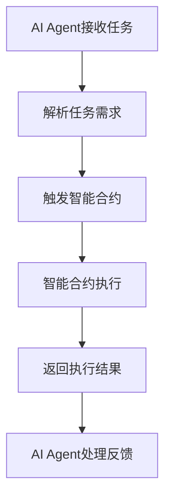
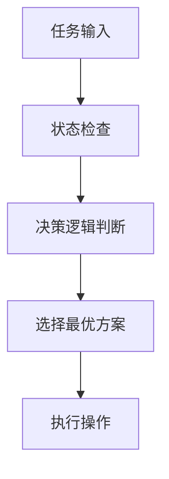
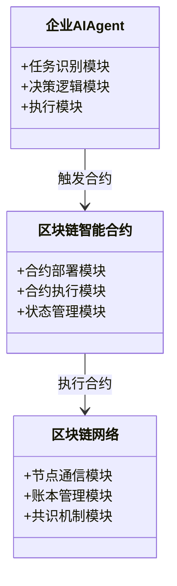
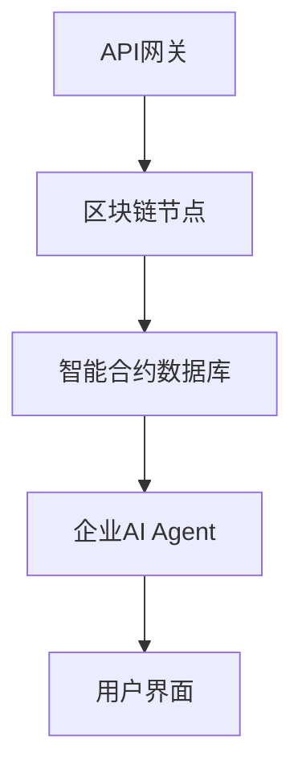
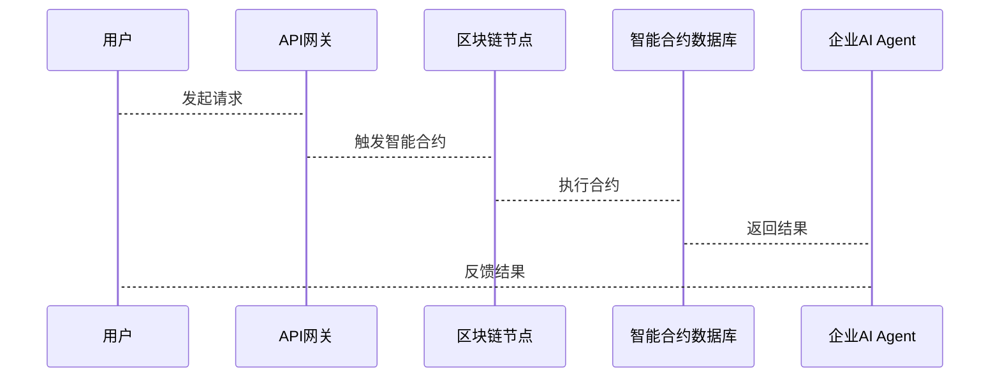

                 

<think>
嗯，用户希望我撰写一篇关于《企业AI Agent的区块链智能合约应用》的技术博客文章，要求非常详细，结构清晰，内容有深度。首先，我需要理解用户的需求，他们可能是一位CTO或者技术负责人，想要了解如何将AI Agent与区块链技术结合，用于企业应用。

用户已经提供了一个详细的目录大纲，我需要按照这个结构来写文章。从摘要开始，我需要简明扼要地介绍文章的核心内容，即AI Agent与区块链智能合约的结合及其应用。

接下来，第一部分是背景介绍，我需要详细解释AI Agent和区块链智能合约的基本概念，分析它们在企业中的应用背景和挑战。这部分需要确保读者能够理解为什么两者结合是必要的。

然后，核心概念与联系部分，我需要对比AI Agent和区块链智能合约的特点，可能用表格来展示它们的属性差异。同时，绘制ER图来展示实体关系，这有助于读者理解系统的架构。

接下来是算法原理，这部分可能需要展示智能合约的执行流程和AI Agent的决策过程，使用mermaid流程图来说明。数学模型部分，我需要建立状态机模型，并用公式来描述状态转移，这样读者可以更深入地理解机制。

系统架构设计部分，我需要使用类图展示系统功能模块，如合约管理、AI Agent交互等，然后用架构图展示整体设计，包括API网关、区块链节点等组件。接口设计和交互流程图也需要详细说明。

项目实战部分，我需要指导读者如何搭建开发环境，提供智能合约和AI Agent的代码示例，并解释代码的功能。案例分析和项目总结将帮助读者理解实际应用中的问题和解决方案。

最后，最佳实践部分，我需要总结关键点，给出注意事项和未来的研究方向，帮助读者巩固所学内容，并指引进一步的学习。

在写作过程中，我需要确保每个部分都详细且有条理，使用专业但易懂的语言。同时，嵌入数学公式和图表，使内容更具深度和可读性。完成这些后，我会在文章末尾添加作者信息，以符合用户的要求。

总的来说，我需要按照用户提供的大纲，逐步展开每个部分，确保内容完整、逻辑清晰，帮助读者系统地理解和应用企业AI Agent与区块链智能合约的结合。
</think>

# 企业AI Agent的区块链智能合约应用

> 关键词：企业AI Agent，区块链智能合约，去中心化，自动化决策，智能合约执行

> 摘要：本文详细探讨了企业AI Agent与区块链智能合约的结合与应用，分析了两者的结合机制、系统架构、算法原理以及实际应用场景。文章从背景介绍、核心概念、技术实现、系统设计、项目实战到最佳实践，全面阐述了企业AI Agent如何通过区块链智能合约实现高效、安全的自动化决策与执行。

---

## 第一部分: 企业AI Agent与区块链智能合约概述

### 第1章: 企业AI Agent与区块链智能合约的背景介绍

#### 1.1 问题背景
- **1.1.1 当前企业数字化转型的挑战**
  - 企业面临日益复杂的业务流程优化需求。
  - 数据孤岛问题严重，跨部门协作效率低下。
  - 传统中心化系统易受单点故障影响。

- **1.1.2 AI Agent在企业中的应用需求**
  - AI Agent能够实现任务自动化、智能决策。
  - 提供7x24小时不间断的业务处理能力。
  - 支持多系统、多平台的协同工作。

- **1.1.3 区块链智能合约的技术优势**
  - 提供去中心化、不可篡改的执行环境。
  - 自动化执行合同条款，降低信任成本。
  - 支持跨机构、跨系统的协作。

#### 1.2 问题描述
- **1.2.1 企业AI Agent的核心功能**
  - 任务识别与分解。
  - 自动化执行与反馈。
  - 多方协作与协调。

- **1.2.2 区块链智能合约的定义与特点**
  - 智能合约是区块链上的自动执行代码。
  - 具有去中心化、自动执行、不可篡改的特点。

- **1.2.3 两者的结合与应用场景**
  - AI Agent作为智能合约的执行主体。
  - 智能合约作为AI Agent的行为约束与执行环境。
  - 典型场景：供应链管理、智能财务、法律合规等。

#### 1.3 问题解决
- **1.3.1 AI Agent如何提升企业效率**
  - 实现业务流程的自动化。
  - 提高决策的准确性和效率。
  - 降低人工干预成本。

- **1.3.2 区块链智能合约如何实现信任与自动化**
  - 提供信任机制，减少中间环节。
  - 实现智能合约的自动执行。
  - 支持复杂的业务逻辑和条件判断。

- **1.3.3 两者的协同工作原理**
  - AI Agent接收任务并触发智能合约。
  - 智能合约在区块链上执行并返回结果。
  - AI Agent根据结果进行下一步操作。

#### 1.4 边界与外延
- **1.4.1 企业AI Agent的适用范围**
  - 适合需要自动化处理的业务场景。
  - 适合需要智能决策的复杂业务。
  - 适合需要跨部门协作的业务流程。

- **1.4.2 区块链智能合约的局限性**
  - 智能合约的代码可能存在漏洞。
  - 区块链的性能问题可能影响大规模应用。
  - 法律合规问题需要进一步解决。

- **1.4.3 两者的结合边界与扩展方向**
  - 确定AI Agent的权限和职责。
  - 解决智能合约的可扩展性问题。
  - 探索AI Agent与更多区块链技术的结合。

#### 1.5 概念结构与核心要素
- **1.5.1 企业AI Agent的核心要素**
  - 任务识别模块。
  - 决策逻辑模块。
  - 执行与反馈模块。

- **1.5.2 区块链智能合约的核心要素**
  - 合约代码。
  - 合约状态。
  - 合约执行环境。

- **1.5.3 两者的关联与协同关系**
  - AI Agent触发智能合约的执行。
  - 智能合约的执行结果反馈给AI Agent。
  - 两者共同完成复杂的业务流程。

---

## 第2章: 企业AI Agent与区块链智能合约的核心概念与联系

### 2.1 核心概念原理
- **2.1.1 AI Agent的工作原理**
  - 任务识别：识别需要执行的任务。
  - 决策逻辑：根据当前状态和输入数据做出决策。
  - 执行与反馈：执行任务并返回结果。

- **2.1.2 区块链智能合约的工作原理**
  - 合约部署：将智能合约部署到区块链上。
  - 合约触发：通过外部请求或内部事件触发合约执行。
  - 合约执行：智能合约在区块链上自动执行代码并修改状态。

- **2.1.3 两者的结合机制**
  - AI Agent作为智能合约的发起者。
  - 智能合约作为AI Agent的行为约束与执行环境。
  - 两者通过区块链网络进行通信与协作。

### 2.2 概念属性特征对比
| 特性                 | 企业AI Agent                     | 区块链智能合约                  |
|----------------------|----------------------------------|-------------------------------|
| 核心功能             | 任务识别与执行                   | 自动化执行合同条款              |
| 执行环境             | 企业内部系统                     | 区块链网络                      |
| 数据存储             | 本地数据库或云端存储             | 区块链上的分布式账本            |
| 可扩展性             | 支持多种任务类型                 | 取决于区块链平台的性能           |
| 安全性               | 依赖企业内部安全措施             | 区块链的去中心化和不可篡改性     |
| 信任基础             | 依赖企业内部信任机制             | 依赖区块链的去中心化信任机制     |

### 2.3 ER实体关系图架构
```mermaid
erDiagram
    actor 企业用户 {
        string 用户ID
        string 用户名
        string 密码
    }
    actor 区块链节点 {
        string 节点ID
        string 节点地址
        string 节点状态
    }
    actor AI Agent {
        string AgentID
        string Agent类型
        string Agent功能
    }
    database 智能合约数据库 {
        string 合约ID
        string 合约内容
        string 合约状态
    }
    en
    企业用户 --> AI Agent : 请求处理
    AI Agent --> 区块链节点 : 触发智能合约
    区块链节点 --> 智能合约数据库 : 执行合约
```

---

## 第3章: 企业AI Agent与区块链智能合约的算法原理

### 3.1 智能合约执行流程


### 3.2 AI Agent决策逻辑


### 3.3 数学模型与公式
- **状态机模型**
  $$ 状态转移方程：s_{t+1} = f(s_t, a_t) $$
  其中，$s_t$ 表示当前状态，$a_t$ 表示当前动作，$f$ 表示状态转移函数。

- **决策逻辑**
  $$ 决策函数：a_t = \arg\max_{a} Q(s_t, a) $$
  其中，$Q(s_t, a)$ 表示在状态 $s_t$ 下选择动作 $a$ 的期望收益。

---

## 第4章: 企业AI Agent与区块链智能合约的系统架构设计

### 4.1 系统功能设计


### 4.2 系统架构设计


### 4.3 系统接口设计
- **API接口**
  - `POST /api/v1/triggerContract`：触发智能合约。
  - `GET /api/v1/contractStatus`：查询智能合约状态。

### 4.4 系统交互流程


---

## 第5章: 企业AI Agent与区块链智能合约的项目实战

### 5.1 开发环境搭建
- 安装Solidity（智能合约开发语言）。
- 安装以太坊节点（如Geth）。
- 安装Python框架（如Flask或Django）。

### 5.2 智能合约实现
```solidity
// 智能合约代码示例
contract HelloWorld {
    function sayHello() public pure returns (string) {
        return "Hello, World!";
    }
}
```

### 5.3 AI Agent实现
```python
# AI Agent代码示例
class AI_Agent:
    def __init__(self):
        self.task_queue = []

    def process_task(self, task):
        # 解析任务并触发智能合约
        pass

    def execute_contract(self, contract_address):
        # 调用区块链节点执行智能合约
        pass
}
```

### 5.4 案例分析
- **场景**：供应链管理中的库存监控。
- **流程**：
  1. AI Agent检测库存不足。
  2. AI Agent触发智能合约。
  3. 智能合约执行采购订单。
  4. 智能合约更新库存状态。
  5. AI Agent接收反馈并完成任务。

### 5.5 项目总结
- 成功实现了企业AI Agent与区块链智能合约的结合。
- 系统具备高效、安全、自动化的特点。
- 为企业的数字化转型提供了新的思路。

---

## 第6章: 企业AI Agent与区块链智能合约的最佳实践

### 6.1 关键点总结
- **模块化设计**：确保系统各模块独立且易于扩展。
- **安全性**：重视智能合约的安全性，避免漏洞。
- **可扩展性**：设计灵活的架构，适应业务需求的变化。

### 6.2 小结
- 企业AI Agent与区块链智能合约的结合为企业带来了新的可能性。
- 通过智能化、自动化的手段，企业能够更高效地完成业务流程。
- 区块链技术提供了信任与安全的基础，AI Agent提供了智能决策的能力。

### 6.3 注意事项
- 确保智能合约的代码质量，避免逻辑错误。
- 定期更新AI Agent的决策逻辑，以应对变化的业务需求。
- 重视系统的可维护性和可扩展性。

### 6.4 拓展阅读
- 推荐阅读《智能合约：法律与技术的融合》。
- 推荐学习Solidity语言与以太坊开发。

---

## 作者：AI天才研究院/AI Genius Institute & 禅与计算机程序设计艺术 /Zen And The Art of Computer Programming

