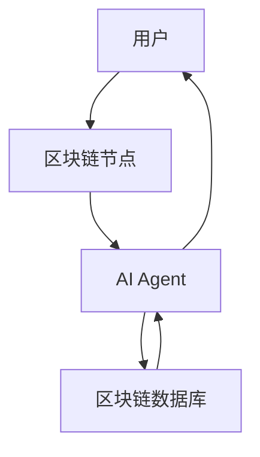
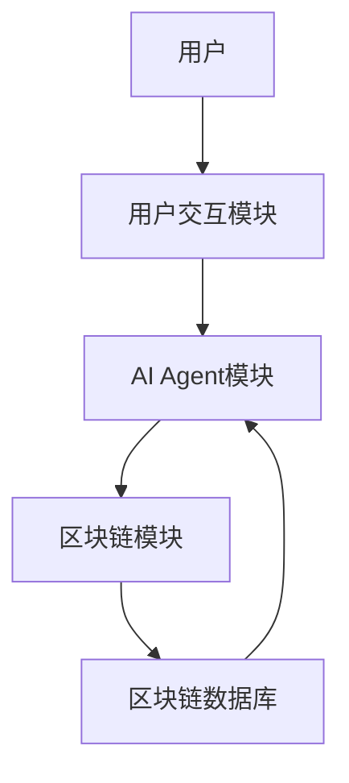
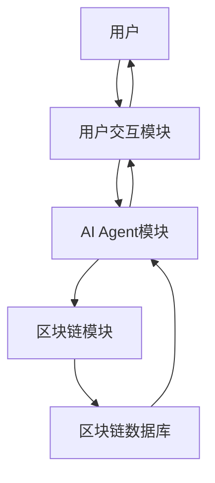

                 


# 《企业AI Agent的区块链集成策略》

## 关键词：企业AI Agent，区块链，集成策略，智能合约，分布式系统

## 摘要：本文探讨了企业AI Agent与区块链技术的集成策略，分析了其核心概念、技术原理及系统架构，结合实际案例，详细阐述了集成的优势、挑战及解决方案，为企业的智能化转型提供了指导。

---

# 第一部分：企业AI Agent与区块链集成概述

## 第1章：企业AI Agent与区块链集成的背景与意义

### 1.1 企业AI Agent的概念与特点

- **1.1.1 AI Agent的定义**
  - AI Agent是一个智能体，能够感知环境、自主决策并执行任务。
  
- **1.1.2 企业AI Agent的核心特点**
  - 智能性：基于AI算法，能够进行复杂决策。
  - 自主性：无需人工干预，自动执行任务。
  - 社交能力：与其他系统、用户交互。
  - 学习能力：通过数据优化自身行为。

- **1.1.3 企业AI Agent的应用场景**
  - 客户服务：智能客服助手。
  - 供应链管理：优化物流路径。
  - 金融风控：实时监控和预警。

### 1.2 区块链技术的核心概念

- **1.2.1 区块链的定义**
  - 分布式账本技术，确保数据不可篡改。
  
- **1.2.2 区块链的主要特点**
  - 去中心化：无须信任第三方。
  - 可追溯性：记录全生命周期。
  - 安全性：加密技术保护数据。

- **1.2.3 区块链的典型应用场景**
  - 供应链管理：确保数据透明。
  - 金融支付：降低交易成本。
  - 版权保护：确权和溯源。

### 1.3 企业AI Agent与区块链集成的意义

- **1.3.1 提升企业智能化水平**
  - 结合AI和区块链，增强企业决策能力。
  
- **1.3.2 增强数据安全与信任**
  - 区块链确保数据不可篡改，提升信任度。
  
- **1.3.3 优化业务流程效率**
  - 自动化处理，减少人为干预，提高效率。

### 1.4 本章小结

- 介绍了企业AI Agent和区块链的基本概念、特点及应用场景。
- 强调了两者集成对企业智能化转型的重要性。

---

## 第2章：企业AI Agent与区块链的核心概念

### 2.1 AI Agent与区块链的对比分析

- **2.1.1 核心概念对比表格**

| 属性 | AI Agent | 区块链 |
|------|----------|--------|
| 核心功能 | 自主决策、执行任务 | 存储、传输、验证数据 |
| 技术基础 | 机器学习、自然语言处理 | 加密学、分布式系统 |
| 应用场景 | 智能客服、供应链优化 | 金融支付、版权保护 |

- **2.1.2 核心属性特征对比**
  - AI Agent强调智能性和自主性。
  - 区块链强调去中心化和安全性。

- **2.1.3 企业AI Agent与区块链的ER实体关系图**

```mermaid
er
    actor 用户
    actor 区块链节点
    actor AI Agent
    database 区块链数据库
    database AI Agent数据库
    relationship 用户与区块链节点的交互
    relationship 区块链节点与AI Agent的交互
    relationship AI Agent与区块链数据库的交互
```

### 2.2 区块链与AI Agent的交互流程

- **2.2.1 区块链与AI Agent的交互流程图**



### 2.3 本章小结

- 对比分析了AI Agent和区块链的核心概念和属性。
- 使用ER图和流程图展示了两者的关系和交互方式。

---

## 第3章：区块链共识算法与AI Agent的结合

### 3.1 共识算法概述

- **3.1.1 共识算法的定义**
  - 区块链节点达成一致的机制。
  
- **3.1.2 常见共识算法**
  - PoW（工作量证明）：比特币采用。
  - PoS（权益证明）：以太坊2.0采用。
  - BFT（拜占庭容错）：适用于高延迟网络。

### 3.2 AI Agent在共识算法中的作用

- **3.2.1 AI Agent在区块链共识中的应用场景**
  - 智能合约执行：AI Agent自动触发智能合约。
  - 共识节点选择：AI算法优化节点选择。
  - 共识效率提升：AI预测网络状况，优化共识过程。

### 3.3 区块链共识算法的数学模型

- **3.3.1 常见共识算法的数学模型**

  PoW数学模型：

  $$ \text{工作量} = \text{哈希计算次数} $$

  BFT数学模型：

  $$ \text{共识时间} = \text{网络延迟} + \text{消息传递次数} $$

### 3.4 AI Agent优化共识算法的实现

- **3.4.1 基于AI的共识算法优化**
  - 使用机器学习模型预测网络状况，动态调整共识参数。

- **3.4.2 共识算法与AI Agent的协同机制**
  - AI Agent监控网络状态，动态选择最优共识算法。

### 3.5 本章小结

- 探讨了AI Agent在区块链共识算法中的应用。
- 提出了基于AI的共识优化策略。

---

## 第4章：企业AI Agent与区块链集成的系统架构设计

### 4.1 系统功能设计

- **4.1.1 系统功能模块**
  - 用户交互模块：接收用户指令。
  - 区块链模块：处理区块链事务。
  - AI Agent模块：执行智能合约。

### 4.2 系统架构设计

- **4.2.1 系统架构图**



### 4.3 系统接口设计

- **4.3.1 接口定义**
  - 用户输入接口：接收用户请求。
  - 区块链API：与区块链节点交互。
  - AI Agent API：调用AI Agent服务。

### 4.4 系统交互流程

- **4.4.1 交互流程图**



### 4.5 本章小结

- 设计了企业AI Agent与区块链集成的系统架构。
- 绘制了系统架构图和交互流程图，明确了各模块的职责。

---

## 第5章：企业AI Agent与区块链集成的项目实战

### 5.1 项目环境安装

- **5.1.1 环境要求**
  - 操作系统：Linux或Windows。
  - 区块链框架：以太坊或Hyperledger。
  - AI框架：TensorFlow或PyTorch。

- **5.1.2 安装命令示例**

  ```bash
  # 安装以太坊
  npm install -g ethereumjs

  # 安装TensorFlow
  pip install tensorflow
  ```

### 5.2 核心代码实现

- **5.2.1 智能合约实现**

  ```solidity
  // ERC20代币合约
  contract ERC20 {
      mapping(address => uint) balances;

      function transfer(address recipient, uint amount) external {
          balances[msg.sender] -= amount;
          balances[recipient] += amount;
      }
  }
  ```

- **5.2.2 AI Agent实现**

  ```python
  import tensorflow as tf
  from tensorflow.keras import layers

  model = tf.keras.Sequential([
      layers.Dense(128, activation='relu'),
      layers.Dense(1, activation='sigmoid')
  ])
  ```

### 5.3 实际案例分析

- **5.3.1 案例背景**
  - 某企业希望优化供应链管理。

- **5.3.2 实施步骤**
  1. 部署区块链网络。
  2. 集成AI Agent进行预测和优化。
  3. 部署智能合约处理交易。

### 5.4 项目小结

- 详细介绍了项目环境安装和核心代码实现。
- 结合实际案例分析，展示了系统的应用价值。

---

## 第6章：企业AI Agent与区块链集成的最佳实践

### 6.1 小结

- 总结了企业AI Agent与区块链集成的主要内容和价值。

### 6.2 注意事项

- 数据隐私保护：确保数据加密传输。
- 系统性能优化：合理选择共识算法。
- 安全性保障：定期进行安全审计。

### 6.3 未来趋势

- 更多行业应用：如医疗、教育、制造等。
- 技术融合：AI与区块链的深度结合。
- 标准化发展：推动行业标准制定。

### 6.4 拓展阅读

- 推荐书籍：《区块链：分布式应用的落地指南》。
- 推荐博客：Techonomy。

---

## 附录

### A. 参考文献

1. 区块链技术入门与实战.
2. AI Agent与智能合约的应用研究.

### B. 工具列表

- 区块链框架：以太坊、Hyperledger。
- AI框架：TensorFlow、PyTorch。

---

## 作者：AI天才研究院 & 禅与计算机程序设计艺术

---

# 结语

企业AI Agent与区块链的集成是未来智能化转型的关键方向，本文从多个维度进行了深入分析，为企业的实践提供了理论和实践指导。

