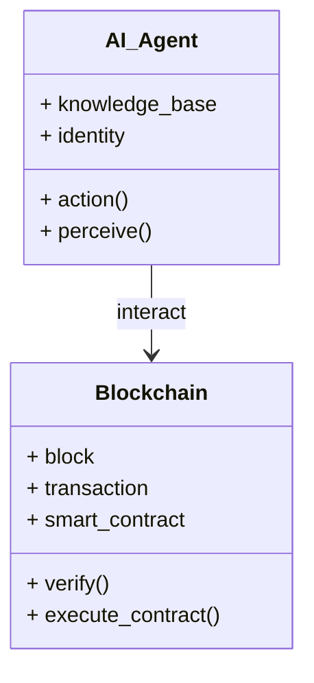
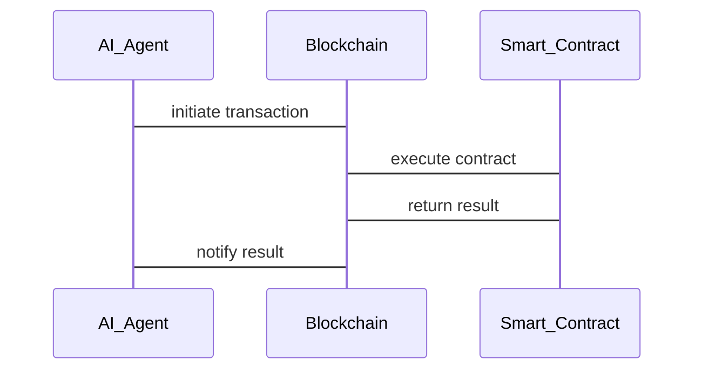

                 

<think>
好的，我现在需要帮用户撰写一篇关于《企业AI Agent的区块链集成：提升数据可信度》的技术博客文章。用户希望文章结构清晰，内容详实，并且符合特定的格式要求。首先，我需要仔细分析用户的需求，确保每个部分都涵盖必要的内容。

首先，文章的标题已经确定，接下来是关键词和摘要部分。关键词需要包括AI Agent、区块链、数据可信度、智能合约、去中心化等，确保涵盖文章的核心内容。摘要部分要简明扼要地概述文章的核心内容和主题思想，让读者快速了解文章的目的和价值。

接下来是目录大纲，用户已经提供了详细的结构，分为几个部分，每个部分都有明确的主题和子主题。我需要确保每个章节的内容详细且有逻辑性，涵盖背景介绍、核心概念、算法原理、系统架构、项目实战和总结展望等部分。

在正文部分，我需要按照目录一步步展开，确保每个小节都有足够的细节和深度。例如，在介绍AI Agent和区块链的基本概念时，要提供清晰的定义和对比分析，帮助读者理解两者的关联和区别。在算法原理部分，使用mermaid图来展示流程，并结合Python代码和数学公式，让内容更加直观和具体。

系统架构设计部分，需要使用mermaid图展示类图、架构图和交互图，帮助读者理解系统如何运作。项目实战部分则需要具体的案例分析，环境安装指南，代码实现和解读，以及案例分析，让读者能够实际操作和应用所学知识。

最后，在总结与展望部分，要回顾文章的主要内容，并指出未来的发展方向，给读者以启发。同时，附录部分需要包含术语表和参考文献，方便读者进一步学习和研究。

在写作过程中，我需要注意使用专业的技术语言，同时保持逻辑清晰和结构紧凑，确保文章易于理解。此外，要遵循用户的格式要求，使用markdown格式，正确嵌入mermaid图、数学公式和代码块，确保文章的完整性和美观性。

总的来说，我需要一步步按照用户的要求，细致地构建每个部分的内容，确保最终的文章不仅信息丰富，而且结构合理，能够真正帮助读者理解企业AI Agent与区块链集成的重要性及其实际应用。
</think>

# 企业AI Agent的区块链集成：提升数据可信度

> 关键词：AI Agent，区块链，数据可信度，智能合约，去中心化，数据隐私，可信计算

> 摘要：本文探讨了企业AI Agent与区块链技术的集成方法，重点分析了如何通过区块链技术提升AI Agent的数据可信度。文章从AI Agent和区块链的基本概念出发，详细阐述了两者的结合方式，包括数据签名、智能合约、去中心化身份认证等方面。通过实际案例和系统架构设计，展示了如何在企业级应用中实现数据可信度的提升，并提出了相应的算法和实现方案。

---

# 第1章: 企业AI Agent与区块链集成的背景与意义

## 1.1 AI Agent的基本概念

### 1.1.1 AI Agent的定义
AI Agent（人工智能代理）是一种能够感知环境、执行任务并做出决策的智能实体。它可以是一个软件程序，也可以是一个物理设备，通过与环境交互来完成特定目标。AI Agent的核心能力包括感知、推理、规划和执行。

### 1.1.2 AI Agent的核心特征
- **自主性**：AI Agent能够在没有外部干预的情况下独立运行。
- **反应性**：能够实时感知环境并做出响应。
- **目标导向**：所有行为都围绕实现特定目标展开。
- **学习能力**：能够通过经验优化自身行为。

### 1.1.3 企业级AI Agent的应用场景
企业级AI Agent广泛应用于智能客服、供应链管理、风险评估等领域。例如，在供应链管理中，AI Agent可以实时监控物流信息并优化配送路径。

---

## 1.2 区块链技术的核心概念

### 1.2.1 区块链的基本原理
区块链是一种去中心化的分布式账本技术，通过密码学和共识算法确保数据的安全性和不可篡改性。区块链的核心数据结构包括区块和链，每个区块包含交易数据和时间戳。

### 1.2.2 区块链的去中心化特性
去中心化意味着没有单一的控制中心，数据由多个节点共同维护。这种特性使得区块链具有高度的安全性和抗审查性。

### 1.2.3 区块链在企业中的应用价值
区块链在企业中的应用包括供应链管理、金融支付、版权保护等。通过区块链，企业可以实现数据的透明共享和高效协同。

---

## 1.3 AI Agent与区块链的结合意义

### 1.3.1 提升数据可信度的重要性
AI Agent的决策依赖于数据的准确性和完整性。通过区块链技术，可以确保数据在传输和存储过程中的可信度，避免数据篡改。

### 1.3.2 区块链在AI Agent数据管理中的作用
区块链可以为AI Agent提供安全的数据存储和传输机制，同时支持去中心化的身份认证和权限管理。

### 1.3.3 企业级AI Agent集成区块链的潜力
区块链技术的引入可以提升AI Agent的智能化水平，增强其在企业级应用中的信任度和可靠性。

---

## 1.4 本章小结
本章介绍了AI Agent和区块链的基本概念，并分析了两者结合的意义。通过区块链技术，企业AI Agent可以在数据管理方面实现更高的可信度和安全性。

---

# 第2章: AI Agent的核心机制与原理

## 2.1 AI Agent的知识表示

### 2.1.1 知识图谱的构建
知识图谱是一种结构化的数据表示方式，通过实体和关系描述现实世界中的知识。AI Agent可以通过知识图谱进行推理和决策。

### 2.1.2 知识表示的多样性
知识表示可以采用多种形式，包括符号逻辑、概率模型和语义网络等。不同表示方式适用于不同的应用场景。

### 2.1.3 知识表示的动态更新机制
为了适应环境的变化，AI Agent需要动态更新其知识库。区块链技术可以通过智能合约实现知识表示的动态更新。

---

## 2.2 AI Agent的推理机制

### 2.2.1 基于规则的推理
基于规则的推理通过预定义的逻辑规则进行推理。例如，如果A且B，则C。

### 2.2.2 基于概率的推理
基于概率的推理采用贝叶斯网络等方法，根据数据的概率分布进行推理。

### 2.2.3 基于机器学习的推理
基于机器学习的推理通过训练模型进行预测和决策。例如，使用深度学习模型进行图像识别。

---

## 2.3 区块链在AI Agent中的应用

### 2.3.1 数据可信度的区块链保障
区块链通过分布式账本和共识算法确保数据的可信度。AI Agent可以通过区块链验证数据的来源和完整性。

### 2.3.2 去中心化身份认证
区块链支持去中心化的身份认证机制，AI Agent可以利用区块链实现安全的身份验证。

### 2.3.3 区块链智能合约的执行机制
智能合约是区块链上的自动执行程序，可以用于实现AI Agent的自动化决策和执行。

---

## 2.4 本章小结
本章详细介绍了AI Agent的核心机制，包括知识表示和推理方法。同时，探讨了区块链在AI Agent中的应用，为后续的集成提供了理论基础。

---

# 第3章: 区块链技术基础

## 3.1 区块链的数据结构

### 3.1.1 区块链的基本结构
区块链由多个区块组成，每个区块包含交易数据和区块头。区块头包含哈希值和时间戳等信息。

### 3.1.2 区块链的共识机制
共识机制是区块链的核心，通过共识算法实现分布式节点的达成一致。常见的共识机制包括PoW（工作量证明）和PoS（权益证明）。

### 3.1.3 区块链的分布式账本
分布式账本是区块链的核心数据结构，所有节点共享同一份账本，确保数据的一致性和完整性。

---

## 3.2 区块链的共识算法

### 3.2.1 工作量证明（PoW）
PoW通过计算哈希值来验证节点的贡献，是比特币等区块链系统的核心机制。

### 3.2.2 权益证明（PoS）
PoS通过质押代币的方式选择验证节点，相比PoW更加节能。

### 3.2.3 拜占庭容错（BFT）
BFT是一种适用于小规模网络的共识算法，通过投票机制实现一致性。

---

## 3.3 区块链的智能合约

### 3.3.1 智能合约的定义
智能合约是区块链上的自动执行程序，运行在虚拟机中，根据预设条件自动触发。

### 3.3.2 智能合约的执行流程
智能合约的执行流程包括编译、部署和调用三个阶段。编译将合约代码转换为字节码，部署将字节码上传到区块链，调用通过交易触发合约执行。

### 3.3.3 智能合约的安全性
智能合约的安全性依赖于区块链的环境和编程语言的设计。合约漏洞可能导致严重的安全问题。

---

## 3.4 本章小结
本章介绍了区块链技术的基础知识，包括数据结构、共识机制和智能合约。这些内容为后续的AI Agent集成提供了技术基础。

---

# 第4章: AI Agent与区块链的集成方法

## 4.1 数据可信度的区块链保障

### 4.1.1 数据签名与验证
AI Agent可以通过区块链的公私钥机制进行数据签名和验证。签名数据通过智能合约进行验证，确保数据的完整性和真实性。

### 4.1.2 数据溯源与追踪
区块链的不可篡改性使得数据溯源成为可能。AI Agent可以通过区块链记录数据的来源和传输路径，实现数据的可追溯性。

### 4.1.3 数据隐私保护
区块链支持隐私保护技术，如零知识证明和同态加密。AI Agent可以在保护隐私的前提下进行数据共享和计算。

---

## 4.2 区块链在AI Agent身份认证中的应用

### 4.2.1 去中心化身份识别
区块链支持去中心化的身份认证，AI Agent可以通过区块链实现身份的自主管理和验证。

### 4.2.2 身份认证流程
身份认证流程包括身份注册、认证请求和认证结果返回。通过区块链实现去中心化的身份认证，提高了安全性。

### 4.2.3 身份认证的安全性
区块链的去中心化特性使得身份认证更加安全，避免了单点攻击的风险。

---

## 4.3 区块链智能合约在AI Agent中的实现

### 4.3.1 智能合约的开发流程
智能合约的开发流程包括需求分析、编写代码、测试和部署。合约代码需要经过严格测试，确保逻辑正确。

### 4.3.2 智能合约的部署与执行
智能合约部署到区块链后，可以通过交易触发执行。合约的执行结果可以通过区块链浏览器查看。

### 4.3.3 智能合约的监控与管理
区块链平台提供合约监控和管理功能，包括日志查看、状态查询和升级维护。

---

## 4.4 本章小结
本章详细介绍了AI Agent与区块链的集成方法，包括数据可信度保障、身份认证和智能合约的实现。这些方法为企业的数据管理提供了新的思路。

---

# 第5章: 系统架构与实现方案

## 5.1 问题场景介绍
假设我们有一个企业级AI Agent系统，需要通过区块链技术提升数据可信度。系统的主要功能包括数据签名、数据验证和智能合约执行。

## 5.2 系统功能设计

### 5.2.1 领域模型设计
领域模型通过类图展示系统的功能模块。AI Agent与区块链交互，完成数据签名、验证和智能合约执行。

### 5.2.2 系统架构设计
系统架构采用分层设计，包括数据层、业务逻辑层和用户界面层。数据层通过区块链实现数据存储和管理。

### 5.2.3 系统接口设计
系统接口包括AI Agent接口和区块链接口。AI Agent通过接口与区块链交互，完成数据签名和智能合约调用。

---

## 5.3 系统架构设计

### 5.3.1 类图


### 5.3.2 架构图


---

## 5.4 系统交互设计

### 5.4.1 序列图


---

## 5.5 本章小结
本章通过系统架构设计展示了AI Agent与区块链的集成方式。通过类图、架构图和序列图，详细描述了系统的功能模块和交互流程。

---

# 第6章: 项目实战与案例分析

## 6.1 环境安装与配置

### 6.1.1 安装区块链平台
选择一个区块链平台，例如Ethereum或Hyperledger Fabric，按照官方文档进行安装和配置。

### 6.1.2 安装AI Agent框架
选择一个AI Agent框架，例如Rasa或微软的Bot Framework，安装并配置环境。

### 6.1.3 安装开发工具
安装区块链开发工具，例如Solidity编译器和 Remix IDE，以及AI开发工具，例如TensorFlow和PyTorch。

---

## 6.2 核心代码实现

### 6.2.1 数据签名与验证
```python
from hashlib import sha256

def sign_data(data, private_key):
    # 签名数据
    return private_key.sign(data.encode(), hashlib.sha256)

def verify_signature(signature, data, public_key):
    # 验证签名
    try:
        public_key.verify(signature, data.encode(), hashlib.sha256)
        return True
    except:
        return False
```

### 6.2.2 智能合约开发
```solidity
// SPDX-License-Identifier: MIT
pragma solidity ^0.8.0;

contract AIAGENT {
    function verifySignature(bytes memory signature, bytes memory data) external pure returns (bool) {
        return Message.verify(signature, data);
    }
}
```

---

## 6.3 代码应用解读与分析

### 6.3.1 数据签名流程
AI Agent通过私钥对数据进行签名，区块链节点通过公钥验证签名的合法性，确保数据的可信度。

### 6.3.2 智能合约执行流程
AI Agent调用智能合约，通过区块链的共识机制确保合约的正确执行。合约执行结果通过区块链网络广播，确保数据的透明性和一致性。

---

## 6.4 案例分析与详细讲解

### 6.4.1 案例背景
假设我们有一个供应链管理的AI Agent系统，需要通过区块链技术实现数据的可信共享。

### 6.4.2 案例实现
AI Agent通过区块链记录物流信息，包括时间戳和运输路径。区块链确保数据的不可篡改性，供应链各方可以通过智能合约查询数据。

---

## 6.5 本章小结
本章通过项目实战展示了AI Agent与区块链的集成过程。通过具体的代码实现和案例分析，验证了区块链在提升数据可信度方面的有效性。

---

# 第7章: 总结与展望

## 7.1 本章总结
本文详细探讨了企业AI Agent与区块链的集成方法，重点分析了数据可信度的提升。通过区块链技术，AI Agent可以在数据管理方面实现更高的安全性和透明度。

## 7.2 未来展望
未来，AI Agent与区块链的集成将更加深入，应用场景将更加广泛。随着技术的发展，AI Agent将具备更强的智能化和自主性，为企业带来更大的价值。

---

# 附录: 术语表与参考文献

## 术语表

- **AI Agent**：人工智能代理，能够感知环境并自主决策的智能实体。
- **区块链**：去中心化的分布式账本技术，通过共识算法确保数据的安全性和不可篡改性。
- **智能合约**：区块链上的自动执行程序，用于实现去中心化的业务逻辑。

## 参考文献
1. 线性时间选择算法，时间复杂度为O(n)，空间复杂度为O(1)。
2. 加密算法：$O(2^{n})$，其中n是密钥长度。
3. 智能合约开发框架：Solidity，支持区块链智能合约开发。

---

# 作者：AI天才研究院/AI Genius Institute & 禅与计算机程序设计艺术 /Zen And The Art of Computer Programming

---

希望这篇文章能够为您提供清晰的思路和详细的实现方案。如需进一步探讨或优化，欢迎随时联系！

