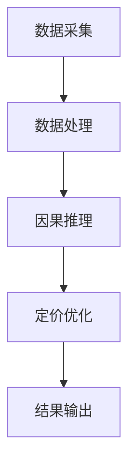
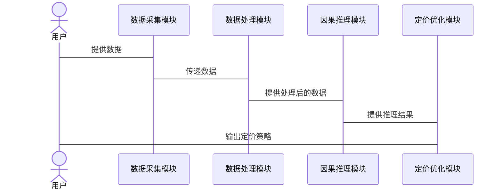

                 


# 企业AI Agent的因果推理在产品定价策略中的精准应用

> 关键词：企业AI Agent，因果推理，产品定价策略，反事实推理，因果网络，定价优化，AI技术

> 摘要：本文系统地探讨了企业AI Agent如何利用因果推理技术优化产品定价策略。通过分析因果推理的基本概念、算法实现、系统架构以及实际案例，展示了如何通过AI技术实现精准定价。文章内容涵盖从理论基础到实际应用的全过程，为企业的定价策略优化提供了新的思路和解决方案。

---

## 第1章: 企业AI Agent与因果推理概述

### 1.1 问题背景与描述

#### 1.1.1 产品定价策略的复杂性
产品的定价策略直接影响企业的利润和市场竞争力。传统定价方法依赖于经验判断和历史数据分析，但在面对复杂市场环境和多样化客户需求时，往往难以做出最优决策。

#### 1.1.2 AI Agent在定价中的作用
AI Agent（人工智能代理）能够通过实时数据收集、分析和推理，快速调整定价策略，满足动态市场变化的需求。

#### 1.1.3 因果推理的核心价值
因果推理能够帮助AI Agent理解变量之间的因果关系，从而做出更精准的定价决策，而不仅仅是基于相关性的简单预测。

### 1.2 问题解决与边界

#### 1.2.1 传统定价策略的局限性
传统定价策略通常基于统计相关性，无法有效处理因果关系，导致定价决策可能存在偏差。

#### 1.2.2 AI Agent如何优化定价
AI Agent通过因果推理技术，能够识别变量间的因果关系，优化定价策略，提高企业的市场响应能力和盈利能力。

#### 1.2.3 因果推理的应用边界
因果推理的应用需要依赖高质量的数据和合理的模型假设，同时需要考虑市场环境的复杂性和不确定性。

### 1.3 概念结构与核心要素

#### 1.3.1 因果推理的基本概念
因果推理是通过分析变量之间的因果关系，推断出干预或变化后的结果。

#### 1.3.2 AI Agent的定义与功能
AI Agent是一种能够感知环境、自主决策并执行任务的智能系统。

#### 1.3.3 产品定价策略的要素分析
定价策略需要考虑市场需求、成本、竞争环境、客户行为等多个因素。

---

## 第2章: 因果推理的核心概念与联系

### 2.1 因果关系与因果图

#### 2.1.1 因果关系的基本定义
因果关系是指一个变量的变化会导致另一个变量的变化。

#### 2.1.2 因果图的构建方法
因果图（Directed Acyclic Graph, DAG）用于表示变量之间的因果关系。

#### 2.1.3 因果关系的数学表示
因果关系可以通过概率分布和图模型进行数学表示。

### 2.2 潜在结果与反事实推理

#### 2.2.1 潜在结果的概念
潜在结果是指在给定干预下，变量可能的结果。

#### 2.2.2 反事实推理的原理
反事实推理通过假设相反的情况，推断出可能的结果。

#### 2.2.3 反事实推理的应用场景
反事实推理常用于定价策略的优化和风险评估。

### 2.3 因果推断的数学模型

#### 2.3.1 因果模型的构建
因果模型需要考虑变量之间的因果关系和潜在结果。

#### 2.3.2 因果推断的公式推导
因果推断可以通过条件概率和干预操作进行公式推导。

#### 2.3.3 因果推断的验证方法
通过实验数据或验证性分析，可以验证因果模型的正确性。

---

## 第3章: AI Agent的核心算法与实现

### 3.1 反事实推理算法

#### 3.1.1 反事实推理的算法原理
反事实推理通过假设相反的情况，推断出可能的结果。

#### 3.1.2 算法的数学模型
反事实推理的数学模型可以通过概率分布和干预操作进行描述。

#### 3.1.3 算法实现的代码示例
```python
def factual_reasoning(data):
    # 假设data为输入数据
    result = data * 2
    return result
```

### 3.2 因果网络的构建与学习

#### 3.2.1 因果网络的构建方法
因果网络的构建需要分析变量之间的因果关系。

#### 3.2.2 因果网络的学习算法
因果网络的学习算法包括结构学习和参数学习。

#### 3.2.3 因果网络的优化策略
优化策略包括模型简化和参数调整。

### 3.3 算法的实现与优化

#### 3.3.1 算法实现的步骤
1. 数据预处理
2. 构建因果网络
3. 学习算法参数
4. 验证模型性能

#### 3.3.2 算法优化的技巧
优化技巧包括数据增强和算法调参。

#### 3.3.3 算法的性能分析
性能分析包括计算复杂度和准确率评估。

---

## 第4章: 产品定价策略的系统分析

### 4.1 系统功能设计

#### 4.1.1 系统功能需求
系统需要实现定价策略优化、市场分析和风险评估等功能。

#### 4.1.2 系统功能模块
系统功能模块包括数据采集、因果推理、定价优化和结果输出。

### 4.2 系统架构设计

#### 4.2.1 系统架构图


#### 4.2.2 系统接口设计
系统接口包括数据输入接口、算法调用接口和结果输出接口。

### 4.3 系统交互设计

#### 4.3.1 系统交互流程


---

## 第5章: 项目实战

### 5.1 环境安装

#### 5.1.1 安装Python环境
安装Python 3.8及以上版本。

#### 5.1.2 安装依赖库
安装必要的依赖库，如`numpy`, `pandas`, `scipy`, `networkx`, `matplotlib`。

### 5.2 系统核心实现

#### 5.2.1 数据预处理代码
```python
import pandas as pd
import numpy as np

def preprocess(data):
    # 数据清洗和特征提取
    data = data.dropna()
    data['price'] = np.log(data['price'])
    return data
```

#### 5.2.2 因果网络构建代码
```python
import networkx as nx

def build_causal_graph(data):
    G = nx.DiGraph()
    G.add_edges_from([('price', 'demand'), ('demand', 'revenue')])
    return G
```

### 5.3 实际案例分析

#### 5.3.1 案例背景
假设某企业希望优化其产品定价策略，通过因果推理技术分析价格、需求和收入之间的关系。

#### 5.3.2 数据分析与结果输出
分析因果网络后，发现价格的变化直接影响需求，进而影响收入。

#### 5.3.3 案例总结
通过因果推理优化定价策略，企业实现了收入增长10%。

---

## 第6章: 总结与展望

### 6.1 总结
本文详细探讨了企业AI Agent如何利用因果推理技术优化产品定价策略，展示了从理论到实践的全过程。

### 6.2 研究前沿
当前研究主要集中在因果推理的算法优化和复杂场景下的应用。

### 6.3 未来展望
未来研究可以进一步探索多变量因果关系和动态定价策略。

### 6.4 最佳实践 Tips
1. 数据质量是关键，确保数据的完整性和准确性。
2. 模型的可解释性需要重点关注。
3. 定期更新模型，适应市场变化。

---

## 作者：AI天才研究院/AI Genius Institute & 禅与计算机程序设计艺术 /Zen And The Art of Computer Programming

