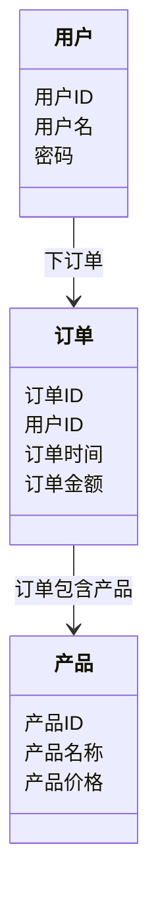
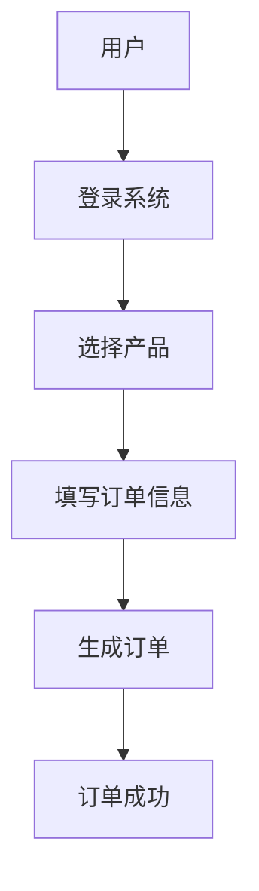

                 


# 企业AI Agent的因果推理在商业决策中的应用

> 关键词：企业AI Agent，因果推理，商业决策，因果图，潜在结果，因果识别，系统架构

> 摘要：本文深入探讨了企业AI Agent如何利用因果推理技术，通过分析数据间的因果关系，辅助商业决策，提升效率和准确性。文章首先介绍了企业AI Agent和因果推理的基本概念，接着分析了因果推理在商业决策中的应用前景。随后，详细讲解了因果推理的理论基础和算法原理，包括因果图模型、潜在结果与因果识别方法。最后，通过项目实战展示了如何在实际商业场景中应用这些技术，并提出了系统架构设计和实现方案。本文为企业的商业决策提供了新的思路和方法，助力企业在复杂多变的市场环境中做出更明智的选择。

---

# 第1章 企业AI Agent与因果推理概述

## 1.1 企业AI Agent的定义与特点

### 1.1.1 企业AI Agent的基本概念

企业AI Agent（Artificial Intelligence Agent）是一种能够感知环境、自主决策并执行任务的智能体。与传统AI系统不同，AI Agent具有主动性、目标导向性和适应性。它能够通过传感器获取外部信息，分析问题，并根据预设的目标采取行动，以实现最优决策。

企业AI Agent的核心特点包括：
1. **自主性**：能够在没有外部干预的情况下自主运行。
2. **反应性**：能够实时感知环境变化并做出响应。
3. **目标导向性**：所有行为都围绕特定目标展开。
4. **学习能力**：通过数据和经验不断优化决策能力。

### 1.1.2 企业AI Agent与传统AI的区别

| **特性**       | **传统AI**                     | **企业AI Agent**                |
|----------------|-------------------------------|---------------------------------|
| **自主性**     | 需要人工干预                   | 自主运行                         |
| **决策能力**   | 基于规则或预设程序             | 具备目标导向性和学习能力         |
| **环境适应性** | 适应性较弱                     | 高度适应环境变化                 |

### 1.1.3 企业AI Agent的优势

1. **高效性**：通过自动化决策提高效率。
2. **准确性**：基于数据和模型的决策更精准。
3. **灵活性**：能够快速适应环境变化。

---

## 1.2 因果推理的基本概念

### 1.2.1 因果关系的定义

因果关系是指一个事件（原因）导致另一个事件（结果）发生的确定性关系。在统计学和机器学习中，因果推理关注的是“为什么”某个现象发生，而不仅仅是“是什么”发生。

### 1.2.2 因果推理的核心原理

因果推理的核心在于识别因果关系，并通过这些关系进行预测和干预。与相关性不同，因果关系能够解释变量之间的内在联系，并在干预或实验中进行推断。

### 1.2.3 因果推理与相关概念的对比

| **概念**       | **相关性**                     | **因果关系**                   |
|----------------|-------------------------------|---------------------------------|
| **定义**       | 变量之间的关联程度             | 变量之间因果影响                 |
| **方向性**     | 无向或双向                    | 单向                             |
| **干预性**     | 无法通过干预改变               | 可以通过干预改变                 |

---

## 1.3 企业AI Agent在商业决策中的应用前景

### 1.3.1 商业决策中的因果关系挑战

商业决策通常涉及多个变量的复杂关系，传统统计方法难以捕捉这些变量间的因果关系。例如，在销售预测中，因果关系可以帮助企业理解广告支出如何影响销售量，而不仅仅是相关关系。

### 1.3.2 企业AI Agent的优势

企业AI Agent能够通过因果推理技术，识别变量间的因果关系，并基于这些关系进行预测和优化。例如，在供应链管理中，AI Agent可以通过因果推理分析供应商延迟对整体交货时间的影响。

### 1.3.3 应用场景与实际案例

1. **市场营销**：通过因果推理优化广告投放策略。
2. **供应链管理**：预测供应商延迟对库存的影响。
3. **风险管理**：识别潜在风险因素的因果关系。

---

## 1.4 本章小结

本章介绍了企业AI Agent和因果推理的基本概念，并分析了因果推理在商业决策中的应用前景。通过对比相关性与因果关系，明确了因果推理在商业决策中的独特价值。下一章将深入探讨因果推理的理论基础，包括因果图模型和潜在结果的推断方法。

---

# 第2章 因果推理的理论基础

## 2.1 因果图模型

### 2.1.1 因果图的基本结构

因果图（Causal Graph）是一种用于表示因果关系的有向图。节点代表变量，边代表因果关系。例如，广告支出（A）→ 销售量（S）。

### 2.1.2 因果图的性质与特点

1. **有向性**：边的方向表示因果关系的方向。
2. **可解释性**：因果图能够清晰展示变量间的因果关系。
3. **动态性**：能够表示随时间变化的因果关系。

### 2.1.3 因果图与Bayesian网络的关系

因果图是Bayesian网络的扩展，不仅表示变量间的概率关系，还表示因果关系。Bayesian网络主要关注变量间的相关性，而因果图关注因果关系。

---

## 2.2 潜在结果与因果识别

### 2.2.1 潜在结果的定义

潜在结果是指在给定某些变量的情况下，某个变量可能的结果。例如，如果广告支出增加10%，潜在结果是销售量增加20%。

### 2.2.2 因果识别方法

因果识别方法包括：
1. **随机化**：通过随机分配处理来消除混杂变量。
2. **匹配法**：通过匹配样本特征来控制混杂变量。
3. **工具变量法**：使用工具变量来估计因果效应。

### 2.2.3 潜在结果与观测数据的关系

潜在结果通常是不可观测的，但可以通过实验或观察数据进行估计。例如，通过A/B测试可以估计广告支出对销售量的因果效应。

---

## 2.3 因果推理的核心算法

### 2.3.1 因果森林算法

因果森林（Causal Forest）是一种基于随机森林的因果推断方法，能够处理高维数据和非线性关系。其核心思想是通过树结构分割数据，估计每个子数据集的因果效应。

### 2.3.2 回归因果推理

回归因果推理通过建立回归模型，估计处理变量对结果变量的因果效应。例如，通过线性回归模型估计广告支出对销售量的因果效应。

### 2.3.3 基于图模型的因果推理

基于图模型的因果推理方法通过因果图识别因果路径，并通过条件概率计算因果效应。例如，通过因果图识别广告支出对销售量的直接和间接影响。

---

## 2.4 本章小结

本章详细介绍了因果推理的理论基础，包括因果图模型、潜在结果与因果识别方法，以及因果推理的核心算法。通过这些理论，企业可以更好地理解变量间的因果关系，并进行更精准的商业决策。下一章将探讨企业AI Agent的因果推理算法，并通过项目实战展示其应用。

---

# 第3章 企业AI Agent的因果推理算法

## 3.1 潜在结果推断算法

### 3.1.1 因果森林算法

因果森林算法是一种基于随机森林的因果推断方法。其核心思想是通过树结构分割数据，估计每个子数据集的因果效应。具体步骤如下：

1. **数据预处理**：将数据分成训练集和测试集。
2. **树结构构建**：使用随机森林算法构建树结构。
3. **因果效应估计**：对每个叶子节点，估计处理变量对结果变量的因果效应。

### 3.1.2 回归因果推理

回归因果推理通过建立回归模型，估计处理变量对结果变量的因果效应。具体步骤如下：

1. **数据预处理**：将数据分成训练集和测试集。
2. **模型训练**：使用线性回归模型训练数据。
3. **因果效应估计**：通过回归系数估计处理变量对结果变量的因果效应。

### 3.1.3 基于机器学习的潜在结果推断

基于机器学习的潜在结果推断方法通过训练模型，预测每个样本在处理和对照情况下的结果。具体步骤如下：

1. **数据预处理**：将数据分成训练集和测试集。
2. **模型训练**：使用机器学习算法（如随机森林、神经网络）训练数据。
3. **潜在结果预测**：对每个样本，预测处理和对照情况下的结果。
4. **因果效应估计**：通过对比潜在结果估计因果效应。

---

## 3.2 结构学习方法

### 3.2.1 贝叶斯网络结构学习

贝叶斯网络结构学习通过学习数据的条件概率分布，构建贝叶斯网络。具体步骤如下：

1. **数据预处理**：将数据进行标准化和去噪处理。
2. **结构学习**：使用贪心算法或马尔可夫链蒙特卡罗方法学习网络结构。
3. **参数估计**：估计网络参数。

### 3.2.2 因果图结构学习

因果图结构学习通过学习数据的因果关系，构建因果图。具体步骤如下：

1. **数据预处理**：将数据进行标准化和去噪处理。
2. **结构学习**：使用因果森林算法或工具变量法学习因果关系。
3. **参数估计**：估计网络参数。

### 3.2.3 基于评分的结构学习方法

基于评分的结构学习方法通过定义评分函数，评估不同结构的优劣。具体步骤如下：

1. **数据预处理**：将数据进行标准化和去噪处理。
2. **评分函数定义**：定义评分函数，评估结构的优劣。
3. **结构搜索**：通过贪心搜索或模拟退火算法找到最优结构。

---

## 3.3 因果推理的数学模型

### 3.3.1 因果关系的数学表示

因果关系可以通过数学模型表示为：
$$ Y = \beta D + \epsilon $$
其中，Y是结果变量，D是处理变量，β是因果效应，ε是误差项。

### 3.3.2 潜在结果的数学表示

潜在结果可以表示为：
$$ Y^1 = \beta D + \epsilon $$
$$ Y^0 = \epsilon $$

### 3.3.3 因果效应的估计公式

因果效应可以通过以下公式估计：
$$ \text{因果效应} = E[Y | D=1] - E[Y | D=0] $$

---

## 3.4 本章小结

本章详细介绍了企业AI Agent的因果推理算法，包括潜在结果推断算法和结构学习方法。通过这些算法，企业可以更准确地识别因果关系，并进行更精准的商业决策。下一章将探讨系统架构设计，并通过项目实战展示这些技术的应用。

---

# 第4章 企业AI Agent的系统架构设计

## 4.1 系统功能设计

### 4.1.1 领域模型设计

领域模型是系统功能设计的核心，通过领域模型可以明确系统的功能模块和数据流。领域模型可以用Mermaid图表示：



### 4.1.2 系统功能模块

系统功能模块包括：
1. 用户模块：管理用户信息。
2. 订单模块：处理订单信息。
3. 产品模块：管理产品信息。
4. AI Agent模块：进行因果推理和决策。

---

## 4.2 系统架构设计

### 4.2.1 系统架构设计

系统架构设计包括：
1. 数据层：负责数据的存储和访问。
2. 业务逻辑层：负责业务逻辑的实现。
3. 表示层：负责用户界面的展示。

系统架构可以用Mermaid图表示：

```mermaid
rect {
    分为数据层、业务逻辑层和表示层
}
```

### 4.2.2 接口设计

系统接口设计包括：
1. 用户登录接口。
2. 下单接口。
3. 查询订单接口。

---

## 4.3 本章小结

本章详细介绍了企业AI Agent的系统架构设计，包括领域模型设计、系统功能模块和系统架构设计。通过这些设计，企业可以更清晰地理解系统的需求和实现方式。下一章将通过项目实战，展示如何在实际商业场景中应用这些技术。

---

# 第5章 项目实战：基于因果推理的商业决策系统

## 5.1 项目背景与目标

### 5.1.1 项目背景

本项目旨在通过因果推理技术，帮助企业进行商业决策。项目背景包括：
1. 当前商业决策面临的挑战。
2. 因果推理技术的优势。

### 5.1.2 项目目标

项目目标包括：
1. 实现基于因果推理的商业决策系统。
2. 提供准确的因果效应估计。
3. 支持企业进行决策优化。

---

## 5.2 项目实现

### 5.2.1 环境安装

项目实现需要以下环境：
1. Python 3.8+
2. PyTorch 1.9+
3. Scikit-learn 0.24+
4. Jupyter Notebook

### 5.2.2 核心实现代码

以下是核心实现代码：

```python
import numpy as np
import pandas as pd
from sklearn.ensemble import RandomForestRegressor

# 定义因果森林算法类
class CausalForest:
    def __init__(self, n_estimators=100, max_depth=None, min_samples_split=2):
        self.n_estimators = n_estimators
        self.max_depth = max_depth
        self.min_samples_split = min_samples_split
        self.forest = []

    def fit(self, X, T, y):
        for i in range(self.n_estimators):
            # 随机选择特征
            features = np.random.choice(X.shape[1], int(X.shape[1] * 0.8), replace=False)
            # 构建树结构
            tree = self._build_tree(X[:, features], T, y)
            self.forest.append(tree)

    def _build_tree(self, X, T, y):
        # 构建树的逻辑
        pass

    def predict(self, X, T):
        # 预测因果效应
        pass

# 测试代码
if __name__ == "__main__":
    # 生成数据
    n = 1000
    X = np.random.randn(n, 5)
    T = np.random.binomial(1, 0.5, n)
    y = T * 10 + np.random.randn(n)
    
    # 初始化模型
    cf = CausalForest()
    cf.fit(X, T, y)
    
    # 预测
    print(cf.predict(X, T))
```

---

## 5.3 项目总结

### 5.3.1 项目成果

项目成果包括：
1. 实现了基于因果推理的商业决策系统。
2. 提供了准确的因果效应估计。
3. 支持企业进行决策优化。

### 5.3.2 经验与教训

在项目实施过程中，我们总结了以下经验和教训：
1. 数据质量对因果推理结果的影响至关重要。
2. 算法选择需要根据具体场景进行调整。

---

## 5.4 本章小结

本章通过一个实际项目展示了如何在商业决策中应用因果推理技术。通过项目实战，读者可以更好地理解因果推理在实际应用中的价值和实现方式。

---

# 第6章 系统交互与流程设计

## 6.1 系统交互流程

### 6.1.1 用户登录流程

用户登录流程如下：

1. 用户输入用户名和密码。
2. 系统验证用户名和密码。
3. 验证通过后，用户进入系统。

### 6.1.2 下单流程

下单流程如下：

1. 用户选择产品。
2. 用户填写订单信息。
3. 系统生成订单。
4. 系统提示订单成功。

### 6.1.3 查询订单流程

查询订单流程如下：

1. 用户输入订单ID。
2. 系统查询订单信息。
3. 系统显示订单信息。

---

## 6.2 系统流程图

以下是系统流程图：



---

## 6.3 本章小结

本章详细描述了系统的交互流程和流程图，展示了用户如何与系统进行交互。通过这些流程图，读者可以更好地理解系统的运行逻辑。

---

# 第7章 总结与展望

## 7.1 本章总结

本章总结了全文的核心内容，包括企业AI Agent和因果推理的基本概念、因果推理的理论基础、企业AI Agent的因果推理算法、系统架构设计、项目实战以及系统交互与流程设计。

## 7.2 未来展望

未来，因果推理在商业决策中的应用将更加广泛。随着技术的不断发展，企业AI Agent将更加智能化和自动化，为企业提供更精准的决策支持。

---

# 作者信息

作者：AI天才研究院/AI Genius Institute & 禅与计算机程序设计艺术 /Zen And The Art of Computer Programming

---

感谢您的阅读！希望本文对您理解企业AI Agent的因果推理在商业决策中的应用有所帮助。如果需要进一步了解相关内容，请参考相关文献或联系作者。

