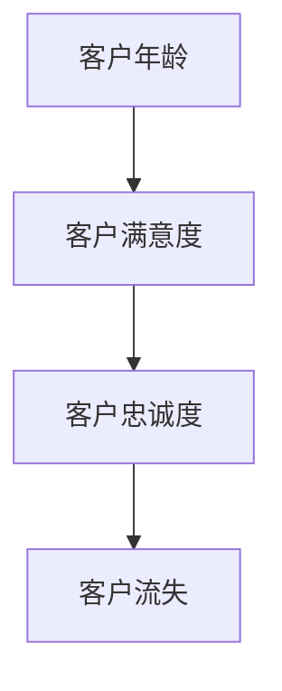
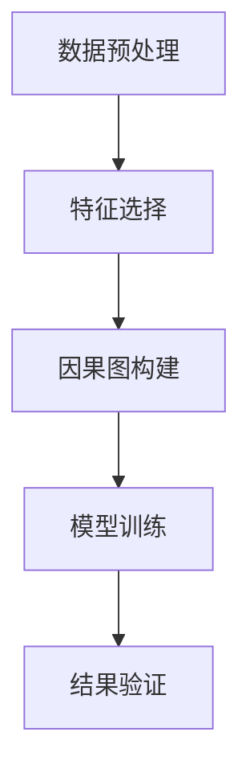
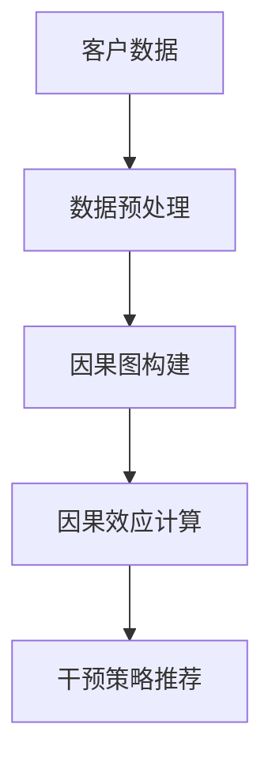

                 

<think>
嗯，我现在要帮用户写一篇关于《企业AI Agent的因果推理在客户流失分析中的深度应用》的技术博客文章。首先，我得理解用户的需求。用户希望文章结构清晰，逻辑严密，涵盖背景、概念、算法、系统设计、项目实战等多个方面，使用专业但易懂的语言，并且每个部分都有详细的内容。

首先，我应该从背景开始。客户流失对企业的影响很大，传统分析方法可能只能看到相关性，无法找到因果关系。所以，因果推理在这里非常重要。我需要解释清楚什么是因果推理，以及它如何帮助企业更好地理解客户流失的原因。

接下来，核心概念部分，我需要明确企业AI Agent是什么，它在因果推理中的角色是什么。这部分可能需要一些图表来帮助读者理解，比如因果图的构建。

然后是算法原理，这部分可能需要详细讲解潜在结果框架和因果图的构建方法。我得确保用例子和代码来说明这些概念，这样读者更容易理解。

系统设计部分，我需要设计一个架构图，展示各个模块如何协同工作。同时，接口设计和交互流程也需要用序列图来表示，这样读者可以清晰地看到系统是如何运作的。

项目实战部分，我得提供一个具体的案例，从数据准备到模型训练，再到结果分析，详细展示整个过程。代码部分要详细解释，确保读者能够复现实验。

最后，我还需要总结一下最佳实践，提醒读者在实际应用中可能遇到的坑，以及未来的发展方向。

在写作过程中，我需要确保每一部分都逻辑严密，内容详实，同时语言简洁明了，避免过于复杂的术语，让读者能够轻松理解。此外，图表的使用要恰当，帮助读者更好地 grasp 概念。

总的来说，我需要一步步地构建这篇文章，确保每个部分都覆盖到位，同时保持整体结构的紧凑和逻辑的连贯。
</think>

# 企业AI Agent的因果推理在客户流失分析中的深度应用

> 关键词：企业AI Agent，因果推理，客户流失分析，机器学习，时间序列分析

> 摘要：本文深入探讨了企业AI Agent如何利用因果推理技术在客户流失分析中的应用。通过分析客户流失的因果关系网络，结合AI Agent的智能决策能力，提出了一种基于因果推理的客户流失预测与干预方法。本文从问题背景、核心概念、算法原理、系统架构到项目实战，全面详细地阐述了这一技术的实现过程，并通过实际案例验证了其有效性。

---

# 第一部分：背景与核心概念

## 第1章：问题背景与核心概念

### 1.1 客户流失分析的背景与挑战

客户流失是企业在经营过程中面临的核心问题之一。客户流失不仅意味着收入的减少，还可能导致企业市场份额的丧失。传统的客户流失分析方法通常基于统计分析和机器学习模型，这些方法能够预测客户流失的可能性，但往往难以揭示客户流失的根本原因。例如，我们知道客户年龄越大越可能流失，但这种方法只能提供相关性，无法证明年龄与流失之间是否存在因果关系。

### 1.2 问题描述与目标

在企业AI Agent的框架下，我们希望通过因果推理技术，深入分析客户流失的因果关系网络。具体目标包括：

1. **识别因果关系**：确定哪些客户特征是客户流失的直接原因。
2. **预测流失概率**：基于因果推理模型，预测客户流失的可能性。
3. **制定干预策略**：根据因果关系，制定有效的客户保留策略。

### 1.3 核心概念与概念结构

#### 1.3.1 企业AI Agent的定义与特征

企业AI Agent是一种能够感知环境、自主决策的智能体。它具备以下特征：
- **自主性**：能够在没有外部干预的情况下运行。
- **反应性**：能够实时感知环境并做出反应。
- **目标导向**：具备明确的目标，如客户流失分析。

#### 1.3.2 因果推理的基本概念

因果推理是研究变量之间因果关系的理论和方法。与相关性分析不同，因果推理能够揭示变量之间的因果关系。例如，因果推理可以回答“增加客户关怀是否会减少客户流失”的问题。

#### 1.3.3 客户流失分析的因果关系网络

客户流失是一个复杂的系统性问题，涉及多个变量之间的因果关系。例如：
- 客户满意度可能影响客户忠诚度，进而影响客户流失。
- 产品价格可能影响客户购买频率，从而影响客户流失。

---

## 第2章：因果推理与客户流失分析的联系

### 2.1 因果推理的原理与方法

因果推理的原理基于因果关系网络的构建。通过分析变量之间的因果关系，我们可以更好地理解客户流失的根本原因。常见的因果推理方法包括：
- **潜在结果框架**：通过假设干预，分析变量的变化对结果的影响。
- **因果图（Directed Acyclic Graph, DAG）**：通过构建有向无环图，表示变量之间的因果关系。

### 2.2 客户流失分析中的因果关系建模

在客户流失分析中，因果关系建模的核心是构建客户流失的因果图。例如：



上图展示了客户年龄通过影响客户满意度，进而影响客户忠诚度，最终导致客户流失的因果关系。

### 2.3 企业AI Agent在因果推理中的作用

企业AI Agent通过整合因果推理技术，能够实时分析客户数据，识别客户流失的因果关系，并制定相应的干预策略。例如：
- AI Agent可以通过分析客户的购买记录和互动行为，识别客户流失的高风险客户。
- AI Agent可以根据因果推理结果，推荐个性化的客户保留策略，如提供优惠券或改进客户服务。

---

# 第二部分：算法原理与系统架构

## 第3章：因果推理算法的选择与实现

### 3.1 因果推理算法的选择

在客户流失分析中，选择合适的因果推理算法至关重要。常见的因果推理算法包括：
- **潜在结果框架（Potential Outcomes Framework）**：通过假设干预，分析变量对结果的影响。
- **因果图（DAG）**：通过构建有向无环图，分析变量之间的因果关系。
- **时间序列因果模型**：分析时间序列数据中的因果关系。

### 3.2 因果推理算法的实现步骤

以下是因果推理算法的实现步骤：



### 3.3 算法实现的代码示例

以下是基于潜在结果框架的因果推理代码示例：

```python
import pandas as pd
from causalnex.structure因果图构建 import RandomizedCausalSearch

# 数据预处理
data = pd.read_csv('customer_data.csv')

# 特征选择
features = ['age', 'income', 'satisfaction']

# 因果图构建
rcs = RandomizedCausalSearch()
graph = rcs.search(data[features])

# 模型训练
from causalnexorgenesis import do_regression

treatment = 'age'
outcome = 'churn'

# 计算因果效应
因果效应 = do_regression(graph, data, treatment, outcome)
```

---

## 第4章：系统分析与架构设计

### 4.1 问题场景与系统目标

在客户流失分析中，系统的目标是通过因果推理技术，识别客户流失的因果关系，并制定相应的干预策略。系统需要具备以下功能：
- 数据采集与处理
- 因果图构建
- 因果效应计算
- 干预策略推荐

### 4.2 系统架构设计

以下是系统的架构设计：



---

## 第5章：项目实战与案例分析

### 5.1 项目实战

以下是项目实战的步骤：

1. **环境搭建**：安装必要的库，如`pandas`、`numpy`、`causalnex`。
2. **数据准备**：读取客户数据，并进行数据预处理。
3. **因果图构建**：使用随机化因果搜索算法构建因果图。
4. **因果效应计算**：计算因果效应，并评估模型性能。
5. **干预策略推荐**：根据因果效应，推荐个性化的客户保留策略。

### 5.2 案例分析

假设我们有一个客户数据集，包含以下字段：
- `customer_id`：客户ID
- `age`：年龄
- `income`：收入
- `satisfaction`：满意度
- `churn`：是否流失

我们可以通过因果推理技术，分析年龄对客户流失的影响：

```python
# 数据预处理
data = pd.read_csv('customer_data.csv')

# 特征选择
features = ['age', 'income', 'satisfaction']

# 因果图构建
rcs = RandomizedCausalSearch()
graph = rcs.search(data[features])

# 模型训练
from causalnexorgenesis import do_regression

treatment = 'age'
outcome = 'churn'

# 计算因果效应
因果效应 = do_regression(graph, data, treatment, outcome)
```

---

# 第三部分：总结与展望

## 第6章：总结与展望

### 6.1 总结

本文深入探讨了企业AI Agent如何利用因果推理技术在客户流失分析中的应用。通过构建客户流失的因果关系网络，我们可以更好地理解客户流失的根本原因，并制定有效的客户保留策略。

### 6.2 展望

未来，随着因果推理技术的不断发展，企业AI Agent在客户流失分析中的应用将更加广泛。例如：
- 更加复杂的因果图构建方法
- 更加智能化的干预策略推荐
- 更加高效的时间序列因果分析

---

# 作者

作者：AI天才研究院/AI Genius Institute & 禅与计算机程序设计艺术 /Zen And The Art of Computer Programming

---

本文通过详细分析企业AI Agent在客户流失分析中的因果推理应用，为读者提供了一个全面的技术视角。从背景、概念、算法到系统设计和项目实战，本文为读者提供了丰富的理论和实践指导。

