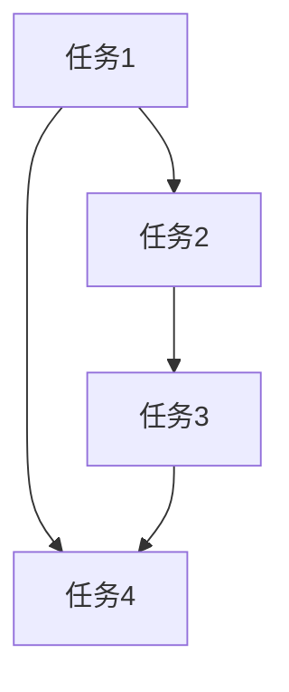
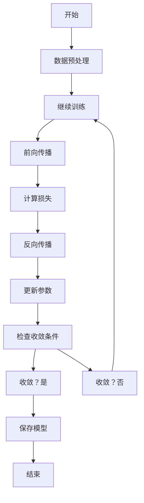
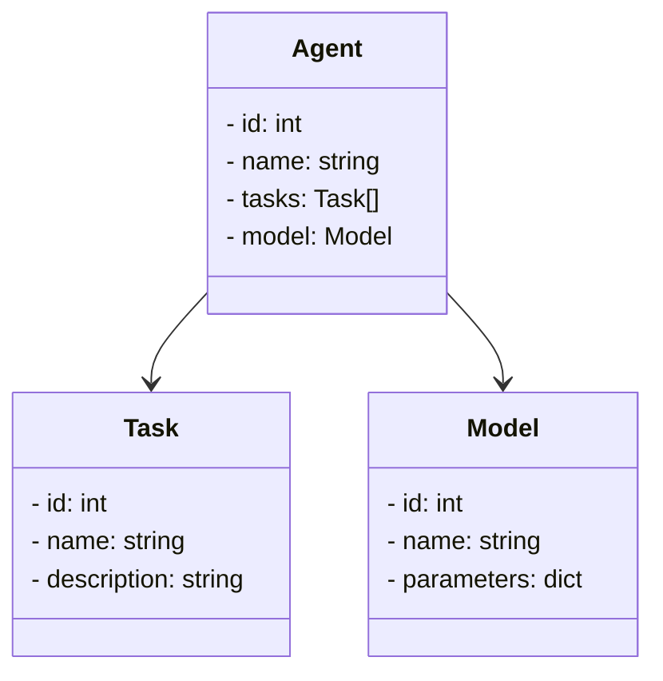
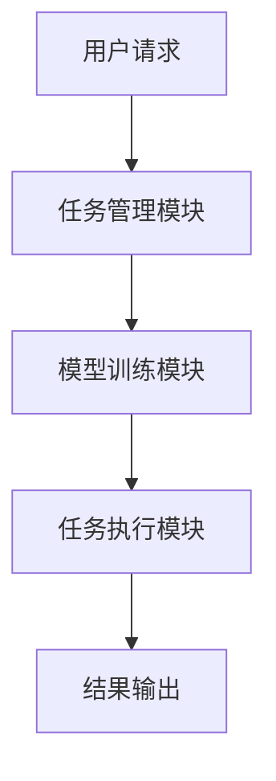
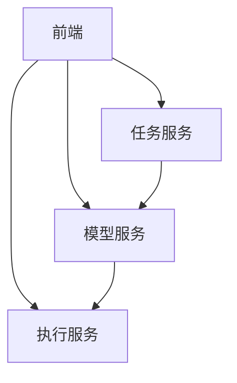
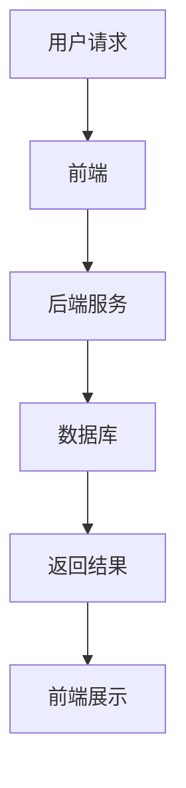

                 


# 企业AI Agent的多任务学习框架：提升模型通用性与效率

## 关键词：企业AI Agent，多任务学习，模型通用性，效率优化，系统架构设计，算法实现，人工智能

## 摘要：本文将深入探讨企业AI Agent的多任务学习框架，分析其核心概念、算法原理、系统架构设计及实际应用。通过详细讲解多任务学习的原理与实现，结合实际案例，展示如何通过多任务学习提升AI Agent的模型通用性和运行效率，为企业的智能化转型提供有力支持。

---

## 第一部分：企业AI Agent的背景与挑战

### 第1章：企业AI Agent的背景与挑战

#### 1.1 企业AI Agent的定义与特点

##### 1.1.1 什么是企业AI Agent
企业AI Agent（Artificial Intelligence Agent）是指在企业环境中，通过人工智能技术实现特定任务的智能体。它能够理解上下文、执行操作并做出决策，以辅助或替代人类完成复杂任务。

##### 1.1.2 AI Agent的核心特点
- **自主性**：能够在没有外部干预的情况下独立运行。
- **反应性**：能够实时感知环境并做出相应反应。
- **目标导向**：具备明确的目标，并通过行为优化来实现这些目标。
- **学习能力**：能够通过数据和经验不断优化自身的性能。

##### 1.1.3 企业AI Agent的应用场景
- **客户支持**：通过自然语言处理技术为用户提供24/7的在线支持。
- **流程自动化**：自动处理企业中的重复性任务，如订单处理、数据录入等。
- **决策支持**：基于数据分析提供业务决策建议。
- **风险管理**：实时监控企业运营中的潜在风险并提出解决方案。

#### 1.2 多任务学习的必要性

##### 1.2.1 单任务学习的局限性
传统的单任务学习模型只能在单一任务上表现良好，无法应对企业环境中复杂的多任务场景，导致资源浪费和效率低下。

##### 1.2.2 多任务学习的优势
多任务学习（Multi-Task Learning, MTL）通过共享多个任务的特征表示，能够在多个任务之间实现知识迁移，提升模型的泛化能力和训练效率。

##### 1.2.3 企业场景中多任务学习的应用
- **客户服务与营销**：在同一平台上同时处理客户咨询和营销推荐任务。
- **数据分析与预测**：在同一个模型中同时进行数据清洗、特征提取和预测建模。
- **流程优化与监控**：同时监控多个业务流程并提出优化建议。

#### 1.3 企业AI Agent的挑战与机遇

##### 1.3.1 企业AI Agent的挑战
- **任务多样性和复杂性**：企业环境中任务种类繁多，且任务之间可能存在冲突或不一致。
- **数据稀疏性**：某些任务可能数据量较少，导致模型难以有效学习。
- **模型泛化能力**：如何在多个任务之间找到平衡，避免某一任务的表现下降。

##### 1.3.2 多任务学习在企业中的机遇
- **提升模型效率**：通过共享参数减少模型训练的计算资源消耗。
- **增强模型通用性**：通过跨任务学习提升模型的泛化能力。
- **降低开发成本**：一次训练多个任务，减少重复开发的工作量。

##### 1.3.3 未来发展趋势
随着人工智能技术的不断进步，企业AI Agent的多任务学习框架将更加智能化和高效化，应用场景也将更加广泛。

---

### 第2章：多任务学习框架的核心概念与联系

#### 2.1 多任务学习的基本原理

##### 2.1.1 多任务学习的定义
多任务学习是指在同一模型中同时学习多个相关任务，通过共享参数或特征表示，提升模型的泛化能力和训练效率。

##### 2.1.2 多任务学习的核心要素
- **任务相关性**：任务之间的关联程度直接影响多任务学习的效果。
- **参数共享机制**：通过共享参数实现任务间的知识迁移。
- **损失函数设计**：合理设计损失函数以平衡多个任务的学习目标。

##### 2.1.3 多任务学习的分类与对比
| 分类标准 | 任务类型 | 任务共享方式 | 示例 |
|----------|----------|--------------|------|
| 是否共享参数 | 参数共享 | 共享参数 | 多任务神经网络 |
| 是否共享权重 | 权重共享 | 权重共享 | 基于注意力机制的多任务模型 |

---

#### 2.2 多任务学习框架的实体关系图

##### 2.2.1 实体关系图的构建


##### 2.2.2 任务之间的关系分析
- **任务之间的关系**：任务1与任务2、任务3之间存在直接或间接的关系。
- **任务之间的依赖性**：任务4依赖于任务1和任务3的结果。

##### 2.2.3 框架的可扩展性设计
通过模块化设计，使得框架能够方便地扩展新的任务。

---

#### 2.3 多任务学习的数学模型与公式

##### 2.3.1 基本公式推导
假设我们有多个任务，每个任务的损失函数为$L_i$，则多任务学习的总损失函数可以表示为：
$$
L = \sum_{i=1}^{n} \lambda_i L_i
$$
其中，$\lambda_i$是任务$i$的权重系数。

##### 2.3.2 任务间权重分配的数学模型
$$
\lambda_i = \frac{1}{1 + e^{-\alpha i}}
$$
其中，$\alpha$是调节参数，用于控制任务权重的衰减程度。

##### 2.3.3 案例分析与公式应用
通过案例分析，展示如何根据任务的重要性调整权重系数，以达到最优的多任务学习效果。

---

### 第3章：多任务学习算法的原理与实现

#### 3.1 多任务学习算法的流程图



#### 3.2 多任务学习的Python实现

##### 3.2.1 环境安装与配置
```bash
pip install numpy matplotlib tensorflow
```

##### 3.2.2 核心算法代码实现
```python
import numpy as np
import tensorflow as tf

# 定义多任务模型
class MultiTaskModel(tf.keras.Model):
    def __init__(self, output_dims):
        super(MultiTaskModel, self).__init__()
        self.shared_layer = tf.keras.layers.Dense(64, activation='relu')
        self.task_layers = [tf.keras.layers.Dense(dim, name=f'task_{i}') for i, dim in enumerate(output_dims)]
    
    def call(self, inputs):
        x = self.shared_layer(inputs)
        outputs = []
        for task_layer in self.task_layers:
            outputs.append(task_layer(x))
        return outputs

# 模型训练
def train_model(model, optimizer, loss_fn, epochs=100):
    for epoch in range(epochs):
        for batch_x, batch_y in dataloader:
            with tf.GradientTape() as tape:
                outputs = model(batch_x)
                loss = sum([loss_fn(y_true, y_pred) for y_true, y_pred in zip(batch_y, outputs)])
            gradients = tape.gradient(loss, model.trainable_variables)
            optimizer.apply_gradients(zip(gradients, model.trainable_variables))
```

##### 3.2.3 代码解读与优化建议
- **共享层设计**：通过共享层提取特征，减少参数数量。
- **任务特定层**：每个任务都有独立的输出层，避免任务间干扰。
- **损失函数计算**：将多个任务的损失函数相加，权重可以根据任务重要性调整。

#### 3.3 多任务学习的数学模型与公式

##### 3.3.1 任务间权重分配的数学模型
$$
\lambda_i = \frac{e^{\beta i}}{\sum_{j=1}^{n} e^{\beta j}}
$$
其中，$\beta$是调节参数，用于控制任务权重的分布。

##### 3.3.2 参数共享机制的数学推导
通过矩阵分解的方法，将多个任务的参数表示为共享矩阵的不同行或列。

##### 3.3.3 案例分析与公式应用
通过具体案例，展示如何根据任务权重调整公式，优化模型性能。

---

### 第4章：企业AI Agent的系统分析与架构设计

#### 4.1 系统功能设计

##### 4.1.1 领域模型设计


##### 4.1.2 功能模块划分
- **任务管理模块**：负责任务的创建、修改和删除。
- **模型训练模块**：负责模型的训练和优化。
- **任务执行模块**：负责任务的实际执行和结果输出。

##### 4.1.3 系统功能流程图


#### 4.2 系统架构设计

##### 4.2.1 模块化架构设计
- **前端**：负责用户交互和请求处理。
- **后端**：负责任务管理、模型训练和结果返回。
- **数据库**：负责存储任务和模型的相关信息。

##### 4.2.2 微服务架构设计
- **任务服务**：负责任务的创建、管理和监控。
- **模型服务**：负责模型的训练和部署。
- **执行服务**：负责任务的实际执行和结果输出。

##### 4.2.3 系统架构图展示


#### 4.3 系统接口设计

##### 4.3.1 接口定义与规范
- **任务创建接口**：`POST /tasks`
- **任务执行接口**：`POST /execute`
- **结果查询接口**：`GET /results`

##### 4.3.2 接口交互流程图


---

## 第五章：项目实战

### 5.1 环境安装与配置

```bash
pip install numpy pandas scikit-learn tensorflow
```

### 5.2 核心算法实现

#### 5.2.1 任务管理模块实现
```python
class TaskManager:
    def __init__(self):
        self.tasks = []
    
    def add_task(self, task):
        self.tasks.append(task)
    
    def remove_task(self, task_id):
        for task in self.tasks:
            if task.id == task_id:
                self.tasks.remove(task)
                break
```

#### 5.2.2 模型训练模块实现
```python
class ModelTrainer:
    def __init__(self, model):
        self.model = model
    
    def train(self, data, epochs=100):
        for epoch in range(epochs):
            for batch_x, batch_y in data:
                with tf.GradientTape() as tape:
                    outputs = self.model(batch_x)
                    loss = sum([loss_fn(y_true, y_pred) for y_true, y_pred in zip(batch_y, outputs)])
                gradients = tape.gradient(loss, self.model.trainable_variables)
                optimizer.apply_gradients(zip(gradients, self.model.trainable_variables))
```

#### 5.2.3 任务执行模块实现
```python
class TaskExecutor:
    def __init__(self, model):
        self.model = model
    
    def execute_task(self, task, input_data):
        outputs = self.model(input_data)
        return outputs[task.index]
```

### 5.3 项目小结

通过实际项目的实现，我们可以看到多任务学习在企业AI Agent中的巨大潜力。通过合理的系统架构设计和算法实现，可以显著提升模型的通用性和效率，为企业智能化转型提供有力支持。

---

## 结语

企业AI Agent的多任务学习框架是一个复杂而有趣的研究领域。通过本文的详细讲解，我们希望能够帮助读者更好地理解多任务学习的原理和应用，并为企业在实际应用中提供有价值的参考。

---

## 作者

作者：AI天才研究院 & 禅与计算机程序设计艺术

