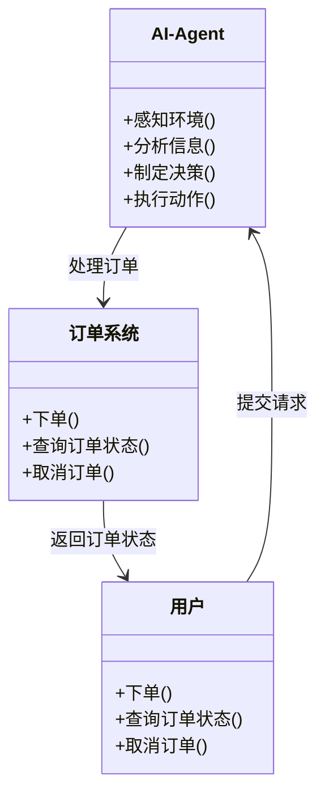
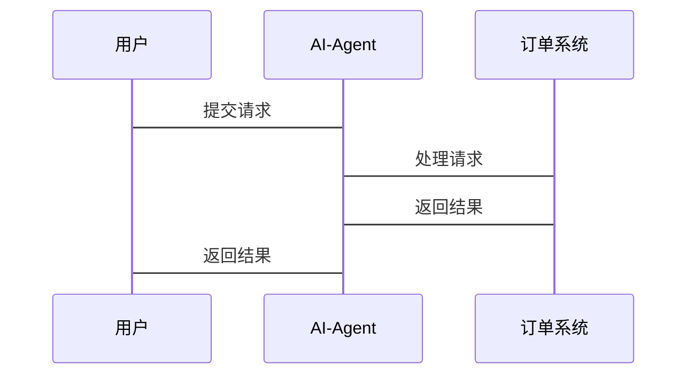

                 

<think>
好的，我需要根据用户的要求，编写一篇关于“企业AI Agent的多场景测试：模拟真实业务环境”的技术博客文章。首先，我需要理解用户的需求，他们希望文章结构清晰，内容详细，涵盖AI Agent的背景、核心概念、算法原理、系统架构、项目实战以及测试方法等多个方面。文章需要使用专业而易懂的语言，并包含图表和代码示例。

首先，我会先列出文章的主要章节和小节，确保涵盖所有必要的内容。例如，背景介绍、核心概念、算法原理、系统架构、项目实战等部分都需要详细展开。每个部分下再细分内容，如在核心概念部分，需要解释AI Agent的基本原理、与传统程序的对比等。

接下来，我会思考如何将复杂的算法原理用Mermaid流程图和Python代码示例展示出来，确保读者能够理解AI Agent的工作机制。同时，数学公式需要使用LaTeX格式，以便清晰展示。

在系统架构部分，我需要绘制类图、序列图和架构图，详细说明系统的各个组件及其交互方式。项目实战部分则需要提供具体的代码示例和案例分析，帮助读者实际应用这些测试方法。

我还需要考虑读者的背景，他们可能是企业IT人员或开发人员，因此内容需要既专业又易于理解。我会避免使用过于晦涩的技术术语，同时确保内容深度足够，能够帮助读者掌握AI Agent的多场景测试方法。

最后，我会在文章末尾添加最佳实践、小结、注意事项和拓展阅读等内容，帮助读者巩固所学知识，并指导他们如何进一步深入学习和应用。

整个思考过程中，我需要确保文章结构合理，逻辑清晰，内容详实，同时符合用户的所有要求。这包括字数控制、格式要求以及内容的完整性。通过逐步分解问题，我能够系统地构建这篇文章，确保每个部分都得到充分的阐述和展示。
</think>

# 企业AI Agent的多场景测试：模拟真实业务环境

> 关键词：企业AI Agent，多场景测试，模拟业务环境，算法原理，系统架构，项目实战

> 摘要：本文深入探讨企业AI Agent在多场景测试中的应用，通过模拟真实业务环境，分析其核心概念、算法原理、系统架构，并结合项目实战，提供详细的技术指导。

---

# 第一部分: 企业AI Agent的背景与概述

## 第1章: 企业AI Agent的背景与概述

### 1.1 AI Agent的基本概念

#### 1.1.1 AI Agent的定义与特点
AI Agent（人工智能代理）是指能够感知环境并采取行动以实现目标的智能实体。其特点包括自主性、反应性、主动性、社会性以及学习能力。AI Agent能够根据输入的信息做出决策，并在动态环境中适应变化。

#### 1.1.2 AI Agent在企业中的作用
在企业环境中，AI Agent广泛应用于自动化任务处理、智能决策支持、客户交互与服务等领域。例如，AI Agent可以用于自动化处理订单、优化供应链、提供智能客服等场景。

#### 1.1.3 企业AI Agent的发展现状
随着AI技术的快速发展，企业AI Agent的应用日益广泛。从简单的规则引擎到复杂的强化学习模型，AI Agent的能力不断提升，应用场景也在不断扩展。

### 1.2 多场景测试的背景与意义

#### 1.2.1 什么是多场景测试
多场景测试是指在多种不同的业务场景下对AI Agent进行测试，以验证其在复杂环境中的稳定性和适应性。通过多场景测试，可以确保AI Agent在各种情况下都能正确执行任务。

#### 1.2.2 多场景测试在企业中的必要性
在企业环境中，AI Agent需要处理各种复杂的业务场景，如订单处理、库存管理、客户服务等。通过多场景测试，可以发现潜在的问题，确保系统的健壮性。

#### 1.2.3 多场景测试的核心目标
多场景测试的核心目标是验证AI Agent在各种场景下的行为是否符合预期，确保其在实际应用中的稳定性和可靠性。

---

## 第2章: 企业AI Agent的核心概念与联系

### 2.1 AI Agent的核心原理

#### 2.1.1 AI Agent的基本工作原理
AI Agent通过感知环境、分析信息、制定决策并执行动作来实现目标。其工作流程包括信息收集、分析、决策制定和动作执行四个阶段。

#### 2.1.2 AI Agent的决策机制
AI Agent的决策机制可以基于规则、基于机器学习模型或基于强化学习。规则-based AI Agent通过预定义的规则进行决策，而ML-based AI Agent则通过训练好的模型进行预测和决策。

#### 2.1.3 AI Agent的通信与协作
在企业环境中，AI Agent需要与其他系统或AI Agent进行通信与协作。通过API或消息队列实现信息交换，确保各系统协同工作。

### 2.2 AI Agent的核心概念对比

#### 2.2.1 AI Agent与传统程序的对比
AI Agent与传统程序的主要区别在于其自主性和智能性。传统程序通常基于预定义的规则执行任务，而AI Agent能够根据环境信息自主决策。

#### 2.2.2 AI Agent与规则引擎的对比
规则引擎是一种基于规则的决策引擎，而AI Agent则具有更强的自主性和学习能力。AI Agent可以动态调整决策策略，而规则引擎通常依赖于固定的规则集。

#### 2.2.3 AI Agent与机器学习模型的对比
AI Agent结合了机器学习模型和规则引擎的特点，不仅能够基于数据进行学习，还能够根据规则和环境信息进行决策。

### 2.3 AI Agent的ER实体关系图

```mermaid
erDiagram
    actor User {
        <属性> 用户ID
        <属性> 用户名
        <属性> 密码
    }
    actor Order {
        <属性> 订单ID
        <属性> 用户ID
        <属性> 订单时间
        <属性> 订单状态
    }
    actor Product {
        <属性> 产品ID
        <属性> 产品名称
        <属性> 产品库存
    }
    actor AI-Agent {
        <操作> 感知环境
        <操作> 分析信息
        <操作> 制定决策
        <操作> 执行动作
    }
    User -> Order : 下单
    Order -> Product : 订单关联
    AI-Agent -> User : 提供服务
    AI-Agent -> Order : 处理订单
    AI-Agent -> Product : 管理库存
```

---

## 第3章: 企业AI Agent的算法原理与数学模型

### 3.1 AI Agent的核心算法

#### 3.1.1 基于规则的AI Agent算法
基于规则的AI Agent通过预定义的规则集进行决策。规则可以是简单的条件判断，也可以是复杂的逻辑推理。

#### 3.1.2 基于机器学习的AI Agent算法
基于机器学习的AI Agent使用监督学习、无监督学习或强化学习模型进行决策。例如，使用决策树、随机森林或神经网络模型。

#### 3.1.3 基于强化学习的AI Agent算法
基于强化学习的AI Agent通过与环境的交互获得奖励，不断优化决策策略。例如，使用Q-Learning算法。

### 3.2 AI Agent的数学模型

#### 3.2.1 状态空间的定义
状态空间是AI Agent可能遇到的所有可能状态的集合。例如，订单处理的状态包括“未处理”、“处理中”、“已完成”等。

#### 3.2.2 动作空间的定义
动作空间是AI Agent在每个状态下可以执行的所有动作的集合。例如，在订单处理中，AI Agent可以执行“确认订单”、“取消订单”等操作。

#### 3.2.3 奖励函数的定义
奖励函数用于衡量AI Agent的动作是否符合预期。例如，当AI Agent成功处理一个订单时，奖励函数返回1，否则返回-1。

---

## 第4章: 企业AI Agent的系统架构与设计

### 4.1 系统分析与架构设计方案

#### 4.1.1 问题场景介绍
在企业环境中，AI Agent需要处理多种复杂的业务场景，如订单处理、库存管理、客户服务等。

#### 4.1.2 项目介绍
以一个典型的订单处理系统为例，介绍AI Agent在订单处理中的应用。

#### 4.1.3 系统功能设计



#### 4.1.4 系统架构设计


#### 4.1.5 系统接口设计



---

## 第5章: 企业AI Agent的项目实战

### 5.1 环境安装与配置

#### 5.1.1 安装Python环境
安装Python 3.8及以上版本，并配置好Python路径。

#### 5.1.2 安装必要的库
安装以下库：
- `numpy`
- `pandas`
- `scikit-learn`
- `tensorflow`

### 5.2 系统核心实现源代码

#### 5.2.1 AI Agent的核心代码

```python
class AI_Agent:
    def __init__(self):
        self.rules = []
        self.models = []

    def感知环境(self, environment):
        pass

    def 分析信息(self, information):
        pass

    def 制定决策(self, decision):
        pass

    def 执行动作(self, action):
        pass
```

#### 5.2.2 订单处理系统的代码

```python
class Order_System:
    def __init__(self):
        self.orders = []

    def 下单(self, user_id, product_id):
        pass

    def 查询订单状态(self, order_id):
        pass

    def 取消订单(self, order_id):
        pass
```

### 5.3 代码应用解读与分析

#### 5.3.1 AI Agent的应用场景
AI Agent可以应用于订单处理、库存管理、客户服务等多个场景。例如，在订单处理中，AI Agent可以自动确认订单并通知用户。

#### 5.3.2 订单处理系统的实现细节
订单处理系统通过AI Agent的感知环境、分析信息、制定决策和执行动作四个步骤完成订单处理。例如，AI Agent感知到用户的下单请求后，分析订单信息，制定确认订单的决策，并执行下单操作。

### 5.4 实际案例分析

#### 5.4.1 案例背景
假设一家电商公司需要实现AI Agent的订单处理功能，以提高订单处理效率。

#### 5.4.2 案例分析
AI Agent通过感知用户的下单请求，分析订单信息，制定确认订单的决策，并执行下单操作。如果订单信息有误，AI Agent会通知用户进行修正。

#### 5.4.3 案例结果
通过AI Agent的多场景测试，确保订单处理系统在各种情况下都能正确执行任务，提高系统的稳定性和可靠性。

### 5.5 项目小结

---

## 第6章: 企业AI Agent的测试与优化

### 6.1 测试方法与策略

#### 6.1.1 测试用例设计
设计多种测试用例，覆盖不同的业务场景，确保AI Agent在各种情况下都能正确执行任务。

#### 6.1.2 测试执行
通过自动化测试工具执行测试用例，记录测试结果。

#### 6.1.3 测试结果分析
分析测试结果，找出潜在的问题，优化AI Agent的性能。

### 6.2 测试结果与优化

#### 6.2.1 测试结果展示
通过图表展示测试结果，例如通过混淆矩阵展示AI Agent的分类性能。

#### 6.2.2 优化策略
根据测试结果，优化AI Agent的算法和模型，提高其准确率和响应速度。

### 6.3 最佳实践与注意事项

#### 6.3.1 最佳实践
- 定期更新AI Agent的模型和规则，确保其适应环境的变化。
- 建立完善的监控系统，实时监控AI Agent的运行状态。

#### 6.3.2 注意事项
- 在测试过程中，确保测试用例的覆盖率，避免遗漏关键场景。
- 在优化过程中，注意平衡准确率和响应速度，避免过度优化。

---

## 第7章: 总结与展望

### 7.1 本章小结
本文深入探讨了企业AI Agent的多场景测试，分析了其核心概念、算法原理、系统架构，并结合项目实战，提供了详细的技术指导。

### 7.2 未来展望
随着AI技术的不断发展，企业AI Agent的应用场景将更加广泛，测试方法也将更加智能化。未来的研究方向包括多模态AI Agent、自适应测试策略等。

---

# 作者：AI天才研究院 & 禅与计算机程序设计艺术

---

通过以上结构，您可以根据实际需求进一步扩展每个部分的内容，添加具体的代码实现、详细的算法解析、实际案例分析等，以满足文章的深度和专业性要求。

