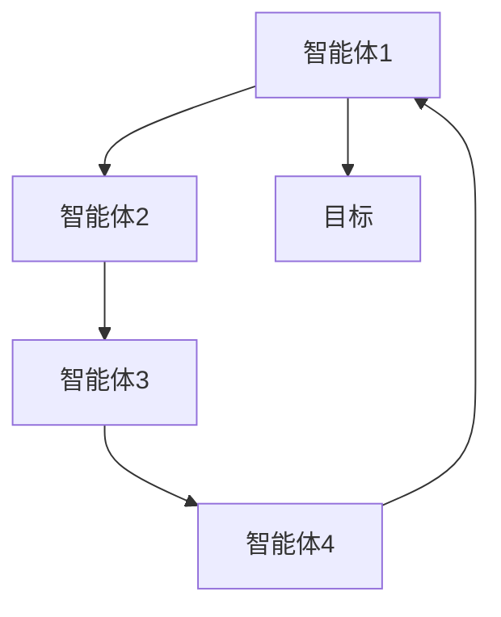
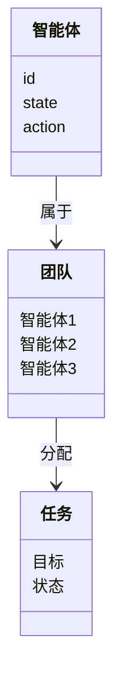
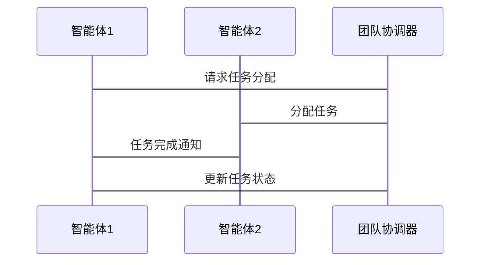

                 

<think>
嗯，用户希望我撰写一篇关于《企业AI Agent的多智能体系统在团队协作中的应用》的技术博客文章。首先，我需要理解用户的需求。他是一位资深的技术专家，可能在寻找深入的技术分析，同时希望文章结构清晰，逻辑严谨。

接下来，我注意到用户提供了详细的要求，包括目录结构、关键词、摘要以及具体的章节内容。我需要确保文章符合这些要求，特别是每个章节都要有详细的分析，包括背景、概念、算法、系统设计和实战案例。

我应该从背景介绍开始，解释AI Agent和多智能体系统的基本概念，然后逐步深入讨论它们的原理和应用场景。在算法部分，使用mermaid图来说明协作流程，同时提供数学公式和代码示例，这样读者可以更好地理解和应用这些技术。

另外，用户强调了系统架构设计的重要性，我需要详细讲解分层设计、通信机制和扩展性设计，可能用mermaid图来展示架构图。最后，通过实际案例分析，展示如何在企业中部署和优化AI Agent系统，确保文章内容丰富，结构紧凑。

最后，我需要总结全文，并展望未来的发展趋势，为读者提供有价值的见解。整体上，我要确保文章既专业又易懂，满足技术专家的需求。
</think>

# 企业AI Agent的多智能体系统在团队协作中的应用

---

## 关键词：
- AI Agent
- 多智能体系统
- 团队协作
- 企业应用
- 智能协作
- 分布式计算

---

## 摘要：
本文深入探讨了企业AI Agent的多智能体系统在团队协作中的应用，从背景、核心概念、算法原理到系统架构设计，再到实战案例，全面解析了多智能体系统如何提升企业团队协作效率。通过详细的技术分析和实际应用示例，本文为读者提供了从理论到实践的完整指南，帮助企业在数字化转型中更好地利用AI技术优化协作流程。

---

# 第1章: 企业AI Agent与多智能体系统概述

## 1.1 企业AI Agent的背景与意义

### 1.1.1 从传统协作到智能协作的演进
企业的团队协作经历了从简单的人际协作到复杂的系统协作的演进。传统的团队协作依赖于人工沟通和任务分配，效率较低且容易出错。随着AI技术的发展，企业开始引入AI Agent（智能体）来自动化处理协作任务，从而提高效率和准确性。

### 1.1.2 AI Agent的核心概念与特点
AI Agent是一种能够感知环境、执行任务并做出决策的智能实体。它具有以下特点：
- **自主性**：能够独立执行任务。
- **反应性**：能够实时感知环境并做出反应。
- **协作性**：能够与其他智能体或人类协同工作。
- **学习能力**：能够通过数据和经验不断优化自身行为。

### 1.1.3 多智能体系统在企业协作中的价值
多智能体系统（Multi-Agent System, MAS）是由多个智能体组成的系统，能够在复杂的环境中协同完成任务。在企业协作中，多智能体系统可以帮助企业实现以下目标：
- **提高效率**：通过自动化处理重复性任务。
- **增强决策能力**：通过智能体的协作提供更优的决策支持。
- **提升灵活性**：能够快速适应环境变化。

---

## 1.2 多智能体系统的基本概念

### 1.2.1 多智能体系统的定义
多智能体系统是由多个智能体组成的分布式系统，这些智能体通过通信和协作完成共同的目标。每个智能体都有自己的目标和行为，但通过协同工作实现整体目标。

### 1.2.2 多智能体系统与单智能体系统的区别
| 特性 | 单智能体系统 | 多智能体系统 |
|------|--------------|--------------|
| 独立性 | 单一智能体独立完成任务 | 多个智能体协作完成任务 |
| 效率 | 取决于单个智能体的能力 | 通过协作提高整体效率 |
| 复杂性 | 系统简单，易于管理 | 系统复杂，需要协调多个智能体 |

### 1.2.3 多智能体系统的特点与应用场景
多智能体系统的特点包括：
- **分布式计算**：智能体之间通过分布式计算实现协作。
- **动态协作**：智能体能够根据环境变化动态调整协作方式。
- **容错性**：即使部分智能体失效，系统仍能完成任务。

多智能体系统适用于以下场景：
- **任务分配**：将任务分配给最适合的智能体完成。
- **信息共享**：智能体之间共享信息以提高决策能力。
- **复杂问题求解**：通过协作解决单个智能体无法完成的复杂问题。

---

## 1.3 本章小结
本章介绍了AI Agent和多智能体系统的基本概念及其在企业协作中的应用价值。通过对比单智能体系统和多智能体系统的区别，进一步明确了多智能体系统在提升企业协作效率和灵活性方面的优势。

---

# 第2章: AI Agent的核心概念与原理

## 2.1 AI Agent的核心概念

### 2.1.1 AI Agent的定义与分类
AI Agent是一种能够感知环境、执行任务并做出决策的智能实体。根据功能和应用场景的不同，AI Agent可以分为以下几类：
- **基于规则的智能体**：根据预定义的规则执行任务。
- **基于任务的智能体**：根据任务目标动态调整行为。
- **基于学习的智能体**：通过机器学习算法不断优化行为。

### 2.1.2 AI Agent的核心属性
AI Agent的核心属性包括：
- **感知能力**：能够感知环境状态。
- **推理能力**：能够根据感知信息做出推理。
- **决策能力**：能够基于推理结果做出决策。
- **执行能力**：能够执行决策结果。

### 2.1.3 AI Agent的工作流程
AI Agent的工作流程可以分为以下几个步骤：
1. **感知环境**：通过传感器或API获取环境信息。
2. **推理与决策**：基于感知信息进行推理并做出决策。
3. **执行任务**：根据决策结果执行任务。
4. **反馈与优化**：根据执行结果优化自身行为。

---

## 2.2 多智能体系统的工作原理

### 2.2.1 多智能体系统的基本组成
多智能体系统由以下几个部分组成：
- **智能体**：能够独立完成任务的个体。
- **通信机制**：智能体之间进行信息交换的通道。
- **协作机制**：智能体之间协作完成共同目标的方式。
- **环境**：智能体所处的外部环境。

### 2.2.2 多智能体系统的通信协议
多智能体系统中的通信协议是智能体之间协作的关键。常见的通信协议包括：
- **基于消息的通信**：智能体通过发送消息进行协作。
- **基于订阅-发布模型的通信**：智能体通过订阅特定主题来接收信息。

### 2.2.3 多智能体系统的协作模型
多智能体系统的协作模型包括以下几种：
- **协商模型**：智能体通过协商决定任务分配。
- **分布式规划模型**：智能体通过分布式规划完成任务。
- **基于角色的协作模型**：智能体根据角色分配任务。

---

## 2.3 本章小结
本章详细介绍了AI Agent的核心概念和多智能体系统的工作原理。通过分析AI Agent的工作流程和多智能体系统的组成，进一步理解了多智能体系统在企业协作中的技术基础。

---

# 第3章: 多智能体系统的算法原理

## 3.1 多智能体系统的算法原理

### 3.1.1 分布式计算与协作算法
分布式计算是多智能体系统的核心算法之一。常见的分布式计算算法包括：
- **MapReduce**：用于分布式数据处理。
- **分布式一致性算法**：用于保证分布式系统的一致性。

### 3.1.2 基于博弈论的决策算法
基于博弈论的决策算法是多智能体系统中的重要算法，常见的包括：
- **纳什均衡**：用于分析多个智能体之间的博弈关系。
- **极大极小算法**：用于优化智能体的决策过程。

### 3.1.3 联合推理与规划算法
联合推理与规划算法是多智能体系统中用于协作决策的核心算法，常见的包括：
- **联合推理算法**：用于多个智能体之间的信息共享和推理。
- **分布式规划算法**：用于多个智能体之间的任务分配和规划。

---

## 3.2 多智能体系统协作流程图


---

## 3.3 本章小结
本章详细介绍了多智能体系统的算法原理，包括分布式计算、博弈论决策和联合推理与规划算法。通过流程图展示了多智能体系统的协作流程，进一步理解了多智能体系统在技术实现上的复杂性和挑战。

---

# 第4章: 团队协作的建模与分析

## 4.1 团队协作的领域模型
### 4.1.1 领域模型的构建
领域模型是团队协作分析的基础，通过构建领域模型可以更好地理解协作过程中的关键要素。以下是一个团队协作的领域模型示例：



### 4.1.2 用例分析
通过用例分析可以更好地理解团队协作中的关键场景。以下是一个用例分析示例：



---

## 4.2 团队协作的数学模型与公式
### 4.2.1 团队协作的数学模型
团队协作的数学模型可以通过以下公式表示：

$$
\text{团队效率} = \sum_{i=1}^{n} \text{智能体效率}_i
$$

其中，$\text{智能体效率}_i$ 表示第i个智能体的效率。

### 4.2.2 协作任务分配的优化模型
协作任务分配的优化模型可以通过以下公式表示：

$$
\max \sum_{i=1}^{n} \text{任务价值}_i
$$

其中，$\text{任务价值}_i$ 表示第i个任务的价值。

---

## 4.3 本章小结
本章通过领域模型和用例分析，详细介绍了团队协作的建模与分析方法。通过数学模型和公式，进一步理解了团队协作中的关键要素和优化目标。

---

# 第5章: 系统架构设计与实现

## 5.1 系统架构设计

### 5.1.1 系统架构的分层设计
多智能体系统的架构通常采用分层设计，包括：
- **感知层**：负责感知环境信息。
- **推理层**：负责推理和决策。
- **执行层**：负责执行任务。

### 5.1.2 系统架构的通信机制
多智能体系统的通信机制是系统设计的关键部分。常见的通信机制包括：
- **基于消息的通信**：智能体通过发送消息进行协作。
- **基于订阅-发布模型的通信**：智能体通过订阅特定主题来接收信息。

### 5.1.3 系统架构的扩展性设计
多智能体系统的扩展性设计需要考虑以下几点：
- **模块化设计**：通过模块化设计提高系统的可扩展性。
- **动态加入与退出**：支持智能体的动态加入和退出。

---

## 5.2 系统实现

### 5.2.1 环境配置
多智能体系统的环境配置包括以下步骤：
1. 安装必要的软件包。
2. 配置通信机制。
3. 初始化智能体。

### 5.2.2 核心代码实现
以下是多智能体系统的核心代码实现示例：

```python
class Agent:
    def __init__(self, id):
        self.id = id
        self.state = None
        self.action = None

    def perceive(self, environment):
        self.state = environment.get_state()

    def decide(self):
        # 假设环境状态为self.state
        if self.state == "task_need":
            self.action = "execute_task"
        else:
            self.action = "wait"

    def execute(self):
        if self.action == "execute_task":
            print(f"Agent {self.id} is executing task.")
        else:
            print(f"Agent {self.id} is waiting.")

# 初始化智能体
agent1 = Agent(1)
agent2 = Agent(2)
environment = Environment()

# 初始化环境
environment.set_state("task_need")

# 智能体感知环境并决策
agent1.perceive(environment)
agent1.decide()
agent1.execute()

agent2.perceive(environment)
agent2.decide()
agent2.execute()
```

---

## 5.3 系统优化与扩展

### 5.3.1 系统性能优化
多智能体系统的性能优化可以通过以下方法实现：
- **减少通信开销**：通过优化通信协议减少通信开销。
- **提高决策效率**：通过优化决策算法提高决策效率。

### 5.3.2 系统扩展性设计
多智能体系统的扩展性设计可以通过以下方法实现：
- **模块化设计**：通过模块化设计支持智能体的动态加入和退出。
- **分布式计算**：通过分布式计算提高系统的扩展性。

---

## 5.4 本章小结
本章详细介绍了多智能体系统的系统架构设计与实现。通过代码示例和系统优化方法，进一步理解了多智能体系统在实际应用中的技术实现和优化策略。

---

# 第6章: 企业AI Agent的多智能体系统实战案例

## 6.1 案例背景
### 6.1.1 案例介绍
本案例介绍了一家企业的AI Agent多智能体系统的实际应用，通过多智能体系统实现企业内部的任务分配和协作。

### 6.1.2 项目需求
项目需求包括：
- **任务分配**：将任务分配给最适合的智能体完成。
- **信息共享**：智能体之间共享信息以提高决策能力。
- **复杂问题求解**：通过协作解决单个智能体无法完成的复杂问题。

---

## 6.2 案例分析

### 6.2.1 项目介绍
本项目通过多智能体系统实现企业的任务分配和协作。系统包括多个智能体，每个智能体负责不同的任务。

### 6.2.2 系统功能设计
系统功能设计包括：
- **任务分配**：智能体根据自身能力和环境信息分配任务。
- **信息共享**：智能体之间共享信息以提高决策能力。
- **协作完成任务**：智能体通过协作完成共同目标。

### 6.2.3 系统实现
以下是系统的实现代码示例：

```python
class Team:
    def __init__(self):
        self.agents = []

    def add_agent(self, agent):
        self.agents.append(agent)

    def remove_agent(self, agent):
        self.agents.remove(agent)

    def assign_task(self, task):
        # 假设选择第一个智能体完成任务
        self.agents[0].perceive(task)
        self.agents[0].decide()
        self.agents[0].execute()

# 初始化团队
team = Team()
agent1 = Agent(1)
agent2 = Agent(2)

team.add_agent(agent1)
team.add_agent(agent2)

# 分配任务
team.assign_task("完成报告")
```

### 6.2.4 案例总结
通过本案例，我们可以看到多智能体系统在企业协作中的实际应用价值。通过多智能体系统的协作，企业能够提高任务分配的效率和准确性。

---

## 6.3 本章小结
本章通过实际案例分析，详细介绍了多智能体系统在企业协作中的实际应用。通过项目介绍和系统实现，进一步理解了多智能体系统在企业中的实际价值和应用前景。

---

# 第7章: 优化与扩展

## 7.1 系统优化

### 7.1.1 性能优化
多智能体系统的性能优化可以通过以下方法实现：
- **减少通信开销**：通过优化通信协议减少通信开销。
- **提高决策效率**：通过优化决策算法提高决策效率。

### 7.1.2 可扩展性优化
多智能体系统的可扩展性优化可以通过以下方法实现：
- **模块化设计**：通过模块化设计支持智能体的动态加入和退出。
- **分布式计算**：通过分布式计算提高系统的扩展性。

---

## 7.2 系统扩展

### 7.2.1 系统扩展性设计
多智能体系统的扩展性设计可以通过以下方法实现：
- **模块化设计**：通过模块化设计支持智能体的动态加入和退出。
- **分布式计算**：通过分布式计算提高系统的扩展性。

### 7.2.2 系统安全性设计
多智能体系统的安全性设计是系统设计的重要部分。常见的安全性设计包括：
- **身份验证**：通过身份验证保证智能体的合法性。
- **权限控制**：通过权限控制保证智能体的访问权限。

---

## 7.3 本章小结
本章详细介绍了多智能体系统的优化与扩展方法。通过性能优化和可扩展性设计，进一步提高了多智能体系统的实际应用价值。

---

# 第8章: 总结与展望

## 8.1 总结
本文深入探讨了企业AI Agent的多智能体系统在团队协作中的应用。从背景、核心概念、算法原理到系统架构设计，再到实战案例，全面解析了多智能体系统如何提升企业团队协作效率。

## 8.2 未来展望
随着AI技术的不断发展，多智能体系统在企业协作中的应用前景广阔。未来，多智能体系统将更加智能化和自动化，能够更好地适应复杂环境的变化，为企业提供更高效的协作支持。

---

# 作者：AI天才研究院/AI Genius Institute & 禅与计算机程序设计艺术 /Zen And The Art of Computer Programming

---

本文通过详细的技术分析和实际应用示例，为读者提供了从理论到实践的完整指南，帮助企业在数字化转型中更好地利用AI技术优化协作流程。

