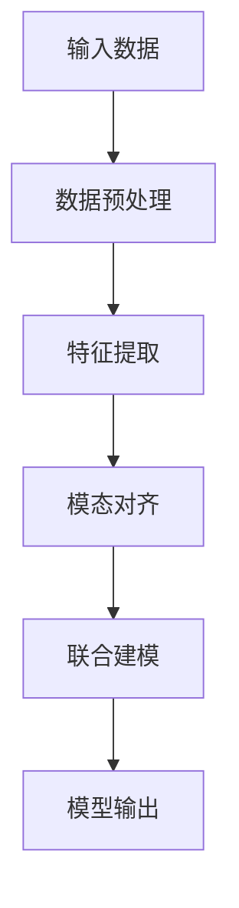
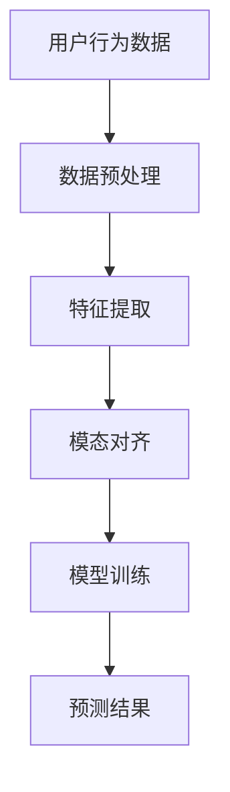

                 


# 企业AI Agent的多模态学习在客户行为分析中的深度应用

> 关键词：企业AI Agent, 多模态学习, 客户行为分析, 深度学习, 人工智能, 数据挖掘, 系统架构

> 摘要：本文深入探讨了企业AI Agent在客户行为分析中的应用，重点分析了多模态学习技术在其中的深度应用。通过结合文本、语音和图像等多种模态数据，企业能够更全面地理解和预测客户行为，从而提升客户体验和业务效率。文章详细介绍了多模态学习的核心原理、算法实现、系统架构设计以及实际项目中的应用案例。

---

## 第一章: 企业AI Agent与多模态学习的背景介绍

### 1.1 企业AI Agent的定义与特点
企业AI Agent是一种智能代理系统，用于辅助企业进行自动化决策和优化。其核心特点包括：
- **智能化**：能够理解和处理复杂信息。
- **自主性**：能够在没有人工干预的情况下执行任务。
- **适应性**：能够根据环境变化调整行为。

### 1.2 多模态学习的定义与特点
多模态学习是指同时利用多种数据模态（如文本、语音、图像等）来提高模型性能的技术。其特点包括：
- **数据丰富性**：结合多种模态数据，提供更全面的信息。
- **互补性**：不同模态的数据可以相互补充，提高模型的鲁棒性。
- **复杂性**：处理多模态数据需要更复杂的模型设计。

### 1.3 客户行为分析的定义与特点
客户行为分析是通过对客户在企业系统中的行为数据进行分析，以理解客户的需求和偏好。其特点包括：
- **实时性**：需要快速处理和分析数据。
- **多样性**：客户行为可能涉及多种模态数据。
- **预测性**：通过分析历史数据，预测未来的客户行为。

---

## 第二章: 多模态学习的核心概念

### 2.1 多模态学习的核心原理
多模态学习通过整合多种数据模态，利用联合表示和对齐技术，提高模型对复杂场景的理解能力。其核心步骤包括：
1. 数据预处理：对不同模态的数据进行标准化处理。
2. 特征提取：从每种模态中提取有意义的特征。
3. 模态对齐：将不同模态的特征对齐到一个统一的表示空间。
4. 联合学习：结合多模态特征进行联合建模。

### 2.2 多模态学习的属性特征对比表
| 模态类型 | 数据来源 | 数据特征 | 处理方式 |
|---------|----------|----------|----------|
| 文本     | 用户输入 | 离散、非结构化 | NLP处理 |
| 语音     | 音频信号 | 连续、时序 | 语音识别 |
| 图像     | 图像像素 | 空间、视觉 | 图像识别 |

### 2.3 客户行为分析的ER实体关系图
```mermaid
er
  customer: 用户
  action: 行为
  attribute: 属性
  relation: 关联
  customer -[执行]-> action
  action -[具有]-> attribute
  customer -[通过]-> relation
```

---

## 第三章: 多模态学习算法原理

### 3.1 多模态学习的算法流程


### 3.2 多模态学习的数学模型
多模态学习的联合学习模型可以通过以下公式表示：
$$
p(y|x_1, x_2, x_3) = \prod_{i=1}^3 p(y|x_i)
$$
其中，$x_i$ 表示不同模态的输入，$y$ 表示目标输出。

### 3.3 多模态学习的代码实现示例
```python
import numpy as np
from sklearn.model_selection import train_test_split
from tensorflow.keras.layers import Input, Dense, concatenate
from tensorflow.keras.models import Model

# 假设输入数据为文本、语音和图像特征
text_input = Input(shape=(100,))
audio_input = Input(shape=(100,))
image_input = Input(shape=(100,))

# 特征提取和模态对齐
text_features = Dense(50, activation='relu')(text_input)
audio_features = Dense(50, activation='relu')(audio_input)
image_features = Dense(50, activation='relu')(image_input)

# 联合建模
combined = concatenate([text_features, audio_features, image_features])
output = Dense(1, activation='sigmoid')(combined)

model = Model(inputs=[text_input, audio_input, image_input], outputs=output)
model.compile(optimizer='adam', loss='binary_crossentropy', metrics=['accuracy'])
```

---

## 第四章: 系统分析与架构设计

### 4.1 系统功能设计
客户行为分析系统的主要功能模块包括：
1. 数据采集：从日志、传感器等来源获取多模态数据。
2. 数据预处理：对数据进行清洗和标准化处理。
3. 特征提取：从每种模态中提取特征。
4. 模态对齐：将不同模态的特征对齐到统一空间。
5. 模型训练：基于多模态特征进行联合建模。

### 4.2 系统架构设计


### 4.3 系统接口设计
系统接口包括：
1. 数据输入接口：接收多模态数据。
2. 模型调用接口：调用训练好的模型进行预测。
3. 结果输出接口：返回预测结果和分析报告。

---

## 第五章: 项目实战

### 5.1 项目背景与目标
本项目旨在通过多模态学习技术，分析客户的点击流数据、语音交互数据和图像数据，预测客户的购买行为。

### 5.2 项目实现步骤
1. 数据预处理：清洗和标准化数据。
2. 特征提取：使用NLP、语音识别和图像识别技术提取特征。
3. 模态对齐：将不同模态的特征对齐到统一空间。
4. 模型训练：基于多模态特征进行联合建模。

### 5.3 项目案例分析
通过实际案例分析，展示了多模态学习在客户行为分析中的优势。例如，结合文本、语音和图像数据，可以更准确地预测客户的购买行为。

---

## 第六章: 最佳实践与小结

### 6.1 最佳实践
- 数据预处理是关键，需要仔细清洗和标准化数据。
- 特征提取和模态对齐需要结合具体场景进行优化。
- 模型训练需要选择合适的深度学习框架和优化算法。

### 6.2 小结
本文深入探讨了企业AI Agent的多模态学习在客户行为分析中的深度应用，通过理论分析和实际案例，展示了多模态学习技术在提升客户行为分析能力中的重要作用。

---

## 附录

### 附录A: 参考文献
1. LeCun, Y., Bengio, Y., & Hinton, G. (2015). Deep learning. Nature, 521(7552), 436-444.
2. Pan, S. J., & Yang, Q. (2010). A survey on transfer learning. IEEE Transactions on Knowledge and Data Engineering, 22(10), 1345-1359.

### 附录B: 工具与库
- Python: 程序设计语言
- TensorFlow/PyTorch: 深度学习框架
- NLTK: 自然语言处理库
- OpenCV: 图像处理库

---

作者：AI天才研究院/AI Genius Institute & 禅与计算机程序设计艺术 /Zen And The Art of Computer Programming

