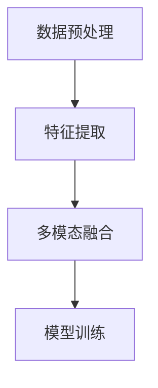

                 

# 企业AI Agent的多模态学习在用户体验优化中的应用

## 关键词：企业AI Agent, 多模态学习, 用户体验优化, 人工智能, 自然语言处理, 视觉识别

## 摘要

随着人工智能技术的快速发展，企业AI Agent在用户体验优化中的应用日益广泛。本文将深入探讨企业AI Agent如何通过多模态学习技术来提升用户体验。通过分析多模态学习的核心概念、算法原理、系统架构以及实际应用案例，本文为企业在多模态学习领域的实践提供了理论支持和实践指导。

---

## 第1章：引言

### 1.1 AI Agent的基本概念

AI Agent（人工智能代理）是一种能够感知环境、自主决策并执行任务的智能系统。它广泛应用于企业自动化、智能客服、推荐系统等领域。AI Agent的核心能力包括自然语言处理、视觉识别、数据分析等。

### 1.2 多模态学习的背景与意义

多模态学习是指同时处理多种数据形式（如文本、图像、语音、视频等）的学习方法。通过整合多模态数据，AI Agent能够更全面地理解用户需求，提供更精准的服务。例如，在电商场景中，AI Agent可以通过分析用户的文本评论、点击行为和视觉偏好，提供个性化的推荐。

### 1.3 问题描述与目标

企业在优化用户体验时，面临数据多样性和复杂性的挑战。传统的单一模态方法难以全面捕捉用户需求，导致推荐不精准、交互效率低下。通过多模态学习，企业AI Agent能够整合多种数据源，提升用户体验优化的效果。

### 1.4 研究目标

本文旨在探讨如何通过多模态学习提升企业AI Agent的用户体验优化能力，包括：

- 提供多模态数据的整合与处理方法。
- 构建高效的多模态学习模型。
- 实现多模态学习在实际场景中的应用。

### 1.5 研究意义

通过多模态学习优化企业AI Agent，可以显著提升用户体验，增强企业的竞争力。同时，本文的研究为企业在AI Agent领域的技术发展提供了新的思路。

---

## 第2章：企业AI Agent的核心概念与理论基础

### 2.1 企业AI Agent的核心功能

企业AI Agent需要具备以下核心功能：

1. **自然语言处理**：理解用户文本输入，生成自然语言回复。
2. **视觉识别**：识别图像、视频中的关键信息。
3. **数据分析与决策**：基于多模态数据进行分析和决策。

### 2.2 多模态学习的定义与特点

多模态学习是指同时利用多种数据形式进行学习的方法。其特点包括：

1. **数据多样性**：整合多种数据源，提供更全面的信息。
2. **互补性**：不同模态的数据可以互相补充，提升模型的鲁棒性。
3. **复杂性**：处理多模态数据需要复杂的算法和计算资源。

### 2.3 多模态学习的核心概念

#### 2.3.1 数据模态

数据模态包括文本、图像、语音、视频等。每种模态都有其独特的特点和应用场景。

#### 2.3.2 多模态融合

多模态融合是将不同模态的数据进行整合的过程。常见的融合方法包括早期融合、晚期融合和层次化融合。

### 2.4 多模态学习与企业AI Agent的关系

企业AI Agent通过多模态学习能够更全面地理解用户需求，提供个性化的服务。例如，在智能客服场景中，AI Agent可以通过分析用户的文本输入和语音情感，提供更精准的服务。

---

## 第3章：多模态学习的算法原理

### 3.1 多模态学习的算法流程

多模态学习的算法流程包括数据预处理、特征提取、融合方法和模型训练。通过Mermaid流程图展示：

### 3.2 多模态融合模型

#### 3.2.1 模型结构

多模态融合模型通常包括编码器、融合层和解码器。编码器负责提取各模态的特征，融合层将特征进行融合，解码器生成最终的输出。

#### 3.2.2 注意力机制

注意力机制在多模态学习中广泛应用。例如，文本和图像的注意力机制可以通过以下公式表示：

$$
\text{Attention}(Q, K, V) = \text{softmax}\left(\frac{QK^T}{\sqrt{d_k}}\right)V
$$

其中，$Q$、$K$、$V$分别是查询、键和值矩阵，$d_k$是键的维度。

### 3.3 多模态学习的训练方法

多模态学习的训练方法包括监督学习、无监督学习和半监督学习。监督学习通过标注数据进行训练，无监督学习通过聚类等方法进行。

### 3.4 模型评估与优化

模型评估可以通过准确率、召回率、F1分数等指标进行。模型优化可以通过调整超参数、数据增强等方法实现。

---

## 第4章：企业AI Agent的系统分析与架构设计

### 4.1 系统功能设计

企业AI Agent的系统功能包括：

1. **用户交互模块**：处理用户的输入和输出。
2. **多模态数据处理模块**：整合文本、图像等多种数据。
3. **模型训练模块**：训练多模态学习模型。
4. **应用模块**：将模型应用于实际场景。

#### 4.1.1 用户交互模块

用户交互模块负责接收用户的输入并生成响应。例如，在智能客服场景中，用户可以通过文本或语音输入查询。

#### 4.1.2 多模态数据处理模块

多模态数据处理模块负责将多种数据形式进行预处理和特征提取。例如，文本数据可以通过词袋模型或词嵌入进行处理，图像数据可以通过卷积神经网络提取特征。

#### 4.1.3 模型训练模块

模型训练模块负责训练多模态学习模型。例如，使用深度学习框架如TensorFlow或PyTorch进行训练。

#### 4.1.4 应用模块

应用模块将训练好的模型应用于实际场景。例如，在推荐系统中，模型可以根据用户的多模态数据生成推荐列表。

### 4.2 系统架构设计

企业AI Agent的系统架构包括数据层、模型层和应用层。数据层负责存储和管理多模态数据，模型层负责训练和优化模型，应用层负责将模型应用于实际场景。

#### 4.2.1 数据层

数据层包括文本库、图像库、语音库等。数据预处理包括数据清洗、特征提取等。

#### 4.2.2 模型层

模型层包括编码器、融合层和解码器。编码器负责提取各模态的特征，融合层将特征进行融合，解码器生成最终的输出。

#### 4.2.3 应用层

应用层包括用户交互界面和应用逻辑。用户可以通过界面与AI Agent交互，应用逻辑负责处理用户的请求并生成响应。

### 4.3 系统接口设计

系统接口设计包括用户接口和模型接口。用户接口负责接收用户的输入并生成响应，模型接口负责与模型进行交互。

### 4.4 系统交互流程

系统交互流程包括用户输入、数据处理、模型推理和结果输出。例如，在电商推荐系统中，用户输入关键词，系统进行数据处理和模型推理，生成推荐列表并返回给用户。

---

## 第5章：项目实战：企业AI Agent的多模态学习应用案例

### 5.1 项目背景

以电商推荐系统为例，企业希望通过多模态学习提升推荐的精准度和用户体验。

### 5.2 环境搭建

#### 5.2.1 硬件环境

推荐使用高性能服务器或云服务，配置足够的GPU资源用于深度学习训练。

#### 5.2.2 软件环境

安装Python、TensorFlow、Keras等深度学习框架，配置数据处理库如Pillow、OpenCV等。

### 5.3 数据预处理

#### 5.3.1 数据清洗

清洗数据中的噪声和冗余信息，例如去除重复数据、填充缺失值等。

#### 5.3.2 特征提取

从文本、图像等数据中提取特征。例如，文本数据可以使用词袋模型或词嵌入生成向量表示，图像数据可以使用卷积神经网络提取特征。

#### 5.3.3 数据标注

根据实际需求对数据进行标注，例如对图像进行分类标签标注。

### 5.4 模型实现

#### 5.4.1 模型训练

使用深度学习框架训练多模态学习模型。例如，使用预训练的文本模型和图像模型进行联合训练。

#### 5.4.2 模型优化

通过调整超参数、数据增强等方法优化模型性能。

### 5.5 系统实现

#### 5.5.1 用户交互界面

开发用户交互界面，支持文本和图像输入。

#### 5.5.2 后台处理逻辑

实现数据处理、模型推理和结果输出的逻辑。

### 5.6 系统测试与优化

#### 5.6.1 功能测试

测试系统的各项功能，确保系统正常运行。

#### 5.6.2 性能优化

通过优化算法和硬件配置提升系统的运行效率。

### 5.7 实际案例分析

通过具体案例分析，验证系统的性能和效果。例如，在电商推荐系统中，评估推荐的准确率和用户满意度。

### 5.8 项目小结

总结项目实施的经验和教训，提出改进建议。

---

## 第6章：最佳实践与总结

### 6.1 小结

本文深入探讨了企业AI Agent的多模态学习在用户体验优化中的应用。通过理论分析和实际案例，展示了多模态学习在提升用户体验中的重要作用。

### 6.2 注意事项

在实际应用中，需要注意数据隐私、模型泛化能力等问题。同时，要根据实际需求选择合适的多模态学习方法。

### 6.3 未来趋势

随着AI技术的不断发展，企业AI Agent的多模态学习将在更多领域得到应用，例如智能客服、教育、医疗等。

### 6.4 拓展阅读

建议读者进一步阅读相关文献，深入理解多模态学习的最新进展和技术细节。

---

## 作者：AI天才研究院（AI Genius Institute） & 《禅与计算机程序设计艺术》

---

以上是《企业AI Agent的多模态学习在用户体验优化中的应用》的完整内容，希望对您有所帮助！

