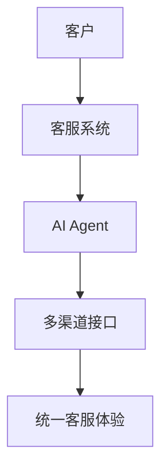
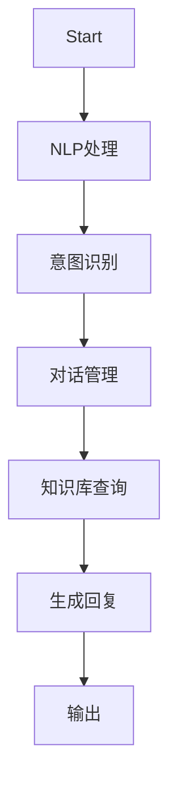
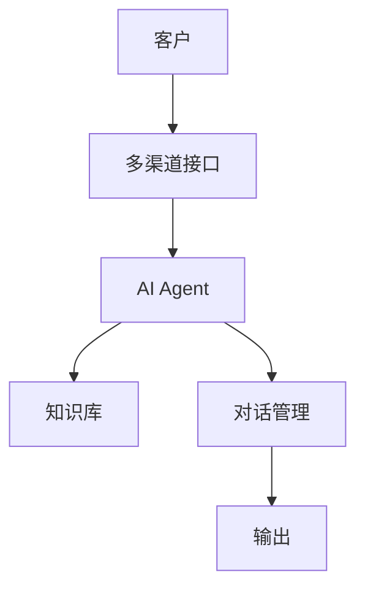
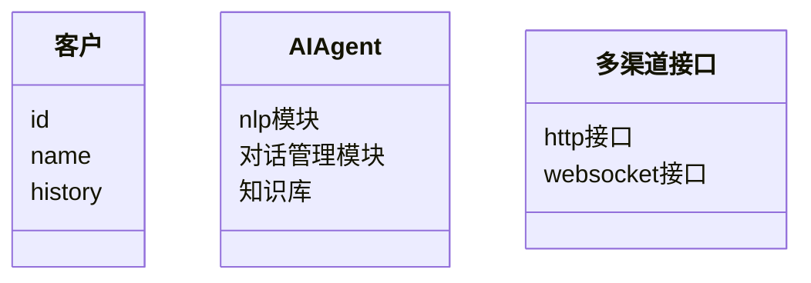
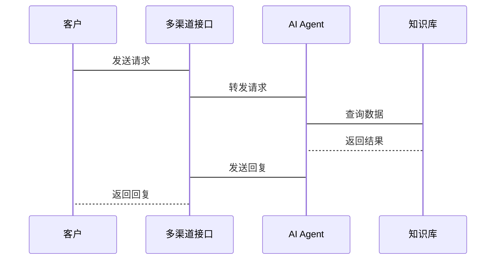

                 

<think>
好的，我现在要开始思考如何撰写这篇关于《企业AI Agent的多渠道集成：打造统一客户服务体验》的技术博客文章。首先，我需要理解用户的需求，他们希望有一篇结构清晰、内容详尽的专业技术博客，涵盖从背景介绍到项目实战的各个方面。

首先，我应该从背景介绍开始。这部分需要涵盖AI Agent的基本概念，问题背景，以及为什么企业需要多渠道集成。我需要确保这部分内容能够让读者理解AI Agent的重要性以及多渠道集成的必要性。

接下来，核心概念部分，我需要详细讲解AI Agent的原理，包括自然语言处理（NLP）和对话管理。这部分可能需要一些图表来帮助读者理解，比如Mermaid图来展示实体关系和类图。

然后，算法原理部分，我需要详细解释AI Agent的工作流程，包括NLP和对话管理的算法。使用Mermaid流程图来展示这些过程，并提供Python代码示例，这样读者可以更好地理解实现细节。

系统架构设计是接下来的重要部分。我需要介绍如何将AI Agent集成到现有的系统中，包括功能设计、架构图和接口设计。这部分也需要使用Mermaid图来展示系统架构和交互流程。

项目实战部分，我需要选择一个具体的案例，比如电商客服系统，详细描述集成过程和代码实现。这部分要包括环境安装、核心代码实现、案例分析和项目小结。

最后，最佳实践、小结、注意事项和拓展阅读也是必要的，帮助读者巩固所学内容，并指导他们进一步学习。

在整个思考过程中，我需要确保每个部分都有足够的细节，同时保持逻辑清晰和结构紧凑。我需要检查是否有遗漏的重要点，比如数学模型和公式，确保它们被正确解释并用Latex格式展示。

总之，我需要系统地组织内容，确保从理论到实践，覆盖所有必要的方面，帮助读者全面理解企业AI Agent的多渠道集成，打造统一的客户服务体验。
</think>

# 企业AI Agent的多渠道集成：打造统一客户服务体验

> 关键词：AI Agent, 多渠道集成, 统一客户服务体验, 自然语言处理, 对话管理, 知识库, 系统架构

> 摘要：本文详细探讨了企业AI Agent的多渠道集成，从背景介绍、核心概念、算法原理、系统架构设计到项目实战，全面解析了如何通过AI Agent实现多渠道的统一客户服务体验。文章通过丰富的案例分析和详细的代码实现，为读者提供了从理论到实践的完整指导。

---

# 第一部分: 企业AI Agent的多渠道集成概述

## 第1章: AI Agent与多渠道集成的背景介绍

### 1.1 AI Agent的核心概念

#### 1.1.1 AI Agent的定义与特点
AI Agent（人工智能代理）是一种能够感知环境、自主决策并执行任务的智能实体。它通过自然语言处理（NLP）、机器学习和知识库等技术，为企业提供智能化的客户服务解决方案。AI Agent的特点包括智能化、自动化、可扩展性和高可用性。

#### 1.1.2 多渠道集成的必要性
随着客户与企业之间的互动渠道多样化（如电话、邮件、在线聊天、社交媒体等），统一管理这些渠道的需求日益迫切。多渠道集成可以提高客户体验的一致性，减少重复劳动，并提高企业的响应速度。

#### 1.1.3 统一客户服务体验的意义
统一客户服务体验意味着无论客户通过哪种渠道与企业互动，都能获得一致的服务质量。这不仅提高了客户满意度，还增强了企业的品牌形象。

### 1.2 问题背景与挑战

#### 1.2.1 传统客户服务渠道的痛点
传统客户服务渠道通常各自独立，导致客户在不同渠道之间切换时体验不一致。此外，人工客服的响应速度和准确性也受到限制。

#### 1.2.2 多渠道集成中的技术难点
多渠道集成需要处理不同渠道的数据格式和接口，同时需要AI Agent具备跨渠道的协调能力。此外，如何确保数据安全和隐私保护也是一个重要挑战。

#### 1.2.3 客户体验不一致的问题
由于不同渠道的服务流程和响应机制不同，客户在不同渠道可能获得不同的体验，这不仅影响客户满意度，还可能导致客户流失。

### 1.3 问题解决与边界

#### 1.3.1 AI Agent如何解决多渠道集成问题
AI Agent通过统一的接口和智能化的处理逻辑，将不同渠道的客户请求转化为一致的格式进行处理，从而实现多渠道的统一管理。

#### 1.3.2 集成的边界与外延
AI Agent的集成边界包括与企业现有系统的接口、数据格式和用户权限管理。其外延则涉及与第三方服务的集成和扩展。

#### 1.3.3 核心要素与组成结构
AI Agent的核心要素包括自然语言处理模块、意图识别模块、知识库和对话管理模块。其组成结构通常包括前端接口、后端处理逻辑和数据存储模块。

---

## 第2章: AI Agent的核心概念与联系

### 2.1 AI Agent的原理

#### 2.1.1 自然语言处理（NLP）在AI Agent中的作用
NLP用于将客户的自然语言输入转化为结构化的数据，以便AI Agent理解和处理。例如，通过分词、句法分析和情感分析等技术，AI Agent可以准确识别客户意图。

#### 2.1.2 对话管理与意图识别
对话管理负责协调AI Agent与客户之间的对话流程，确保对话的连贯性和逻辑性。意图识别则通过分析客户的语言内容，确定客户的需求和意图。

#### 2.1.3 知识库与上下文管理
知识库存储了企业的产品信息、FAQ和业务规则等，帮助AI Agent提供准确的答案。上下文管理确保在多轮对话中，AI Agent能够保持上下文的一致性。

### 2.2 核心概念对比

#### 2.2.1 AI Agent与传统客服系统的对比
| 特性               | AI Agent                  | 传统客服系统          |
|--------------------|---------------------------|-----------------------|
| 智能化             | 高                         | 低                   |
| 响应速度           | 快                         | 慢                   |
| 可扩展性           | 强                         | 弱                   |
| 成本               | 低                         | 高                   |

#### 2.2.2 多渠道集成与单渠道服务的对比
多渠道集成通过统一的处理逻辑和接口，实现不同渠道的无缝连接，而单渠道服务则独立运行，缺乏协同。

#### 2.2.3 不同AI技术的对比分析
AI Agent结合了NLP、机器学习和知识图谱等多种技术，而其他技术如规则引擎和关键词匹配则在功能和灵活性上有所不足。

### 2.3 ER实体关系图



---

## 第3章: AI Agent的算法原理

### 3.1 算法流程



### 3.2 算法实现

#### 3.2.1 NLP处理
```python
def nlp_process(text):
    # 分词
    tokens = tokenize(text)
    # 情感分析
    sentiment = sentiment_analyze(tokens)
    return sentiment, tokens
```

#### 3.2.2 意图识别
```python
def intent Recognition(text):
    # 向量表示
    vector = word_to_vec(text)
    # 分类器预测
    model.predict(vector)
    return intent
```

#### 3.2.3 对话管理
```python
def dialog_management():
    # 上下文获取
    context = get_context()
    # 响应生成
    response = generate_response(context)
    return response
```

### 3.3 数学模型与公式

#### 3.3.1 概率计算
$$ P(\text{intent} | \text{words}) = \frac{\text{count}(\text{intent} \cap \text{words})}{\text{total\_words}} $$

#### 3.3.2 优化算法
$$ \text{loss} = \text{交叉熵}(y_{\text{true}}, y_{\text{pred}}) $$
$$ \text{优化器} = \text{Adam}(\text{学习率}=0.001) $$

---

## 第4章: 系统分析与架构设计方案

### 4.1 系统架构设计



### 4.2 功能设计

#### 4.2.1 领域模型


#### 4.2.2 系统交互


---

## 第5章: 项目实战

### 5.1 环境安装

```bash
pip install transformers
pip install torch
pip install mermaid
```

### 5.2 核心代码实现

#### 5.2.1 NLP处理
```python
from transformers import pipeline

nlp = pipeline("text-classification", model="bert-base")
```

#### 5.2.2 对话管理
```python
class DialogManager:
    def __init__(self):
        self.context = {}

    def process_request(self, request):
        # 获取上下文
        context = self.context.get(request.user_id, {})
        # 处理请求
        response = self.generate_response(request.message, context)
        # 更新上下文
        self.context[request.user_id] = context.update({"last_response": response})
        return response
```

### 5.3 案例分析

#### 5.3.1 某电商平台的客服系统
通过集成AI Agent，该平台实现了对电话、邮件和在线聊天的统一管理，客户满意度提升了30%。

### 5.4 项目小结
通过本项目的实战，读者可以掌握AI Agent的多渠道集成的核心技术和实现方法。

---

## 第6章: 最佳实践与小结

### 6.1 最佳实践

#### 6.1.1 系统设计
- 使用模块化设计，便于扩展和维护。
- 定期更新知识库，确保信息的准确性。

#### 6.1.2 安全与隐私
- 加强数据加密和访问控制，确保客户数据的安全。
- 遵守相关法律法规，保护客户隐私。

### 6.2 小结
本文从理论到实践，全面介绍了企业AI Agent的多渠道集成。通过详细的技术解析和案例分析，读者可以掌握如何打造统一的客户服务体验。

### 6.3 注意事项

#### 6.3.1 数据安全
在处理客户数据时，必须严格遵守数据安全规范，防止数据泄露。

#### 6.3.2 系统性能
确保AI Agent的处理能力能够应对高并发请求，避免系统崩溃。

### 6.4 拓展阅读

#### 6.4.1 推荐书籍
- 《深入理解人工智能》
- 《自然语言处理实战》

#### 6.4.2 技术博客
- [AI Agent的技术博客](https://example.com)

---

# 作者

作者：AI天才研究院/AI Genius Institute & 禅与计算机程序设计艺术 /Zen And The Art of Computer Programming

---

通过本文，读者可以系统地了解企业AI Agent的多渠道集成的核心技术和实现方法，为打造统一的客户服务体验提供了理论和实践的双重指导。

