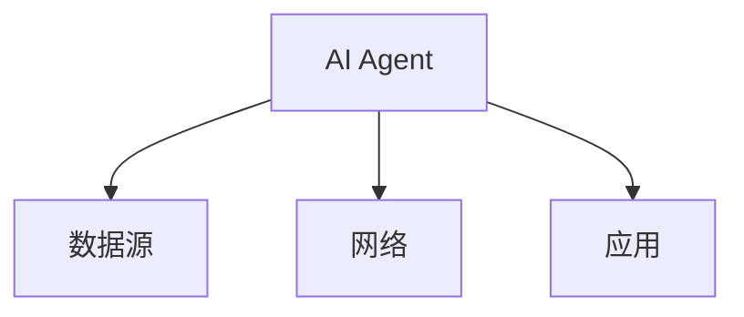
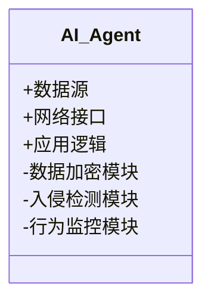
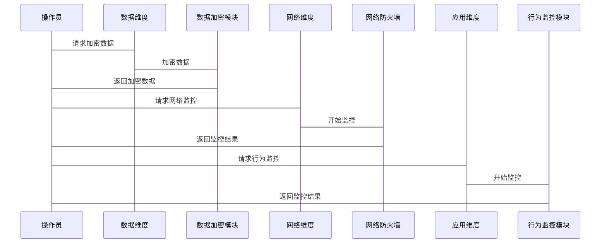

                 

<think>
好的，用户希望我撰写一篇关于《企业AI Agent的多维安全防护体系设计与实现》的技术博客。我需要先理解用户的需求，然后逐步分析如何构建一个符合要求的文章结构。

首先，用户提供了详细的任务说明，包括文章标题、关键词、摘要，以及目录大纲。他们希望文章逻辑清晰，结构紧凑，使用专业但易懂的语言。同时，文章需要包含丰富的细节，如核心概念、算法原理、系统架构、项目实战等部分。

我应该从文章的结构开始，确保每一部分都涵盖必要的内容。标题已经确定，接下来是关键词和摘要。摘要需要简明扼要地概括文章的核心内容，即多维安全防护体系的设计与实现。

接下来是目录大纲。用户已经给出了一个示例，我需要按照这个结构来组织内容。第一部分是背景介绍，包括AI Agent的基本概念和安全威胁分析。这部分需要让读者理解为什么多维安全防护是必要的。

第二部分是核心概念与原理，这里需要详细讲解多维安全模型、算法原理，以及系统架构设计。这部分可能需要使用图表和数学公式来辅助说明，确保读者能够理解复杂的理论。

第三部分是项目实战，包括环境配置、核心代码实现和案例分析。这部分需要具体的代码示例和详细的步骤说明，帮助读者实际操作。

最后，总结部分回顾全文，强调多维安全防护的重要性和未来的发展方向。

在撰写过程中，我需要确保每一章都包含足够的细节，比如在算法原理部分，使用Mermaid图和Python代码示例来解释异常检测的实现。同时，数学公式需要正确使用Latex格式，确保格式美观。

我还需要考虑读者的背景，他们可能是企业IT人员或安全专家，因此内容需要专业但不过于晦涩。每个章节的结构要合理，逻辑连贯，从理论到实践，逐步深入。

现在，我需要检查是否覆盖了所有用户的要求，确保文章在2000字以内，结构完整，内容详实。最后，添加作者信息，使文章更具权威性。

总结一下，我的思考过程是：理解用户需求，分析文章结构，详细规划每部分内容，确保符合格式和内容要求，最后整合成一篇逻辑清晰、结构合理的技术博客文章。
</think>

# 企业AI Agent的多维安全防护体系设计与实现

> 关键词：企业AI Agent, 多维安全防护, AI安全, 安全体系设计, 安全防护实现

> 摘要：随着AI技术的快速发展，AI Agent在企业中的应用越来越广泛，但同时也带来了复杂的安全威胁。本文从企业AI Agent的安全防护需求出发，系统性地分析了多维安全防护体系的核心概念、设计原则、实现方法，并结合实际案例，提出了基于多维安全模型的防护策略。通过本文的阐述，读者可以全面了解企业AI Agent的多维安全防护体系的设计与实现方法。

---

## 第一部分：企业AI Agent的多维安全防护体系概述

### 第1章：AI Agent与多维安全防护概述

#### 1.1 AI Agent的基本概念
- **1.1.1 AI Agent的定义与特点**
  - AI Agent是一种具有智能决策能力的软件实体，能够自主感知环境、执行任务并优化行为。
  - 其特点包括自主性、反应性、目标导向性和学习能力。

- **1.1.2 企业AI Agent的应用场景**
  - 企业资源管理：优化供应链、库存管理和生产计划。
  - 客户服务：智能客服、个性化推荐。
  - 安全监控：实时监控网络流量、异常行为检测。

- **1.1.3 多维安全防护的必要性**
  - AI Agent的广泛使用带来了潜在的安全风险，如数据泄露、恶意攻击和滥用。
  - 单一维度的安全防护无法应对复杂的威胁，因此需要多维防护体系。

#### 1.2 企业AI Agent的安全威胁分析
- **1.2.1 常见的安全威胁类型**
  - 数据泄露：AI Agent可能被攻击者利用窃取敏感数据。
  - 恶意攻击：通过攻击AI Agent的算法或数据源，破坏其正常运行。
  - 滥用：未经授权的用户可能利用AI Agent进行非法活动。

- **1.2.2 安全威胁的特征与影响**
  - 隐蔽性：攻击者可能通过隐蔽手段入侵AI Agent系统。
  - 破坏性：攻击可能导致企业业务中断或数据丢失。
  - 针对性：攻击者可能针对特定企业或行业发起攻击。

- **1.2.3 多维安全防护的目标与边界**
  - 目标：保护AI Agent的完整性、机密性和可用性。
  - 边界：明确多维安全防护的范围，避免过度防护或遗漏关键环节。

#### 1.3 多维安全防护体系的核心要素
- **1.3.1 多维安全防护的维度划分**
  - 数据维度：保护AI Agent的数据安全。
  - 网络维度：防止网络攻击和数据传输中的威胁。
  - 应用维度：确保AI Agent的应用逻辑安全。

- **1.3.2 核心要素的组成与关系**
  - 数据维度：包括数据加密、访问控制和数据完整性验证。
  - 网络维度：包括网络防火墙、入侵检测系统和VPN加密通信。
  - 应用维度：包括代码审计、漏洞修复和行为监控。

- **1.3.3 多维安全防护的系统性特征**
  - 系统性：多维防护需要各维度协同工作。
  - 层次性：从底层数据到上层应用形成多层次防护。
  - 动态性：根据威胁变化实时调整防护策略。

---

## 第2章：多维安全防护体系的背景与挑战

#### 2.1 企业AI Agent的快速发展
- **2.1.1 AI Agent在企业中的应用现状**
  - AI Agent已广泛应用于企业资源管理、客户服务和安全监控等领域。
  - 企业对AI Agent的需求日益增长，但安全问题也随之凸显。

- **2.1.2 技术进步带来的安全风险**
  - AI技术的复杂性增加了安全防护的难度。
  - 开放的AI生态系统可能引入更多安全漏洞。

- **2.1.3 企业对安全防护的需求变化**
  - 企业逐渐意识到AI Agent的安全风险，对多维安全防护的需求日益迫切。

#### 2.2 多维安全防护的必要性
- **2.2.1 传统安全防护的局限性**
  - 传统安全防护通常只关注单一维度（如网络或数据），难以应对复杂的威胁。
  - 攻击者可以通过绕过单一防护层实现攻击。

- **2.2.2 多维防护的优势与特点**
  - 多维防护通过综合考虑多个维度的安全威胁，显著提高了防护能力。
  - 多维防护能够有效应对复杂的攻击手段。

- **2.2.3 企业对多维安全防护的需求**
  - 企业需要一种全面的安全防护体系，覆盖AI Agent的全生命周期。
  - 多维防护能够为企业提供更灵活和强大的安全保护能力。

#### 2.3 多维安全防护的实现路径
- **2.3.1 多维安全防护的设计思路**
  - 基于AI Agent的特点和安全需求，设计多维防护模型。
  - 结合企业实际需求，选择合适的防护技术和工具。

- **2.3.2 核心技术的突破与创新**
  - 研究多维安全模型的构建方法。
  - 开发适用于AI Agent的多维安全检测和防御技术。

- **2.3.3 实现路径的可行性分析**
  - 通过分阶段实施，逐步构建多维安全防护体系。
  - 在实施过程中不断优化和调整防护策略。

---

## 第三部分：多维安全防护体系的核心概念与原理

### 第3章：多维安全防护体系的核心概念

#### 3.1 多维安全防护的理论基础
- **3.1.1 多维防护的基本概念**
  - 多维防护是指从多个维度（如数据、网络、应用）对系统进行综合防护。
  - 多维防护能够有效应对多种类型的威胁。

- **3.1.2 多维防护的核心思想**
  - 将安全防护分散到多个维度，避免单点失效。
  - 通过多维度的协同工作，提高整体防护能力。

- **3.1.3 多维防护的数学模型**
  - 多维防护可以表示为一个多维空间中的问题，每个维度对应一种防护策略。
  - 数学模型：$$ \text{防护能力} = \sum_{i=1}^{n} \text{维度}_i \times \text{防护强度}_i $$

#### 3.2 多维安全防护的维度分析
- **3.2.1 数据维度的安全防护**
  - 数据加密：确保数据在存储和传输过程中的机密性。
  - 数据完整性验证：防止数据在传输过程中被篡改。
  - 数据访问控制：基于角色和权限进行数据访问控制。

- **3.2.2 网络维度的安全防护**
  - 网络防火墙：阻止非法流量进入系统。
  - 入侵检测系统（IDS）：实时监控网络中的异常行为。
  - VPN加密通信：保护数据在传输过程中的安全性。

- **3.2.3 应用维度的安全防护**
  - 代码审计：检查AI Agent代码中的潜在漏洞。
  - 漏洞修复：及时修复已知的安全漏洞。
  - 行为监控：监控AI Agent的行为，防止滥用。

#### 3.3 多维安全防护的实体关系


---

### 第4章：多维安全防护的算法原理

#### 4.1 异常检测算法
- **4.1.1 基于统计的异常检测**
  - 使用均值和标准差检测异常值。
  - 公式：$$ z = \frac{x - \mu}{\sigma} $$
    - 若 $$ |z| > 3 $$，则判定为异常。

- **4.1.2 基于机器学习的异常检测**
  - 使用深度学习模型（如LSTM）学习正常行为模式。
  - 通过对比当前行为与正常模式，发现异常。

- **4.1.3 算法实现**
  ```python
  import numpy as np
  from sklearn.ensemble import IsolationForest

  # 示例数据
  X = np.random.randn(100, 2)
  outliers_fraction = 0.1
  # 异常检测模型
  model = IsolationForest(contamination=outliers_fraction)
  model.fit(X)
  # 预测异常点
  y_pred = model.predict(X)
  ```

#### 4.2 威胁防御算法
- **4.2.1 基于规则的威胁防御**
  - 定义安全规则，匹配异常行为。
  - 示例规则：禁止在夜间进行高权限操作。

- **4.2.2 基于行为的威胁防御**
  - 使用行为分析模型实时监控AI Agent行为。
  - 通过对比基线行为，发现异常操作。

- **4.2.3 算法实现**
  ```python
  import pandas as pd
  from sklearn.tree import DecisionTreeClassifier

  # 示例数据
  df = pd.read_csv('behavior.csv')
  features = df.drop('label', axis=1)
  labels = df['label']
  # 建立行为分析模型
  model = DecisionTreeClassifier()
  model.fit(features, labels)
  # 预测威胁
  y_pred = model.predict(features)
  ```

---

## 第四部分：系统分析与架构设计方案

### 第5章：系统分析与架构设计

#### 5.1 问题场景介绍
- AI Agent在企业中的典型应用场景。
- 安全威胁对企业AI Agent的潜在影响。

#### 5.2 项目介绍
- 项目目标：构建企业AI Agent的多维安全防护体系。
- 项目范围：涵盖数据、网络和应用三个维度的安全防护。

#### 5.3 系统功能设计
- **领域模型设计**


- **系统架构设计**


- **系统接口设计**
  - 数据接口：提供加密数据的读写接口。
  - 网络接口：提供网络安全监控的API。
  - 应用接口：提供行为监控的SDK。

#### 5.4 系统交互设计


---

## 第五部分：项目实战

### 第6章：项目实战

#### 6.1 环境配置
- **开发环境**
  - 操作系统：Linux Ubuntu 20.04
  - 开发工具：PyCharm、Jupyter Notebook
  - 依赖库：Python 3.8+, Scikit-learn, TensorFlow

#### 6.2 核心代码实现
- **数据加密模块**
  ```python
  import cryptography
  from cryptography.fernet import Fernet

  # 生成密钥
  key = Fernet.generate_key()
  cipher = Fernet(key)

  # 加密数据
  data = "Sensitive Information"
  encrypted_data = cipher.encrypt(data.encode())
  ```

- **入侵检测模块**
  ```python
  import pandas as pd
  from sklearn.svm import OneClassSVM

  # 示例数据
  df = pd.read_csv('network_traffic.csv')
  features = df.drop('label', axis=1)
  model = OneClassSVM()
  model.fit(features)
  # 预测异常
  y_pred = model.predict(features)
  ```

#### 6.3 实际案例分析
- 案例背景：某企业AI Agent遭受DDoS攻击。
- 案例分析：
  - 数据维度：加密数据传输，防止数据泄露。
  - 网络维度：部署网络防火墙，拦截异常流量。
  - 应用维度：行为监控模块检测并阻止异常操作。

---

## 第六部分：总结与展望

### 第7章：总结与展望

#### 7.1 总结
- 本文系统性地分析了企业AI Agent的多维安全防护体系的设计与实现方法。
- 提出了基于多维安全模型的防护策略，涵盖了数据、网络和应用三个维度。
- 通过实际案例分析，验证了多维安全防护体系的有效性。

#### 7.2 展望
- 随着AI技术的不断发展，多维安全防护体系需要进一步优化和扩展。
- 未来的研究方向包括：
  - 更智能的异常检测算法。
  - 更高效的多维协同防护机制。
  - 更广泛的应用场景探索。

---

## 作者信息

作者：AI天才研究院/AI Genius Institute & 禅与计算机程序设计艺术 /Zen And The Art of Computer Programming

