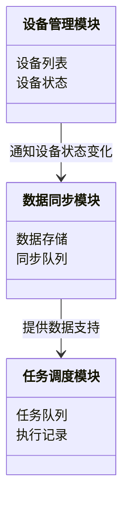
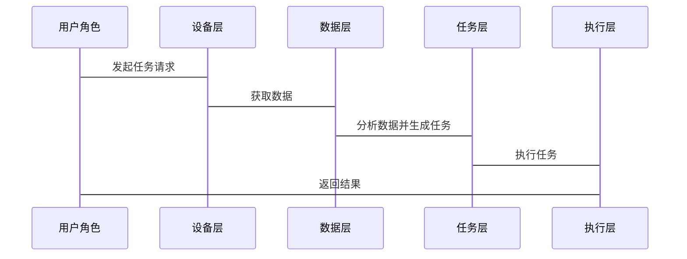

                 

<think>
好的，我现在要帮用户撰写一篇关于《企业AI Agent的多设备支持：PC、移动端到IoT设备》的技术博客文章。根据用户提供的大纲，我需要确保文章内容详实，涵盖所有必要的部分，包括背景介绍、核心概念、算法原理、系统架构、项目实战和总结展望。

首先，我需要理解每个章节的内容。文章标题和关键词已经给出，摘要部分需要简洁明了地概括文章的核心内容。接下来，我要确保每个章节都有足够的细节，特别是核心概念、算法原理和系统架构部分，需要用mermaid图和数学公式来详细解释。

在开始写作之前，我需要检查是否有遗漏的部分，并确保所有技术术语准确无误。同时，我要注意文章的逻辑性，使读者能够顺畅地理解从背景到实现的过程。

现在，我准备开始按照用户提供的大纲一步步撰写文章。
</think>

# 企业AI Agent的多设备支持：PC、移动端到IoT设备

## 关键词：企业AI Agent，多设备支持，PC，移动端，IoT设备，算法原理，系统架构

## 摘要：本文深入探讨了企业AI Agent在多设备环境下的支持策略，涵盖背景、核心概念、算法原理、系统架构设计及项目实战。文章通过详细分析感知、决策和执行层，结合数学模型和mermaid图，阐述了AI Agent在不同设备上的实现与优化，为开发者提供实用的指导。

---

## 第1章：企业AI Agent的背景与问题描述

### 1.1 什么是企业AI Agent

#### 1.1.1 AI Agent的定义与特点
AI Agent（智能体）是能够感知环境、做出决策并执行任务的智能系统。企业AI Agent具备以下特点：
- **自主性**：无需外部干预，自主完成任务。
- **反应性**：实时感知环境变化并做出响应。
- **目标导向性**：根据目标调整行为。

#### 1.1.2 企业AI Agent的核心概念
企业AI Agent专注于为企业提供智能化服务，涵盖数据处理、决策支持和任务执行。其核心要素包括：
- **数据源**：来自PC、移动端和IoT设备的数据流。
- **决策机制**：基于AI算法做出最优决策。
- **执行能力**：通过设备完成任务并反馈结果。

#### 1.1.3 企业AI Agent的分类与应用场景
根据功能和环境，企业AI Agent可分为：
- **任务型**：专注于完成特定任务，如文件处理、日程管理。
- **服务型**：提供持续服务，如智能客服、设备监控。

应用场景包括企业内部管理、客户服务、设备协同等。

### 1.2 企业AI Agent的多设备支持背景

#### 1.2.1 多设备环境的复杂性
现代企业环境中，设备种类繁多，包括PC、手机、智能手表、智能家居等。这些设备产生的数据格式多样，需要复杂的处理机制。

#### 1.2.2 企业AI Agent在多设备中的挑战
- **异构设备支持**：不同设备的硬件和操作系统差异大，难以统一处理。
- **数据同步与一致性**：多设备间的数据需要实时同步，确保一致性。
- **安全性与隐私**：跨设备的数据传输需确保安全，防止泄露。

#### 1.2.3 多设备支持的重要性与价值
实现多设备支持，企业可以提升效率、增强用户体验，并在物联网时代保持竞争力。

### 1.3 问题描述与目标

#### 1.3.1 多设备支持的核心问题
- 设备间的通信与协作。
- 数据的实时同步与处理。
- 不同设备上的任务调度与资源分配。

#### 1.3.2 企业AI Agent的目标与边界
目标是实现跨设备的无缝协作，提高企业效率。边界包括仅支持企业内部设备，不涉及外部服务。

#### 1.3.3 多设备支持的解决方案框架
包括设备管理、数据同步、任务调度三个核心模块。

---

## 第2章：企业AI Agent的核心概念与联系

### 2.1 AI Agent的核心原理

#### 2.1.1 感知层：数据采集与处理
- 数据采集：通过传感器或API获取设备数据。
- 数据预处理：清洗、转换数据，便于后续处理。

#### 2.1.2 决策层：智能决策机制
- 基于上下文数据，结合预设规则，做出决策。
- 使用机器学习模型进行预测和优化。

#### 2.1.3 执行层：任务执行与反馈
- 通过设备API或通信协议执行任务。
- 收集反馈，优化决策模型。

### 2.2 核心概念对比与ER实体关系图

#### 2.2.1 核心概念对比表格

| 概念 | 描述 |
|------|------|
| 设备层 | 包括PC、移动端和IoT设备 |
| 数据层 | 包括结构化和非结构化数据 |
| 任务层 | 包括多种类型的任务 |

#### 2.2.2 ER实体关系图的Mermaid流程图
```mermaid
erDiagram
    actor 用户角色 {
        role 设备用户
        role 管理员
    }
    actor 系统 {
        role 感知模块
        role 决策模块
        role 执行模块
    }
    设备层 --> 数据层 : 传递数据
    数据层 --> 任务层 : 生成任务
    任务层 --> 执行层 : 执行任务
```

---

## 第3章：企业AI Agent的算法原理与数学模型

### 3.1 感知层算法

#### 3.1.1 数据采集与预处理
- 数据采集：通过API获取设备数据。
- 数据预处理：清洗、转换、标准化。

#### 3.1.2 感知算法的数学模型
- 数据流的时序分析：使用滑动窗口技术，窗口大小为n。
- 异常检测：基于统计学方法，如Z-score。

$$ Z = \frac{X - \mu}{\sigma} $$

### 3.2 决策层算法

#### 3.2.1 基于上下文的决策模型
- 上下文分析：提取关键特征，如时间、地点、用户状态。
- 决策优化：使用遗传算法或模拟退火。

#### 3.2.2 决策模型的优化
- 线性规划模型：$$ \text{max } z = \sum c_i x_i $$
- 约束条件：$$ \sum a_i x_i \leq b $$

### 3.3 执行层算法

#### 3.3.1 任务调度算法
- 基于优先级的调度：使用短作业优先或时间片轮转。
- 资源分配：动态分配设备资源，确保任务完成。

#### 3.3.2 反馈机制
- 实时反馈：通过API返回结果。
- 绩效评估：记录任务完成时间，优化未来决策。

---

## 第4章：企业AI Agent的系统分析与架构设计

### 4.1 系统功能设计

#### 4.1.1 领域模型的Mermaid类图


#### 4.1.2 系统架构的Mermaid架构图
```mermaid
archi
    设备层 --> 数据层 : 数据传输
    数据层 --> 任务层 : 生成任务
    任务层 --> 执行层 : 执行任务
    执行层 --> 反馈层 : 返回结果
```

### 4.2 接口与交互设计

#### 4.2.1 接口设计
- 设备层API：用于设备间通信。
- 数据层API：用于数据存取和处理。
- 任务层API：用于任务调度和执行。

#### 4.2.2 交互流程的Mermaid序列图


---

## 第5章：企业AI Agent的项目实战

### 5.1 环境安装与配置

#### 5.1.1 安装环境
- 安装Python 3.8及以上版本。
- 安装必要的库：numpy、pandas、scikit-learn。

#### 5.1.2 配置开发环境
- 配置虚拟环境，安装项目依赖。

### 5.2 核心功能实现

#### 5.2.1 感知模块实现
```python
def preprocess_data(data):
    # 数据清洗与转换
    cleaned_data = data.dropna()
    return cleaned_data
```

#### 5.2.2 决策模块实现
```python
def decision_model(features):
    # 基于特征的决策逻辑
    if features['priority'] > 0.8:
        return 'high'
    else:
        return 'low'
```

#### 5.2.3 执行模块实现
```python
def execute_task(task):
    # 执行任务并返回结果
    result = task.execute()
    return result
```

### 5.3 代码解读与分析

#### 5.3.1 代码结构
- 感知模块：负责数据处理。
- 决策模块：负责任务优先级评估。
- 执行模块：负责任务执行。

#### 5.3.2 功能实现细节
- 数据预处理：使用pandas库。
- 决策逻辑：基于特征阈值判断优先级。

### 5.4 案例分析与详细解读

#### 5.4.1 案例分析
假设企业需要监控IoT设备的运行状态，AI Agent会实时采集数据，分析设备状态，并在检测到异常时自动触发维护任务。

#### 5.4.2 实施步骤
1. 数据采集：通过传感器获取设备参数。
2. 数据处理：清洗并分析数据。
3. 任务生成：根据异常情况生成维护任务。
4. 任务执行：通过API调用维护流程。
5. 反馈结果：返回维护结果并优化决策模型。

### 5.5 项目小结

#### 5.5.1 项目总结
通过项目实战，验证了企业AI Agent在多设备环境下的可行性。

#### 5.5.2 实施经验
- 设备间通信需确保实时性。
- 数据处理需高效，减少延迟。
- 任务调度需合理，避免资源冲突。

---

## 第6章：企业AI Agent的总结与展望

### 6.1 总结

#### 6.1.1 核心内容回顾
- 企业AI Agent的多设备支持需要从感知、决策、执行三个层面入手。
- 系统架构设计需考虑设备间的通信与协作。

#### 6.1.2 最佳实践
- 确保数据同步与一致性。
- 优化任务调度算法，提高效率。
- 加强安全性与隐私保护。

### 6.2 展望

#### 6.2.1 未来技术趋势
- 更智能的决策算法，如强化学习。
- 更高效的设备间通信协议。

#### 6.2.2 拓展方向
- 支持更多设备类型，如智能家居、工业设备。
- 提供更复杂的任务类型，如多设备协同任务。

---

## 作者：AI天才研究院/AI Genius Institute & 禅与计算机程序设计艺术/Zen And The Art of Computer Programming

---

**本文旨在通过系统化的方法，详细阐述企业AI Agent在多设备环境下的支持策略，为开发者提供理论与实践的双重指导。**

