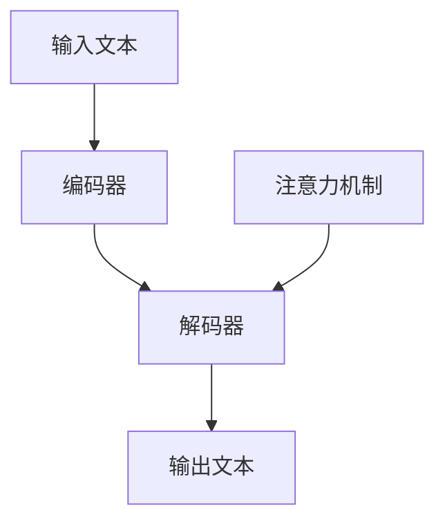
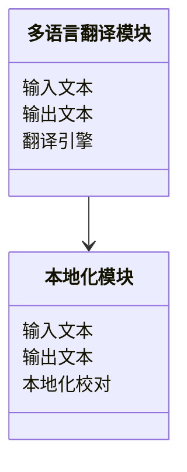
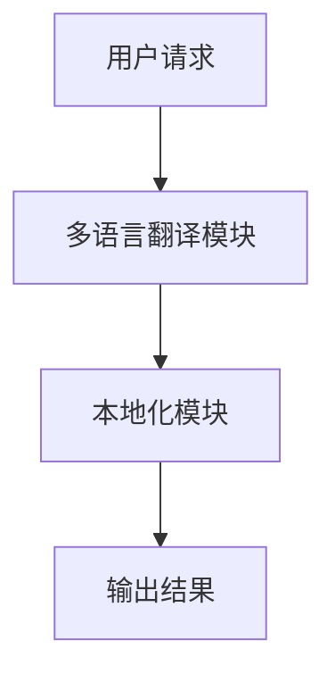
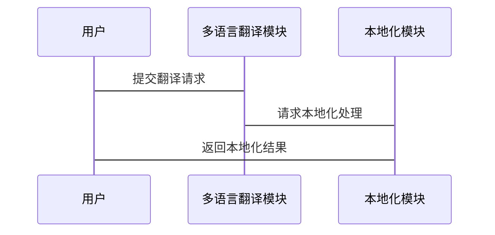

                 

<think>
好的，我现在要解决用户的问题，为《企业AI Agent的多语言翻译与本地化功能》撰写目录。用户希望目录结构清晰、内容详细，并且包含技术细节和图表。

首先，我需要理解用户的需求。用户希望这本书涵盖从背景到系统架构，再到算法实现和项目实战的各个方面。我需要确保目录包含足够的章节，每个章节都有足够的细节，比如理论、流程图、代码示例等。

接下来，我会从背景开始。第一章应该介绍企业AI Agent的多语言翻译和本地化的必要性，包括问题背景、核心需求和必要性。这将帮助读者理解为什么需要这个功能。

然后，第二章需要详细讲解多语言翻译的核心原理，包括各种翻译方法和神经机器翻译模型。这部分需要对比不同方法，并用图表辅助说明。

第三章聚焦于神经机器翻译的算法，解释其结构和训练流程，并用数学公式和Mermaid流程图来详细说明。

第四章讨论系统架构设计，包括功能模块、系统架构和接口设计。这部分需要使用Mermaid类图和架构图来展示系统结构。

第五章是项目实战，涵盖环境安装、代码实现和案例分析。这将帮助读者实际应用所学知识。

最后，第六章总结，并提供未来展望和注意事项。这将帮助读者巩固所学内容，并了解发展趋势。

在撰写过程中，我需要确保每个部分都有足够的细节，比如数学公式用LaTeX表示，流程图和类图用Mermaid绘制。同时，每个章节的小结要简洁明了，帮助读者回顾主要内容。

总的来说，我需要系统地构建目录，确保涵盖从理论到实践的所有方面，满足用户对深度和结构的要求。
</think>

# 企业AI Agent的多语言翻译与本地化功能

> 关键词：企业AI Agent，多语言翻译，本地化功能，神经机器翻译，系统架构设计，算法原理

> 摘要：本文深入探讨了企业AI Agent在多语言翻译与本地化方面的功能实现，从核心概念、算法原理到系统架构设计，再到项目实战，全面解析了如何构建高效的多语言翻译与本地化系统。文章结合理论与实践，通过详细的数学公式、Mermaid流程图和系统架构图，帮助读者全面理解并掌握相关技术。

---

# 第一部分: 企业AI Agent的多语言翻译与本地化背景

# 第1章: 企业AI Agent的多语言翻译与本地化概述

## 1.1 问题背景与描述

### 1.1.1 多语言翻译与本地化的定义

多语言翻译是指将一种语言的文本转换为另一种或多种语言的文本，而本地化则是在翻译的基础上，结合目标语言的文化、习惯和特定领域的需求，对文本进行调整，以适应目标市场的语言和文化习惯。

### 1.1.2 企业AI Agent的核心需求

企业AI Agent需要支持多语言翻译与本地化功能，以满足全球化业务的需求。例如，跨国企业需要与不同语言的用户进行交互，或者处理多语言文档和数据。AI Agent通过多语言翻译与本地化功能，可以提高用户体验，增强企业的竞争力。

### 1.1.3 问题的边界与外延

多语言翻译与本地化的边界包括语言的识别、翻译和校对。外延则包括文化适应、排版调整和本地化测试。企业AI Agent需要在这些方面进行综合处理，确保翻译和本地化的质量。

### 1.1.4 核心概念结构与要素

- **输入**：多语言文本或文档
- **输出**：目标语言的翻译文本或本地化文档
- **核心功能**：语言识别、翻译、校对、文化适配、排版调整
- **目标**：提高用户体验，支持全球化业务

## 1.2 多语言翻译与本地化的必要性

### 1.2.1 全球化企业的需求

全球化企业需要与全球用户进行交互，支持多语言翻译与本地化功能是实现全球化业务的基础。

### 1.2.2 多语言翻译的挑战

- 多语言翻译的复杂性：不同语言的语法、词汇差异
- 本地化的文化差异：节日、习俗、货币单位等
- 翻译的准确性：专业术语、行业特定表达

### 1.2.3 本地化对用户体验的影响

本地化能够提高用户体验，增强用户对品牌的信任感和忠诚度。

### 1.2.4 企业AI Agent的解决方案

企业AI Agent通过集成多语言翻译与本地化功能，实现跨语言的高效交互和文档处理。

## 1.3 本章小结

### 1.3.1 核心概念回顾

- 多语言翻译：将一种语言转换为另一种语言
- 本地化：翻译基础上的文化适配和排版调整

### 1.3.2 问题解决思路

- 通过AI技术实现高效翻译和本地化
- 结合企业需求进行定制化处理

### 1.3.3 下文展开方向

- 详细讲解多语言翻译的核心原理
- 探讨神经机器翻译的算法实现
- 分析企业AI Agent的系统架构设计

---

# 第二部分: 多语言翻译与本地化的核心概念

# 第2章: 多语言翻译的核心原理

## 2.1 机器翻译的原理

### 2.1.1 统计机器翻译

统计机器翻译基于语言学统计模型，通过分析双语语料库，建立语言间的对应关系。

### 2.1.2 基于规则的机器翻译

基于规则的机器翻译通过语言学规则和语法分析进行翻译，适用于规则清晰的语言。

### 2.1.3 神经机器翻译（NMT）

神经机器翻译基于深度学习模型，通过编码器-解码器结构实现翻译。

## 2.2 多语言翻译的实现方式

### 2.2.1 单语翻译

单语翻译仅依赖单一语言的语料库，适用于资源充足的语言。

### 2.2.2 双语翻译

双语翻译依赖双语语料库，通过对比分析实现翻译。

### 2.2.3 多语翻译

多语翻译处理多种语言，适用于多语言环境下的翻译任务。

## 2.3 神经机器翻译模型

### 2.3.1 编码器-解码器结构

- 编码器将源语言文本编码为向量表示
- 解码器将编码向量解码为目标语言文本

### 2.3.2 注意力机制

注意力机制通过计算源语言文本中每个词对目标词的重要性，优化翻译结果。

### 2.3.3 Transformer模型

Transformer模型由编码器和解码器组成，通过自注意力机制实现高效的并行处理。

## 2.4 本地化的实现步骤

### 2.4.1 文本分析

分析文本内容，识别需要本地化的部分。

### 2.4.2 文本分割

将文本分割为可翻译的单元，如句子、段落或术语。

### 2.4.3 翻译与校对

通过翻译工具或API进行翻译，并进行人工或自动校对。

### 2.4.4 文本重组

将翻译后的文本重新组合，确保原文的结构和格式。

## 2.5 核心概念对比表

| 比较维度 | 传统翻译 | 神经机器翻译 |
|----------|----------|--------------|
| 基础     | 统计或规则 | 神经网络模型 |
| 精度     | 较低      | 较高          |
| 速度     | 较慢      | 较快          |
| 适应性   | 有限      | 强            |

---

# 第三部分: 多语言翻译与本地化的算法原理

# 第3章: 神经机器翻译算法

## 3.1 神经机器翻译模型结构

### 3.1.1 编码器结构

- 输入：源语言文本
- 输出：向量表示

### 3.1.2 解码器结构

- 输入：编码器输出的向量表示
- 输出：目标语言文本

### 3.1.3 注意力机制

- 输入：源语言文本和目标语言文本
- 输出：注意力权重

## 3.2 神经机器翻译的训练流程

### 3.2.1 数据预处理

- 分词、清洗、对齐

### 3.2.2 模型训练

- 使用优化算法（如Adam）训练模型

### 3.2.3 模型评估

- 使用BLEU、ROUGE等指标评估翻译质量

## 3.3 神经机器翻译的数学模型

### 3.3.1 编码器公式

$$
\text{编码器输出} = f_{\text{编码器}}(x)
$$

### 3.3.2 解码器公式

$$
\text{解码器输出} = f_{\text{解码器}}(y_{\text{prev}}, x)
$$

### 3.3.3 注意力机制公式

$$
\text{注意力权重} = \text{softmax}(\frac{QK^T}{\sqrt{d}})
$$

## 3.4 算法实现的Mermaid流程图



---

# 第四部分: 企业AI Agent的系统架构与设计

# 第4章: 系统架构设计

## 4.1 系统功能设计

### 4.1.1 多语言翻译模块

- 文本识别
- 翻译引擎
- 翻译结果校对

### 4.1.2 本地化模块

- 文本分析
- 本地化校对
- 本地化结果输出

## 4.2 系统架构设计

### 4.2.1 系统功能模块



### 4.2.2 系统架构图



## 4.3 系统接口设计

### 4.3.1 输入接口

- HTTP REST API
- 微消息队列

### 4.3.2 输出接口

- 翻译结果输出
- 本地化结果输出

## 4.4 系统交互设计



---

# 第五部分: 项目实战

# 第5章: 项目实战

## 5.1 环境安装

- 安装Python和相关库（如TensorFlow、PyTorch）
- 安装翻译API（如Google Cloud Translation API）

## 5.2 核心代码实现

```python
def translate(text, source_lang, target_lang):
    # 使用翻译API进行翻译
    translator = Translator(api_key)
    return translator.translate(text, source_lang, target_lang)

def localize(text, locale):
    # 使用本地化模块进行校对
    localizer = Localizer(locale)
    return localizer.localize(text)
```

## 5.3 代码应用解读与分析

### 5.3.1 翻译模块

- `translate`函数：接收文本、源语言和目标语言，调用翻译API完成翻译。

### 5.3.2 本地化模块

- `localize`函数：接收文本和目标区域，调用本地化模块进行校对。

## 5.4 实际案例分析

### 5.4.1 翻译案例

- 输入文本：Hello, how are you?
- 源语言：英语
- 目标语言：中文
- 输出：你好，你怎么样？

### 5.4.2 本地化案例

- 输入文本：Order confirmed
- 目标区域：美国
- 本地化结果：订单已确认（美国式英语）

## 5.5 项目小结

### 5.5.1 核心功能实现

- 多语言翻译模块：支持多种语言的文本翻译
- 本地化模块：支持多种区域的文本校对

### 5.5.2 代码实现特点

- 灵活性高，支持多种翻译API
- 易扩展，支持更多语言和区域

---

# 第六部分: 总结与展望

# 第6章: 总结与展望

## 6.1 核心概念回顾

- 多语言翻译：基于神经机器翻译实现高效翻译
- 本地化：基于文化适配和排版调整实现用户体验优化

## 6.2 最佳实践 tips

- 使用高质量的翻译API和本地化工具
- 定期更新翻译和本地化规则
- 进行本地化测试确保质量

## 6.3 本章小结

### 6.3.1 核心内容回顾

- 多语言翻译与本地化的实现原理
- 企业AI Agent的系统架构设计
- 项目实战的代码实现与案例分析

### 6.3.2 未来展望

- 更高效的神经机器翻译算法
- 更智能的本地化模块
- 多语言翻译与本地化的结合优化

---

作者：AI天才研究院/AI Genius Institute & 禅与计算机程序设计艺术 /Zen And The Art of Computer Programming

