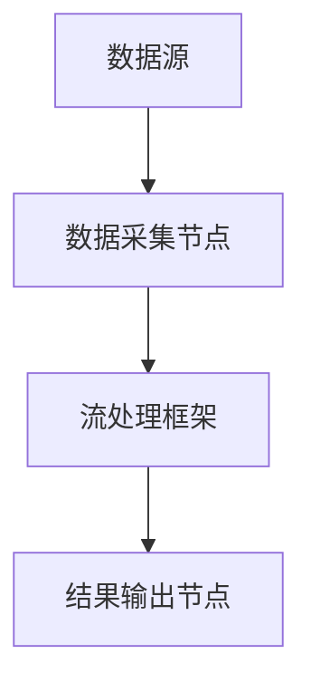
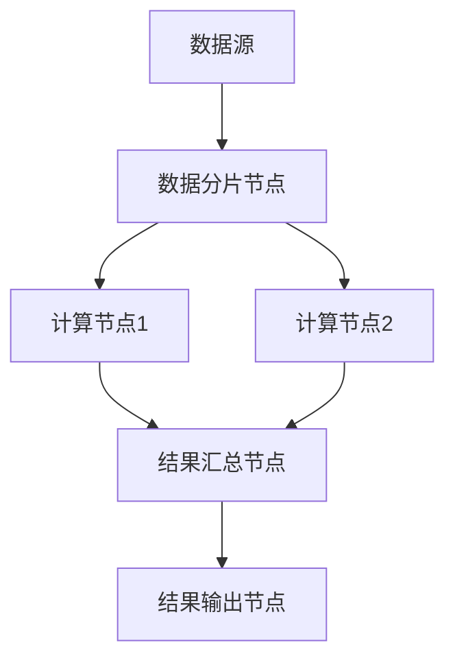
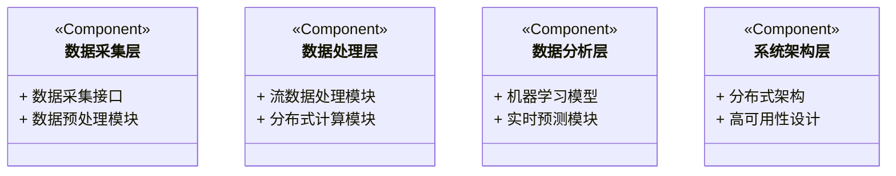
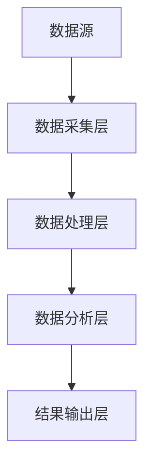
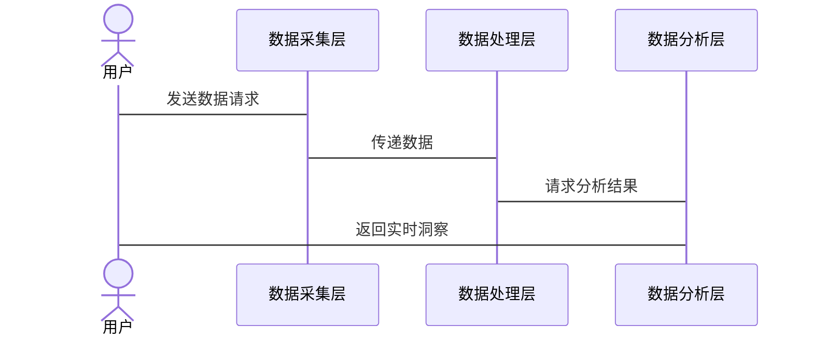

                 

<think>
好，我现在需要帮用户设计一本名为《企业AI Agent的实时大数据分析平台》的技术博客文章。用户已经提供了详细的目录结构，现在需要按照这个结构来撰写内容。

首先，我得理解每个部分的核心内容。文章的关键词和摘要需要准确反映主题，接着是各章节的详细内容，包括核心概念、算法原理、系统架构、项目实战等。

在撰写时，要确保逻辑清晰，每个章节下有足够详细的子部分。例如，核心概念部分需要定义企业AI Agent和实时大数据分析平台，并用表格和Mermaid图展示它们的特征对比和实体关系。算法部分需要用Python代码和数学公式详细阐述，确保读者能理解原理和应用。

系统架构部分需要介绍项目背景，设计系统功能，使用Mermaid图展示类图、架构图和交互流程。项目实战部分则要包括环境安装、代码实现、案例分析，确保读者能够实际操作。

最后，最佳实践、小结、注意事项和拓展阅读部分要帮助读者巩固知识，提供实用的建议和进一步学习的方向。

现在，我开始逐步撰写每个部分，确保内容详实，结构合理，满足用户的需求。
</think>

# 企业AI Agent的实时大数据分析平台

> 关键词：企业AI Agent，实时大数据分析，流数据处理，分布式计算，系统架构设计

> 摘要：本文深入探讨企业AI Agent与实时大数据分析平台的结合，从背景、核心概念到算法原理、系统架构设计，再到项目实战，全面解析如何构建高效的实时大数据分析平台。通过详细的技术分析和实例，揭示企业AI Agent在实时数据分析中的应用价值和实现方法。

---

## 第一部分: 引言

## 第1章: 问题背景与目标

### 1.1 问题背景

#### 1.1.1 企业AI Agent的概念与需求

企业AI Agent是指一种能够自主感知环境、理解业务需求、并采取相应行动的智能系统。它能够帮助企业自动化处理任务、优化决策流程，并提高整体运营效率。随着企业数据量的指数级增长，实时数据分析的需求日益迫切，企业AI Agent需要具备快速处理和分析数据的能力，以支持实时决策。

#### 1.1.2 实时大数据分析的必要性

实时大数据分析是指在数据生成的瞬间进行处理和分析，以支持快速决策。传统的批量处理方式已无法满足企业对实时性的要求，而流数据处理技术的出现，使得实时数据分析成为可能。企业需要一个高效的实时大数据分析平台，以支持AI Agent的实时数据处理需求。

#### 1.1.3 问题背景的外延与边界

企业AI Agent的实时大数据分析平台需要处理的数据类型多样，包括结构化数据、半结构化数据和非结构化数据。平台的边界在于数据的实时性、系统的可扩展性和数据的安全性。需要明确平台的功能范围，例如数据采集、存储、处理、分析和可视化。

#### 1.1.4 核心问题解决思路

通过构建实时大数据分析平台，企业AI Agent能够实时感知业务数据的变化，快速响应业务需求。解决思路包括：

1. 数据采集与处理：使用流数据处理技术，实时采集和处理数据。
2. 数据分析：利用机器学习和深度学习算法，对实时数据进行分析和预测。
3. 系统架构设计：采用分布式架构，确保系统的高可用性和可扩展性。

### 1.2 问题描述

企业AI Agent需要实时处理大量数据，以支持智能决策。然而，传统的数据处理方式无法满足实时性的要求。实时大数据分析平台需要具备以下能力：

1. 高效的数据处理能力：能够实时采集、存储和处理数据。
2. 强大的分析能力：能够快速分析数据，并生成实时洞察。
3. 灵活的扩展能力：能够根据业务需求，动态扩展系统资源。

### 1.3 解决方案概述

企业AI Agent的实时大数据分析平台解决方案包括：

1. 数据采集层：实时采集数据，并进行初步处理。
2. 数据处理层：使用流数据处理技术，对数据进行实时分析。
3. 数据分析层：利用机器学习和深度学习算法，进行实时预测和决策。
4. 系统架构层：采用分布式架构，确保系统的高可用性和可扩展性。

---

## 第二部分: 核心概念与联系

## 第2章: 企业AI Agent与实时大数据分析平台的核心概念

### 2.1 企业AI Agent的定义与特点

企业AI Agent是一种能够自主感知环境、理解业务需求、并采取相应行动的智能系统。它的核心特点包括：

1. **自主性**：能够自主决策，无需人工干预。
2. **反应性**：能够实时感知环境变化，并快速响应。
3. **学习能力**：能够通过机器学习不断优化自身行为。

### 2.2 实时大数据分析平台的定义与特点

实时大数据分析平台是一种能够实时处理和分析数据的系统。它的核心特点包括：

1. **实时性**：能够在数据生成的瞬间进行处理和分析。
2. **高吞吐量**：能够处理大量数据，确保系统的高效性。
3. **可扩展性**：能够根据业务需求，动态扩展系统资源。

### 2.3 企业AI Agent与实时大数据分析平台的结合

企业AI Agent与实时大数据分析平台的结合，使得企业能够实时感知业务数据的变化，并快速响应。这种结合主要体现在以下几个方面：

1. **数据实时处理**：企业AI Agent能够实时处理数据，生成实时洞察。
2. **智能决策**：基于实时数据的分析结果，企业AI Agent能够做出智能决策。
3. **动态优化**：通过实时数据分析，企业AI Agent能够不断优化自身的行为。

### 2.4 核心概念对比与ER图

以下是企业AI Agent和实时大数据分析平台的核心概念对比：

| 特性                | 企业AI Agent                      | 实时大数据分析平台                  |
|---------------------|------------------------------------|-------------------------------------|
| 核心目标            | 支持企业智能化运营                 | 支持实时数据分析                   |
| 数据来源            | 企业业务数据                     | 实时流数据                         |
| 处理方式            | 自主决策                         | 实时数据处理                       |
| 技术基础            | 人工智能、机器学习               | 流数据处理、分布式计算             |

以下是企业AI Agent与实时大数据分析平台的ER实体关系图：

```mermaid
er
actor: "企业AI Agent"
database: "实时大数据分析平台"
relationship: "使用"
```

---

## 第三部分: 算法原理与数学模型

## 第3章: 算法原理与数学模型

### 3.1 流数据处理算法原理

流数据处理是实时大数据分析的核心技术之一。以下是流数据处理的算法原理：

1. **数据流的采集与传输**：数据通过传感器或业务系统实时采集，并通过网络传输到处理节点。
2. **数据流的存储与处理**：数据被存储在内存中，并通过流处理框架进行实时处理。
3. **数据流的分析与计算**：通过算法对数据流进行分析，生成实时结果。

#### 3.1.1 流数据处理框架

以下是流数据处理的框架：



#### 3.1.2 流数据处理算法的Python实现

以下是流数据处理的Python代码示例：

```python
import time
from kafka import KafkaConsumer

# Kafka消费者配置
consumer = KafkaConsumer('real-time-topic', bootstrap_servers='localhost:9092')

# 处理数据
for message in consumer:
    print(f"接收到数据: {message.value}")
    time.sleep(1)
```

### 3.2 分布式计算算法原理

分布式计算是实时大数据分析的另一种核心技术。以下是分布式计算的算法原理：

1. **数据分片**：将数据分成多个分片，分配到不同的计算节点进行处理。
2. **并行计算**：每个计算节点对分配的数据进行处理，生成中间结果。
3. **结果汇总**：将各个节点的中间结果汇总，生成最终结果。

#### 3.2.1 分布式计算框架

以下是分布式计算的框架：



#### 3.2.2 分布式计算算法的Python实现

以下是分布式计算的Python代码示例：

```python
import concurrent.futures

def process_data(data):
    return data * 2

data = [1, 2, 3, 4, 5]

with concurrent.futures.ThreadPoolExecutor() as executor:
    futures = [executor.submit(process_data, item) for item in data]
    for future in concurrent.futures.as_completed(futures):
        print(future.result())
```

### 3.3 数学模型与公式

#### 3.3.1 实时数据分析的数学模型

实时数据分析的数学模型通常包括时间序列分析、回归分析、聚类分析等。以下是时间序列分析的数学模型：

$$
y_t = \alpha y_{t-1} + \beta \epsilon_t
$$

其中，$y_t$ 表示当前时间点的值，$\alpha$ 表示自回归系数，$\beta$ 表示方差系数，$\epsilon_t$ 表示随机误差项。

#### 3.3.2 分布式计算的数学模型

分布式计算的数学模型通常包括MapReduce模型、流计算模型等。以下是MapReduce模型的数学表达：

$$
Map(input) \rightarrow (key, value)
$$

$$
Reduce(key, values) \rightarrow result
$$

---

## 第四部分: 系统分析与架构设计

## 第4章: 系统分析与架构设计

### 4.1 项目介绍

企业AI Agent的实时大数据分析平台旨在通过实时数据分析，支持企业的智能化运营。该平台需要处理来自多个数据源的实时数据，并通过机器学习算法生成实时洞察。

### 4.2 系统功能设计

以下是系统功能设计的类图：



### 4.3 系统架构设计

以下是系统架构设计的架构图：



### 4.4 系统接口设计

以下是系统接口设计的序列图：



---

## 第五部分: 项目实战

## 第5章: 项目实战

### 5.1 环境安装与配置

以下是环境安装与配置的步骤：

1. 安装Python和相关依赖：
   ```bash
   pip install kafka-python
   pip install concurrent.futures
   ```

2. 安装Kafka和Zookeeper：
   ```bash
   # 下载Kafka和Zookeeper
   wget https://downloads.apache.org/kafka/2.13.0/kafka_2.13-2.13.0.tgz
   wget https://downloads.apache.org/zookeeper/zookeeper-3.4.14/zookeeper-3.4.14.tar.gz
   ```

3. 启动Kafka和Zookeeper服务：
   ```bash
   # 启动Zookeeper
   cd zookeeper-3.4.14
   ./bin/zkServer.sh start
   # 启动Kafka
   cd kafka_2.13-2.13.0
   ./bin/kafka-server-start.sh config/server.properties
   ```

### 5.2 核心代码实现

以下是核心代码实现：

#### 5.2.1 数据采集代码

```python
from kafka import KafkaProducer

# Kafka生产者配置
producer = KafkaProducer(bootstrap_servers='localhost:9092')

# 发送数据
for i in range(10):
    producer.send('real-time-topic', value=f"数据{i}")
    time.sleep(1)
```

#### 5.2.2 数据处理代码

```python
import concurrent.futures

def process_data(data):
    return data * 2

data = [1, 2, 3, 4, 5]

with concurrent.futures.ThreadPoolExecutor() as executor:
    futures = [executor.submit(process_data, item) for item in data]
    for future in concurrent.futures.as_completed(futures):
        print(future.result())
```

### 5.3 代码解读与应用

以下是代码解读与应用：

1. 数据采集代码：使用Kafka生产者实时采集数据，并将其发送到指定的主题。
2. 数据处理代码：使用Python的`concurrent.futures`模块，实现数据的并行处理。

### 5.4 实际案例分析

以下是实际案例分析：

假设我们有一个实时股票价格监测系统，需要实时采集和分析股票价格数据。以下是实现步骤：

1. 数据采集：使用Kafka生产者实时采集股票价格数据。
2. 数据处理：使用流数据处理框架，实时分析股票价格的变化。
3. 数据分析：通过机器学习算法，预测股票价格的趋势。
4. 结果输出：将实时分析结果输出到可视化界面，供投资者参考。

### 5.5 项目小结

通过本项目的实践，我们掌握了实时大数据分析平台的核心技术，包括数据采集、流数据处理和分布式计算。这些技术为我们构建企业AI Agent的实时大数据分析平台奠定了坚实的基础。

---

## 第六部分: 总结与展望

## 第6章: 总结与展望

### 6.1 最佳实践 tips

1. 在实时大数据分析平台的建设中，数据的实时性和系统的可扩展性是关键。
2. 使用流数据处理框架和分布式计算框架，能够显著提高系统的处理能力。
3. 在实际应用中，需要根据具体业务需求，选择合适的算法和框架。

### 6.2 小结

本文详细探讨了企业AI Agent与实时大数据分析平台的结合，从核心概念到算法原理，再到系统架构设计和项目实战，全面解析了如何构建高效的实时大数据分析平台。

### 6.3 注意事项

1. 数据的安全性和隐私保护是实时大数据分析平台建设中需要重点关注的问题。
2. 在实际应用中，需要根据业务需求，动态调整系统的资源分配。
3. 系统的高可用性和容错能力是确保实时数据分析平台稳定运行的关键。

### 6.4 拓展阅读

1. **《实时大数据分析：技术与应用》**
2. **《分布式系统：原理与设计》**
3. **《机器学习实战》**

---

## 结语

企业AI Agent的实时大数据分析平台是企业智能化运营的重要支撑。通过实时数据分析，企业能够快速响应市场变化，优化决策流程，提高整体竞争力。希望本文能够为读者在构建实时大数据分析平台方面提供有益的指导和启发。

---

**作者：AI天才研究院/AI Genius Institute & 禅与计算机程序设计艺术 /Zen And The Art of Computer Programming**

