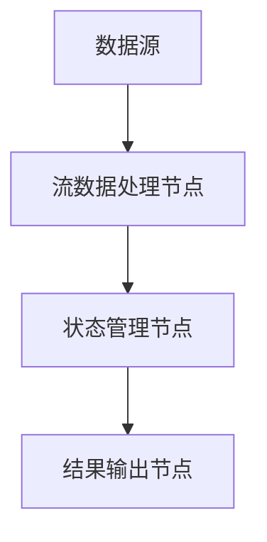
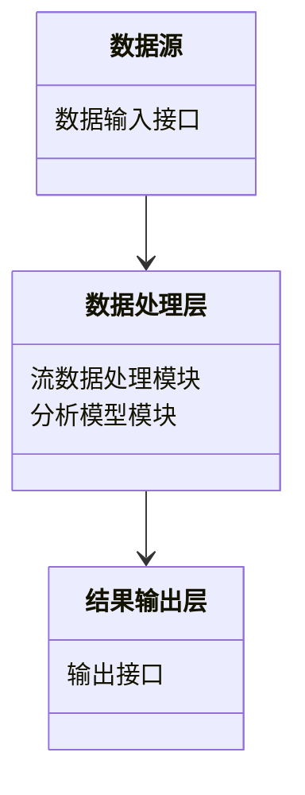
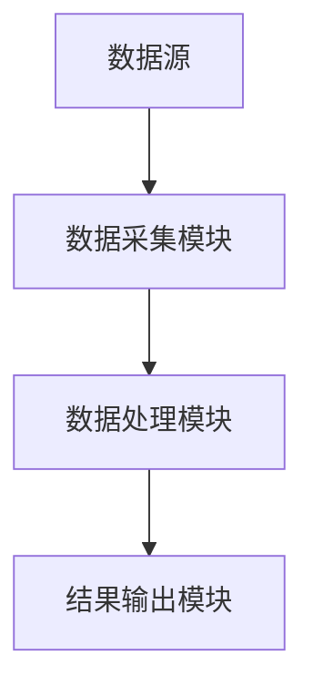
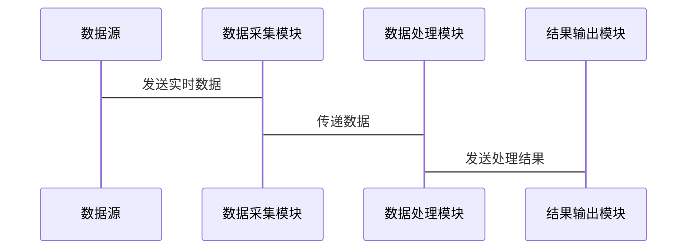

                 


# 企业AI Agent的实时大数据处理架构

## 关键词：企业AI Agent、实时大数据处理、流数据处理、分布式计算、系统架构设计、Flink

## 摘要：  
本文深入探讨企业AI Agent在实时大数据处理中的应用架构，分析其实时数据处理的核心算法与系统设计，结合实际案例，详细阐述从环境搭建到系统实现的全过程，并提供优化建议和未来展望。

---

# 第1章: 企业AI Agent与实时大数据处理的背景

## 1.1 企业AI Agent的定义与特点
### 1.1.1 企业AI Agent的基本概念  
企业AI Agent是一种智能化的软件实体，能够自主感知环境、执行任务并优化决策。它结合了人工智能、机器学习和大数据处理技术，具备学习、推理和自适应能力。

### 1.1.2 AI Agent的核心特点  
- **自主性**：无需人工干预，自主执行任务。  
- **反应性**：实时感知环境变化并做出响应。  
- **学习能力**：通过数据和反馈不断优化性能。  
- **协作性**：与其他系统或AI Agent协同工作。  

### 1.1.3 企业AI Agent的应用场景  
- **智能监控**：实时监控企业运营数据，及时发现异常。  
- **智能决策支持**：基于实时数据提供决策支持。  
- **自动化运维**：自动处理运维任务，减少人工干预。  

---

## 1.2 实时大数据处理的背景与挑战
### 1.2.1 大数据时代的特征  
- 数据量大（Volume）、类型多（Variety）、处理速度快（Velocity）。  
- 数据来源多样，包括物联网设备、日志系统、用户行为数据等。  

### 1.2.2 实时数据处理的重要性  
- 快速响应：实时数据处理能够立即反馈结果，满足业务需求。  
- 业务价值：实时数据处理能够捕捉瞬息万变的市场动态，提升企业竞争力。  

### 1.2.3 实时大数据处理的挑战  
- 数据量大：需要高效的数据处理和存储能力。  
- 处理速度要求高：需要低延迟、高吞吐量的处理能力。  
- 系统复杂性：需要处理数据流、分布式计算和系统容错等问题。  

---

## 1.3 企业AI Agent与实时大数据的结合
### 1.3.1 AI Agent在实时数据处理中的作用  
- 数据采集：实时采集各种来源的数据。  
- 数据分析：利用机器学习模型分析实时数据。  
- 决策反馈：根据分析结果生成决策并反馈执行。  

### 1.3.2 企业级实时数据处理的需求  
- **实时性**：数据处理必须在最短时间内完成。  
- **准确性**：确保分析结果的准确性。  
- **可扩展性**：能够处理快速增长的数据量。  

### 1.3.3 企业AI Agent的实时大数据处理架构的必要性  
- 通过AI Agent实现数据的实时采集、分析和反馈，能够提升企业的智能化水平和竞争力。  

---

## 1.4 本章小结  
本章介绍了企业AI Agent的基本概念和特点，分析了实时大数据处理的重要性和挑战，并探讨了AI Agent与实时大数据结合的必要性。接下来，将深入探讨AI Agent实时大数据处理的核心概念。

---

# 第2章: 企业AI Agent实时大数据处理的核心概念

## 2.1 AI Agent与实时大数据处理的关系
### 2.1.1 AI Agent在实时数据处理中的角色  
- **数据消费者**：实时接收数据并进行处理。  
- **数据生产者**：根据分析结果生成新的数据。  

### 2.1.2 实时数据处理对AI Agent的需求  
- **高效性**：快速处理数据，满足实时性要求。  
- **智能性**：具备自主学习和优化能力。  
- **可靠性**：在复杂环境下稳定运行。  

### 2.1.3 二者的相互作用  
AI Agent通过实时数据处理获取信息，优化自身决策能力；实时数据处理通过AI Agent实现智能化的分析和反馈。

---

## 2.2 实时大数据处理的关键技术
### 2.2.1 流数据处理技术  
- **流数据处理**：基于流数据的实时处理技术，如Flink、Kafka等。  
- **窗口机制**：时间窗口处理，确保数据的实时性和准确性。  

### 2.2.2 分布式计算框架  
- **分布式计算**：利用分布式计算框架（如Spark、Flink）处理大规模数据。  
- **任务调度**：高效的任务调度算法，确保资源利用最大化。  

### 2.2.3 实时数据存储与检索  
- **实时数据库**：支持高并发、低延迟的数据存储。  
- **索引优化**：优化查询性能，提升数据检索效率。  

---

## 2.3 企业AI Agent的实时大数据处理架构
### 2.3.1 架构的基本组成  
- **数据源**：实时数据输入接口。  
- **数据处理层**：包括流数据处理和分析模型。  
- **结果输出层**：将处理结果输出到目标系统或用户。  

### 2.3.2 架构的分层设计  
- **数据采集层**：负责数据的实时采集和预处理。  
- **数据处理层**：进行数据的清洗、转换和分析。  
- **结果输出层**：将分析结果输出到下游系统或用户界面。  

### 2.3.3 架构的可扩展性与可维护性  
- **模块化设计**：各模块相对独立，便于扩展和维护。  
- **容错机制**：确保系统在部分节点故障时仍能正常运行。  

---

## 2.4 核心概念对比表  
以下是对AI Agent与传统数据处理系统、实时数据处理与批量数据处理的核心概念对比：  

| 对比维度 | AI Agent实时大数据处理 | 传统数据处理系统 |
|----------|-------------------------|------------------|
| 数据源    | 多样化实时数据源         | 批处理数据源     |
| 处理速度  | 实时处理                | 批处理           |
| 响应时间  | 低延迟                 | 高延迟           |
| 智能性     | 高，具备学习能力        | 低，规则驱动      |

---

## 2.5 本章小结  
本章分析了AI Agent与实时大数据处理的关系，探讨了实时大数据处理的关键技术，并详细介绍了企业AI Agent的实时大数据处理架构。接下来，将深入讲解实时大数据处理的算法原理。

---

# 第3章: 企业AI Agent实时大数据处理的算法原理

## 3.1 流数据处理算法
### 3.1.1 基于时间窗口的流数据处理  
- **时间窗口**：将数据按时间区间划分为窗口，进行窗口内的数据处理。  
- **滑动窗口**：窗口按固定步长向前滑动，处理实时数据流。  

### 3.1.2 分布式流处理算法  
- **分布式流处理**：利用分布式计算框架（如Flink）处理大规模流数据。  
- **任务并行执行**：将处理任务分布到多个节点，提高处理效率。  

### 3.1.3 基于Flink的流处理流程图  


### 3.1.4 算法实现代码示例  
```python
from pyflink.datastream import StreamExecutionEnvironment
from pyflink.operator import Map, Filter

# 创建执行环境
env = StreamExecutionEnvironment.get_execution_environment()

# 定义处理逻辑
def process_element(element):
    # 示例处理：过滤掉负数
    if element > 0:
        return element
    else:
        return None

# 定义输出处理
def output_element(element):
    print("输出结果：", element)

# 添加处理和输出操作
env.add_source(...) \
   .map(process_element) \
   .filter(Filter(lambda x: x is not None)) \
   .add_sink(output_element)

# 执行程序
env.execute("流数据处理示例")
```

---

## 3.2 实时数据处理的数学模型
### 3.2.1 时间序列数据分析模型  
- **ARIMA模型**：自回归积分滑动平均模型，适用于时间序列数据的预测。  
- **LSTM模型**：长短时记忆网络，适合处理时间序列数据中的长期依赖关系。  

### 3.2.2 示例数学模型  
$$ y_t = \alpha y_{t-1} + \beta x_{t} + \epsilon_t $$  
其中，$ y_t $ 是当前时刻的预测值，$ y_{t-1} $ 是前一时刻的值，$ x_t $ 是输入特征，$ \epsilon_t $ 是误差项。

---

## 3.3 算法原理的通俗解释
- 流数据处理算法通过将数据划分为时间窗口，实时处理每段窗口内的数据，确保低延迟和高实时性。  
- 分布式计算框架通过并行处理任务，提高数据处理效率，适用于大规模数据场景。  
- 数学模型如ARIMA和LSTM用于分析时间序列数据，帮助预测未来趋势并做出决策。

---

## 3.4 本章小结  
本章详细讲解了流数据处理算法、分布式计算框架和数学模型，展示了如何利用这些技术实现企业AI Agent的实时大数据处理。接下来，将探讨系统架构设计。

---

# 第4章: 企业AI Agent实时大数据处理的系统架构设计

## 4.1 系统架构设计的场景介绍
- **业务场景**：企业需要实时监控生产过程中的数据，快速响应异常情况。  
- **系统目标**：构建一个高效、可靠的实时数据处理系统。  

---

## 4.2 系统功能设计
### 4.2.1 领域模型设计  


### 4.2.2 功能模块划分  
- **数据采集模块**：实时采集数据。  
- **数据处理模块**：清洗、转换和分析数据。  
- **结果输出模块**：将处理结果输出到目标系统。  

---

## 4.3 系统架构设计
### 4.3.1 系统架构图  


### 4.3.2 接口设计  
- **数据输入接口**：接收实时数据流。  
- **数据输出接口**：将处理结果输出到下游系统。  

### 4.3.3 交互流程设计  


---

## 4.4 本章小结  
本章通过场景介绍、功能设计和架构设计，详细阐述了企业AI Agent实时大数据处理系统的架构。接下来，将通过实际案例分析，展示如何实现这一架构。

---

# 第5章: 企业AI Agent实时大数据处理的项目实战

## 5.1 项目环境搭建
### 5.1.1 开发环境  
- 操作系统：Linux/Windows/MacOS  
- 开发工具：IntelliJ IDEA、PyCharm  
- 依赖库：Flink、Kafka、Python 3.8+  

### 5.1.2 安装配置  
- 安装Flink：`pip install pyflink`  
- 安装Kafka：`下载并安装Kafka 2.13+`  

---

## 5.2 系统核心实现
### 5.2.1 数据采集模块实现  
```python
# Kafka生产者
from kafka import KafkaProducer

producer = KafkaProducer(bootstrap_servers='localhost:9092')
producer.send('实时数据主题', value='数据内容')
```

### 5.2.2 数据处理模块实现  
```python
# Flink流处理
from pyflink.datastream import StreamExecutionEnvironment

env = StreamExecutionEnvironment.get_execution_environment()
env.add_source(...).process(...).execute()
```

### 5.2.3 数据输出模块实现  
```python
# 输出到控制台
def print_element(element):
    print("处理结果：", element)

env.add_sink(print_element)
```

---

## 5.3 项目实战分析
### 5.3.1 实际案例分析  
- **案例背景**：实时监控生产线设备状态数据。  
- **数据处理流程**：采集设备状态数据，分析设备运行状态，输出异常报警信息。  

### 5.3.2 代码实现与解读  
```python
# 完整代码示例
from pyflink.datastream import StreamExecutionEnvironment
from pyflink.operator import Map, Filter

# 创建执行环境
env = StreamExecutionEnvironment.get_execution_environment()

# 定义处理逻辑
def process_element(element):
    # 示例处理：过滤掉负数
    if element > 0:
        return element
    else:
        return None

# 定义输出处理
def output_element(element):
    print("输出结果：", element)

# 添加处理和输出操作
env.add_source(...) \
   .map(process_element) \
   .filter(Filter(lambda x: x is not None)) \
   .add_sink(output_element)

# 执行程序
env.execute("实时数据处理示例")
```

---

## 5.4 本章小结  
本章通过实际案例分析和代码实现，展示了如何在企业环境中实现AI Agent的实时大数据处理。接下来，将讨论系统优化和注意事项。

---

# 第6章: 企业AI Agent实时大数据处理系统的优化与注意事项

## 6.1 系统优化
### 6.1.1 性能优化  
- **减少计算开销**：优化算法复杂度，降低计算资源消耗。  
- **提高数据处理速度**：优化数据流的传输和处理流程。  

### 6.1.2 资源优化  
- **资源分配**：合理分配计算资源，避免资源浪费。  
- **负载均衡**：确保系统在高负载下仍能稳定运行。  

---

## 6.2 注意事项
### 6.2.1 数据一致性  
- **数据一致性**：确保实时数据处理过程中数据的一致性。  
- **容错机制**：设计完善的容错机制，防止数据丢失。  

### 6.2.2 系统扩展性  
- **模块化设计**：便于后续功能扩展和升级。  
- **接口标准化**：确保系统具备良好的可扩展性。  

---

## 6.3 最佳实践 Tips  
- 定期监控系统性能，及时发现和解决问题。  
- 使用监控工具（如Prometheus、Grafana）监控系统运行状态。  
- 保持代码简洁，便于维护和升级。  

---

## 6.4 本章小结  
本章讨论了系统优化和注意事项，并提供了最佳实践建议。接下来，将对全文进行总结。

---

# 第7章: 企业AI Agent实时大数据处理的总结与展望

## 7.1 全文总结  
企业AI Agent的实时大数据处理架构结合了人工智能、大数据处理和分布式计算技术，为企业提供了高效、智能的数据处理能力。本文详细探讨了其实时大数据处理的核心算法与系统架构设计，并通过实际案例展示了如何实现这一架构。

---

## 7.2 未来展望  
随着人工智能和大数据技术的不断发展，企业AI Agent的实时大数据处理架构将更加智能化和高效。未来的研究方向包括：  
- 更高效的流数据处理算法。  
- 更智能的机器学习模型。  
- 更灵活的系统架构设计。  

---

# 作者：AI天才研究院/AI Genius Institute & 禅与计算机程序设计艺术 /Zen And The Art of Computer Programming

---

**注**：由于篇幅限制，本文仅展示部分内容。完整文章请参考完整版技术博客。

