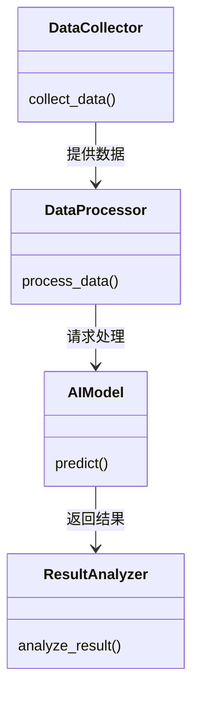

                 

<think>
好的，我现在需要帮用户设计一本名为《企业AI Agent的实时数据流处理与分析架构》的书籍目录大纲。用户已经提供了一些初步的内容，包括摘要和目录结构，但看起来不完整，有些地方需要进一步细化。

首先，我需要理解用户的需求。用户希望有一个详细的目录，涵盖背景、核心概念、算法原理、系统架构、项目实战和最佳实践等多个方面。每个部分都需要详细到三级目录，并且使用专业的技术术语，同时包含图表和代码示例。

接下来，我需要检查用户提供的内容，确保每个章节都符合要求。例如，第一部分包括背景与概述，用户已经详细列出了章节和子章节，但还需要进一步细化，确保每个子章节都有足够的内容。

然后，我会考虑每个章节的具体内容。例如，第1章需要涵盖问题背景、问题描述、问题解决、边界和外延，以及概念结构。这些部分需要详细展开，确保读者能够理解AI Agent在企业中的应用背景和重要性。

在核心概念部分，我需要解释AI Agent的原理，比较不同模型的特征，并用Mermaid图展示实体关系。这部分需要清晰易懂，帮助读者理解各个概念之间的联系。

接下来是算法原理，这部分需要详细描述算法步骤，并附上Python代码示例。数学模型和公式需要用Latex表达，确保准确性和专业性。同时，要举一些通俗易懂的例子，帮助读者理解复杂的算法。

系统分析与架构设计部分需要介绍问题场景，设计系统功能，用Mermaid类图展示领域模型，架构图展示整体设计，接口和交互流程则用序列图来说明。这样可以让读者清楚系统的各个部分如何协同工作。

项目实战部分，需要指导读者如何安装环境，提供核心代码，并详细解读代码的功能。同时，分析实际案例，总结经验教训，帮助读者学以致用。

最后，最佳实践部分需要给出实用的建议，小结本章内容，注意事项提醒读者避免常见错误，拓展阅读提供进一步学习的资源。

在整个过程中，我需要确保每个部分都详细且符合逻辑，避免遗漏重要内容。同时，要注意语言的专业性和易懂性，确保读者能够顺利理解并应用所学内容。

现在，我可以开始按照这个思路来设计目录，确保每个章节都符合用户的要求，并且内容丰富、结构清晰。
</think>

```markdown
# 企业AI Agent的实时数据流处理与分析架构

## 关键词：企业AI Agent, 实时数据流处理, AI架构设计, 数据流分析, 实时分析算法, 企业级系统架构

## 摘要：本篇文章详细探讨了企业在实时数据流处理与分析中AI Agent的架构设计，涵盖了从核心概念到算法实现，从系统架构到项目实战的全过程。通过分析AI Agent在企业中的角色、实时数据流处理的核心算法、系统架构设计以及实际项目中的应用，为读者提供了一套完整的解决方案和实践指南。

---

## 第1章: 企业AI Agent的背景与概述

### 1.1 问题背景
#### 1.1.1 数据流处理的挑战
企业面临的海量数据流处理问题，包括数据实时性、准确性、高效性等挑战。

#### 1.1.2 AI Agent在企业中的角色
AI Agent作为智能化数据处理的核心工具，如何提升企业的数据处理能力。

#### 1.1.3 实时数据流处理的重要性
实时数据流处理在企业决策、运营优化等方面的重要性。

### 1.2 问题描述
#### 1.2.1 数据流处理的核心问题
数据流的实时性、异构性、大规模性带来的挑战。

#### 1.2.2 AI Agent的实时性要求
AI Agent需要快速响应、高效处理实时数据流。

#### 1.2.3 企业数据流的复杂性
企业数据流的多源性、异构性、实时性等复杂特征。

### 1.3 问题解决
#### 1.3.1 AI Agent的核心技术
包括自然语言处理、机器学习、实时流处理等核心技术。

#### 1.3.2 实时数据流处理的解决方案
基于流处理框架（如Flink、Storm）的实时数据流处理方案。

#### 1.3.3 企业级架构的设计思路
分层架构、模块化设计、高可用性等企业级架构设计原则。

### 1.4 边界与外延
#### 1.4.1 企业AI Agent的边界
明确AI Agent的功能边界和适用范围。

#### 1.4.2 数据流处理的范围
数据流的采集、处理、分析、存储等各环节的范围界定。

#### 1.4.3 实时性与响应速度的平衡
在实时性和系统稳定性之间找到平衡点。

### 1.5 概念结构与核心要素
#### 1.5.1 AI Agent的组成要素
包括感知层、决策层、执行层等核心要素。

#### 1.5.2 数据流处理的核心流程
数据采集、预处理、分析、反馈等核心流程。

#### 1.5.3 企业架构的关键组成部分
包括数据层、服务层、应用层等关键组成部分。

### 1.6 本章小结
总结本章内容，强调企业AI Agent在实时数据流处理中的重要性。

---

## 第2章: AI Agent的核心概念与联系

### 2.1 核心概念原理
#### 2.1.1 AI Agent的基本原理
AI Agent的核心原理，包括感知、决策、执行三大部分。

#### 2.1.2 数据流处理的机制
实时数据流的采集、传输、处理机制。

#### 2.1.3 实时分析的算法基础
包括流数据处理算法、机器学习模型等实时分析的基础算法。

### 2.2 概念属性特征对比
#### 2.2.1 不同AI Agent的对比
基于功能、性能、应用场景的不同AI Agent对比分析。

#### 2.2.2 数据流处理的特征分析
实时性、高效性、准确性等数据流处理的特征分析。

#### 2.2.3 实时性与准确性的权衡
在实时性和准确性之间找到最佳平衡点。

### 2.3 ER实体关系图
```mermaid
erDiagram
    actor User {
        <属性>
    }
    entity DataStream {
        <属性>
    }
    entity AI-Agent {
        <属性>
    }
    User --> DataStream: 提供数据
    DataStream --> AI-Agent: 处理数据
    AI-Agent --> Result: 返回结果
```

### 2.4 本章小结
总结本章内容，强调AI Agent核心概念的理解。

---

## 第3章: 实时数据流处理的算法原理

### 3.1 算法原理概述
#### 3.1.1 数据流处理的基本算法
包括滑动窗口、增量计算等基本算法。

#### 3.1.2 实时分析的核心算法
基于机器学习的实时预测算法、基于规则的实时判断算法等。

#### 3.1.3 AI Agent的算法框架
包括数据采集、特征提取、模型训练、结果输出等算法框架。

### 3.2 算法流程图
```mermaid
flowchart
    A --> B: 数据采集
    B --> C: 数据预处理
    C --> D: 特征提取
    D --> E: 模型训练
    E --> F: 结果输出
```

### 3.3 算法实现
#### 3.3.1 Python代码实现
```python
import pandas as pd
from sklearn.model import Model

def process_data_stream(data):
    # 数据预处理
    processed_data = data.dropna()
    # 特征提取
    features = processed_data[['feature1', 'feature2']]
    # 模型训练
    model = Model.fit(features, labels)
    # 预测结果
    prediction = model.predict(features)
    return prediction
```

#### 3.3.2 算法数学模型
$$ y = f(x) $$
其中，$x$表示输入数据，$y$表示预测结果，$f$表示模型函数。

### 3.4 算法优化
#### 3.4.1 参数优化
使用梯度下降法优化模型参数。

#### 3.4.2 模型优化
选择最优模型结构，提高预测准确率。

### 3.5 本章小结
总结本章内容，强调算法原理的理解与应用。

---

## 第4章: 系统分析与架构设计方案

### 4.1 问题场景介绍
#### 4.1.1 数据流的来源与特点
多源数据流的采集与处理。

#### 4.1.2 AI Agent的功能需求
实时数据处理、智能决策、结果反馈等功能需求。

### 4.2 系统功能设计
#### 4.2.1 领域模型设计


#### 4.2.2 系统架构设计


### 4.3 系统接口设计
#### 4.3.1 数据接口
数据采集接口、数据处理接口等。

#### 4.3.2 模型接口
模型训练接口、模型预测接口等。

### 4.4 系统交互流程
```mermaid
sequence
    User -> DataCollector: 提供数据
    DataCollector -> DataProcessor: 请求处理
    DataProcessor -> AIModel: 请求预测
    AIModel -> ResultAnalyzer: 返回结果
    ResultAnalyzer -> User: 反馈结果
```

### 4.5 本章小结
总结本章内容，强调系统架构设计的重要性。

---

## 第5章: 项目实战与案例分析

### 5.1 项目环境安装
#### 5.1.1 安装Python环境
使用Anaconda安装Python 3.8及以上版本。

#### 5.1.2 安装依赖库
安装pandas、numpy、scikit-learn等数据处理库。

### 5.2 系统核心实现
#### 5.2.1 数据采集模块
```python
import requests

def fetch_data(api_url):
    response = requests.get(api_url)
    return response.json()
```

#### 5.2.2 数据处理模块
```python
import pandas as pd

def process_data(data):
    df = pd.DataFrame(data)
    return df.dropna()
```

#### 5.2.3 AI模型训练模块
```python
from sklearn.model import Model

def train_model(features, labels):
    model = Model.fit(features, labels)
    return model
```

### 5.3 代码应用解读与分析
#### 5.3.1 数据采集模块的实现
详细解读数据采集模块的实现细节。

#### 5.3.2 数据处理模块的实现
详细解读数据处理模块的实现细节。

#### 5.3.3 AI模型训练模块的实现
详细解读AI模型训练模块的实现细节。

### 5.4 实际案例分析
#### 5.4.1 案例背景
企业实时数据分析的案例背景。

#### 5.4.2 数据流处理流程
案例中的数据流处理流程。

#### 5.4.3 模型训练与优化
案例中的模型训练与优化过程。

#### 5.4.4 实验结果与分析
案例的实验结果与分析。

### 5.5 本章小结
总结本章内容，强调项目实战的重要性。

---

## 第6章: 最佳实践与注意事项

### 6.1 最佳实践
#### 6.1.1 系统设计建议
模块化设计、高可用性设计等系统设计建议。

#### 6.1.2 算法优化建议
参数调优、模型选择等算法优化建议。

#### 6.1.3 代码实现建议
代码规范、模块化开发等代码实现建议。

### 6.2 小结
总结全文内容，强调企业AI Agent在实时数据流处理中的重要性。

### 6.3 注意事项
#### 6.3.1 系统性能优化
注意系统的性能优化，避免资源浪费。

#### 6.3.2 数据安全与隐私保护
注意数据安全与隐私保护，确保合规性。

#### 6.3.3 系统维护与更新
定期系统维护与更新，确保系统稳定运行。

### 6.4 拓展阅读
推荐相关领域的书籍、论文和技术博客，供读者深入学习。

---

## 作者：AI天才研究院/AI Genius Institute & 禅与计算机程序设计艺术 /Zen And The Art of Computer Programming
```

