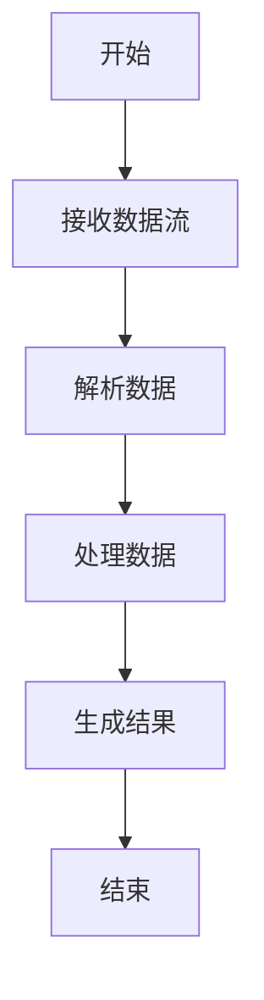
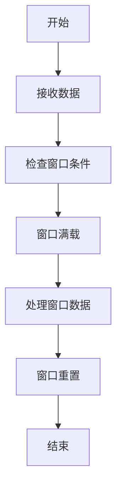
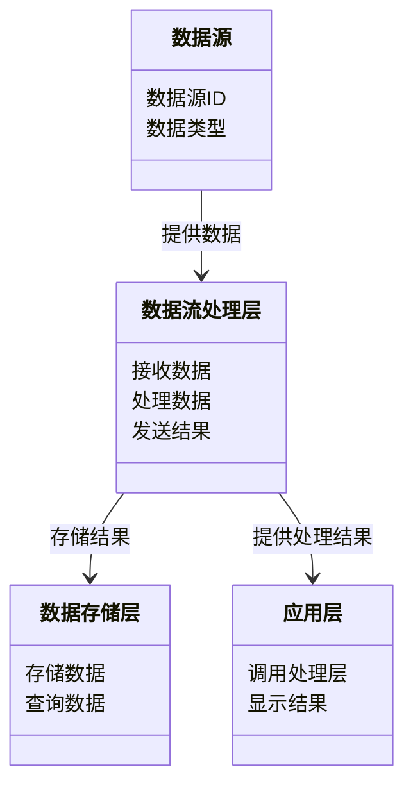
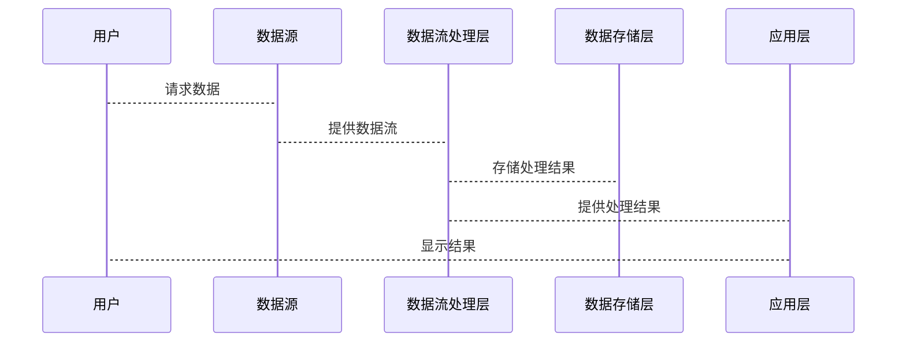

                 

<think>
好的，我需要根据用户提供的目录大纲，完成关于《企业AI Agent的实时数据流处理架构》的技术博客文章的编写。我会按照用户的要求，一步一步地分析和撰写内容。

首先，我需要理解每一章节的内容和要求。整个结构包括背景介绍、核心概念、算法原理、系统架构设计、项目实战和最佳实践等部分。每部分都有详细的子章节，我需要确保每个部分都详细且符合逻辑。

接下来，我将开始撰写文章。首先在开头部分，我会包括文章标题、关键词和摘要。然后按照目录大纲的结构，逐步展开每一章的内容，确保每一章节都有足够的细节，并且使用适当的格式和图表来辅助说明。

在撰写过程中，我需要特别注意使用清晰的技术语言，逻辑推理严密，同时保持文章的结构紧凑和易于理解。我会在适当的地方插入数学公式、mermaid图表和代码示例，以增强文章的技术性和可读性。

最后，在完成所有章节后，我会添加作者信息，并进行一次全面的检查，确保文章内容完整、格式正确，并且符合用户的所有要求。

现在，我开始撰写文章的详细内容。
</think>

# 企业AI Agent的实时数据流处理架构

> 关键词：AI Agent，实时数据流处理，企业架构，流处理模型，系统架构设计

> 摘要：本文深入探讨了企业AI Agent在实时数据流处理中的架构设计与实现。通过分析AI Agent的核心概念、实时数据流处理的算法原理、系统架构设计以及项目实战，本文旨在为企业提供一套完整的实时数据流处理解决方案，助力企业在复杂的数据流环境中实现高效、可靠的智能化处理。

---

## 第1章: 企业AI Agent的背景与问题背景

### 1.1 问题背景

#### 1.1.1 企业实时数据处理的需求
在现代企业中，数据的实时处理已成为核心竞争力之一。企业需要快速响应市场变化、优化业务流程，并通过实时数据分析做出决策。实时数据流处理的需求主要体现在以下几个方面：
- **快速响应**：企业需要在 milliseconds 级别处理数据，以应对实时事件。
- **高吞吐量**：数据流可能包含每秒数千甚至数万个事件，系统必须具备高吞吐量处理能力。
- **低延迟**：实时处理要求系统在极短时间内完成数据处理和反馈。

#### 1.1.2 AI Agent在企业中的角色
AI Agent（人工智能代理）是一种能够感知环境、自主决策并执行任务的智能实体。在企业中，AI Agent 可以作为数据流处理的核心组件，负责实时数据的接收、分析和响应。其主要角色包括：
- **数据消费者**：实时接收并处理数据流。
- **决策者**：基于实时数据做出智能化决策。
- **执行者**：根据决策结果执行相应的操作。

#### 1.1.3 实时数据流处理的核心问题
实时数据流处理涉及多个技术难点，以下是核心问题：
1. **数据一致性**：如何保证处理的数据是实时且一致的。
2. **低延迟处理**：如何在极短时间内完成数据处理并反馈结果。
3. **高可用性**：系统必须具备容错和自我恢复能力，确保数据流处理不中断。

### 1.2 问题描述

#### 1.2.1 数据流处理的挑战
- **数据多样性**：数据流可能包含结构化、半结构化和非结构化数据。
- **数据高速性**：数据流的速度可能非常快，系统需要高效处理。
- **数据准确性**：如何确保处理的数据是准确的，避免错误决策。

#### 1.2.2 AI Agent的实时性要求
- **实时感知**：AI Agent需要实时感知数据流的变化。
- **实时决策**：基于实时数据做出决策，并迅速执行。
- **实时反馈**：系统需要实时反馈处理结果，以便进行进一步优化。

#### 1.2.3 企业级数据流处理的复杂性
- **系统规模**：企业级数据流处理通常涉及大规模数据和复杂架构。
- **系统集成**：需要与企业现有系统（如数据库、消息队列等）无缝集成。
- **系统扩展性**：系统需要具备良好的扩展性，以应对数据量的增长。

### 1.3 问题解决

#### 1.3.1 AI Agent的实时数据流处理方案
- **分布式架构**：采用分布式系统架构，提升处理能力和容错性。
- **流处理引擎**：使用流处理引擎（如 Apache Flink）进行实时数据处理。
- **事件驱动**：采用事件驱动架构，确保数据处理的实时性和高效性。

#### 1.3.2 数据流处理的关键技术
- **流处理技术**：如 Apache Flink、Apache Kafka 等。
- **分布式计算**：如 MapReduce、Spark 等。
- **实时分析**：如时间序列分析、实时预测等。

#### 1.3.3 企业级架构的设计思路
- **分层架构**：将系统分为数据采集层、处理层、存储层和应用层。
- **模块化设计**：各模块独立开发和部署，提升系统的可维护性和扩展性。
- **容错设计**：通过冗余和备份机制确保系统的高可用性。

### 1.4 边界与外延

#### 1.4.1 AI Agent的边界
- **数据源**：AI Agent 接收的数据流来自何处。
- **处理范围**：AI Agent 能处理的数据类型和规模。
- **交互接口**：AI Agent 与其他系统或组件的接口定义。

#### 1.4.2 数据流处理的范围
- **数据来源**：数据流的来源，如传感器、数据库、API 等。
- **处理流程**：数据流的接收、解析、处理、存储和反馈。
- **目标范围**：数据处理的最终目标和应用场景。

#### 1.4.3 与其他系统的交互
- **数据源系统**：如数据库、消息队列等。
- **目标系统**：如业务系统、用户界面等。
- **中间件**：如 API 网关、服务网等。

### 1.5 概念结构与核心要素

#### 1.5.1 核心概念组成
- **数据流**：实时数据的流动和处理。
- **AI Agent**：具备感知和决策能力的智能代理。
- **处理引擎**：实时数据处理的核心组件。

#### 1.5.2 关键要素之间的关系
- **数据流与 AI Agent**：AI Agent 是数据流处理的主体，数据流是处理的对象。
- **处理引擎与 AI Agent**：处理引擎为 AI Agent 提供数据处理的能力，AI Agent 调用处理引擎完成任务。
- **数据源与目标系统**：数据源提供数据，目标系统接收处理结果。

#### 1.5.3 案例分析
例如，一个电商企业使用 AI Agent 实时处理用户行为数据，分析用户购买意向，并实时推送个性化推荐。在这个过程中，AI Agent 是数据流处理的主体，数据源是用户行为数据，目标系统是推荐系统。

---

## 第2章: 企业AI Agent的核心概念与联系

### 2.1 AI Agent的核心原理

#### 2.1.1 AI Agent的基本概念
AI Agent 是一种能够感知环境、自主决策并执行任务的智能实体。在企业实时数据流处理中，AI Agent 的核心原理包括：
- **感知环境**：通过传感器、API 等方式实时获取数据流。
- **自主决策**：基于获取的数据，使用机器学习、规则引擎等技术做出决策。
- **执行任务**：根据决策结果执行相应的操作，如触发报警、发送通知等。

#### 2.1.2 实时数据流处理的机制
实时数据流处理的机制主要包括：
- **事件驱动**：系统通过事件驱动的方式处理数据流，确保实时响应。
- **流处理引擎**：使用流处理引擎（如 Apache Flink）进行实时数据处理，支持窗口、连接等操作。
- **规则引擎**：通过规则引擎（如 Apache Drools）实现数据流的实时分析和决策。

#### 2.1.3 AI Agent与数据流的关系
AI Agent 与数据流的关系可以表示为：
$$ AI Agent \leftrightarrow 数据流 $$
其中，AI Agent 是数据流的消费者和处理者，数据流是 AI Agent 的输入和决策依据。

### 2.2 核心概念的属性特征对比

#### 2.2.1 数据流的特征分析
数据流的特征包括：
- **实时性**：数据流必须实时生成和处理。
- **高速性**：数据流的速度可能非常快，系统必须具备高吞吐量处理能力。
- **多样性**：数据流可能包含多种类型的数据。

#### 2.2.2 AI Agent的特征分析
AI Agent 的特征包括：
- **智能性**：具备自主决策和问题解决能力。
- **实时性**：能够实时感知和处理数据流。
- **适应性**：能够根据环境变化自适应调整行为。

#### 2.2.3 对比分析表

| 特征 | 数据流 | AI Agent |
|------|--------|-----------|
| 实时性 | 高     | 高         |
| 高速性 | 高     | 中         |
| 多样性 | 高     | 中         |
| 智能性 | 无     | 高         |
| 自主性 | 无     | 高         |

### 2.3 ER实体关系图架构

#### 2.3.1 实体关系图的构建
以下是 AI Agent 实时数据流处理的 ER 实体关系图：

```mermaid
erDiagram
    actor 用户 "User" {
        <- UserID : 整数
        <- Username : 字符串
    }
    actor 系统 "System" {
        <- SystemID : 整数
        <- SystemName : 字符串
    }
    entity 数据流 "DataStream" {
        <- StreamID : 整数
        <- StreamData : 字符串
        <- Timestamp : 时间戳
    }
    entity 处理结果 "ProcessResult" {
        <- ResultID : 整数
        <- ProcessedData : 字符串
        <- ResultTimestamp : 时间戳
    }
    用户 --> 数据流 : 发送数据
    数据流 --> 系统 : 处理数据
    系统 --> 处理结果 : 生成结果
    处理结果 --> 用户 : 反馈结果
```

#### 2.3.2 实体关系图的解释
- **用户**：数据流的来源或目标，可以是外部系统或用户。
- **系统**：负责接收和处理数据流，生成处理结果。
- **数据流**：实时数据的流动和处理。
- **处理结果**：系统处理数据流后的输出。

---

## 第3章: 实时数据流处理的算法原理

### 3.1 算法原理概述

#### 3.1.1 流处理模型
流处理模型的核心思想是将数据流视为一个无限长的序列，按照时间顺序处理每一条数据。流处理模型的流程如下：
1. 数据接收：从数据源接收实时数据流。
2. 数据处理：对每条数据进行解析、计算和处理。
3. 数据输出：将处理结果输出到目标系统或存储。

#### 3.1.2 窗口机制
窗口机制是流处理中的一个重要概念，用于将无限长的数据流划分为有限的窗口，方便进行批量处理。常见的窗口类型包括：
- **时间窗口**：基于时间范围定义窗口（如 5 分钟内）。
- **事件计数窗口**：基于事件数量定义窗口（如每 1000 条数据）。
- **滑动窗口**：窗口随时间推移不断滑动，确保数据处理的实时性。

#### 3.1.3 计算模型
计算模型是流处理的核心，常见的计算模型包括：
- **微批处理**：将数据流划分为小批量进行处理。
- **实时计算**：逐条数据处理，确保低延迟。
- **批量处理**：将数据流累积到一定量后进行批量处理。

### 3.2 算法流程图

#### 3.2.1 流处理流程图



#### 3.2.2 窗口处理流程图



### 3.3 算法实现代码

#### 3.3.1 Python代码示例

```python
import time

def process_stream():
    while True:
        data = receive_data()  # 接收数据流
        processed_data = process(data)  # 处理数据
        send_result(processed_data)  # 发送结果
        time.sleep(1)  # 等待1秒

def process(data):
    # 数据处理逻辑
    return processed_data

def receive_data():
    # 数据接收逻辑
    pass

def send_result(data):
    # 数据发送逻辑
    pass

if __name__ == "__main__":
    process_stream()
```

#### 3.3.2 代码功能分析
- **process_stream**：主函数，负责接收数据流并调用处理函数。
- **process**：数据处理函数，对每条数据进行处理。
- **receive_data** 和 **send_result**：数据接收和发送函数，具体实现取决于数据源和目标系统。

### 3.4 数学模型与公式

#### 3.4.1 流处理的数学模型
流处理的数学模型可以表示为：
$$ \text{处理结果} = f(\text{数据流}) $$
其中，$f$ 是数据处理函数，$\text{数据流}$ 是实时数据流。

#### 3.4.2 窗口计算的数学公式
时间窗口的计算公式为：
$$ \text{窗口时间} = \text{当前时间} - \text{窗口开始时间} $$
当窗口时间小于窗口大小时，窗口满载。

#### 3.4.3 示例计算过程
假设时间窗口为5分钟，当前时间戳为1625000000，窗口开始时间为1624997000。窗口时间计算为：
$$ 1625000000 - 1624997000 = 3000 \text{秒} $$
由于3000秒小于300秒（5分钟），窗口未满载。

---

## 第4章: 系统架构设计

### 4.1 项目介绍

#### 4.1.1 项目背景
本项目旨在设计一个企业级的AI Agent实时数据流处理系统，用于处理大规模实时数据流，实现智能化决策和反馈。

#### 4.1.2 项目目标
- 实现实时数据流的高效处理。
- 提供智能化的决策支持。
- 确保系统的高可用性和扩展性。

### 4.2 系统功能设计

#### 4.2.1 领域模型设计



#### 4.2.2 系统架构设计


#### 4.2.3 系统接口设计

- **数据源接口**：定义数据流的接收接口。
- **处理层接口**：定义数据处理的API。
- **存储层接口**：定义数据存储和查询的API。
- **应用层接口**：定义结果展示和用户交互的API。

#### 4.2.4 系统交互流程图



---

## 第5章: 项目实战

### 5.1 环境安装

#### 5.1.1 安装工具
- **Python**：安装 Python 3.x。
- **Flink**：安装 Apache Flink。
- **Kafka**：安装 Apache Kafka。

#### 5.1.2 安装依赖
安装必要的 Python 库：
```bash
pip install apache-flink kafka-python
```

### 5.2 系统核心实现

#### 5.2.1 接收数据流
```python
from kafka import KafkaConsumer
from flink import StreamExecutionEnvironment

def receive_data():
    consumer = KafkaConsumer('data_stream_topic')
    for message in consumer:
        yield message.value
```

#### 5.2.2 处理数据
```python
from flink.api.common.functions import Function

class DataProcessor(Function):
    def process_element(self, value):
        # 数据处理逻辑
        processed_value = value + 1
        return processed_value
```

#### 5.2.3 发送结果
```python
from kafka import KafkaProducer

def send_result(value):
    producer = KafkaProducer('result_stream_topic')
    producer.send(value)
```

### 5.3 代码应用解读

- **数据接收**：使用 Kafka 消费者接收数据流。
- **数据处理**：使用 Apache Flink 处理数据流，定义数据处理逻辑。
- **数据发送**：将处理结果发送到 Kafka 主题，供下游系统消费。

### 5.4 实际案例分析

#### 5.4.1 案例背景
假设我们有一个实时监控系统，需要实时处理传感器数据，检测设备异常。

#### 5.4.2 数据流处理流程
1. 传感器数据通过 Kafka 传输到数据流处理层。
2. 使用 Apache Flink 对数据流进行实时处理，检测设备状态。
3. 处理结果发送到 Kafka 主题，供监控系统显示。

### 5.5 项目小结

通过本项目，我们实现了企业级AI Agent的实时数据流处理系统，掌握了流处理引擎的使用和系统架构设计的方法。在实际应用中，可以根据具体需求进行扩展和优化。

---

## 第6章: 最佳实践与小结

### 6.1 最佳实践

#### 6.1.1 性能优化
- 使用高效的流处理引擎（如 Apache Flink）。
- 避免全量数据处理，采用抽样或增量处理。

#### 6.1.2 系统安全性
- 数据加密传输。
- 权限控制，确保数据流的安全性。

#### 6.1.3 系统可扩展性
- 使用分布式架构，确保系统的可扩展性。
- 采用模块化设计，便于后续功能扩展。

### 6.2 小结

本文详细探讨了企业AI Agent的实时数据流处理架构，从背景介绍、核心概念、算法原理到系统架构设计和项目实战，为企业提供了完整的解决方案。通过本文的学习，读者可以掌握实时数据流处理的核心技术，并将其应用到实际项目中。

### 6.3 注意事项

- 数据一致性：确保数据处理过程中数据的一致性。
- 系统容错性：设计容错机制，确保系统的高可用性。
- 性能监控：实时监控系统性能，及时发现和解决问题。

### 6.4 拓展阅读

- Apache Flink 官方文档：[Flink Documentation](https://flink.apache.org/documentation.html)
- Apache Kafka 官方文档：[Kafka Documentation](https://kafka.apache.org/documentation.html)
- 实时数据流处理的经典书籍：《Data Streaming Made Simple》

---

作者：AI天才研究院/AI Genius Institute & 禅与计算机程序设计艺术 /Zen And The Art of Computer Programming

