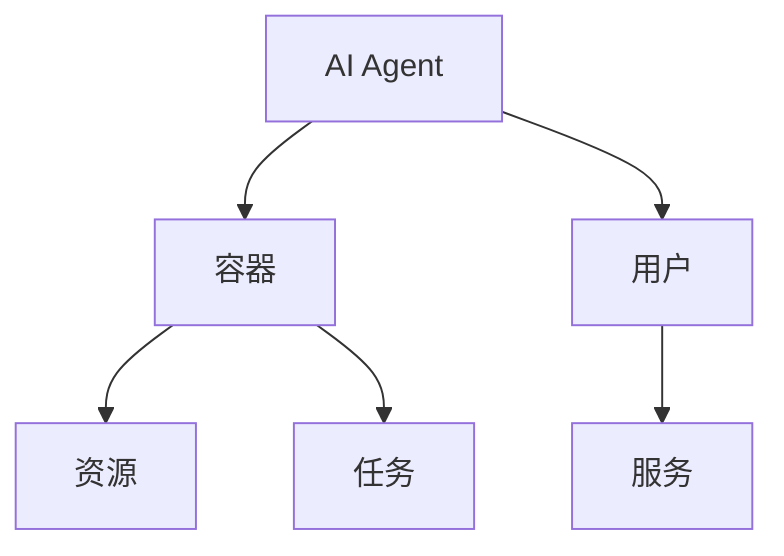
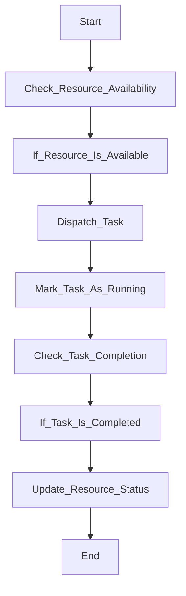
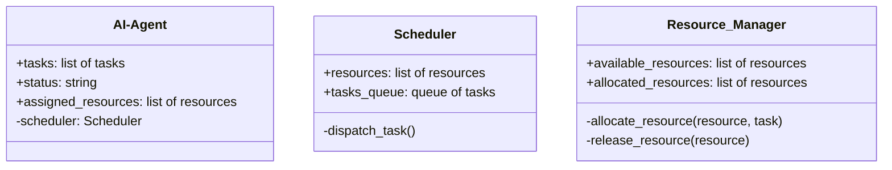
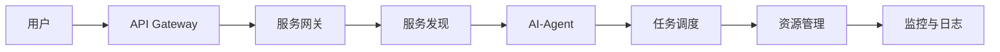

                 


# 《企业AI Agent的容器化应用编排策略》

---

## 关键词：企业AI Agent，容器化，Kubernetes，编排策略，Docker，微服务

---

## 摘要

随着人工智能技术的快速发展，企业AI Agent（智能代理）的应用场景越来越广泛。AI Agent作为一种能够感知环境、自主决策并执行任务的智能实体，正在成为企业数字化转型的重要工具。然而，AI Agent的复杂性和动态性对企业在部署、管理和服务交付方面提出了更高的要求。容器化技术的引入为AI Agent的高效部署和弹性扩展提供了新的解决方案，而容器编排技术则进一步优化了资源利用率和服务交付的稳定性。

本文将详细探讨企业AI Agent的容器化应用编排策略，从理论到实践，系统性地分析其核心概念、算法原理、系统架构以及实际应用案例。通过本文，读者将能够全面理解企业AI Agent容器化的优势、挑战及解决方案。

---

## 第一部分: 企业AI Agent与容器化应用概述

### 第1章: 企业AI Agent的背景与概念

#### 1.1 问题背景与问题描述

在企业环境中，AI Agent通常用于自动化任务执行、数据处理、智能决策等领域。然而，传统的部署方式存在以下问题：

- **资源利用率低**：AI Agent的部署通常需要高性能计算资源，而传统虚拟机的资源隔离性导致资源浪费。
- **部署复杂性高**：AI Agent的依赖项众多，手动部署和配置耗时且容易出错。
- **动态扩展困难**：面对突发的业务需求，手动扩缩容无法满足实时性要求。

容器化技术的引入为这些问题提供了解决方案。容器化能够提供轻量级的隔离环境，快速部署和弹性扩展，同时支持微服务架构，使得AI Agent的部署和管理更加高效。

#### 1.2 问题解决与边界分析

通过容器化技术，企业可以将AI Agent及其依赖项打包为一个独立的容器镜像，实现快速部署和一致的运行环境。容器编排技术（如Kubernetes）则进一步优化了资源利用率和服务交付的稳定性。

企业AI Agent容器化的边界包括：

- **资源管理**：容器化技术负责资源分配和回收。
- **任务调度**：编排系统负责任务的分配和执行。
- **服务发现与通信**：容器网络实现服务间的通信。

#### 1.3 核心概念与关键要素

- **AI Agent**：具备感知环境、自主决策和执行任务的能力。
- **容器化技术**：提供轻量级的虚拟化环境，确保一致性和高效性。
- **编排策略**：优化资源分配和任务执行的策略。

通过以上分析，我们可以看到，容器化技术为AI Agent的高效部署和管理提供了坚实的基础。

---

## 第2章: 企业AI Agent与容器化技术的核心联系

### 2.1 核心概念原理

AI Agent通过容器化技术实现轻量级部署，容器编排技术则优化了资源分配和任务调度。两者的结合使得企业能够高效管理AI Agent，同时保证服务的稳定性和可扩展性。

### 2.2 核心概念属性对比

以下表格展示了AI Agent与传统应用、容器化与虚拟化技术的核心对比：

| 对比维度        | AI Agent                   | 传统应用                   |
|------------------|-----------------------------|-----------------------------|
| 部署方式         | 容器化部署                  | 虚拟机或物理机部署         |
| 资源利用率       | 高                          | 低                          |
| 扩展性           | 弹性扩展                   | 手动或静态扩展             |

### 2.3 ER实体关系图



---

## 第3章: 企业AI Agent容器化编排的算法原理

### 3.1 算法概述

企业AI Agent的容器化编排需要解决任务调度、资源分配和负载均衡等问题。以下是一个优化任务调度的算法流程：



### 3.2 数学模型与公式

任务调度的优化问题可以用以下数学模型表示：

$$ \text{目标函数} = \sum_{i=1}^{n} \text{任务i的完成时间} $$

约束条件包括资源限制和任务优先级。通过求解上述模型，可以得到最优的任务分配策略。

### 3.3 代码实现

以下是一个Python实现的任务调度算法示例：

```python
def schedule_task(tasks, resources):
    for task in tasks:
        if resources_available(resources):
            allocate_resource(resources, task)
            start_task(task)
            monitor_task(task)
    return resources

def resources_available(resources):
    return sum(resource.used < resource.capacity for resource in resources) > 0

def allocate_resource(resources, task):
    for resource in resources:
        if resource.used < resource.capacity:
            resource.used += task.required
            break
```

---

## 第4章: 企业AI Agent容器化编排的系统架构设计

### 4.1 系统功能设计

系统功能模块包括任务调度、资源管理、监控与日志、服务发现等。以下是一个领域模型：



### 4.2 系统架构设计

系统架构采用分层设计，包括数据层、服务层和应用层。以下是一个架构图：



---

## 第5章: 企业AI Agent容器化编排的项目实战

### 5.1 环境搭建

项目需要以下环境：

- 操作系统：Linux
- 容器引擎：Docker
- 编排工具：Kubernetes

### 5.2 核心代码实现

以下是任务调度模块的实现：

```python
import kubernetes.client as k8s_client
from kubernetes.client import api_client

def create_pod(task):
    api = k8s_client.BatchApi(api_client.ApiClient())
    pod = {
        "api_version": "batch/v1",
        "kind": "Job",
        "metadata": {
            "name": task.name
        },
        "spec": {
            "parallelism": 1,
            "completions": 1,
            "selector": {
                "match_labels": {
                    "name": task.name
                }
            },
            "template": {
                "metadata": {
                    "labels": {
                        "name": task.name
                    }
                },
                "spec": {
                    "containers": [{
                        "name": task.name,
                        "image": task.image,
                        "command": task.command
                    }]
                }
            }
        }
    }
    api.create_namespaced_job("default", pod)
```

### 5.3 案例分析

假设我们有一个图像识别任务，通过容器编排实现任务的自动调度和资源分配。具体步骤如下：

1. **任务定义**：定义图像识别任务，包括镜像、命令等。
2. **资源分配**：根据任务需求分配计算资源。
3. **任务调度**：通过Kubernetes API创建Job，启动任务执行。
4. **监控与日志**：实时监控任务状态，记录日志。

---

## 第6章: 总结与展望

### 6.1 本章总结

企业AI Agent的容器化编排通过容器技术和编排策略，解决了部署复杂、资源利用率低和动态扩展困难等问题。本文从理论到实践，详细分析了其核心概念、算法原理和系统架构设计。

### 6.2 展望未来

随着AI技术的不断发展，企业AI Agent的容器化编排将更加智能化和自动化。未来的研究方向包括：

- 更智能的任务调度算法。
- 更高效的资源分配策略。
- 更强大的容器网络与服务发现机制。

---

## 作者：AI天才研究院 & 禅与计算机程序设计艺术

---

希望这篇文章能够为读者提供关于企业AI Agent容器化编排的全面理解，并为实际应用提供有价值的参考。

