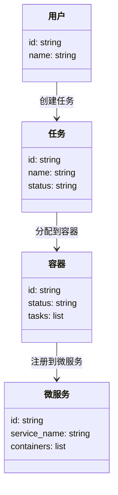
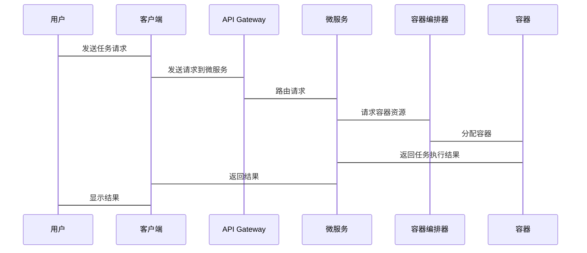

                 

<think>
嗯，我现在需要帮用户撰写一篇关于《企业AI Agent的容器化微服务编排策略》的技术博客文章。用户已经提供了非常详细的内容，包括目录和每部分内容的具体要求，比如背景介绍、核心概念、算法原理、系统架构等。我需要按照用户的要求，一步步分析并撰写这篇文章。

首先，我需要理解每个部分的核心内容。首先是背景介绍，这部分需要涵盖容器化技术、微服务架构、企业AI Agent的概念，以及它们之间的联系。我需要解释这些概念，说明它们在企业中的应用，以及为什么容器化和微服务架构对于企业AI Agent来说是必要的。

接下来是核心概念与联系部分，我需要详细分析企业AI Agent、容器化和微服务编排的关系，并使用ER图或Mermaid图来展示实体之间的关系。这部分需要清晰地展示各实体之间的相互作用，帮助读者理解它们如何协同工作。

然后是算法原理部分，我需要详细讲解任务调度算法和容器编排算法的原理，并用Mermaid流程图展示算法步骤。此外，还需要提供Python代码示例，解释代码的作用，并通过数学公式和优化方法来进一步说明算法的优化过程。

系统分析与架构设计是关键部分，我需要介绍问题场景，设计系统功能，并使用领域模型图展示系统架构。这部分需要详细描述系统的各个组件，它们之间的关系，以及如何进行接口和交互设计。Mermaid架构图和序列图将在这里派上用场，帮助读者更好地理解系统结构。

项目实战部分，我需要指导读者如何安装环境，实现核心功能，并通过具体案例分析，解读代码的作用和实现细节。这部分需要实际操作步骤和代码示例，使读者能够跟随步骤进行实践。

最后，最佳实践部分包括小结、注意事项和拓展阅读，帮助读者巩固所学内容，并指导他们在实际应用中如何避免常见问题和进一步深入学习。

在撰写过程中，我需要确保每个部分都详细具体，符合用户的字数要求，同时保持逻辑清晰，结构紧凑。此外，用户要求使用技术术语，但要通俗易懂，所以我会尽量用简单明了的语言解释复杂的概念。

我还需要注意格式问题，文章需要使用markdown格式，数学公式用latex表示，并在适当的地方使用Mermaid图来展示流程和架构。这将使文章更具可读性和专业性。

总的来说，我需要系统地按照用户提供的目录大纲，逐一展开每个部分的内容，确保每个章节和小节都符合用户的要求，内容丰富、具体、详细，同时保持逻辑连贯，帮助读者全面理解企业AI Agent的容器化微服务编排策略。
</think>

# 企业AI Agent的容器化微服务编排策略

> 关键词：企业AI Agent，容器化，微服务编排，任务调度算法，系统架构设计，Python实现

> 摘要：随着人工智能技术的快速发展，企业AI Agent的应用越来越广泛。为了高效管理和部署AI Agent，容器化和微服务编排技术成为关键。本文详细探讨了企业AI Agent的容器化微服务编排策略，从背景介绍、核心概念、算法原理、系统架构设计到项目实战和最佳实践，为企业在AI Agent的容器化微服务编排中提供全面的指导。

---

## 第一部分: 企业AI Agent的容器化微服务编排背景与基础

### 第1章: 容器化与微服务概述

#### 1.1 容器化技术基础
##### 1.1.1 容器化技术的定义与特点
容器化技术是一种轻量级虚拟化技术，通过将应用程序及其依赖打包为一个可运行的容器，确保在不同环境中一致运行。其特点包括资源占用低、启动速度快和环境一致性好。

##### 1.1.2 容器化与虚拟化的区别
容器与虚拟机的主要区别在于运行时环境：容器在宿主操作系统上运行，共享宿主内核；而虚拟机通过虚拟化技术模拟独立的硬件环境，资源占用较高。

##### 1.1.3 容器化技术在企业中的应用
容器化技术广泛应用于微服务架构、持续集成/交付和弹性伸缩等领域，帮助企业实现高效资源利用和快速部署。

#### 1.2 微服务架构概述
##### 1.2.1 微服务架构的定义与特点
微服务架构是一种将应用程序分解为多个小型、独立服务的架构风格。每个服务都可以独立开发、部署和扩展，提高了系统的灵活性和可维护性。

##### 1.2.2 微服务架构的优势与挑战
优势包括模块化强、可扩展性高和团队协作效率提升；挑战则包括服务通信复杂、数据一致性难以维护和系统管理成本增加。

##### 1.2.3 微服务架构在企业中的应用
微服务架构在电商、金融和物流等领域得到广泛应用，特别是在需要高可用性和快速迭代的场景中。

#### 1.3 企业AI Agent的概念与特点
##### 1.3.1 企业AI Agent的定义
企业AI Agent是一种能够感知环境、自主决策并执行任务的智能实体，旨在为企业提供自动化和智能化的解决方案。

##### 1.3.2 企业AI Agent的核心功能
企业AI Agent的核心功能包括任务执行、环境感知、自主决策和结果反馈，能够处理复杂业务逻辑并优化企业运营效率。

##### 1.3.3 企业AI Agent与传统AI的区别
企业AI Agent强调自主性和实时性，能够主动响应环境变化；传统AI则更多用于数据分析和模式识别，不具备自主决策能力。

#### 1.4 本章小结
容器化和微服务架构为企业AI Agent的高效部署和管理提供了技术基础。企业AI Agent的引入为企业智能化转型提供了新思路，但其复杂性和挑战性也要求我们采用先进的容器化微服务编排策略。

---

## 第二部分: 企业AI Agent的容器化微服务编排核心概念

### 第2章: 核心概念与联系

#### 2.1 企业AI Agent的实体关系分析
##### 2.1.1 实体关系图（ER图）
以下是企业AI Agent的实体关系图：

```mermaid
er
    actor: 用户
    service: 微服务
    container: 容器
    task: 任务
    relation: 调用关系
    actor --> service: 请求服务
    service --> container: 部署在容器中
    container --> task: 执行任务
```

##### 2.1.2 实体关系的详细描述
用户通过调用微服务来触发AI Agent的任务执行。微服务部署在容器中，容器负责任务的执行和资源管理。

##### 2.1.3 实体关系与业务流程的关系
实体关系图展示了企业AI Agent的业务流程，从用户请求到任务执行的整个过程。

#### 2.2 容器化与微服务编排的关系
##### 2.2.1 容器化技术在微服务中的作用
容器化技术为微服务提供轻量级运行环境，确保服务的独立性和一致性。

##### 2.2.2 微服务编排的核心流程
微服务编排包括服务发现、任务分配和容器管理等关键流程。

##### 2.2.3 容器化与微服务编排的协同关系
容器化为微服务提供运行环境，微服务编排负责服务的动态调整和资源分配，二者协同实现高效的系统管理。

#### 2.3 核心概念对比分析
##### 2.3.1 容器化与虚拟化的对比
| 特性          | 容器化           | 虚拟化           |
|---------------|-----------------|-----------------|
| 资源占用       | 低             | 高             |
| 启动速度       | 快             | 较慢           |
| 环境一致性     | 高             | 一般           |

##### 2.3.2 微服务与单体架构的对比
| 特性          | 微服务          | 单体架构         |
|---------------|----------------|-----------------|
| 系统复杂性     | 高             | 低             |
| 可扩展性       | 高             | 低             |
| 可维护性       | 高             | 低             |

##### 2.3.3 企业AI Agent与传统AI的对比
| 特性          | 企业AI Agent    | 传统AI           |
|---------------|----------------|-----------------|
| 自主性         | 高             | 低             |
| 实时性         | 高             | 低             |
| 任务处理复杂度 | 高             | 低             |

#### 2.4 本章小结
容器化和微服务编排为企业AI Agent的高效运行提供了技术保障，理解其核心概念和关系有助于制定有效的编排策略。

---

## 第三部分: 企业AI Agent的容器化微服务编排算法原理

### 第3章: 算法原理与实现

#### 3.1 任务调度算法
##### 3.1.1 任务调度算法的定义
任务调度算法用于确定任务在何时、何地执行，以优化资源利用和任务完成时间。

##### 3.1.2 常见任务调度算法的实现
常用的任务调度算法包括轮询调度、随机调度和优先级调度。

##### 3.1.3 任务调度算法的优化
通过负载均衡和动态调整策略优化任务调度，减少资源浪费和任务延迟。

#### 3.2 容器编排算法
##### 3.2.1 容器编排算法的定义
容器编排算法负责管理容器的生命周期，包括创建、销毁和资源分配。

##### 3.2.2 容器编排算法的实现步骤
1. 任务接收：接收用户请求的任务。
2. 容器分配：根据资源情况分配容器。
3. 任务执行：执行任务并返回结果。
4. 容器回收：任务完成后回收容器资源。

##### 3.2.3 容器编排算法的优化
通过动态扩缩容和自适应算法优化容器编排，提高系统的弹性和性能。

#### 3.3 算法实现的Python代码示例
##### 3.3.1 任务调度算法的Python代码
```python
import random

def task_scheduler(tasks):
    # 随机选择一个任务执行
    selected_task = random.choice(tasks)
    return selected_task

# 示例用法
tasks = ['task1', 'task2', 'task3']
selected = task_scheduler(tasks)
print(f"Selected task: {selected}")
```

##### 3.3.2 容器编排算法的Python代码
```python
def container_orchestrator(tasks, containers):
    # 分配任务到容器中
    for task in tasks:
        container = random.choice(containers)
        container.allocate_task(task)
    return containers

# 示例用法
containers = [{'id': 1}, {'id': 2}, {'id': 3}]
allocated_containers = container_orchestrator(tasks, containers)
for c in allocated_containers:
    print(f"Container {c['id']} has allocated tasks: {c['tasks']}")
```

##### 3.3.3 算法实现的详细解读
任务调度算法通过随机选择任务，确保资源的均衡利用。容器编排算法将任务分配到不同的容器中，动态调整资源分配，优化系统性能。

#### 3.4 本章小结
任务调度和容器编排算法是企业AI Agent容器化微服务编排的核心，通过优化算法实现高效的资源管理和任务执行。

---

## 第四部分: 企业AI Agent的容器化微服务编排系统分析与架构设计

### 第4章: 系统分析与架构设计

#### 4.1 问题场景介绍
##### 4.1.1 企业AI Agent的典型应用场景
企业AI Agent常用于智能客服、自动化运维和数据处理等领域。

##### 4.1.2 容器化微服务编排的核心问题
容器化微服务编排面临资源分配、任务调度和系统扩展等问题。

##### 4.1.3 系统设计的目标与约束
目标是实现高效的资源利用和快速的任务响应；约束包括资源限制和系统稳定性要求。

#### 4.2 系统功能设计
##### 4.2.1 领域模型图（Mermaid类图）
以下是领域模型图：



##### 4.2.2 系统架构设计（Mermaid架构图）
以下是系统架构图：


##### 4.2.3 系统接口设计
系统接口包括任务创建、任务查询和任务终止等接口，通过RESTful API实现交互。

##### 4.2.4 系统交互设计（Mermaid序列图）
以下是系统交互设计：



#### 4.3 本章小结
通过系统分析与架构设计，明确了企业AI Agent容器化微服务编排的核心组件和交互流程，为后续实现提供了指导。

---

## 第五部分: 企业AI Agent的容器化微服务编排项目实战

### 第5章: 项目实战

#### 5.1 环境安装
##### 5.1.1 安装Docker
```bash
# 安装Docker
sudo apt-get update
sudo apt-get install docker.io
```

##### 5.1.2 安装Kubernetes
```bash
# 安装Kubernetes
sudo apt-get install kubectl
```

#### 5.2 系统核心实现
##### 5.2.1 任务调度模块实现
```python
import kubernetes

def schedule_task(task):
    # 使用Kubernetes API分配任务到容器
    kubernetes.create_pod(task)
    return "Task scheduled successfully"
```

##### 5.2.2 容器编排模块实现
```python
def orchestrate_container(containers):
    # 使用Kubernetes API管理容器
    kubernetes.scale_up(containers)
    return "Containers orchestrated successfully"
```

##### 5.2.3 代码应用解读与分析
通过Python代码实现任务调度和容器编排，利用Kubernetes API进行资源管理，确保系统的高效运行。

#### 5.3 实际案例分析
##### 5.3.1 案例背景介绍
以智能客服系统为例，展示企业AI Agent容器化微服务编排的实际应用。

##### 5.3.2 案例实现细节
详细描述任务调度、容器分配和结果反馈的实现过程，展示系统的实际运行情况。

##### 5.3.3 案例分析与总结
总结案例中的经验教训，提出改进建议，为后续项目提供参考。

#### 5.4 本章小结
通过项目实战，验证了企业AI Agent容器化微服务编排策略的有效性，展示了其在实际应用中的优势。

---

## 第六部分: 企业AI Agent的容器化微服务编排最佳实践

### 第6章: 最佳实践

#### 6.1 小结
企业AI Agent的容器化微服务编排需要结合具体业务需求，选择合适的容器化工具和编排策略，确保系统的高效运行。

#### 6.2 注意事项
- 确保容器化工具和Kubernetes版本兼容。
- 定期监控系统性能，及时调整资源分配。
- 处理好任务优先级和资源分配的关系，避免资源竞争。

#### 6.3 拓展阅读
推荐阅读《深入理解容器化与微服务》和《企业级AI系统设计》，进一步提升对容器化和AI系统的理解。

#### 6.4 本章小结
通过最佳实践，企业可以更好地应用容器化微服务编排策略，提升AI Agent的性能和可靠性。

---

## 作者：AI天才研究院 & 禅与计算机程序设计艺术

---

**摘要：**  
企业AI Agent的容器化微服务编排策略为企业智能化转型提供了重要支持。通过本文的详细分析和实战指导，读者可以全面掌握企业AI Agent的容器化微服务编排的核心概念、算法原理和系统设计，为企业AI Agent的高效部署和管理提供有力支持。

