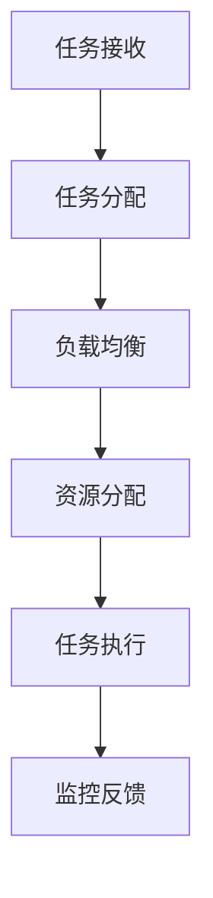
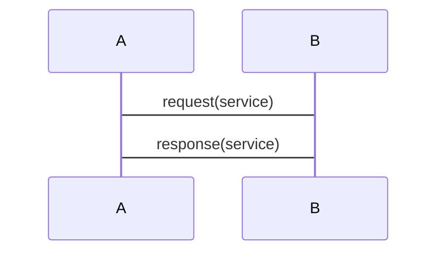
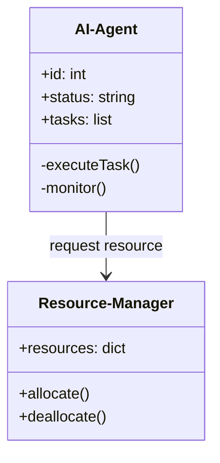
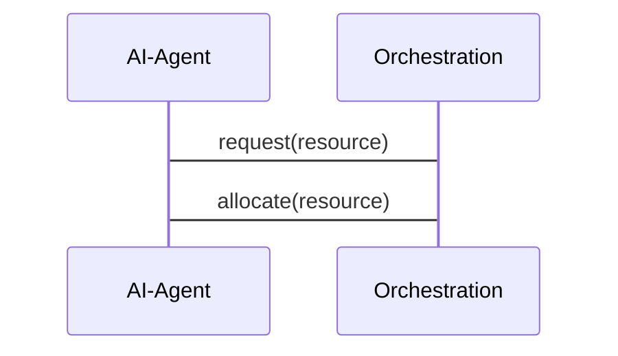

                 


# 《企业AI Agent的容器化微服务部署策略》

> **关键词**：企业AI Agent，容器化，微服务，部署策略，Docker，Kubernetes

> **摘要**：本文详细探讨了企业AI Agent的容器化微服务部署策略，从背景、核心概念到实际部署策略进行了全面分析。通过介绍容器化技术、微服务架构、容器编排算法、数学模型以及系统架构设计，结合实际项目案例，提供了从理论到实践的详细指导。文章最后给出了最佳实践、小结和扩展阅读建议，帮助读者全面理解和应用企业AI Agent的容器化微服务部署策略。

---

# 第一部分：企业AI Agent的背景与概念

## 第1章：企业AI Agent的基本概念

### 1.1 AI Agent的定义与核心特征
AI Agent（人工智能代理）是指能够感知环境、自主决策并执行任务的智能实体。其核心特征包括：
- **自主性**：无需外部干预，自主决策。
- **反应性**：能实时感知环境变化并做出反应。
- **目标导向性**：以特定目标为导向，优化行为。

### 1.2 企业AI Agent的应用场景
企业AI Agent广泛应用于：
- **智能客服**：提供24/7的客户支持。
- **自动化运维**：监控系统状态，自动修复问题。
- **智能推荐**：根据用户行为推荐产品或服务。

### 1.3 企业AI Agent与传统AI的区别
| 特性       | 传统AI                  | 企业AI Agent           |
|------------|-------------------------|-------------------------|
| 行为方式    | 静态执行                | 自主决策，动态执行      |
| 部署方式    | 集中式部署              | 分布式部署              |
| 交互能力    | 单向输出                | 双向交互，实时反馈      |

## 第2章：容器化技术的背景与特点

### 2.1 容器化技术的基本概念
容器化是一种轻量级的虚拟化技术，通过容器运行时环境隔离进程，确保不同应用之间的依赖不会冲突。

### 2.2 容器化技术的核心优势
- **轻量高效**：启动速度快，资源消耗低。
- **环境一致性**：确保开发、测试和生产环境一致。
- **易于扩展**：快速部署和弹性伸缩。

### 2.3 容器化技术在企业中的应用现状
- **开发测试**：快速构建和测试环境。
- **部署交付**：简化应用部署流程。
- **多环境支持**：支持多种操作系统和运行环境。

## 第3章：微服务架构的背景与特点

### 3.1 微服务架构的基本概念
微服务架构是一种将应用程序分解为小型、独立服务的设计方法，每个服务负责特定功能。

### 3.2 微服务架构的核心优势
- **独立部署**：每个服务可以独立部署和扩展。
- **技术多样性**：允许使用不同技术栈开发服务。
- **可维护性**：服务粒度小，便于维护和升级。

### 3.3 微服务架构在企业中的应用现状
- **分布式系统**：适用于复杂业务场景。
- **快速迭代**：支持快速功能开发和发布。
- **弹性扩展**：根据负载自动调整资源。

---

# 第二部分：容器化微服务架构的理论基础

## 第4章：容器编排算法

### 4.1 容器编排算法的核心概念
容器编排算法负责任务调度、负载均衡和资源分配，确保系统高效运行。

### 4.2 容器编排算法的实现流程


### 4.3 容器编排算法的数学模型
容器编排的目标是优化资源利用率，数学模型如下：
$$ \text{目标函数} = \sum_{i=1}^{n} w_i \cdot x_i $$
其中，\( w_i \) 是权重，\( x_i \) 是资源分配变量。

### 4.4 容器编排算法的Python实现
```python
def allocate_resource(tasks, resources):
    for task in tasks:
        if task.requested_resources <= resources:
            allocate(task.id, resources)
            resources -= task.requested_resources
```

## 第5章：微服务间通信机制

### 5.1 微服务间通信的核心概念
微服务间通信通过API接口实现，支持服务发现和服务调用。

### 5.2 微服务间通信的实现流程


### 5.3 微服务间通信的数学模型
通信效率优化模型：
$$ \text{效率} = \frac{\text{请求总数}}{\text{响应时间}} $$

---

# 第三部分：企业AI Agent系统的分析与架构设计

## 第6章：问题场景分析

### 6.1 问题场景介绍
AI Agent在企业中的常见问题包括：
- **资源分配**：如何高效分配计算资源。
- **负载均衡**：如何避免服务过载。
- **弹性扩展**：如何根据负载自动调整资源。

## 第7章：系统功能设计

### 7.1 系统功能模块
| 模块名称     | 功能描述                         |
|--------------|----------------------------------|
| 资源管理模块 | 管理计算资源，如CPU、内存等       |
| 任务调度模块 | 调度AI Agent的任务执行           |
| 监控模块     | 监控系统运行状态，提供反馈       |

### 7.2 系统功能设计的Mermaid类图


## 第8章：系统架构设计

### 8.1 系统架构的Mermaid图


## 第9章：系统接口与交互设计

### 9.1 系统接口设计
- **API接口**：提供RESTful API，如`POST /api/task`。
- **消息队列**：使用Kafka或RabbitMQ进行异步通信。

### 9.2 系统交互的Mermaid序列图


---

# 第四部分：项目实战与实现

## 第10章：项目环境与工具安装

### 10.1 环境要求
- **操作系统**：Linux/Windows/macOS
- **工具安装**：
  - Docker：`brew install docker`
  - Kubernetes：`brew install kubectl`

## 第11章：核心代码实现

### 11.1 容器编排的Python代码
```python
def allocate_resource(tasks, resources):
    for task in tasks:
        if task.requested_resources <= resources:
            allocate(task.id, resources)
            resources -= task.requested_resources
```

### 11.2 微服务通信的实现
```python
from flask import Flask
app = Flask(__name__)

@app.route('/api/task', methods=['POST'])
def create_task():
    return 'Task created'
```

## 第12章：案例分析与代码解读

### 12.1 案例分析
通过部署一个AI客服系统，展示容器化微服务的优势。

### 12.2 代码解读
解释上述Python代码，说明其在任务分配和资源管理中的作用。

## 第13章：项目总结与优化建议

### 13.1 项目总结
总结项目成果，强调容器化微服务的优势。

### 13.2 优化建议
- **引入AI优化算法**：提高资源分配效率。
- **优化通信机制**：减少延迟，提高吞吐量。

---

# 第五部分：最佳实践与扩展阅读

## 第14章：最佳实践

### 14.1 容器化部署建议
- 使用镜像仓库管理容器镜像。
- 配置自动备份和恢复机制。

### 14.2 微服务设计建议
- 服务粒度适中，避免过度分割。
- 使用API网关统一入口。

## 第15章：小结与注意事项

### 15.1 小结
总结全文，强调企业AI Agent容器化微服务部署的重要性。

### 15.2 注意事项
- 安全性：确保容器和微服务的安全性。
- 监控与日志：建立完善的监控和日志系统。

## 第16章：拓展阅读与未来方向

### 16.1 拓展阅读
推荐书籍和论文，如《微服务设计》、《容器化技术实践》。

### 16.2 未来方向
- 研究AI Agent与边缘计算的结合。
- 探索更高效的容器编排算法。

---

# 结论

企业AI Agent的容器化微服务部署策略是一个复杂的系统工程，需要结合容器化技术、微服务架构和AI算法的优化。通过本文的详细讲解和实际案例分析，读者可以全面理解并掌握企业AI Agent的容器化微服务部署策略。未来，随着技术的不断进步，企业AI Agent的部署策略将更加智能化和高效化。

---

**作者：AI天才研究院/AI Genius Institute & 禅与计算机程序设计艺术 /Zen And The Art of Computer Programming**

