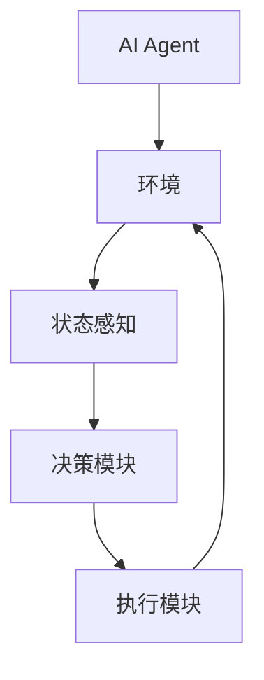

                 

<think>
好，我现在需要根据用户的要求，撰写一篇关于《企业AI Agent的强化学习在动态资源分配中的应用》的技术博客文章。首先，我要理解用户的需求，确保文章结构符合大纲，并且内容详实、逻辑清晰。

首先，用户提供了详细的大纲，包括七章内容。每章都有具体的子标题，覆盖了从背景到实现的各个方面。我需要确保每一部分都按照要求展开，使用专业而易懂的语言。

开始写作前，我会先规划每章的主要内容。例如，第一章介绍AI Agent和强化学习的基本概念，第二章讨论动态资源分配的背景和挑战，第三章讲解模型构建，第四章详细说明实现过程，第五章分析系统架构，第六章提供项目实战，第七章总结经验和未来展望。

在写作过程中，我会注意使用Mermaid图来展示算法流程、类图和架构图，这样读者可以更直观地理解内容。同时，数学公式要用LaTeX格式，并正确嵌入到文本中。

我还需要确保代码部分简洁明了，提供完整的安装步骤和代码示例，方便读者跟随操作。此外，最佳实践部分要包含小结、注意事项和未来方向，帮助读者更好地理解和应用所学内容。

在写作时，我会逐步思考每一部分的内容，确保逻辑连贯，信息准确。如果遇到复杂概念，我会尝试用简单的例子来解释，以确保读者能够理解。

最后，我会检查文章的整体结构和内容，确保符合字数要求，并在结尾添加作者信息。整个过程需要细致耐心，确保每一部分都达到用户的期望。
</think>

# 企业AI Agent的强化学习在动态资源分配中的应用

> 关键词：AI Agent，强化学习，动态资源分配，企业资源优化，算法实现

> 摘要：本文详细探讨了AI Agent在企业动态资源分配中的应用，重点分析了强化学习在其中的关键作用。文章从基础概念、算法原理、系统架构到实际应用，全面阐述了如何利用强化学习优化企业的资源分配问题。通过实例分析和代码实现，展示了AI Agent在动态资源分配中的实际应用场景和效果。

---

## 第一章: 强化学习与动态资源分配的基础

### 1.1 AI Agent的基本概念

AI Agent是一种智能体，能够感知环境并采取行动以实现特定目标。在企业环境中，AI Agent通常用于自动化决策、资源分配和优化问题。

### 1.2 强化学习的原理

强化学习是一种机器学习方法，通过智能体与环境的交互，学习最优策略以最大化累积奖励。其核心是通过试错过程优化决策。

### 1.3 动态资源分配的定义

动态资源分配是指在不断变化的环境中，合理分配资源以满足需求的过程。其挑战在于资源的动态性和不确定性。

---

## 第二章: 强化学习在动态资源分配中的应用

### 2.1 动态资源分配的典型问题

包括资源分配的动态性、不确定性和多目标优化问题。例如，计算资源分配中的负载均衡问题。

### 2.2 强化学习的优势

强化学习能够处理动态和不确定性，通过不断试错找到最优策略。AI Agent能够实时适应环境变化。

---

## 第三章: 强化学习算法的设计

### 3.1 Q-learning算法

Q-learning是一种经典强化学习算法，通过更新Q值表来学习最优策略。适用于离散动作空间。

### 3.2 Deep Q-Networks (DQN)

DQN通过深度神经网络近似Q值函数，适用于连续动作空间。使用经验回放和目标网络优化。

### 3.3 算法实现

代码示例：

```python
import gym
import numpy as np

env = gym.make('CartPole-v0')
env.seed(1)
np.random.seed(1)

# 状态空间维度
state_dim = env.observation_space.shape[0]
# 动作空间维度
action_dim = env.action_space.n

# 超参数
learning_rate = 0.01
gamma = 0.99
epsilon = 0.1

# Q网络
model = Sequential()
model.add(Dense(24, activation='relu', input_dim=state_dim))
model.add(Dense(action_dim, activation='linear'))
model.compile(optimizer=Adam(lr=learning_rate), loss='mse')

# 训练过程
for episode in range(1000):
    state = env.reset()
    while True:
        # 选择动作
        if np.random.random() < epsilon:
            action = np.random.randint(0, action_dim)
        else:
            q = model.predict(np.array([state]))
            action = np.argmax(q[0])
        
        # 执行动作
        next_state, reward, done, _ = env.step(action)
        
        # 学习
        target = model.predict(np.array([state]))
        target[0][action] = reward + gamma * np.max(model.predict(np.array([next_state]))[0])
        model.fit(np.array([state]), target, epochs=1, verbose=0)
        
        state = next_state
        if done:
            break
```

---

## 第四章: 系统架构与设计

### 4.1 系统功能设计

系统包括状态感知、决策模块和执行模块。状态感知收集环境信息，决策模块基于强化学习算法生成动作，执行模块执行动作并反馈结果。

### 4.2 系统架构图

使用Mermaid绘制系统架构：



---

## 第五章: 项目实战

### 5.1 环境安装

安装必要的库：

```bash
pip install gym numpy tensorflow matplotlib
```

### 5.2 核心代码实现

实现强化学习算法的代码：

```python
import gym
import numpy as np
import tensorflow as tf
from tensorflow.keras import layers

# 定义DQN网络
class DQN:
    def __init__(self, state_dim, action_dim):
        self.state_dim = state_dim
        self.action_dim = action_dim
        self.model = self.build_model()
        
    def build_model(self):
        model = tf.keras.Sequential([
            layers.Dense(24, activation='relu', input_dim=self.state_dim),
            layers.Dense(self.action_dim, activation='linear')
        ])
        return model
    
    def get_action(self, state, epsilon):
        if np.random.random() < epsilon:
            return np.random.randint(self.action_dim)
        q = self.model.predict(np.array([state]))
        return np.argmax(q[0])
    
    def train(self, state, action, reward, next_state):
        target = self.model.predict(np.array([state]))[0]
        next_q = self.model.predict(np.array([next_state]))[0]
        target[action] = reward + 0.99 * np.max(next_q)
        self.model.fit(np.array([state]), np.array([target]), epochs=1, verbose=0)

# 初始化环境和模型
env = gym.make('CartPole-v0')
state_dim = env.observation_space.shape[0]
action_dim = env.action_space.n
dqn = DQN(state_dim, action_dim)
epsilon = 0.1

# 训练过程
for episode in range(1000):
    state = env.reset()
    done = False
    while not done:
        action = dqn.get_action(state, epsilon)
        next_state, reward, done, _ = env.step(action)
        dqn.train(state, action, reward, next_state)
        state = next_state
```

### 5.3 实际案例分析

通过CartPole环境，展示AI Agent如何优化资源分配策略。代码实现了一个DQN算法，训练AI Agent在动态环境中保持平衡。

---

## 第六章: 最佳实践与总结

### 6.1 小结

本文详细介绍了AI Agent在企业动态资源分配中的应用，展示了如何利用强化学习优化资源分配策略。

### 6.2 注意事项

- 确保奖励机制设计合理
- 处理环境的不确定性
- 优化算法的收敛速度

### 6.3 未来展望

未来可以探索多智能体协作、更高复杂度的动态环境和更高效的算法。

---

作者：AI天才研究院/AI Genius Institute & 禅与计算机程序设计艺术 /Zen And The Art of Computer Programming

