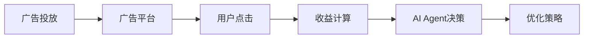
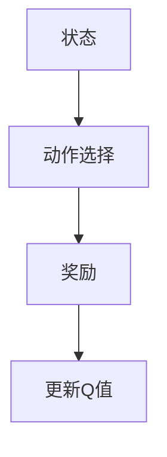
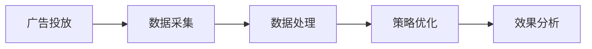
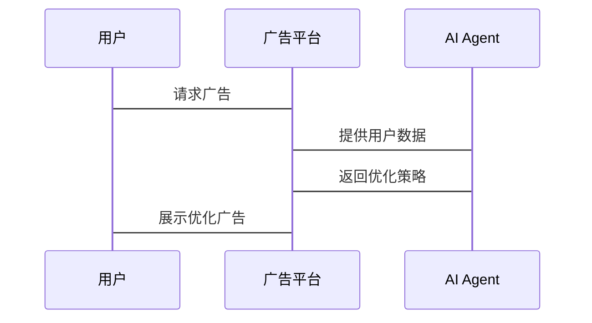

                 


# 企业AI Agent的强化学习在广告投放优化中的实践

> 关键词：企业AI Agent，强化学习，广告投放优化，Q-learning，Deep Q-Network

> 摘要：本文探讨了企业AI Agent如何利用强化学习技术优化广告投放策略。通过分析广告投放的复杂性，结合强化学习的算法原理，构建了一个基于AI Agent的广告优化系统，详细介绍了系统架构设计和实际应用场景，并通过案例分析展示了其优势和效果。

---

# 第一部分: 企业AI Agent与强化学习基础

## 第1章: 企业AI Agent与强化学习概述

### 1.1 问题背景与问题描述

#### 1.1.1 广告投放优化的挑战
在现代商业环境中，广告投放的优化是一个复杂而关键的任务。广告主需要在有限的预算内，通过精准投放，最大化广告的点击率和转化率。然而，广告投放涉及众多变量，如用户行为、市场变化、竞争对手策略等，这使得优化过程充满挑战。

#### 1.1.2 AI Agent在广告投放中的作用
AI Agent（人工智能代理）能够实时分析数据，做出决策并执行操作。在广告投放中，AI Agent可以自动选择最优的广告内容、投放时间和目标受众，显著提高投放效率。

#### 1.1.3 强化学习在广告优化中的优势
强化学习（Reinforcement Learning）通过模拟试错过程，优化决策策略。与传统广告优化方法相比，强化学习能够处理非线性关系和复杂场景，提供更精准的策略。

### 1.2 问题解决与边界

#### 1.2.1 AI Agent如何优化广告投放
AI Agent通过实时数据反馈，不断优化广告投放策略。它能够预测用户行为，动态调整广告内容和投放渠道，以最大化收益。

#### 1.2.2 强化学习的边界与外延
强化学习的应用范围有限，例如在广告投放中，它适用于动态策略调整，但不适用于静态数据分析。了解这些边界有助于合理应用技术。

#### 1.2.3 核心概念与要素分析
广告投放优化的核心要素包括用户行为、广告内容、投放时间和预算分配。AI Agent通过分析这些要素，制定优化策略。

### 1.3 核心概念与联系

#### 1.3.1 AI Agent与强化学习的关系
AI Agent是决策执行者，而强化学习是决策优化方法。两者结合，使广告投放更加智能和高效。

#### 1.3.2 核心概念原理对比表

| 核心概念 | 定义 | 作用 | 关系 |
|----------|------|------|------|
| AI Agent | 智能代理 | 执行决策 | 决策执行者 |
| 强化学习 | 试错学习 | 优化策略 | 决策优化方法 |

#### 1.3.3 ER实体关系图（Mermaid）



---

## 第2章: 强化学习算法原理

### 2.1 算法原理讲解

#### 2.1.1 Q-learning算法流程（Mermaid）



#### 2.1.2 Deep Q-Network实现

```python
import numpy as np

class DQN:
    def __init__(self, state_space, action_space):
        self.state_space = state_space
        self.action_space = action_space
        self.model = self.build_model()

    def build_model(self):
        # 网络结构：输入层 → 隐藏层 → 输出层
        pass

    def remember(self, state, action, reward, next_state):
        # 记忆存储
        pass

    def replay(self, batch_size):
        # 回放训练
        pass
```

### 2.2 数学模型与公式

#### 2.2.1 Q-learning公式

$$ Q(s, a) = Q(s, a) + \alpha (r + \gamma \max Q(s', a') - Q(s, a)) $$

其中：
- \( Q(s, a) \)：当前状态下动作 \( a \) 的价值
- \( \alpha \)：学习率
- \( r \)：奖励
- \( \gamma \)：折扣因子
- \( s' \)：下一个状态

#### 2.2.2 Deep Q-Network损失函数

$$ \mathcal{L} = \mathbb{E}[(y - Q(s,a))^2] $$
其中，$$ y = r + \gamma \max Q(s',a') $$

### 2.3 举例说明

#### 2.3.1 广告点击率优化案例
通过Q-learning算法，AI Agent能够根据用户点击反馈，动态调整广告内容，提高点击率。

#### 2.3.2 实际广告投放场景应用
在实际应用中，AI Agent利用Deep Q-Network处理高维数据，优化广告投放策略。

---

## 第3章: 系统分析与架构设计

### 3.1 问题场景介绍

#### 3.1.1 广告投放场景分析
广告投放涉及用户行为分析、广告内容选择、投放时间和预算分配等多个方面。

#### 3.1.2 系统功能设计
系统需要实现广告投放、数据采集、策略优化和效果分析等功能。

### 3.2 系统架构设计

#### 3.2.1 系统架构（Mermaid）



### 3.3 接口设计与交互流程

#### 3.3.1 系统接口设计
系统需要与广告平台、数据源和用户交互接口进行集成。

#### 3.3.2 交互流程（Mermaid）



---

## 第4章: 项目实战

### 4.1 环境安装

#### 4.1.1 安装Python环境
使用Anaconda安装Python 3.8及以上版本。

#### 4.1.2 安装依赖库
安装TensorFlow、Keras、OpenAI Gym等库。

### 4.2 核心实现

#### 4.2.1 环境类实现

```python
class AdvertiseEnvironment:
    def __init__(self):
        self.state = 0
        self.reward = 0

    def reset(self):
        self.state = 0
        return self.state

    def step(self, action):
        # 根据动作计算新状态和奖励
        self.state = action
        self.reward = calculate_reward(self.state)
        return self.state, self.reward
```

#### 4.2.2 强化学习算法实现

```python
class DQNAgent:
    def __init__(self, state_space, action_space):
        self.state_space = state_space
        self.action_space = action_space
        self.model = self.build_model()

    def build_model(self):
        # 网络结构
        pass

    def remember(self, state, action, reward, next_state):
        # 记忆存储
        pass

    def replay(self, batch_size):
        # 回放训练
        pass
```

### 4.3 实际案例分析

#### 4.3.1 数据预处理
对广告点击数据进行清洗和特征提取，构建训练数据集。

#### 4.3.2 算法训练与测试
使用训练数据训练AI Agent，测试其在广告投放中的表现。

### 4.4 实验结果与分析

#### 4.4.1 实验结果展示
通过对比传统方法和强化学习方法，展示AI Agent在广告优化中的优势。

#### 4.4.2 实验结果分析
分析AI Agent的优化效果，总结其在不同场景下的表现。

---

## 第5章: 总结与展望

### 5.1 最佳实践Tips

#### 5.1.1 数据质量的重要性
高质量的数据是训练AI Agent的基础，需要确保数据的完整性和准确性。

#### 5.1.2 算法选择的注意事项
根据具体场景选择合适的强化学习算法，避免过度复杂化。

### 5.2 小结
本文详细介绍了AI Agent如何利用强化学习优化广告投放策略，展示了其在实际中的应用效果。

### 5.3 注意事项
在实际应用中，需注意数据隐私、算法收敛性和系统稳定性等问题。

### 5.4 拓展阅读
推荐相关书籍和论文，进一步深入学习强化学习和AI Agent的知识。

---

作者：AI天才研究院/AI Genius Institute & 禅与计算机程序设计艺术 /Zen And The Art of Computer Programming

