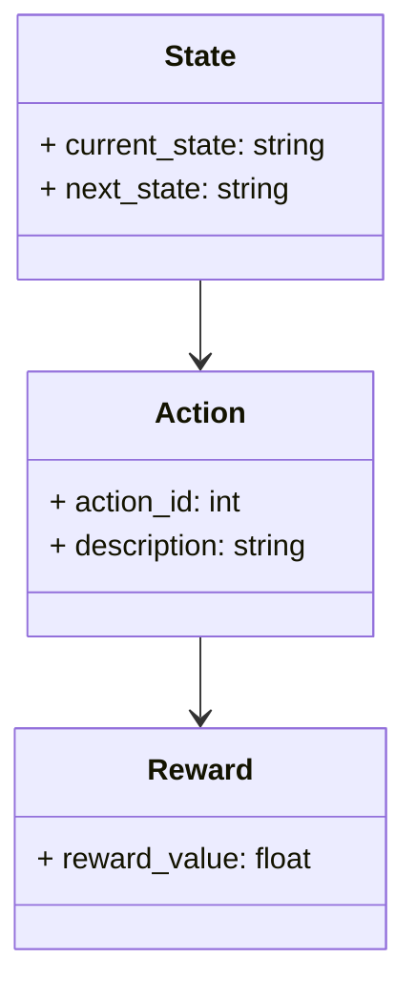
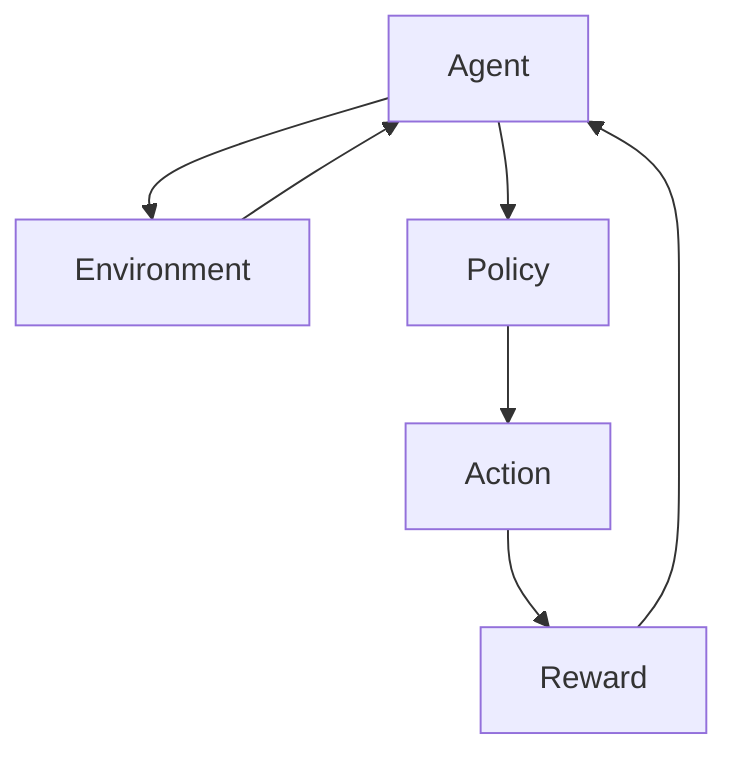
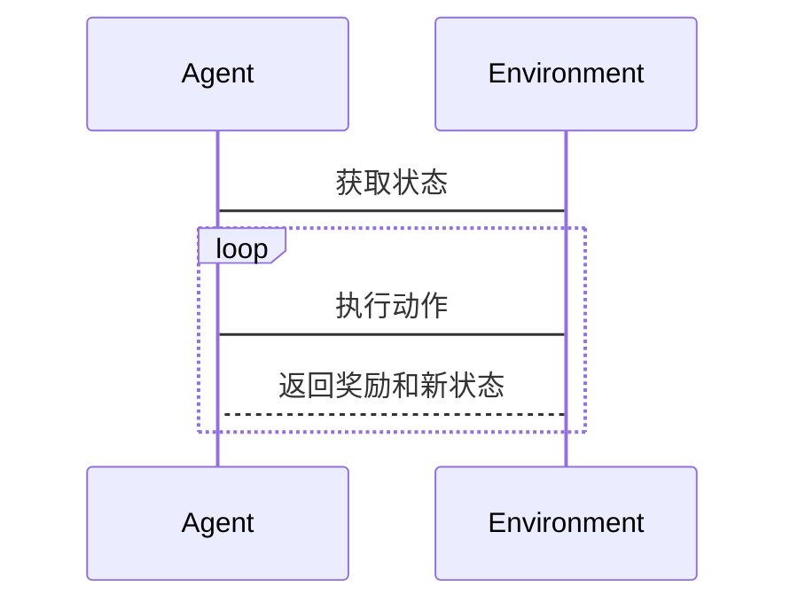

                 


# 企业AI Agent的强化学习在智慧城市管理中的应用

> 关键词：AI Agent, 强化学习, 智慧城市, 算法原理, 系统设计, 项目实战

> 摘要：本文探讨了企业AI Agent在智慧城市管理中的应用，重点分析了强化学习在其中的核心作用。通过详细阐述强化学习的原理、算法实现以及在智慧城市中的具体应用场景，本文为读者提供了一种新的视角来理解如何利用AI技术提升城市管理效率。文章内容涵盖背景介绍、核心概念、算法原理、系统设计、项目实战及最佳实践，旨在为相关领域的研究者和实践者提供有价值的参考。

---

## 第一章: 企业AI Agent与强化学习概述

### 1.1 问题背景与描述

#### 1.1.1 智慧城市管理的挑战
随着城市化进程的加快，城市管理面临的问题日益复杂。交通拥堵、资源分配不均、环境污染等问题亟待解决。传统的管理方式依赖人工决策，效率低下且难以应对动态变化的环境。

#### 1.1.2 AI Agent在智慧城市中的应用需求
AI Agent（智能体）能够通过感知环境、自主决策并执行动作，为智慧城市的管理提供高效解决方案。例如，在交通管理中，AI Agent可以实时调整信号灯以缓解拥堵。

#### 1.1.3 强化学习在AI Agent中的作用
强化学习是一种通过试错机制优化决策的算法，非常适合用于动态环境中的AI Agent控制。它使AI Agent能够通过与环境的交互不断优化其行为，从而实现更高效的管理。

### 1.2 企业AI Agent的核心概念

#### 1.2.1 AI Agent的定义与特点
AI Agent是一种能够感知环境、自主决策并执行动作的智能系统。其特点包括自主性、反应性、目标导向和学习能力。

#### 1.2.2 强化学习的基本原理
强化学习通过智能体与环境的交互，基于奖励机制优化决策策略。智能体会根据当前状态选择动作，并通过与环境的交互获得奖励或惩罚。

#### 1.2.3 AI Agent与强化学习的关系
AI Agent是强化学习的应用载体，而强化学习是实现AI Agent自主决策的核心技术。两者相互依存，共同推动智慧城市的智能化管理。

### 1.3 本章小结
本章介绍了AI Agent和强化学习的基本概念，以及它们在智慧城市管理中的重要性。通过理解这些概念，我们可以为后续的算法实现和系统设计打下基础。

---

## 第二章: 强化学习的核心原理与算法

### 2.1 强化学习的基本原理

#### 2.1.1 状态、动作、奖励的定义
- **状态（State）**：环境中的当前情况，例如交通信号灯的状态。
- **动作（Action）**：智能体在某一状态下选择的行为，例如调整信号灯。
- **奖励（Reward）**：智能体执行动作后获得的反馈，奖励用于指导智能体的决策。

#### 2.1.2 Q-learning算法原理
Q-learning是一种基于值函数的强化学习算法。其核心思想是通过不断更新Q值表来优化决策策略。Q值表示在给定状态下采取某动作的期望回报。

#### 2.1.3 Deep Q-learning算法的改进
Deep Q-learning通过使用深度神经网络近似Q值函数，解决了Q-learning在处理复杂状态时的局限性。神经网络能够自动提取特征，提高学习效率。

### 2.2 强化学习的核心算法对比

#### 2.2.1 Q-learning与Deep Q-learning对比
| 参数                | Q-learning                     | Deep Q-learning                 |
|---------------------|-------------------------------|--------------------------------|
| 表示方法            | 离散Q值表                     | 深度神经网络                   |
| 处理复杂性          | 低                           | 高                           |
| 学习效率            | 较低                         | 较高                         |

#### 2.2.2 其他强化学习算法简介
- **策略梯度方法（Policy Gradient）**：直接优化策略，而非值函数。
- **Actor-Critic方法**：结合策略和值函数，通过同时优化动作策略和价值函数来提高学习效率。

#### 2.2.3 选择合适算法的策略
根据问题的复杂性和环境的动态特性选择合适的算法。对于复杂的智慧城市管理问题，Deep Q-learning和Actor-Critic方法更为适用。

### 2.3 本章小结
本章详细讲解了强化学习的基本原理和核心算法，为后续的系统设计和项目实现奠定了理论基础。

---

## 第三章: AI Agent在智慧城市管理中的应用

### 3.1 智慧城市管理的典型场景

#### 3.1.1 交通管理
AI Agent可以通过实时调整信号灯和优化路线规划，有效缓解交通拥堵问题。

#### 3.1.2 公共资源分配
在资源分配中，AI Agent能够根据需求动态调整资源的分配策略，提高资源利用效率。

#### 3.1.3 环境监测
AI Agent可以实时监测环境数据，例如空气质量，并根据数据变化采取相应的控制措施。

### 3.2 AI Agent在智慧城市中的优势

#### 3.2.1 自适应决策能力
AI Agent能够根据环境变化实时调整决策，提高应对复杂场景的能力。

#### 3.2.2 多目标优化能力
在智慧城市建设中，常常需要在多个目标之间进行权衡，AI Agent可以通过强化学习优化多目标决策。

#### 3.2.3 实时响应能力
AI Agent能够在短时间内快速做出决策，满足智慧城市管理对实时性的要求。

### 3.3 本章小结
本章通过具体案例展示了AI Agent在智慧城市管理中的广泛应用，突出了其在提升管理效率和应对复杂问题中的重要作用。

---

## 第四章: 强化学习在AI Agent中的数学模型与公式

### 4.1 Q-learning算法的数学模型

#### 4.1.1 Q值更新公式
$$ Q(s, a) = Q(s, a) + \alpha (r + \gamma \max Q(s', a') - Q(s, a)) $$
其中：
- \( Q(s, a) \) 表示当前状态下采取动作 \( a \) 的Q值。
- \( \alpha \) 表示学习率。
- \( r \) 表示奖励。
- \( \gamma \) 表示折扣因子。
- \( s' \) 表示下一个状态。

#### 4.1.2 探索与利用策略
- **探索（Exploration）**：智能体随机选择动作以发现新的状态-动作对。
- **利用（Exploitation）**：智能体选择当前Q值最高的动作以最大化期望回报。

#### 4.1.3 奖励机制设计
奖励机制的设计直接影响智能体的学习效果。例如，在交通管理中，奖励可以是“减少拥堵时间”。

### 4.2 Deep Q-learning的数学模型

#### 4.2.1 神经网络结构
神经网络通常包括输入层、隐藏层和输出层。输入层接收状态信息，输出层预测Q值。

#### 4.2.2 损失函数
$$ \mathcal{L} = \mathbb{E}[(y - Q(s, a))^2] $$
其中：
- \( y \) 表示目标Q值。
- \( Q(s, a) \) 表示预测的Q值。

#### 4.2.3 网络更新策略
使用经验回放和目标网络来稳定训练过程。经验回放通过随机抽取历史经验来减少相关样本的问题，目标网络通过延迟更新来减少参数的剧烈变化。

### 4.3 本章小结
本章通过数学公式和神经网络结构，详细讲解了Q-learning和Deep Q-learning的实现原理，为后续的系统设计提供了理论依据。

---

## 第五章: AI Agent的系统分析与架构设计

### 5.1 智慧城市管理的场景介绍

#### 5.1.1 项目背景
本项目旨在利用AI Agent和强化学习技术，解决城市交通管理中的拥堵问题。

### 5.2 系统功能设计

#### 5.2.1 领域模型


#### 5.2.2 系统架构


#### 5.2.3 接口设计
- **状态接口**：提供当前状态信息。
- **动作接口**：接收智能体的动作指令。
- **奖励接口**：返回奖励值以指导学习。

#### 5.2.4 交互流程


### 5.3 本章小结
本章通过系统设计和架构图，详细展示了AI Agent在智慧城市管理中的实现方案，为后续的项目实施提供了清晰的指导。

---

## 第六章: 项目实战

### 6.1 环境安装

#### 6.1.1 安装Python
```bash
python --version
# 确保Python版本为3.6以上
```

#### 6.1.2 安装依赖
```bash
pip install numpy matplotlib keras-tqdm
```

### 6.2 系统核心实现

#### 6.2.1 Q-learning实现
```python
import numpy as np

class QLearning:
    def __init__(self, state_size, action_size):
        self.state_size = state_size
        self.action_size = action_size
        self.Q = np.zeros((state_size, action_size))

    def get_action(self, state, epsilon):
        if np.random.random() < epsilon:
            return np.random.randint(self.action_size)
        else:
            return np.argmax(self.Q[state])

    def update_Q(self, state, action, reward, next_state, gamma=0.99):
        self.Q[state][action] += 0.1 * (reward + gamma * max(self.Q[next_state]) - self.Q[state][action])
```

#### 6.2.2 Deep Q-learning实现
```python
import tensorflow as tf

model = tf.keras.Sequential([
    tf.keras.layers.Dense(64, activation='relu', input_shape=(state_size,)),
    tf.keras.layers.Dense(action_size, activation='linear')
])

def custom_loss(y_true, y_pred):
    return tf.keras.losses.mean_squared_error(y_true, y_pred)

model.compile(optimizer=tf.keras.optimizers.Adam(learning_rate=0.001), loss=custom_loss)
```

### 6.3 项目小结
本章通过具体的代码实现，展示了如何将强化学习算法应用于智慧城市管理。通过实战项目，读者可以更好地理解理论知识并应用于实际问题。

---

## 第七章: 最佳实践与展望

### 7.1 小结
本文详细讲解了AI Agent在智慧城市管理中的应用，重点分析了强化学习的核心原理和算法实现。通过系统设计和项目实战，展示了如何将理论知识应用于实际问题。

### 7.2 注意事项
- **算法选择**：根据具体场景选择合适的强化学习算法。
- **模型训练**：确保数据质量和训练时间足够以获得良好的学习效果。
- **系统优化**：在实际应用中，需要考虑系统的实时性和可扩展性。

### 7.3 拓展阅读
- 推荐阅读《强化学习（书籍）》。
- 关注最新的强化学习研究，了解新的算法和技术进展。

### 7.4 本章小结
本文为读者提供了从理论到实践的全面指导，帮助读者更好地理解和应用强化学习技术。

---

## 作者
作者：AI天才研究院 & 禅与计算机程序设计艺术

