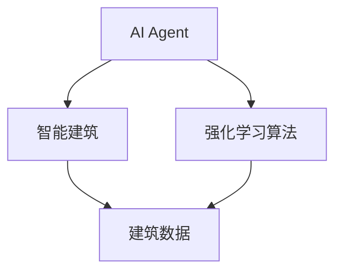
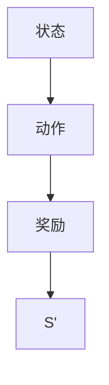
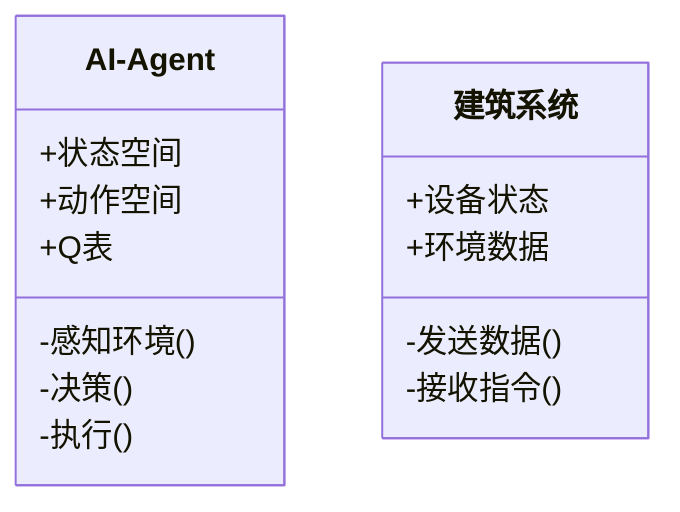
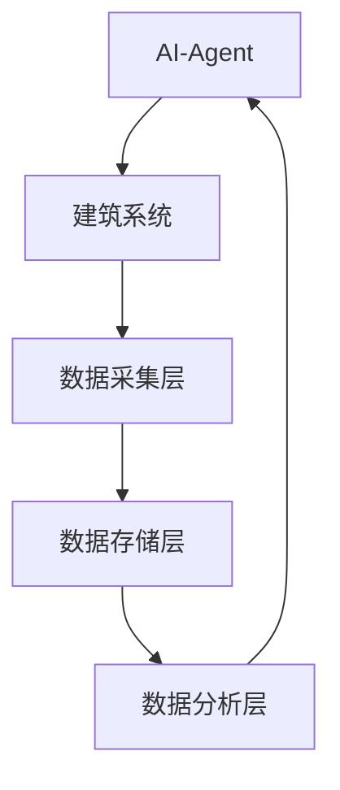
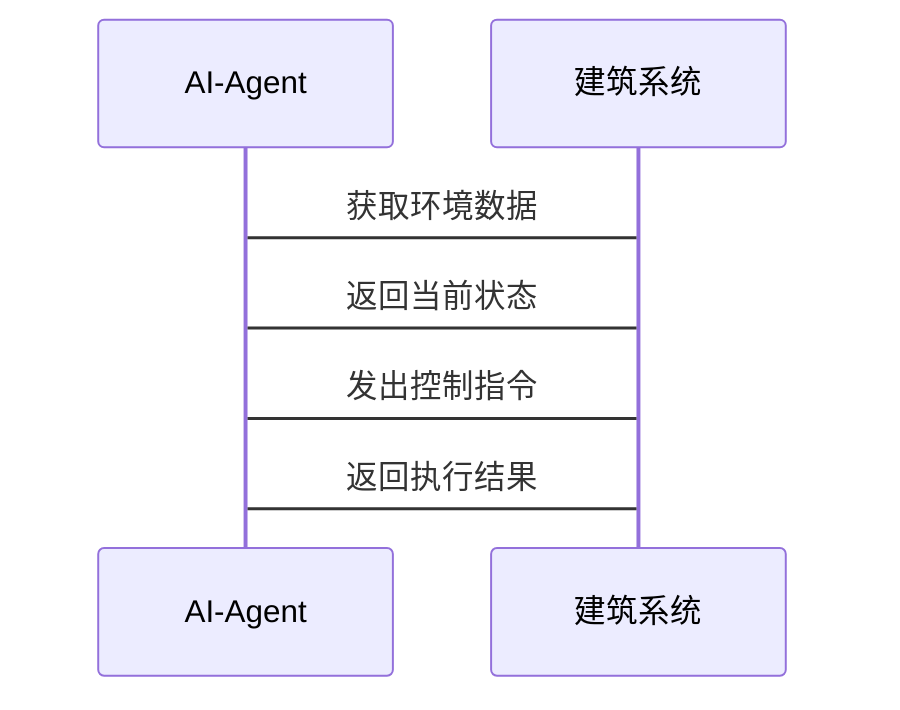

                 


# 企业AI Agent的强化学习在智能建筑管理中的应用

## 关键词
- AI Agent
- 强化学习
- 智能建筑管理
- 系统架构
- 项目实战

## 摘要
本文探讨了AI Agent结合强化学习在智能建筑管理中的应用。首先，分析了传统建筑管理的不足，引出AI Agent和强化学习的重要性。接着，详细讲解了AI Agent和强化学习的核心概念，及其在智能建筑管理中的应用潜力。通过Q-learning算法实现案例，展示了AI Agent在智能建筑管理中的具体应用。最后，总结了实现过程中的经验与教训，并展望了未来的研究方向。

---

## 第一部分: 企业AI Agent的强化学习基础

### 第1章: 企业AI Agent与强化学习概述

#### 1.1 问题背景
- **智能建筑管理的挑战**：传统建筑管理依赖人工操作，效率低下，难以应对动态变化的环境。
- **传统管理的不足**：信息孤岛、响应迟缓、资源浪费。
- **强化学习的潜力**：通过智能决策优化资源分配和能源使用。

#### 1.2 问题描述
- **核心问题**：如何在动态环境中优化建筑管理。
- **强化学习的应用**：通过奖励机制，优化AI Agent的决策过程。
- **AI Agent的角色**：作为决策者，实时响应建筑内外部环境变化。

#### 1.3 问题解决
- **AI Agent的功能**：感知环境、决策、执行。
- **强化学习的思想**：通过试错和奖励机制，优化策略。
- **结合方式**：AI Agent基于强化学习做出最优决策。

#### 1.4 边界与外延
- **应用边界**：适用于动态、复杂环境下的决策问题。
- **适用场景**：能源管理、设备调度、应急管理。
- **区别传统AI**：强化学习通过试错优化，传统AI依赖规则。

#### 1.5 核心要素
- **AI Agent**：感知、决策、执行。
- **强化学习**：状态、动作、奖励、策略。
- **系统架构**：AI Agent与建筑系统交互的结构。

#### 1.6 本章小结
本章介绍了AI Agent和强化学习在智能建筑管理中的重要性，明确了核心概念和应用边界。

---

## 第二部分: AI Agent与强化学习的核心概念与联系

### 第2章: 核心概念与联系

#### 2.1 核心概念原理
- **AI Agent原理**：通过感知和决策，实现自主行动。
- **强化学习原理**：通过试错和奖励，优化决策策略。
- **结合思想**：AI Agent通过强化学习不断优化决策。

#### 2.2 对比分析
| 属性 | AI Agent | 强化学习 |
|------|----------|----------|
| 输入 | 环境状态 | 状态、动作、奖励 |
| 输出 | 动作 | 策略优化 |
| 目标 | 完成任务 | 最大化累计奖励 |

#### 2.3 ER实体关系图


#### 2.4 本章小结
本章通过对比分析和实体关系图，清晰展示了AI Agent与强化学习的联系与区别。

---

## 第三部分: 强化学习算法原理

### 第3章: 算法原理

#### 3.1 算法流程
1. **初始化**：建立Q表，初始化为零。
2. **环境感知**：获取当前状态。
3. **决策**：选择动作，探索与利用。
4. **执行**：执行动作，获取奖励。
5. **更新**：更新Q值，记录经验。

#### 3.2 Q-learning算法


#### 3.3 算法实现
```python
import numpy as np

class AI-Agent:
    def __init__(self, state_space, action_space):
        self.state_space = state_space
        self.action_space = action_space
        self.q_table = np.zeros((state_space, action_space))

    def choose_action(self, state):
        # 探索与利用
        epsilon = 0.1
        if np.random.random() < epsilon:
            return np.random.randint(self.action_space)
        else:
            return np.argmax(self.q_table[state])

    def update_q_table(self, state, action, reward, next_state):
        learning_rate = 0.1
        gamma = 0.99
        self.q_table[state][action] = self.q_table[state][action] + learning_rate * (reward + gamma * max(self.q_table[next_state]) - self.q_table[state][action])
```

#### 3.4 数学模型
- **Q-learning公式**：$$ Q(s, a) = Q(s, a) + \alpha (r + \gamma \max Q(s', a') - Q(s, a)) $$
- **状态转移**：$$ P(s' | s, a) $$

#### 3.5 应用案例
通过简单的建筑环境模拟，展示AI Agent如何优化能源使用。

#### 3.6 本章小结
本章详细讲解了强化学习算法的原理和实现，并通过案例展示其应用。

---

## 第四部分: 系统分析与架构设计

### 第4章: 系统分析与架构设计

#### 4.1 项目场景
- **项目目标**：优化建筑能源管理。
- **核心功能**：实时感知、决策优化、执行反馈。

#### 4.2 系统功能设计


#### 4.3 系统架构设计


#### 4.4 接口设计
- **输入接口**：环境数据、设备状态。
- **输出接口**：控制指令、反馈数据。

#### 4.5 交互序列图


#### 4.6 本章小结
本章设计了系统的架构和接口，展示了AI Agent如何与建筑系统交互。

---

## 第五部分: 项目实战

### 第5章: 项目实战

#### 5.1 环境安装
- **工具安装**：Python、NumPy、Mermaid、TensorFlow。

#### 5.2 核心代码实现
```python
# 初始化Q表
q_table = np.zeros((state_space, action_space))

# 训练过程
for episode in range(episodes):
    state = env.reset()
    total_reward = 0
    while True:
        action = choose_action(state)
        next_state, reward, done = env.step(action)
        update_q_table(state, action, reward, next_state)
        total_reward += reward
        if done:
            break
    print(f"Episode {episode}: Total Reward = {total_reward}")

# 测试过程
state = env.reset()
while True:
    action = choose_action(state)
    next_state, reward, done = env.step(action)
    print(f"当前状态: {state}, 动作: {action}, 奖励: {reward}")
    if done:
        break
```

#### 5.3 代码解读
- **初始化**：建立Q表，记录状态-动作对的奖励值。
- **训练**：通过多次训练，优化Q表。
- **测试**：使用优化后的Q表进行决策。

#### 5.4 案例分析
- **训练结果**：Q表的更新情况。
- **测试结果**：AI Agent的决策是否最优。

#### 5.5 总结
通过项目实战，验证了AI Agent在智能建筑管理中的有效性。

---

## 第六部分: 最佳实践

### 第6章: 最佳实践

#### 6.1 小结
- **概念总结**：AI Agent与强化学习的结合。
- **实现总结**：算法实现与系统设计的关键点。

#### 6.2 注意事项
- **环境复杂性**：处理动态变化。
- **算法选择**：根据场景选择合适算法。
- **数据质量**：确保数据的准确性和及时性。

#### 6.3 拓展阅读
- **推荐书籍**：《强化学习：理论与算法》。
- **推荐论文**：Nature杂志的相关论文。

#### 6.4 本章小结
本章总结了项目经验，提出了实际应用中的注意事项。

---

## 作者：AI天才研究院/AI Genius Institute & 禅与计算机程序设计艺术 /Zen And The Art of Computer Programming

---

本文系统地探讨了AI Agent结合强化学习在智能建筑管理中的应用，通过理论分析和项目实战，展示了其在优化建筑管理中的潜力和实现方法。

