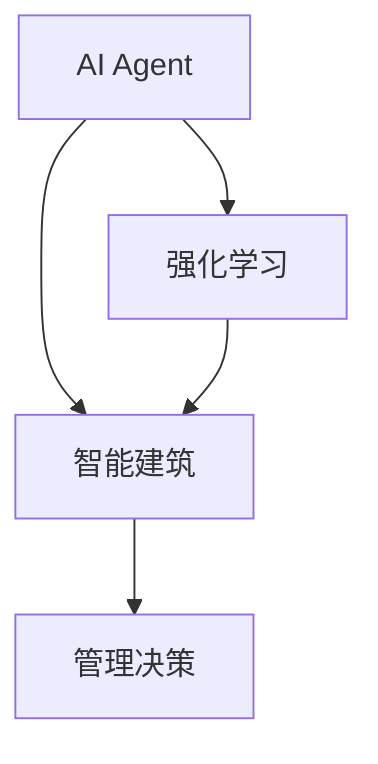
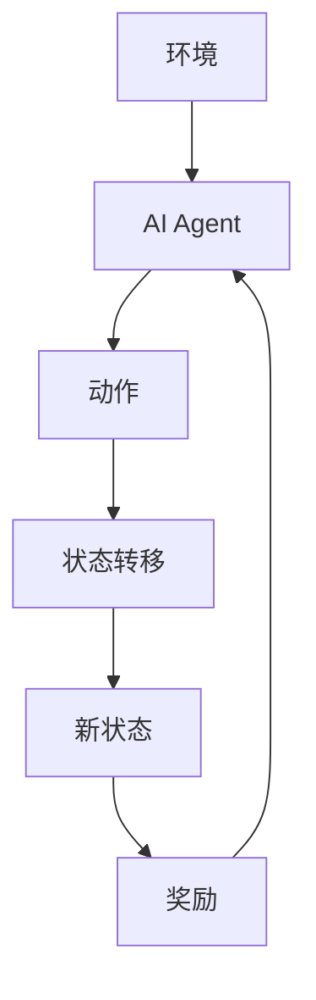

                 


# 企业AI Agent的强化学习在智能建筑管理中的节能应用

> 关键词：企业AI Agent, 强化学习, 智能建筑管理, 节能, 可持续发展

> 摘要：本文探讨了企业AI Agent通过强化学习优化智能建筑管理的节能应用。文章从理论到实践，详细分析了AI Agent和强化学习的核心原理，系统设计与架构，以及实际案例的实现，为智能建筑的可持续发展提供了新的思路。

---

## 第一部分: 背景介绍

### 第1章: 企业AI Agent的强化学习背景

#### 1.1 问题背景
- **1.1.1 智能建筑管理的现状与挑战**
  - 智能建筑的快速发展：从传统建筑到智能建筑的演变。
  - 当前建筑管理中的能耗问题：高能耗、低效率。
  - 节能的必要性：能源危机与可持续发展的需求。

- **1.1.2 节能的重要性与潜力**
  - 节能对环境保护的意义。
  - 节能在经济成本中的重要性。
  - 强化学习在动态优化中的潜力。

- **1.1.3 AI Agent在智能建筑管理中的角色**
  - AI Agent在建筑管理中的作用。
  - 强化学习如何提升AI Agent的决策能力。

#### 1.2 问题描述
- **1.2.1 建筑能耗管理的核心问题**
  - 能耗管理中的不确定性。
  - 多目标优化的复杂性。

- **1.2.2 强化学习在动态优化中的应用**
  - 动态环境下的优化需求。
  - 强化学习的实时性和适应性。

- **1.2.3 AI Agent在智能建筑中的具体应用场景**
  - 能耗预测与优化。
  - 设备调度与协调。

#### 1.3 问题解决
- **1.3.1 AI Agent如何优化建筑管理**
  - AI Agent的实时决策能力。
  - 强化学习的策略优化。

- **1.3.2 强化学习在节能中的具体作用**
  - 动态调整策略以降低能耗。
  - 多目标优化中的平衡。

- **1.3.3 技术实现的路径与方法**
  - 数据采集与处理。
  - 强化学习算法的设计与实现。

#### 1.4 边界与外延
- **1.4.1 AI Agent的边界条件**
  - 系统范围的界定。
  - 决策范围的限制。

- **1.4.2 强化学习的应用范围**
  - 短期预测与长期优化。
  - 内部优化与外部协调。

- **1.4.3 智能建筑管理的外延领域**
  - 建筑设计与施工。
  - 用户行为分析。

#### 1.5 概念结构与核心要素
- **1.5.1 AI Agent的核心要素**
  - 感知能力。
  - 决策能力。
  - 执行能力。

- **1.5.2 强化学习的关键要素**
  - 状态、动作、奖励。
  - 策略、价值函数。

- **1.5.3 智能建筑管理的系统要素**
  - 传感器网络。
  - 控制系统。
  - 数据处理平台。

---

## 第二部分: 核心概念与联系

### 第2章: AI Agent与强化学习的核心原理

#### 2.1 AI Agent的原理
- **2.1.1 AI Agent的定义与分类**
  - 定义：AI Agent的定义及其在智能建筑中的应用。
  - 分类：基于决策能力的分类。

- **2.1.2 强化学习的基本原理**
  - 定义：强化学习的核心概念。
  - 基本公式：$$ Q(s,a) = Q(s,a) + \alpha [r + \gamma \max Q(s',a') - Q(s,a)] $$

- **2.1.3 AI Agent与强化学习的关系**
  - 强化学习如何赋予AI Agent决策能力。
  - AI Agent在强化学习中的角色。

#### 2.2 核心概念对比
- **2.2.1 AI Agent与传统AI的区别**
  - 传统AI的局限性。
  - AI Agent的自主决策能力。

- **2.2.2 强化学习与其他机器学习方法的对比**
  - 监督学习、无监督学习与强化学习的区别。
  - 强化学习的独特性。

- **2.2.3 智能建筑管理中的概念对比**
  - 能耗管理与其他管理方式的对比。

#### 2.3 ER实体关系图


---

## 第三部分: 算法原理讲解

### 第3章: 强化学习算法的数学模型

#### 3.1 强化学习的基本公式
- **3.1.1 Q-learning算法**
  - 公式：$$ Q(s,a) = Q(s,a) + \alpha [r + \gamma \max Q(s',a') - Q(s,a)] $$
  - 详细解释：Q-learning算法的更新规则。

- **3.1.2 Deep Q-Network (DQN)算法**
  - 公式：$$ Q(s,a) = \theta \cdot \phi(s,a) $$
  - 详细解释：DQN算法的神经网络结构。

#### 3.2 强化学习的流程图


#### 3.3 强化学习的实现代码
```python
import numpy as np
import gym

env = gym.make('CartPole-v0')
env.seed(42)

class QLAgent:
    def __init__(self, state_space, action_space, alpha=0.1, gamma=0.99):
        self.state_space = state_space
        self.action_space = action_space
        self.alpha = alpha
        self.gamma = gamma
        self.q_table = np.zeros((state_space, action_space))

    def get_action(self, state):
        return np.argmax(self.q_table[state])

    def update_q_table(self, state, action, reward, next_state):
        self.q_table[state][action] += self.alpha * (reward + self.gamma * np.max(self.q_table[next_state]) - self.q_table[state][action])

agent = QLAgent(4, 2)
for episode in range(100):
    state = env.reset()
    total_reward = 0
    while True:
        action = agent.get_action(state)
        next_state, reward, done, _ = env.step(action)
        agent.update_q_table(state, action, reward, next_state)
        total_reward += reward
        state = next_state
        if done:
            break
```

---

## 第四部分: 系统分析与架构设计方案

### 第4章: 智能建筑管理系统的分析与设计

#### 4.1 问题场景介绍
- 智能建筑的典型场景。
- 能耗管理的具体问题。

#### 4.2 项目介绍
- 项目目标：降低建筑能耗。
- 项目范围：智能建筑管理系统的整体设计。

#### 4.3 系统功能设计
- **4.3.1 领域模型**
  ```mermaid
  classDiagram
    class Building {
        +rooms: list
        +devices: list
        +sensors: list
        +actors: list
    }
    class EnergyManager {
        +energy_data: dict
        +control_policy: dict
        +QLAgent: QLAgent
    }
    Building --> EnergyManager
  ```

- **4.3.2 系统架构设计**
  ```mermaid
  architecture
  Client/Server
  client --> server: 请求
  server --> client: 响应
  server --> database: 查询
  server --> agent: 调用
  ```

- **4.3.3 系统接口设计**
  - 接口1：数据采集接口。
  - 接口2：控制命令接口。
  - 接口3：状态反馈接口。

- **4.3.4 系统交互流程**
  ```mermaid
  sequenceDiagram
    BuildingMonitoringSystem -> EnergyManager: 数据更新
    EnergyManager -> QLAgent: 获取决策
    QLAgent -> EnergyManager: 返回控制命令
    EnergyManager -> BuildingMonitoringSystem: 执行命令
  ```

---

## 第五部分: 项目实战

### 第5章: 实战案例分析

#### 5.1 环境安装
- 安装依赖：Python、numpy、gym、tensorflow。

#### 5.2 核心代码实现
- **5.2.1 AI Agent的实现**
  ```python
  class QLAgent:
      def __init__(self, state_space, action_space, alpha=0.1, gamma=0.99):
          self.state_space = state_space
          self.action_space = action_space
          self.alpha = alpha
          self.gamma = gamma
          self.q_table = np.zeros((state_space, action_space))

      def get_action(self, state):
          return np.argmax(self.q_table[state])

      def update_q_table(self, state, action, reward, next_state):
          self.q_table[state][action] += self.alpha * (reward + self.gamma * np.max(self.q_table[next_state]) - self.q_table[state][action])
  ```

- **5.2.2 系统集成**
  ```python
  def run_episode(env, agent):
      state = env.reset()
      total_reward = 0
      while True:
          action = agent.get_action(state)
          next_state, reward, done, _ = env.step(action)
          agent.update_q_table(state, action, reward, next_state)
          total_reward += reward
          state = next_state
          if done:
              break
      return total_reward

  env = gym.make('CartPole-v0')
  agent = QLAgent(4, 2)
  for episode in range(100):
      run_episode(env, agent)
  ```

#### 5.3 案例分析
- 案例1：智能建筑能耗优化。
- 案例2：强化学习在设备调度中的应用。

#### 5.4 项目总结
- 项目成果：降低能耗的具体数据。
- 经验总结：算法调优的关键点。

---

## 第六部分: 总结与展望

### 第6章: 最佳实践与小结

#### 6.1 最佳实践
- 数据采集的准确性。
- 算法选择的合理性。
- 系统设计的可扩展性。

#### 6.2 小结
- 本文的核心内容总结。
- 未来研究方向的展望。

#### 6.3 注意事项
- 算法实现中的常见问题。
- 系统部署中的注意事项。

#### 6.4 拓展阅读
- 推荐的强化学习书籍。
- 相关领域的研究论文。

---

## 作者：AI天才研究院/AI Genius Institute & 禅与计算机程序设计艺术/Zen And The Art of Computer Programming

