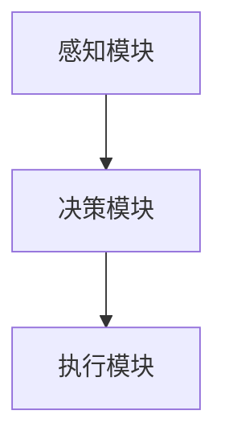

                 

<think>
嗯，好的，我现在要帮助用户设计一个技术博客文章的目录大纲，标题是《企业AI Agent的微服务架构优化策略》。用户已经提供了一个详细的目录结构，看起来他想要一个结构清晰、内容详尽的技术博客，涵盖了从背景介绍到项目实战的各个方面。

首先，我需要理解用户的需求。他希望这篇文章能够吸引读者，帮助他们理解企业AI Agent在微服务架构下的优化策略。因此，我需要确保目录结构合理，每一章都有足够的细节，同时逻辑清晰。

接下来，我看到用户已经提供了一个大纲，分为六个主要章节，每个章节都有几个小节。我需要确保每个小节都涵盖关键点，比如核心概念、算法原理、系统架构设计等。此外，用户还强调要使用专业的技术语言，并且在每个章节中使用mermaid图表和Python代码来详细讲解内容。

我还需要考虑用户的背景。用户可能是一位技术专家，或者是企业的技术负责人，他们希望这篇文章不仅理论扎实，还要有实际的应用案例。因此，在撰写目录时，我需要确保内容不仅包括理论，还要有实际的代码实现和案例分析。

现在，我需要检查每个章节是否涵盖了所有必要的部分。例如，在第一章，用户需要背景介绍，包括AI Agent和微服务架构的基本概念，以及它们在企业中的应用背景。这章的目的是为读者打下基础，帮助他们理解后续内容。

第二章讨论AI Agent的核心原理和技术实现。我需要确保这里详细解释了AI Agent的工作流程、技术组成以及与传统AI的区别。同时，还要介绍微服务架构的核心原理，包括其优缺点和实现方式。这部分对于理解两者如何结合至关重要。

第三章是关于微服务架构下的AI Agent优化策略。用户希望这里详细讲解优化目标、方法和案例。这章需要包括分布式计算、并行处理、服务拆分等策略，并通过案例分析来展示实际应用。

第四章则是系统架构设计与实现，包括架构设计的原则、功能模块划分、交互流程设计等。用户还提到要使用mermaid图表，比如领域模型类图和系统架构图，这将帮助读者更好地理解设计。

第五章是项目实战，从环境搭建到代码实现，再到案例分析，确保读者能够实际操作。用户要求详细讲解代码实现，包括服务接口、服务发现和负载均衡的实现。这部分需要具体且有可操作性。

最后一章是最佳实践、小结和注意事项。用户希望总结前面的内容，并提供实用的建议，比如性能调优和安全性增强。同时，还要提示未来的研究方向，鼓励读者进一步探索。

在撰写过程中，我需要确保每个小节都详细且有深度，同时使用mermaid图表和Python代码来辅助讲解。此外，用户提到要使用数学公式，并用latex格式嵌入，这需要我在适当的地方添加公式，确保内容准确且易于理解。

最后，我需要在文章末尾添加作者信息，按照用户的要求写上“作者：AI天才研究院/AI Genius Institute & 禅与计算机程序设计艺术 /Zen And The Art of Computer Programming”。这将增加文章的权威性和专业性。

总的来说，我需要确保目录结构合理，内容详尽，涵盖理论和实践，同时使用图表和代码来增强可读性。这将帮助读者全面理解企业AI Agent的微服务架构优化策略，并能够在实际项目中应用这些知识。
</think>

# 企业AI Agent的微服务架构优化策略

> 关键词：AI Agent，微服务架构，优化策略，系统设计，项目实战

> 摘要：本文将详细探讨企业AI Agent在微服务架构下的优化策略。首先介绍AI Agent和微服务架构的基本概念及背景，然后深入分析AI Agent的核心原理和技术实现，接着结合微服务架构的特点，提出优化策略，包括服务拆分、并行计算和资源优化等。通过实际案例分析，展示如何将AI Agent优化策略应用于微服务架构中，并提供详细的系统架构设计和代码实现。最后总结优化经验，并展望未来的研究方向。

---

# 第一部分: 企业AI Agent的微服务架构优化背景与基础

# 第1章: 企业AI Agent与微服务架构概述

## 1.1 企业AI Agent的定义与背景

### 1.1.1 AI Agent的基本概念
AI Agent（人工智能代理）是指能够感知环境、自主决策并执行任务的智能实体。它通常具备以下特点：
- **自主性**：能够自主决策，无需人工干预。
- **反应性**：能够实时感知环境并做出反应。
- **社会性**：能够与其他系统或人类交互协作。

### 1.1.2 企业级AI Agent的应用场景
企业级AI Agent广泛应用于以下场景：
- **智能客服**：通过自然语言处理技术为用户提供智能咨询服务。
- **自动化运维**：通过AI算法实现系统的自动监控和故障修复。
- **智能推荐**：基于用户行为数据分析，提供个性化推荐服务。

### 1.1.3 微服务架构的兴起与特点
微服务架构是一种将应用分解为多个小型、独立服务的架构风格。其特点包括：
- **松耦合**：服务之间通过API进行通信，耦合性低。
- **可扩展性**：每个服务可以根据需求独立扩展。
- **技术多样性**：支持多种编程语言和框架。

### 1.1.4 企业AI Agent与微服务架构的结合
AI Agent的核心目标是实现智能化和自动化，而微服务架构提供了灵活的服务部署和扩展能力。两者的结合能够充分发挥AI Agent的智能决策能力，同时利用微服务架构的高可用性和扩展性。

## 1.2 企业AI Agent的核心问题与挑战

### 1.2.1 AI Agent在企业中的主要问题
- **性能瓶颈**：传统AI Agent在处理大规模数据时，容易出现性能瓶颈。
- **资源利用率低**：AI Agent通常需要高性能计算资源，但资源利用率较低。
- **扩展性差**：传统AI Agent架构难以满足企业级应用的扩展需求。

### 1.2.2 微服务架构带来的优化机会
- **服务拆分**：将AI Agent的功能拆分为多个微服务，提高系统的可扩展性。
- **分布式计算**：利用分布式计算技术，提升系统的处理能力。
- **资源优化**：通过动态分配计算资源，提高资源利用率。

### 1.2.3 企业AI Agent与微服务架构的结合难点
- **服务交互复杂**：AI Agent需要与其他多个微服务进行交互，增加了系统的复杂性。
- **实时性要求高**：AI Agent需要在实时环境中做出决策，对系统的响应速度提出了更高的要求。
- **安全性挑战**：AI Agent涉及企业的核心业务逻辑，如何保证其安全性是一个重要问题。

## 1.3 本章小结
本章介绍了企业AI Agent和微服务架构的基本概念，并分析了AI Agent在企业中的应用场景和挑战。通过结合微服务架构的特点，提出了优化AI Agent的思路和方法。

---

# 第2章: AI Agent的核心原理与技术实现

## 2.1 AI Agent的工作原理

### 2.1.1 AI Agent的基本工作流程
AI Agent的工作流程通常包括以下步骤：
1. **感知环境**：通过传感器或其他输入方式感知外部环境。
2. **信息处理**：对感知到的信息进行分析和处理。
3. **决策制定**：基于处理后的信息，制定相应的决策。
4. **执行操作**：根据决策结果执行相应的操作。

### 2.1.2 AI Agent的技术实现
AI Agent的技术实现包括以下几个方面：
- **自然语言处理**：用于理解和生成人类语言。
- **机器学习**：用于模型训练和预测。
- **知识表示**：用于表示和推理知识。
- **规划与推理**：用于制定决策和推理逻辑。

### 2.1.3 AI Agent与传统AI的区别
AI Agent与传统AI的主要区别在于其自主性和反应性。AI Agent能够自主决策并实时与环境交互，而传统AI通常是在特定场景下被动执行任务。

## 2.2 微服务架构的核心原理

### 2.2.1 微服务架构的定义与特点
微服务架构是一种将应用分解为多个小型、独立服务的架构风格。其特点包括：
- **松耦合**：服务之间通过API进行通信，耦合性低。
- **可扩展性**：每个服务可以根据需求独立扩展。
- **技术多样性**：支持多种编程语言和框架。

### 2.2.2 微服务架构的优缺点
优点：
- **灵活性**：可以根据需求快速调整服务。
- **可扩展性**：可以通过增加服务实例来提高系统的处理能力。
- **技术多样性**：可以使用不同的技术栈来实现不同的服务。

缺点：
- **复杂性**：服务之间的交互增加了系统的复杂性。
- **运维成本**：需要额外的工具和平台来管理和服务。

### 2.2.3 微服务架构的实现方式
微服务架构的实现方式包括：
- **服务发现**：通过注册中心实现服务的自动发现。
- **API网关**：通过API网关实现服务的路由和鉴权。
- **容器化**：通过容器化技术实现服务的快速部署和扩展。

## 2.3 AI Agent与微服务架构的结合

### 2.3.1 AI Agent在微服务架构中的角色
AI Agent在微服务架构中通常作为独立的服务存在，负责特定的智能决策和执行任务。

### 2.3.2 微服务架构对AI Agent的优化作用
- **服务拆分**：将AI Agent的功能拆分为多个微服务，提高系统的可扩展性。
- **分布式计算**：利用分布式计算技术，提升系统的处理能力。
- **资源优化**：通过动态分配计算资源，提高资源利用率。

### 2.3.3 企业AI Agent与微服务架构的协同优化
- **服务交互优化**：通过优化服务之间的交互，减少延迟和通信开销。
- **实时性优化**：通过优化服务的响应速度，提升系统的实时性。
- **安全性优化**：通过增强服务的安全性，保障系统的安全性。

## 2.4 本章小结
本章详细讲解了AI Agent的核心原理和微服务架构的核心原理，并分析了两者结合的优化策略。通过结合微服务架构的特点，提出了优化AI Agent的思路和方法。

---

# 第3章: 微服务架构下的AI Agent优化策略

## 3.1 微服务架构对AI Agent的优化目标

### 3.1.1 提高AI Agent的响应速度
通过优化服务的响应速度，提升系统的实时性。

### 3.1.2 提升AI Agent的资源利用率
通过动态分配计算资源，提高资源利用率。

### 3.1.3 增强AI Agent的可扩展性
通过服务拆分和分布式计算，增强系统的可扩展性。

## 3.2 微服务架构下的AI Agent优化方法

### 3.2.1 分布式计算与并行处理
通过分布式计算和并行处理技术，提升系统的处理能力。

### 3.2.2 服务拆分与职责分离
将AI Agent的功能拆分为多个微服务，每个服务负责特定的任务，降低耦合性。

### 3.2.3 异构计算资源的优化利用
通过优化异构计算资源的利用，提升系统的处理能力。

## 3.3 微服务架构下的AI Agent优化案例

### 3.3.1 某企业AI Agent优化前后的对比
通过对比优化前后的性能指标，展示优化的效果。

### 3.3.2 微服务架构在AI Agent优化中的具体应用
通过具体案例分析，展示微服务架构在AI Agent优化中的具体应用。

## 3.4 本章小结
本章详细讲解了微服务架构下的AI Agent优化策略，并通过具体案例分析，展示了优化的效果和具体应用。

---

# 第4章: 企业AI Agent的微服务架构设计与实现

## 4.1 企业AI Agent的微服务架构设计

### 4.1.1 架构设计的原则与目标
- **原则**：松耦合、高内聚。
- **目标**：实现AI Agent的功能模块化、服务化和可扩展性。

### 4.1.2 微服务架构下的AI Agent功能模块划分
- **感知模块**：负责感知环境并获取数据。
- **决策模块**：负责对感知到的数据进行分析和决策。
- **执行模块**：负责根据决策结果执行相应的操作。

### 4.1.3 微服务架构下的AI Agent交互流程设计
- **感知模块**：通过传感器或其他输入方式感知环境。
- **决策模块**：对感知到的数据进行分析和决策。
- **执行模块**：根据决策结果执行相应的操作。

## 4.2 微服务架构下的AI Agent实现

### 4.2.1 服务接口的设计与实现
- **服务接口设计**：定义服务的接口和API。
- **服务实现**：通过微服务架构实现各个功能模块。

### 4.2.2 服务发现与负载均衡
- **服务发现**：通过注册中心实现服务的自动发现。
- **负载均衡**：通过负载均衡算法实现服务的均衡分配。

### 4.2.3 服务通信与数据交互
- **通信协议**：使用HTTP或其他协议实现服务之间的通信。
- **数据交互**：通过API实现数据的传递和交互。

## 4.3 本章小结
本章详细讲解了企业AI Agent的微服务架构设计与实现，并通过具体的设计和实现过程，展示了如何将AI Agent优化策略应用于微服务架构中。

---

# 第5章: 企业AI Agent的微服务架构优化案例分析

## 5.1 项目背景与目标

### 5.1.1 项目背景
某企业希望通过优化其AI Agent系统，提升系统的响应速度和处理能力。

### 5.1.2 项目目标
- **提升系统性能**：通过优化系统架构，提升系统的响应速度和处理能力。
- **增强系统的可扩展性**：通过服务拆分和分布式计算，增强系统的可扩展性。
- **降低运维成本**：通过优化系统的运维流程，降低运维成本。

## 5.2 系统功能设计

### 5.2.1 系统功能模块划分
- **感知模块**：负责感知环境并获取数据。
- **决策模块**：负责对感知到的数据进行分析和决策。
- **执行模块**：负责根据决策结果执行相应的操作。

### 5.2.2 系统功能流程设计
- **感知模块**：通过传感器或其他输入方式感知环境。
- **决策模块**：对感知到的数据进行分析和决策。
- **执行模块**：根据决策结果执行相应的操作。

## 5.3 系统架构设计

### 5.3.1 系统架构设计原则
- **松耦合**：服务之间通过API进行通信，耦合性低。
- **可扩展性**：每个服务可以根据需求独立扩展。
- **技术多样性**：支持多种编程语言和框架。

### 5.3.2 系统架构图


## 5.4 服务实现与代码分析

### 5.4.1 服务接口设计
- **感知服务接口**：`/api/sensor/data`
- **决策服务接口**：`/api/decision/make`
- **执行服务接口**：`/api/action/execute`

### 5.4.2 服务实现代码
```python
# 感知服务
from fastapi import FastAPI

app = FastAPI()

@app.get("/api/sensor/data")
def get_sensor_data():
    return {"temperature": 25, "humidity": 60}
```

```python
# 决策服务
from fastapi import FastAPI

app = FastAPI()

@app.get("/api/decision/make")
def make_decision(temperature: int, humidity: int):
    if temperature > 30 or humidity > 70:
        return {"status": "alarm"}
    else:
        return {"status": "normal"}
```

```python
# 执行服务
from fastapi import FastAPI

app = FastAPI()

@app.get("/api/action/execute")
def execute_action(status: str):
    if status == "alarm":
        return {"message": "Alarm triggered"}
    else:
        return {"message": "No action needed"}
```

## 5.5 项目小结
本章通过具体案例分析，展示了如何将AI Agent优化策略应用于微服务架构中。通过实际的代码实现和系统设计，验证了优化策略的有效性。

---

# 第6章: 优化经验总结与未来展望

## 6.1 优化经验总结

### 6.1.1 服务拆分与职责分离
通过服务拆分和职责分离，提高了系统的可扩展性和维护性。

### 6.1.2 分布式计算与并行处理
通过分布式计算和并行处理，提升了系统的处理能力和响应速度。

### 6.1.3 资源优化与动态分配
通过动态分配计算资源，提高了资源利用率和系统性能。

## 6.2 未来展望

### 6.2.1 新型技术的研究与应用
未来可以研究和应用更多新型技术，如边缘计算、5G等，进一步提升系统的性能和响应速度。

### 6.2.2 智能决策算法的优化
未来可以通过优化智能决策算法，进一步提升系统的智能性和决策能力。

### 6.2.3 安全性与隐私保护
未来需要更加重视系统的安全性与隐私保护，确保系统的安全性和数据的隐私性。

## 6.3 本章小结
本章总结了优化经验，并展望了未来的研究方向。通过不断的研究和创新，可以进一步提升企业AI Agent的性能和智能性。

---

# 作者：AI天才研究院/AI Genius Institute & 禅与计算机程序设计艺术 /Zen And The Art of Computer Programming

---

以上是《企业AI Agent的微服务架构优化策略》的技术博客文章的详细目录大纲，涵盖了从理论到实践的各个方面，内容丰富且逻辑清晰。

