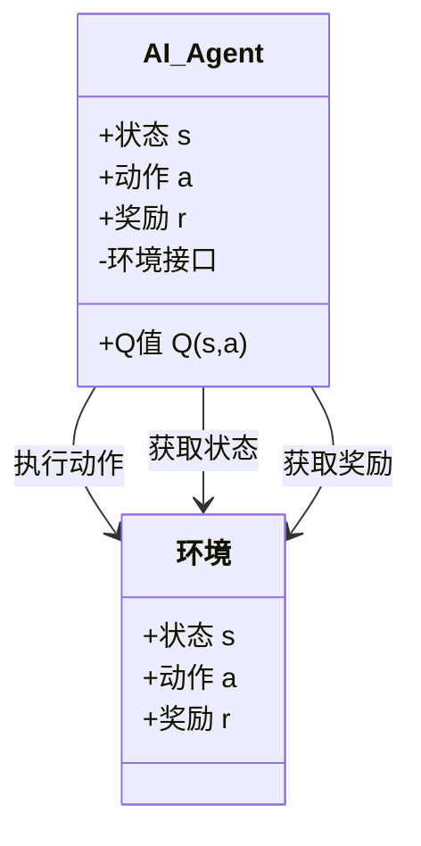
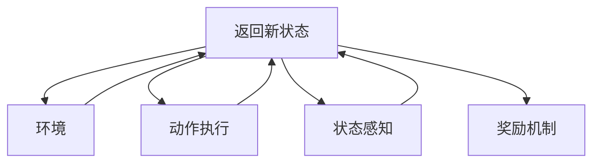
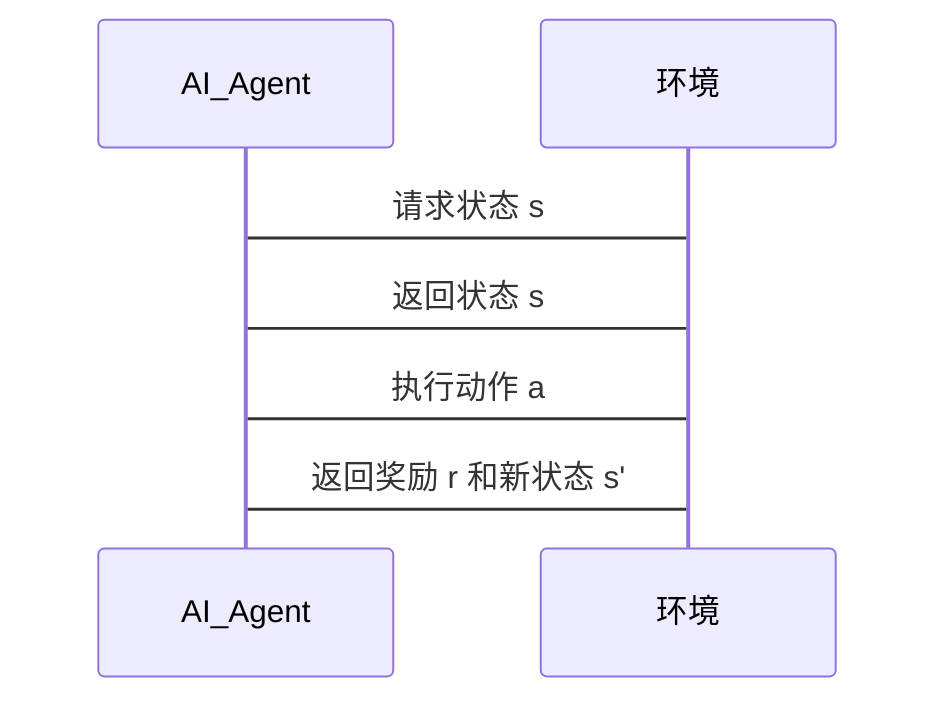
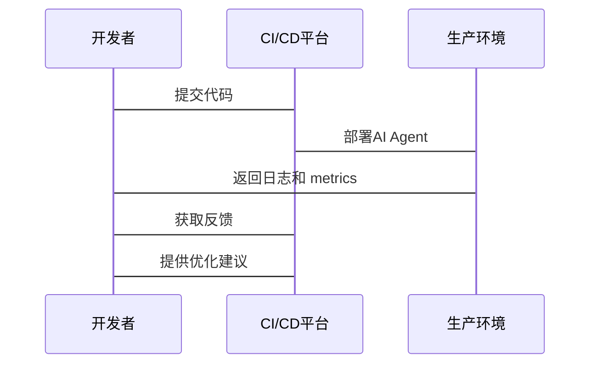

                 


# 企业AI Agent的持续集成与持续部署(CI/CD)实践

## 关键词：企业AI Agent, 持续集成, 持续部署, 强化学习, CI/CD, 系统架构

## 摘要：  
随着人工智能技术的快速发展，AI Agent（智能代理）在企业中的应用越来越广泛。为了高效地开发和部署AI Agent，企业需要结合持续集成与持续部署（CI/CD）的最佳实践。本文从AI Agent的核心算法原理出发，详细探讨了AI Agent与CI/CD的结合方式，分析了企业在实现AI Agent CI/CD过程中面临的挑战，并提出了系统的架构设计和实施策略。通过具体项目实战，本文展示了如何在实际场景中应用这些方法，并总结了相关的最佳实践和未来发展方向。

---

# 第一部分: 企业AI Agent的持续集成与持续部署(CI/CD)概述

## 第1章: AI Agent与CI/CD的背景与概念

### 1.1 AI Agent的基本概念

#### 1.1.1 AI Agent的定义与特点
AI Agent（智能代理）是指能够感知环境、自主决策并执行任务的智能实体。它通常具备以下特点：
- **自主性**：能够自主决策，无需外部干预。
- **反应性**：能够实时感知环境并做出响应。
- **目标导向性**：基于目标驱动行为。
- **学习能力**：能够通过经验改进性能。

#### 1.1.2 AI Agent的核心功能与应用场景
AI Agent的核心功能包括：
- **感知**：通过传感器或API获取环境信息。
- **推理**：基于感知信息进行逻辑推理。
- **决策**：根据推理结果做出最优决策。
- **执行**：通过执行器或API将决策转化为具体操作。

AI Agent的应用场景广泛，包括：
- 自动化运维（AIOps）
- 智能客服
- 自动交易系统
- 智能推荐系统

#### 1.1.3 企业级AI Agent的挑战与机遇
企业级AI Agent的开发和部署面临以下挑战：
- **复杂性**：AI Agent需要处理复杂的业务逻辑和环境。
- **实时性**：需要在实时场景中快速响应。
- **可靠性**：必须保证高可用性和稳定性。
- **安全性**：涉及敏感数据和操作，必须确保安全。

同时，AI Agent也为企业带来了巨大的机遇，例如提高效率、降低成本、增强用户体验等。

---

### 1.2 CI/CD的基本概念

#### 1.2.1 持续集成（CI）的定义与作用
持续集成是指开发人员频繁地将代码合并到主代码库，并通过自动化工具进行构建、测试和验证。其作用包括：
- **快速反馈**：及时发现和修复代码合并中的问题。
- **减少集成风险**：通过频繁集成降低代码冲突的风险。
- **提高代码质量**：通过自动化测试确保代码的正确性。

#### 1.2.2 持续部署（CD）的定义与作用
持续部署是指在持续集成的基础上，将代码自动部署到生产环境或准生产环境。其作用包括：
- **加速交付**：快速将新功能或修复推送给用户。
- **降低风险**：通过小批量部署降低上线失败的风险。
- **提高效率**：减少手动操作，提高部署效率。

#### 1.2.3 CI/CD在企业开发中的重要性
CI/CD已经成为现代软件开发的标配，其重要性体现在：
- **缩短开发周期**：通过自动化流程加快开发和交付速度。
- **提高代码质量**：通过自动化测试确保代码的正确性。
- **降低运营成本**：通过自动化部署减少人工操作。

---

### 1.3 AI Agent与CI/CD的结合

#### 1.3.1 AI Agent开发中的CI/CD需求
AI Agent的开发需要频繁的实验和迭代，CI/CD在其中起到了关键作用：
- **快速迭代**：通过CI/CD快速验证AI算法的改进。
- **自动化测试**：确保AI Agent在不同环境中的稳定性和可靠性。
- **高效部署**：快速将AI Agent部署到生产环境。

#### 1.3.2 CI/CD在AI Agent迭代中的作用
CI/CD不仅适用于传统软件开发，也适用于AI Agent的迭代开发。通过CI/CD，AI Agent的开发可以实现：
- **模型迭代自动化**：快速验证和部署新的AI模型。
- **环境一致性**：确保AI Agent在不同环境中的行为一致。
- **版本控制**：通过版本控制工具管理AI模型和代码。

#### 1.3.3 企业AI Agent CI/CD的现状与趋势
目前，企业AI Agent的CI/CD实践还处于起步阶段，但随着AI技术的普及和DevOps文化的推广，越来越多的企业开始关注AI Agent的CI/CD。未来，随着AI技术的不断发展，AI Agent的CI/CD将更加智能化和自动化。

---

### 1.4 本章小结
本章介绍了AI Agent和CI/CD的基本概念，并探讨了AI Agent与CI/CD的结合。通过分析企业AI Agent的开发和部署需求，我们明确了CI/CD在AI Agent开发中的重要性。接下来，我们将深入探讨AI Agent的核心算法原理，并分析如何将这些算法与CI/CD流程相结合。

---

# 第二部分: 企业AI Agent的算法与技术原理

## 第2章: AI Agent的核心算法原理

### 2.1 AI Agent的算法概述

#### 2.1.1 基于规则的AI Agent
基于规则的AI Agent通过预定义的规则进行决策。例如，智能客服系统可以根据用户的问题匹配相应的规则进行回复。这种方法简单易懂，但在面对复杂场景时可能显得力不从心。

#### 2.1.2 基于模型的AI Agent
基于模型的AI Agent通过构建数学模型来模拟问题，并根据模型的输出进行决策。例如，推荐系统可以根据用户的行为数据构建协同过滤模型，并根据模型预测用户的喜好进行推荐。

#### 2.1.3 基于强化学习的AI Agent
基于强化学习的AI Agent通过与环境的交互获得奖励，并通过最大化累计奖励来优化决策策略。这种方法在复杂动态环境中表现尤为突出，例如自动交易系统和游戏AI。

---

### 2.2 强化学习算法在AI Agent中的应用

#### 2.2.1 强化学习的基本原理
强化学习是一种通过试错机制来优化决策的算法。其核心在于通过与环境的交互获得奖励，并根据奖励调整策略以最大化累计奖励。

#### 2.2.2 Q-learning算法在AI Agent中的应用
Q-learning是一种经典的强化学习算法，其核心思想是通过Q表记录状态-动作对的最优价值，并通过Q值的更新来优化策略。

$$ Q(s,a) = Q(s,a) + \alpha [r + \max_{a'} Q(s',a') - Q(s,a)] $$

其中：
- \( Q(s,a) \) 表示当前状态下执行动作 \( a \) 的价值。
- \( \alpha \) 是学习率。
- \( r \) 是奖励。
- \( s' \) 是下一个状态。

#### 2.2.3 Deep Q-Network（DQN）算法的实现
DQN算法通过神经网络近似Q值函数，避免了Q表的维度灾难问题。其核心流程如下：

1. 环境提供当前状态 \( s \)。
2. 神经网络输出动作 \( a \) 的Q值。
3. 执行动作 \( a \)，获得奖励 \( r \) 和下一个状态 \( s' \)。
4. 根据Bellman方程更新Q值：
$$ \text{损失函数} = \mathbb{E}[(r + \gamma Q(s',a') - Q(s,a))^2] $$

其中：
- \( \gamma \) 是折扣因子。
- \( \mathbb{E} \) 表示期望。

---

### 2.3 AI Agent算法的数学模型与公式

#### 2.3.1 Q-learning的数学模型
Q-learning的数学模型可以用以下公式表示：
$$ Q(s,a) = Q(s,a) + \alpha [r + \max_{a'} Q(s',a') - Q(s,a)] $$

其中：
- \( s \) 是当前状态。
- \( a \) 是当前动作。
- \( r \) 是获得的奖励。
- \( s' \) 是下一个状态。

#### 2.3.2 DQN算法的数学模型
DQN算法的数学模型可以用以下公式表示：
$$ \text{损失函数} = \mathbb{E}[(r + \gamma Q(s',a') - Q(s,a))^2] $$

其中：
- \( \gamma \) 是折扣因子。
- \( Q(s,a) \) 是Q值函数的近似值。

---

### 2.4 本章小结
本章介绍了AI Agent的核心算法，包括基于规则的AI Agent、基于模型的AI Agent和基于强化学习的AI Agent。重点讲解了Q-learning和DQN算法的原理和实现，并通过数学公式展示了算法的核心思想。接下来，我们将从系统架构的角度分析如何实现企业AI Agent的CI/CD。

---

# 第三部分: 企业AI Agent的系统架构

## 第3章: 企业AI Agent的系统架构设计

### 3.1 系统功能设计（领域模型）

#### 3.1.1 领域模型设计
领域模型是系统功能设计的核心，以下是AI Agent系统的领域模型：



---

### 3.2 系统架构设计

#### 3.2.1 系统架构图
以下是AI Agent系统的系统架构图：



---

### 3.3 系统接口设计

#### 3.3.1 接口设计
以下是AI Agent系统的接口设计：



---

### 3.4 系统交互流程

#### 3.4.1 交互流程
以下是AI Agent系统的交互流程：



---

### 3.5 本章小结
本章从系统架构的角度分析了企业AI Agent的实现。通过领域模型、系统架构图和接口设计，我们明确了AI Agent系统的各个组件及其交互方式。接下来，我们将结合具体项目实战，详细讲解如何在实际场景中实现企业AI Agent的CI/CD。

---

# 第四部分: 项目实战

## 第4章: 企业AI Agent CI/CD的项目实战

### 4.1 项目背景与目标
本项目旨在通过CI/CD实现企业AI Agent的自动化开发和部署。项目目标包括：
- 实现AI Agent的自动化测试。
- 实现AI Agent的自动化部署。
- 实现AI Agent的版本控制。

---

### 4.2 环境安装与配置

#### 4.2.1 环境安装
以下是项目所需的环境和工具：
- **代码仓库**：Git
- **CI工具**：Jenkins
- **CD工具**：Kubernetes
- **机器学习框架**：TensorFlow/PyTorch

#### 4.2.2 环境配置
以下是项目环境的配置步骤：

1. 安装Git：
```bash
sudo apt-get install git
```

2. 安装Jenkins：
```bash
sudo apt-get install jenkins
```

3. 安装Kubernetes：
```bash
curl -s https://packages.cloud.google.com/apt/docuum... | sudo tee /etc/apt/sources.list.d/kub.list
sudo apt-get update && sudo apt-get install kubectl
```

4. 安装TensorFlow/PyTorch：
```bash
pip install tensorflow
```

---

### 4.3 核心代码实现

#### 4.3.1 AI Agent的核心代码
以下是AI Agent的核心代码实现：

```python
class AI_Agent:
    def __init__(self):
        self.q_table = {}

    def get_action(self, state):
        if state not in self.q_table:
            self.q_table[state] = 0
        return self.q_table[state]

    def update_q_table(self, state, action, reward, next_state):
        current_q = self.q_table.get((state, action), 0)
        next_max_q = max(self.q_table.get((next_state, action), 0) for action in self.get_actions(next_state))
        new_q = current_q + alpha * (reward + gamma * next_max_q - current_q)
        self.q_table[(state, action)] = new_q
```

---

#### 4.3.2 CI/CD管道代码
以下是CI/CD管道的核心代码实现：

```python
from jenkins import Jenkins

jenkins = Jenkins('http://localhost:8080', 'admin', 'admin')

def build_job():
    jenkins.build_job('AI-Agent-Build')

def deploy_job():
    jenkins.build_job('AI-Agent-Deploy')

def main():
    build_job()
    deploy_job()

if __name__ == '__main__':
    main()
```

---

### 4.4 代码解读与分析

#### 4.4.1 AI Agent代码解读
AI Agent的核心代码实现了一个基于Q-learning的智能代理。通过维护一个Q表，AI Agent可以根据当前状态选择动作，并根据反馈更新Q值。

#### 4.4.2 CI/CD管道代码解读
CI/CD管道代码实现了与Jenkins的集成，通过调用Jenkins API触发构建和部署任务。通过这种方式，我们可以实现AI Agent的自动化测试和部署。

---

### 4.5 项目实战案例分析

#### 4.5.1 案例背景
假设我们开发了一个智能客服系统，希望通过CI/CD实现自动化的测试和部署。

#### 4.5.2 案例分析
以下是智能客服系统的CI/CD流程：

1. 开发人员提交代码到Git仓库。
2. Jenkins触发构建任务，运行单元测试。
3. 测试通过后，Jenkins触发部署任务，将AI Agent部署到生产环境。
4. 部署完成后，Jenkins提供反馈，包括测试结果和部署日志。

---

### 4.6 本章小结
本章通过具体项目实战，详细讲解了企业AI Agent CI/CD的实现过程。通过代码实现和案例分析，我们明确了如何将AI Agent与CI/CD相结合。接下来，我们将总结相关的最佳实践和注意事项。

---

# 第五部分: 最佳实践与未来展望

## 第5章: 企业AI Agent CI/CD的最佳实践

### 5.1 最佳实践

#### 5.1.1 环境一致性
确保开发、测试和生产环境的一致性，避免因环境差异导致的问题。

#### 5.1.2 自动化测试
通过自动化测试确保AI Agent的稳定性和可靠性。

#### 5.1.3 模型迭代自动化
通过CI/CD实现AI模型的自动化迭代和部署。

#### 5.1.4 安全性
确保AI Agent的安全性，防止恶意攻击和数据泄露。

---

### 5.2 小结与注意事项

#### 5.2.1 小结
企业AI Agent的CI/CD实践需要结合AI算法和DevOps文化，通过自动化流程实现高效开发和部署。

#### 5.2.2 注意事项
- **模型监控**：需要实时监控AI模型的性能，及时发现和修复问题。
- **数据安全**：确保数据的隐私和安全。
- **团队协作**：需要开发、测试和运维团队的紧密协作。

---

### 5.3 未来展望

#### 5.3.1 智能化CI/CD
未来的CI/CD将更加智能化，能够根据历史数据和实时反馈自动优化部署策略。

#### 5.3.2 自适应模型更新
未来的AI Agent将具备自适应能力，能够根据环境变化自动更新模型。

#### 5.3.3 多云部署
随着云计算的普及，未来的AI Agent将支持多云部署，具备更高的可用性和容灾能力。

---

## 附录: 工具与资源

### 附录A: 常用工具列表
1. **代码仓库**：Git
2. **CI工具**：Jenkins
3. **CD工具**：Kubernetes
4. **机器学习框架**：TensorFlow/PyTorch

### 附录B: 术语表
- **AI Agent**：智能代理。
- **CI/CD**：持续集成与持续部署。
- **Q-learning**：基于Q值的学习算法。
- **DQN**：深度Q网络。

### 附录C: 参考文献
1. [1] Richard S. Sutton and Andrew G. Barto. "Reinforcement Learning: An Introduction."
2. [2] DeepMind. "Deep Q-Networks (DQN)."
3. [3] Martin Fowler. "Continuous Integration."

---

# 作者：AI天才研究院/AI Genius Institute & 禅与计算机程序设计艺术 /Zen And The Art of Computer Programming

