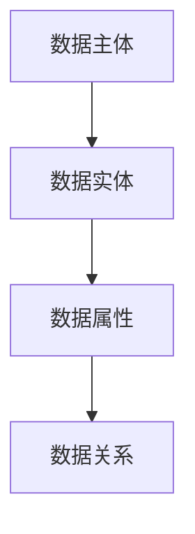
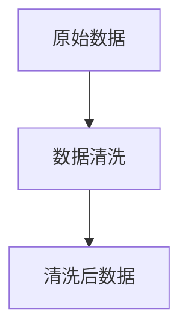
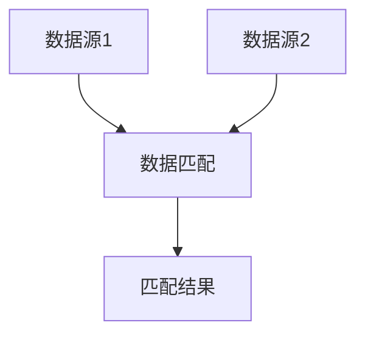
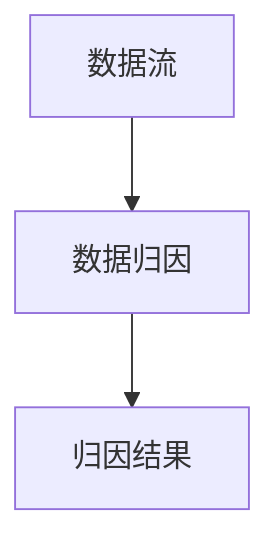
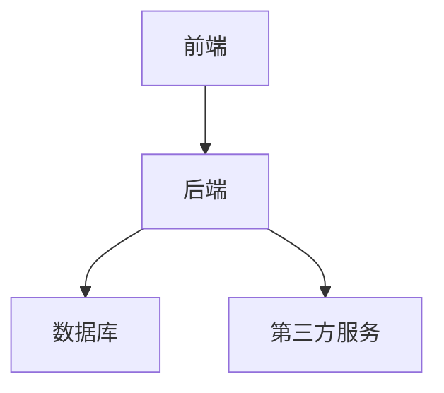
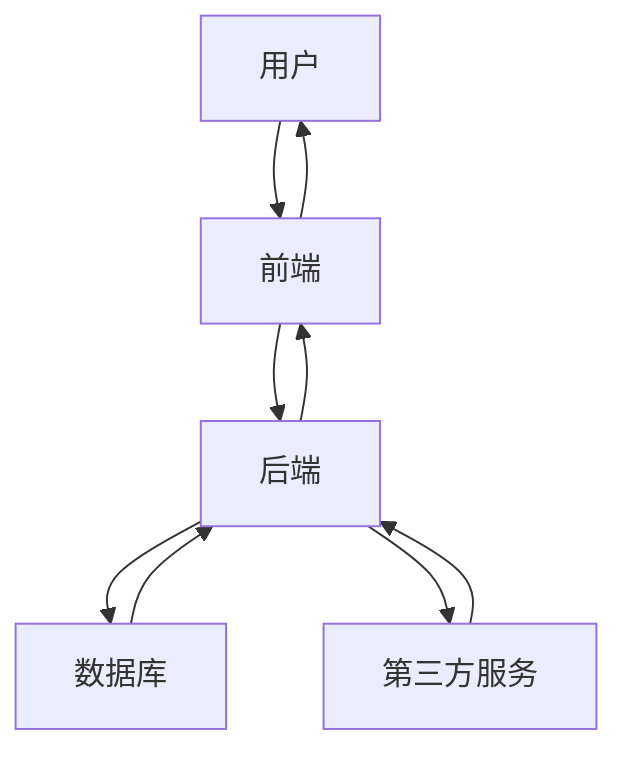

                 


# 企业AI Agent的数据治理框架

> 关键词：企业AI Agent，数据治理，数据清洗，数据匹配，数据归因，数据安全，数据质量

> 摘要：本文详细探讨了企业AI Agent在数据治理中的应用，分析了数据治理的核心概念与算法原理，提出了基于领域模型的系统架构设计方案，并通过实际案例展示了数据治理框架的实现过程。文章内容涵盖了从理论到实践的各个方面，为读者提供了全面而深入的指导。

---

## 第1章: 企业AI Agent与数据治理概述

### 1.1 企业AI Agent的定义与背景

#### 1.1.1 AI Agent的基本概念
AI Agent（人工智能代理）是指能够感知环境、自主决策并执行任务的智能体。它能够通过传感器获取信息，利用推理能力进行分析，并通过执行器与外部环境交互。AI Agent的核心特征包括自主性、反应性、目标导向和学习能力。

#### 1.1.2 企业AI Agent的应用场景
在企业环境中，AI Agent广泛应用于智能客服、供应链管理、风险监控、欺诈 detection、智能推荐等领域。例如，智能客服AI Agent能够实时响应用户需求，优化客户服务体验。

#### 1.1.3 数据治理在企业中的重要性
数据治理是指对数据的全生命周期进行规划、监控和控制，以确保数据的准确性、完整性和一致性。在企业AI Agent中，数据治理是确保AI系统能够可靠运行的基础。

### 1.2 数据治理框架的核心要素

#### 1.2.1 数据治理的目标与原则
数据治理的目标包括确保数据的质量、安全性和合规性。数据治理的原则包括数据所有权、数据访问控制、数据隐私保护和数据生命周期管理。

#### 1.2.2 数据治理的关键活动
数据治理的关键活动包括数据收集、数据清洗、数据存储、数据分析和数据可视化。这些活动共同构成了数据治理的完整流程。

#### 1.2.3 数据治理的组织架构
数据治理的组织架构通常包括数据治理委员会、数据管理员、数据分析师和技术团队。这些角色共同协作，确保数据治理目标的实现。

### 1.3 企业AI Agent与数据治理的关系

#### 1.3.1 AI Agent对数据治理的挑战
AI Agent的广泛应用带来了数据量的剧增，这对数据治理提出了更高的要求。例如，如何处理实时数据流、如何确保数据的实时准确性等。

#### 1.3.2 数据治理对AI Agent的支持
数据治理通过确保数据的质量和一致性，为AI Agent提供了可靠的数据基础。例如，通过数据清洗和数据匹配，AI Agent能够更准确地进行决策。

#### 1.3.3 企业AI Agent数据治理的必要性
企业AI Agent的高效运行依赖于高质量的数据。通过数据治理，企业能够优化AI系统的性能，降低决策风险。

### 1.4 本章小结
本章介绍了企业AI Agent的基本概念及其在数据治理中的重要性。通过分析数据治理的核心要素和AI Agent与数据治理的关系，读者可以理解数据治理在企业AI Agent中的关键作用。

---

## 第2章: 数据治理框架的核心概念与联系

### 2.1 数据治理框架的原理

#### 2.1.1 数据治理的基本流程
数据治理的基本流程包括数据收集、数据清洗、数据存储、数据分析和数据可视化。每个步骤都需要严格按照数据治理的原则进行。

#### 2.1.2 数据治理的主要活动
数据治理的主要活动包括数据质量管理、数据安全管理和数据生命周期管理。这些活动共同确保了数据的准确性和安全性。

#### 2.1.3 数据治理的实施步骤
数据治理的实施步骤包括需求分析、数据收集、数据清洗、数据存储、数据分析和持续监控。每个步骤都需要精心设计和执行。

### 2.2 核心概念的特征对比

#### 2.2.1 数据治理与数据管理的对比
数据治理关注数据的全生命周期管理，而数据管理更侧重于数据的存储和使用。数据治理是数据管理的高级阶段，涵盖了更多的管理内容。

#### 2.2.2 数据治理与数据安全的关系
数据治理通过制定数据安全策略和访问控制，保障数据的安全性。数据安全是数据治理的重要组成部分，两者相辅相成。

#### 2.2.3 数据治理与数据质量的联系
数据治理通过数据清洗和数据匹配，确保数据的质量。数据质量是数据治理的核心目标之一，两者密不可分。

### 2.3 数据治理框架的ER实体关系图



上述ER图展示了数据主体与数据实体的关系，数据实体通过数据属性与数据关系相连。数据主体是数据治理的核心对象，数据实体是数据主体的具体表现形式，数据属性描述了数据实体的特征，数据关系则反映了数据实体之间的关联。

### 2.4 本章小结
本章通过分析数据治理框架的核心概念及其相互关系，帮助读者理解数据治理的内在逻辑。通过ER图的展示，读者可以直观地看到数据治理框架的结构。

---

## 第3章: 数据治理框架的算法原理

### 3.1 数据治理的算法概述

#### 3.1.1 数据清洗算法
数据清洗算法用于去除数据中的噪声和冗余信息。常见的数据清洗算法包括重复数据删除、数据格式标准化和数据缺失值填充。

#### 3.1.2 数据匹配算法
数据匹配算法用于将不同数据源中的数据进行匹配。例如，通过基于字符串相似度的算法，将不同数据源中的同一实体进行匹配。

#### 3.1.3 数据归因算法
数据归因算法用于确定数据来源。例如，通过哈希算法和时间戳，确定数据的原始来源。

### 3.2 数据清洗算法的实现

#### 3.2.1 数据清洗算法的流程图


#### 3.2.2 数据清洗的Python代码实现
```python
import pandas as pd

# 示例数据
data = {'id': [1, 2, 3, 4, 5],
        'name': ['Alice', 'Bob', 'Charlie', 'David', 'Eve'],
        'age': [25, 30, None, 35, 40]}

df = pd.DataFrame(data)

# 删除重复数据
df = df.drop_duplicates()

# 标准化数据格式
df['name'] = df['name'].str.lower()

# 填充缺失值
df['age'].fillna(df['age'].mean(), inplace=True)

print(df)
```

### 3.3 数据匹配算法的实现

#### 3.3.1 数据匹配算法的流程图


#### 3.3.2 数据匹配的Python代码实现
```python
from fuzzywuzzy import fuzz

# 示例数据源
source1 = ['Alice', 'Bob', 'Charlie']
source2 = ['alice', 'bobo', 'Charlie']

# 数据匹配
matches = []
for name1 in source1:
    for name2 in source2:
        ratio = fuzz.token_set_ratio(name1, name2)
        if ratio > 80:
            matches.append((name1, name2, ratio))

print(matches)
```

### 3.4 数据归因算法的实现

#### 3.4.1 数据归因算法的流程图


#### 3.4.2 数据归因的Python代码实现
```python
import hashlib

# 示例数据
data = '原始数据'

# 数据归因
def data_hash(data):
    return hashlib.md5(data.encode()).hexdigest()

result = data_hash(data)
print(result)
```

### 3.5 本章小结
本章通过详细讲解数据清洗、数据匹配和数据归因算法的实现，展示了数据治理框架在算法层面的具体应用。通过Python代码和流程图的展示，读者可以更好地理解这些算法的实现过程。

---

## 第4章: 数据治理框架的系统分析与架构设计

### 4.1 项目背景与目标

#### 4.1.1 项目背景
随着企业AI Agent的广泛应用，数据治理的重要性日益凸显。本项目旨在设计一个高效的数据治理框架，确保AI Agent的数据质量和安全。

#### 4.1.2 项目目标
项目的总体目标包括实现数据清洗、数据匹配和数据归因功能，确保数据的准确性和一致性。同时，项目还致力于优化数据治理流程，提高数据治理的效率。

#### 4.1.3 项目范围
项目范围涵盖了数据治理框架的设计、算法实现和系统集成。项目不包括数据存储的具体实现，但提供了数据存储的接口设计。

### 4.2 系统功能设计

#### 4.2.1 数据采集模块
数据采集模块负责从多个数据源采集数据，并将其传输到数据处理模块。

#### 4.2.2 数据处理模块
数据处理模块包括数据清洗、数据匹配和数据归因功能，确保数据的准确性和一致性。

#### 4.2.3 数据存储模块
数据存储模块负责将处理后的数据存储到数据库中，并提供数据查询接口。

#### 4.2.4 数据分析模块
数据分析模块利用处理后的数据，进行数据挖掘和分析，为决策提供支持。

### 4.3 系统架构设计

#### 4.3.1 系统架构图


#### 4.3.2 领域模型类图


### 4.4 系统接口设计

#### 4.4.1 数据接口
数据接口包括数据输入接口和数据输出接口，确保数据的顺利传输。

#### 4.4.2 API接口
API接口包括数据清洗接口、数据匹配接口和数据归因接口，方便其他系统调用。

#### 4.4.3 交互接口
交互接口包括用户界面和日志记录接口，方便用户与系统进行交互。

### 4.5 系统交互流程

#### 4.5.1 系统交互序列图


### 4.6 本章小结
本章通过系统分析与架构设计，展示了数据治理框架在企业AI Agent中的具体应用。通过领域模型类图和系统架构图的展示，读者可以直观地理解系统的整体结构。

---

## 第5章: 数据治理框架的项目实战

### 5.1 环境安装

#### 5.1.1 安装Python
读者需要安装Python 3.8或更高版本。

#### 5.1.2 安装依赖库
读者需要安装以下依赖库：
```bash
pip install pandas fuzzywuzzy python-Levenshtein
```

### 5.2 系统核心实现源代码

#### 5.2.1 数据清洗模块的实现
```python
import pandas as pd

def clean_data(data):
    # 删除重复数据
    data = data.drop_duplicates()
    # 标准化数据格式
    data['name'] = data['name'].str.lower()
    # 填充缺失值
    data['age'].fillna(data['age'].mean(), inplace=True)
    return data
```

#### 5.2.2 数据匹配模块的实现
```python
from fuzzywuzzy import fuzz

def match_data(source1, source2):
    matches = []
    for name1 in source1:
        for name2 in source2:
            ratio = fuzz.token_set_ratio(name1, name2)
            if ratio > 80:
                matches.append((name1, name2, ratio))
    return matches
```

#### 5.2.3 数据归因模块的实现
```python
import hashlib

def data_hash(data):
    return hashlib.md5(data.encode()).hexdigest()
```

### 5.3 代码应用解读与分析

#### 5.3.1 数据清洗模块的应用
数据清洗模块用于处理原始数据中的噪声和冗余信息，确保数据的准确性和一致性。

#### 5.3.2 数据匹配模块的应用
数据匹配模块用于将不同数据源中的数据进行匹配，确保数据的一致性。

#### 5.3.3 数据归因模块的应用
数据归因模块用于确定数据的来源，确保数据的可信度。

### 5.4 实际案例分析和详细讲解剖析

#### 5.4.1 案例背景
假设我们有一个企业AI Agent系统，需要从多个数据源中收集客户信息，并确保数据的准确性。

#### 5.4.2 数据清洗与匹配过程
通过数据清洗模块，我们删除了重复数据，并标准化了数据格式。通过数据匹配模块，我们将不同数据源中的客户信息进行了匹配，确保了数据的一致性。

#### 5.4.3 数据归因过程
通过数据归因模块，我们确定了每个数据项的原始来源，确保了数据的可信度。

### 5.5 本章小结
本章通过实际案例分析，展示了数据治理框架在企业AI Agent中的具体应用。通过代码实现和案例分析，读者可以更好地理解数据治理框架的实际操作。

---

## 第6章: 总结与展望

### 6.1 总结
本文详细探讨了企业AI Agent的数据治理框架，分析了数据治理的核心概念与算法原理，提出了基于领域模型的系统架构设计方案，并通过实际案例展示了数据治理框架的实现过程。通过本文的介绍，读者可以全面理解企业AI Agent的数据治理框架。

### 6.2 当前挑战与未来展望
当前，企业AI Agent的数据治理框架仍面临一些挑战，例如如何处理实时数据流、如何确保数据的实时准确性等。未来，随着技术的发展，数据治理框架将更加智能化和自动化。

### 6.3 作者建议
作者建议读者在实际应用中，结合具体业务需求，灵活调整数据治理框架的设计。同时，建议读者关注数据治理领域的最新技术发展，不断提升自身的技术能力。

---

## 作者：AI天才研究院/AI Genius Institute & 禅与计算机程序设计艺术 /Zen And The Art of Computer Programming

---

本文通过详细讲解企业AI Agent的数据治理框架，为读者提供了全面而深入的指导。希望本文能够帮助读者更好地理解数据治理的核心概念与实际应用，为企业的智能化转型提供有力支持。

