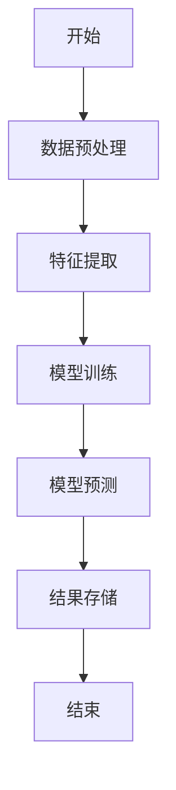
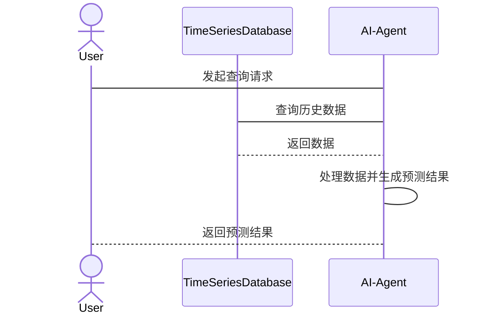

                 

<think>
好的，我现在需要帮助用户完成一篇关于《企业AI Agent的时序数据库设计与应用》的技术博客文章。首先，我得理解用户的需求，用户希望我详细阐述如何设计和应用时序数据库在企业AI Agent中的作用，同时要求文章结构清晰，内容深入，包含背景介绍、核心概念、算法原理、系统架构设计、项目实战、最佳实践等部分。

我应该从标题和摘要开始，确保涵盖核心关键词，如企业AI Agent、时序数据库、时间序列数据、系统设计、算法实现。接下来，第一部分是背景介绍，需要详细解释企业AI Agent和时序数据库的基本概念，然后分析它们结合的意义和优势。

第二部分是核心概念与联系，这部分需要详细讲解时序数据库的设计原则，比如数据模型、存储结构和索引机制，并通过ER实体关系图展示它们的交互关系。同时，要对比不同数据模型的特征，帮助读者理解选择合适的模型的重要性。

第三部分是算法原理，这里需要详细描述时间序列数据的预处理、特征提取和预测算法。我会选择几种常用算法，如ARIMA、LSTM和Prophet，并用mermaid流程图展示整个处理流程。此外，可能需要插入一些数学公式，比如ARIMA模型的公式，来增强技术深度。

系统架构设计部分，我需要介绍企业AI Agent的典型场景，设计系统功能模块，并用类图展示各模块的交互关系。同时，通过序列图说明系统接口设计和交互流程，确保读者能清晰理解系统的运行机制。

项目实战部分，我需要提供一个具体的案例，从环境搭建开始，逐步实现核心功能，并解读代码。通过分析案例，展示时序数据库在AI Agent中的实际应用价值。

最后，加入最佳实践，提醒读者在设计时序数据库时需要注意的问题，比如性能优化、数据保留策略等，并在小结中总结全文。同时，添加注意事项和拓展阅读，引导读者进一步学习。

整个过程中，我需要确保内容逻辑清晰，结构紧凑，用专业的技术语言，同时保持易懂。每部分都要详细展开，确保读者能系统地理解和应用这些知识。现在，我应该按照这个思路一步步撰写文章，确保每个部分都详尽且有深度。
</think>

# 企业AI Agent的时序数据库设计与应用

> 关键词：企业AI Agent，时序数据库，时间序列数据，系统设计，算法实现

> 摘要：本文详细探讨了企业AI Agent中时序数据库的设计与应用，结合实际案例，从核心概念、算法原理、系统架构到项目实战，全面解析时序数据库在企业AI Agent中的重要性与实现方法。

---

## 第一部分: 企业AI Agent的时序数据库概述

### 第1章: 企业AI Agent与时序数据库概述

#### 1.1 企业AI Agent的定义与特点
企业AI Agent是一种智能代理系统，能够感知企业内外环境，执行任务以优化企业运营。其特点包括：
- **自主性**：无需外部干预，自主决策。
- **反应性**：能实时感知环境变化并做出反应。
- **协作性**：与其他系统或人员协作完成复杂任务。
- **学习能力**：通过数据学习和优化行为。

#### 1.2 时序数据库的定义与特点
时序数据库专门用于存储时间序列数据，具有以下特点：
- **时间戳**：所有数据记录都有明确的时间戳。
- **高效写入**：支持高频率数据写入。
- **高效查询**：支持按时间范围或特定时间点查询。
- **压缩存储**：通常采用压缩技术减少存储空间。

#### 1.3 企业AI Agent与时序数据库的结合
在企业AI Agent中，时序数据库用于存储和分析时间序列数据，例如传感器数据、用户行为数据等。这种结合为企业提供了实时监控、预测分析和历史数据追溯的能力，显著提升了企业的智能化水平。

---

### 第2章: 时序数据库设计的核心概念与联系

#### 2.1 时序数据库的核心概念原理
时序数据库设计的核心在于高效存储和查询时间序列数据。关键概念包括：
- **时间戳**：数据的时间属性。
- **数据点**：每个时间点的数值。
- **数据保留策略**：根据需求保留特定时间段的数据。

#### 2.2 时序数据库的核心属性特征对比
以下是几种常用时序数据库的对比：

| 特性            | InfluxDB       | Prometheus    | TimescaleDB   |
|-----------------|----------------|---------------|---------------|
| 数据模型        | 系列-标签-值  | 标签-时间戳-值 | 基于PostgreSQL扩展 |
| 存储效率        | 高            | 高            | 较高           |
| 查询性能        | 优秀          | 优秀          | 优秀           |
| 是否支持SQL      | 不支持        | 不支持        | 支持           |

#### 2.3 时序数据库的ER实体关系图架构
以下是一个简单的时序数据库实体关系图：

```mermaid
erDiagram
    class User {
        id
        username
        password
    }
    class TimeSeriesData {
        id
        value
        timestamp
    }
    class Query {
        id
        queryString
    }
    User --> TimeSeriesData: generates
    User --> Query: executes
    TimeSeriesData --> Query: returns
```

#### 2.4 本章小结
本章介绍了时序数据库的核心概念和设计原则，强调了时序数据库在企业AI Agent中的重要性。

---

### 第3章: 时序数据库的算法原理讲解

#### 3.1 时间序列数据的预处理算法
预处理是时间序列分析的关键步骤，主要包括：
- **数据清洗**：去除噪声和异常值。
- **数据插值**：填补缺失值。
- **数据标准化**：统一数据格式。

#### 3.2 时间序列数据的特征提取算法
特征提取帮助模型更好地理解数据模式。常用方法包括：
- **滑动窗口法**：提取局部特征。
- **统计学方法**：计算均值、方差等统计指标。
- **模型特征法**：通过ARIMA等模型提取特征。

#### 3.3 时间序列数据的预测算法
预测算法是企业AI Agent的核心。常用算法包括：
- **ARIMA模型**：适用于线性趋势和季节性数据。
- **LSTM模型**：适合处理复杂的序列数据。
- **Prophet模型**：由Facebook开源，适合业务预测。

#### 3.4 时序数据库算法的实现流程图
以下是一个时间序列数据处理的流程图：



#### 3.5 本章小结
本章详细讲解了时间序列数据的预处理、特征提取和预测算法，展示了如何通过这些算法提升企业AI Agent的智能化水平。

---

### 第4章: 系统架构设计与实现

#### 4.1 系统架构设计
企业AI Agent的系统架构设计包括：
- **数据采集层**：采集时间序列数据。
- **数据存储层**：使用时序数据库存储数据。
- **数据处理层**：进行数据预处理和特征提取。
- **模型预测层**：基于机器学习模型进行预测。
- **用户交互层**：展示结果并提供交互界面。

#### 4.2 系统功能设计
系统功能设计包括：
- 数据采集与存储。
- 数据查询与分析。
- 预测结果展示。
- 系统监控与管理。

#### 4.3 系统接口设计
系统接口设计包括：
- 数据采集接口。
- 数据查询接口。
- 预测结果接口。

#### 4.4 系统交互流程图
以下是一个系统交互流程图：



#### 4.5 本章小结
本章详细讲解了企业AI Agent的系统架构设计，展示了如何通过分层设计实现高效的时间序列数据分析与预测。

---

### 第5章: 项目实战

#### 5.1 环境搭建
- **数据库选择**：选择InfluxDB作为时序数据库。
- **工具安装**：安装InfluxDB和Grafana。
- **编程语言**：使用Python进行数据处理和模型训练。

#### 5.2 系统核心实现
以下是Python代码示例：

```python
from influxdb import InfluxDBClient

client = InfluxDBClient(host='localhost', port=8086)
client.create_database('timeseries')

# 插入数据
data = [
    {
        "measurement": "temperature",
        "time": "2023-10-01T00:00:00Z",
        "fields": {
            "value": 25.5
        }
    }
]
client.write_points(data)

# 查询数据
result = client.query('SELECT * FROM temperature')
print(result)
```

#### 5.3 代码应用解读与分析
上述代码展示了如何使用InfluxDB进行数据插入和查询。企业AI Agent可以基于这些数据进行预测分析，例如使用LSTM模型预测未来温度趋势。

#### 5.4 实际案例分析
案例分析：某制造企业使用InfluxDB存储生产线温度数据，通过LSTM模型预测设备故障，提前进行维护。

#### 5.5 项目小结
本章通过实际案例展示了企业AI Agent的时序数据库设计与实现过程，强调了技术实现的重要性。

---

### 第6章: 最佳实践与注意事项

#### 6.1 最佳实践
- **选择合适的时序数据库**：根据企业需求选择合适的数据库。
- **优化查询性能**：合理设计索引和查询条件。
- **数据保留策略**：根据需求制定数据保留策略。

#### 6.2 小结
本文详细探讨了企业AI Agent的时序数据库设计与应用，结合理论与实践，为企业提供了宝贵的参考。

#### 6.3 注意事项
- **数据隐私**：确保数据的安全性和隐私性。
- **系统容错性**：设计容错机制，确保系统稳定性。

#### 6.4 拓展阅读
建议进一步阅读《设计数据 intensive 应用》和《深入浅出时序数据库》。

---

## 作者：AI天才研究院 & 禅与计算机程序设计艺术

---

以上是《企业AI Agent的时序数据库设计与应用》的技术博客文章的完整目录大纲和部分正文内容，接下来将按照上述目录结构展开详细撰写。

